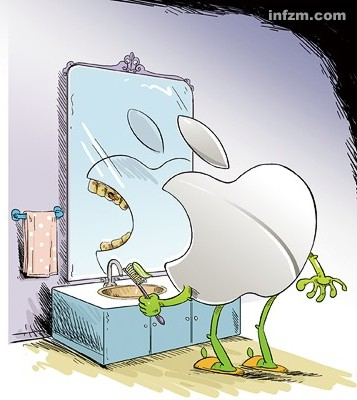
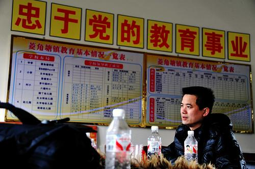

# 第五期：太阳系里，热闹的不只是你们地球

### 

### 

# 七星视点

## 第五期：太阳系里，热闹的不只是你们地球

** ** **编者按：在大家的关注和支持下，七星视点已经走到第五期了。根据读者的意见，从本期开始，七星视点进行改版。我们关注的话题突破大学生的范围，扩展到所有时事。而七星视点的评论也邀请大家来写。评论观点只代表个人，不代表北斗官方。欢迎大家继续关注七星视点！参与七星视点！谢谢！**

### 

### 1.太阳系里，热闹的不只是你们地球

### 

###  

### 

[奥尔星云](http://baike.baidu.com/view/291988.htm)的背后有什么？刘慈欣在[《超新星纪元》](http://baike.baidu.com/view/724026.htm)里说，那里有颗超新星“死星”，会在2012年爆发，届时将杀死全世界所有12岁以上的人科动物，00后将执掌全球（有消息称这部小说即将被好莱坞改编为电影[《狂怒时代》](http://news.mtime.com/2011/01/27/1450046.html)）。然而本周科学家告诉我们，这种近似于柯南剧场版《贝克街的亡灵》（都看过吧看过吧！没有看过不要说你是8090一代的大学生= =|||）中通过人为制造年龄断层净化人类社会的愿望大概要落空了。 情人节，英国《每日邮报》爆出一则爆炸性新闻，天文学家可能在太阳系边缘奥尔特星云外侧发现了[太阳系的一颗新行星Tyche](http://news.xinhuanet.com/world/2011-02/18/c_121097916.htm)，并有望在两年之内证实它的存在。据报道，这颗行星的体积居然可能达到木星的四倍！看来，假如2012末日来临时你能躲过一劫的话，便可以再度见证一个[九大行星的太阳系](http://scitech.people.com.cn/GB/13957817.html)。[06年惨遭降级的冥王星](http://news.xinhuanet.com/herald/2006-08/25/content_5005884.htm)啊，你可以安息了…… 

### ** **

**七星视点：** 太阳系里，热闹的不只是你们地球嘛，连行星们也要学习埃及、突尼斯、也门、巴林、伊朗、伊拉克、阿尔及利亚诸国搞[敏感花革命](http://www.baidu.com/s?wd=%DC%D4%C0%F2%BB%A8%B8%EF%C3%FC)了耶！不过要看清楚哦，这颗行星目前仅存在于天文学家IQ→+∞的大脑中，他们并不是用肉眼真正看到了这颗行星，也不是从[已经飞抵奥尔特星云的旅行者一号](http://news.sctv.com/kjxw/kp/201012/t20101216_561872.shtml)那里接收到了文件名为“太阳系天然素人Tyche高清无码1440p.rmvb”蓝光影像，而是通过对太空中的望远镜传回地球的数据进行分析，测量远方深空中星体的红外光谱，计算它们的轨道与相互之间的引力作用，从而推测出这样一颗行星的存在的哦。所以这颗星作为一个噱头是存在的，但作为严谨科学它还不是一个确定的存在。 对了，听说北斗计划搞“松鼠会+爱枣报”？不管是真是假，请宇宙众天体做好接受北斗和“全球华人大学生”（OTZ）检阅的准备，而且，要以充满吐槽点的姿态！ **By ****白泽**

### ** **

### 2. 北京到底欢迎谁？

### 

### 

### 

### 

### 

京版[“国八条”](http://baike.baidu.com/view/411459.htm)（共含15条规定，又称[“京十五条”]( http://house.hexun.com/2011-02-17/127372817.html)）2月16日出台，细则要求外地人购房须提供5年纳税证明，已有一套房的本市居民限购一套房，已有2套房的本地人和已有1套房的外地人暂停购房，限购以认房为标准。随即，上海、南京、广州等城市也出台了[房屋限购细则，均与户籍挂钩](http://www.qingdaonews.com/gb/content/2011-02/20/content_8670654.htm)。 一首熟悉的旋律顿时在小编耳边响起：住房不是你想买，想买就能买！ 

### ** **

**七星视点：** 在房价不断上涨的背景下，房产的地位也越来越异化，“五年纳税证明”的规定让我想起了许多年前人们购买电视需要工业券，获取福利房需要“指标”的时候，行政手段想当然的试图让房屋从商品蜕化为供给品，“脱离供求关系，价格当然就能控制住了”，然而，一次次“国N条”们的雷声大雨点小却让我不得不怀疑这是在缘木求鱼。 更让人忧虑的是，这样的手段所施行的基础是饱受诟病的户籍制度。不少网民讽刺道“没有在四川五年纳税证明，不得骚扰四川姑娘”“没有在广东五年纳税证明，不得贪图广东的海鲜”。住宅这个时下的焦点和户籍制度这个数十年来困扰人们的问题捆绑在一起，我也不知道，它所带来的会是什么样的争议和问题。 

**By ****罗天**

李承鹏就此事写的博文[《人人都是外地人》](http://blog.sina.com.cn/s/blog_46e7ba4101017o8w.html)里面说：“但这个事情我没想到在网上变成了北京人大战外地人。这个盛况就是我说过的——人民和人民终于火并起来了。在我眼里没外地人和北京人，只有穷人和有钱人，最后一句是：你要是没钱，在祖国，人人都是外地人。”李承鹏说的这个，我早就看出来了，矛盾被转嫁了。本来是人民和权贵之间的矛盾被转嫁为人民之间的矛盾。 

**By ****竺道生**

### ** **

### 3.苹果好吃但有毒

### 

2月15日，苹果公布了[2011年供应商责任进展报告](http://www.mycloud.com/discuz/index.php)，这是自2010年4月起中国34家环境NGO组织（后增至36家）点名苹果供应链问题后，苹果公司首次做出的实质回应。该报告披露了供应商[联建科技](http://baike.baidu.com/view/3172777.htm137)名员工正己烷中毒事件、深圳富士康连续12名工人跳楼事件，这是苹果首次正视在华“毒工厂”、“血汗工厂”问题。

小编呼吁抵制苹果！苹果是用中国工人健康和生命换来的！虽然本来小编也买不起苹果。 

**七星视点：** 关于“毒苹果”事件，我们先科普一下：一般组装好的苹果机，为了显得很新，通常要用有机溶剂擦洗一下屏幕什么的。所选的溶剂通常是挥发性很好的有机物，比如大家比较常见的酒精。结果厂家发现正己烷这个东西不错，一擦屏幕干净透亮，就选用了。正己烷其实很强大，除了挥发后随着呼吸道进入人体外，还能透皮吸收，就是皮肤上沾到一点，它就跑到身体里去啦！原因么当然是正己烷的分子量比较小，又能跟很多物质合体的缘故。所以一般在使用正己烷的时候除了尽量通风外，还要戴各种防具，比如自吸过滤式防毒面具，安全防护眼镜，耐油手套，穿防护服等等。如果没有做好防护措施，让过多的正己烷进入人体，后果十分严重！可导致人体出现头痛、头晕、乏力、四肢麻木等慢性中毒症状，严重的可导致晕倒、神志丧失、甚至死亡。再看这次的员工中毒事件，这些中国供应商们显然没有做好对员工的硬件防护工作和防护知识普及。否则有一定知识的员工一定能避免自己身处“毒雾”中的。其实小编在那个声讨苹果公司的视频里看到一个镜头，就是实拍车间工作过程的，结果镜头里的员工浑身上下裹得严严实实的，被保护的很好嘛！那问题就显而易见了，这些无良厂商是不是只在定期的“领导视察”中才发防护服摆摆样子，在平时的生产中就马虎行事了呢？最后真的出了状况，供应商和苹果就互打太极，推卸责任，对伤病员工极度的不负责。所以，我们的矛头不能单单指向苹果，更要指向“自己人”——中国土地上的供应商老板们。 

**By ****辰帝**

### ** **

### 4. 一千个公民就有一千个公正标准

### 

### 

### 

16日，人民日报发布社论**[《理性看待当前的社会公正问题》](http://politics.people.com.cn/GB/30178/13927872.html)**。 

### ** **

**七星视点：** 《人民日报：理性看待当前的社会公正问题》是篇面面俱到的社论，什么都说了就跟什么都没说一样。一千公民就有一千个公正标准，威权国家蜻蜓点水地罗列这些标准，高呼实现各个方面的公正，最后在不同阶段采用有利于自身统治的标准凌驾于大众之上。这篇社论说，“一方面是取得了巨大成就，另一方面是问题日益凸显，这可以说是当前我国社会公正的基本状况。”即是说我们是个既公正又不公正的国家，消灭私有制是公正的，经济改革也是公正的，威权统治是公正的，人民参与也是公正的，这思维比理性还理性。不受约束的政府乃不公正的源泉。而社会公正简单的很，人类自由自发博弈的结果就是公正的，没有强买强卖，没有暴力干涉。人民用选票决定他们的代理人，让老百姓的公正观念在民主市场上博弈。理性是也仅仅是激情的奴隶，政府是也仅仅是老百姓的奴仆。什么是理性，什么是公正，自然由人民用选票和舆论敬告政府。而非相反。 

**By ****姜真人**

### ** **

### 5.其实我早就不想吃空饷了

### 

### ****

** **

近日，新京报爆出[官二代吃空饷两年](http://www.chinadaily.com.cn/dfpd/beijing/2011-02-18/content_1804487.html)**。**重庆万州原区长女儿李果被举报调进驻京联络处工作，不上班拿空饷两年。联络处一负责人表示，吃空饷是误会，李果早就想把工资退还给联络处，只因受限于人在国外，一直无法返还工资。又是一个蹩脚的借口，为为官员“借口学”再添新案例。 据说文强听了这件事表示：其实我早就想把受贿的财物退还给行贿人或上缴给纪委，只因受限于天天要陪“全国三八红旗手”、“全国劳动模范”、“第五届全国十大女杰”以及各路女明星们睡觉，一直无法上缴。 铁道部表示：其实我们早就想把倒票的“内鬼”扫地出门的，只因受限于“未曾发现”，所以一直停留在“干打雷不下雨”的状态。 小编表示：其实我早就想买几套豪宅、购几辆豪车、包几个二奶、办几个国家的绿卡，只因受限于没有一个叫李刚的亲戚，一直无法实现远大抱负。 同时本周也爆出[永州数百教师空饷门](http://politics.people.com.cn/GB/14562/13941391.html)。** **

### ** **

**七星视点：** 对于吃空饷的这些事，有媒体评论说这叫[变相行贿](http://news.sohu.com/20110219/n279419951.shtml)，也有媒体说这是[合谋腐败](http://news.lnd.com.cn/htm/2011-02/16/content_1725451.htm)。小编觉得，这样看就too simple了。 永州市零陵区教育局长质问记者：“空饷吃的是地方财政,不是国家财政,关你记者什么事?公务员吃空饷的更多,你们记者怎么不去关注?” 领空饷给体制性腐败又提供了一个很好的例证。确实，中国肯定还会有数量很多的公务员在吃空饷，只不过没有被曝光。这些人能这么容易的就不去上班还领钱，就像包租公包租婆一样。只不过他们不是有房子在出租，而是有体制内的职位。我们的体制就是这么设计的，有空隙给你领空饷；而且很多人虽然没领空饷去上班了，也没见得干多少活；就算干活也是想办法弄更多的饷领。体制性的腐败我觉得就不能叫腐败了，叫食利。 

**By ****竺道生**

### ** **

### 6. 巴林军警对示威者强制清场！

### 

### ****

### ** **

巴林警方17日对连续几天在首都麦纳麦进行大规模抗议活动的示威者采取强制清场行动。清场过程中，3名示威者死亡，231人受伤。在驱逐示威者过程中，巴林军方动用坦克。 

### ** **

**七星视点：** 咳咳！ 没有中国人受伤，请勿联想。 

### ** **

### 7.胡锦涛对社会管理提出8点意见。

### 

### ****

** ** 省部级主要领导干部社会管理及其创新专题研讨班开班式１９日上午在中央党校举行。中共中央总书记、国家主席、中央军委主席胡锦涛发表重要讲话。胡锦涛就当前要重点抓好的工作提出８点意见，在此省略659个字。小编不放链接了，只要你打开电视就会听到的。 ** ** **七星视点：** 这8点意见，第一点是完善社会管理格局，第二点是协调利益机制，第三点是管理流动人口，第四点是关于基层社会管理，第五点是关于公共安全体系，第六点关于社会组织，第七点关于网络管理，第八点关于道德建设。 我再说8个中国亟待解决的社会问题：政府权力不受约束，利益格局不合理，农民工权益无保障，没有真正的基层自治，毒奶粉，管理员，向钱看。 七星视点栏目在招募编辑的时候，有一个考题是问：对当今中国如此多的社会问题你如何认识。有应募的同学无从回答。这八点可以给你提供一个看问题的框架。不要总以为他们知道的比你少。看来胡主席的讲话是要好好学习啊。秀才不翻墙，便知天下事。 **By ****竺道生**** **

### 

（编辑： 刘一舟）

### 

### 
