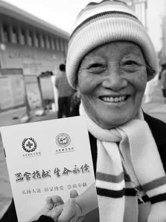
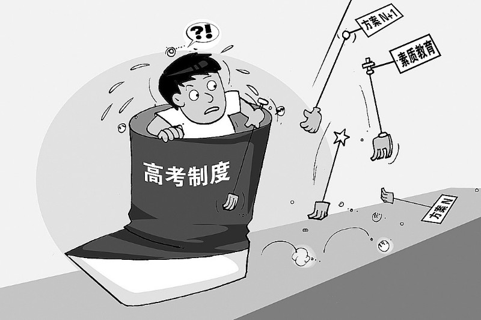

# 第六期：公车防腐 谁做主

### 

### 

# 七星视点

### 

## 第六期：公车防腐 谁做主

** **

### 1. 公车防腐 谁做主

 广州市政协委员黄慧敏建言，公车私用增加单位的公费负担、同时给干部提供了腐败便利，认为可考虑在公车上安装GPS系统，**抑制公车私用及公冒领使用费的问题**([http://news.163.com/09/0120/05/502VO8PP0001124J.html](http://news.163.com/09/0120/05/502VO8PP0001124J.html))。 

### 

**七星视点：**那我就想啦~~装上GPS就能公车防腐，那再花巨资买个高级监控器神马的，那会不会从中国腐败滴手里节约更多的国家公款呢？腐败就能根治了捏？我看悬，那就得等等啦，如果要问等多久，此处略去n个字…… 

### 

**新闻双面胶** **正面贴**： GPS反腐非常靠谱，一般方式是通过GPS记载车辆所在经纬度坐标，而后通过GPRS网络（也就是手机网络）发送到相关地点，就可以知道车辆的当前具体位置和车辆所经过的地点。对于公车私用而言，只要公车出现在了不该出现的地方，它的坐标就会记录下来，记录下来的坐标就可以作为处罚依据，配合相关制度杜绝公车私用，这样反腐又有何不可？ 大家对于高科技的使用一定要多看相关资料。GSP追踪车辆的技术手段，都可以**使用在警方破案方面**（[http://news.163.com/11/0105/03/6PJT0CDN00014AED.html](http://news.163.com/11/0105/03/6PJT0CDN00014AED.html)）为何不能用在反腐呢 我认为反腐败本身制度是一方面，技术手段又是一方面。利用科技力量反腐败很好，毕竟技术永远比人来执行制度来的可靠。 **By 【大猫】与海** **反面粘：** 我们的官员太聪明了，总是上有政策下有对策。装GPS的公务车难道一定要时时打开GPS么？还有就是公务车辆该走什么路线的标准又是什么呢？如果所有的公务车使用都有严格的路线管理、或者是出车理由审核，那装GPS会不会又是多此一举呢？ 还有，试问一句，这可以说车载GPS的生产商家行贿成功了么？ **By 李伯凯** 三天反贪污，五天打腐败，若不是去年广州亚运让广州市创下又一项中国特色的吉尼斯世界纪录——负债2100亿，也不至于让广州市的财政如此捉襟见肘，以至于让敢于睡在办公室的副市长睡坏了脊椎，现在才终于幡然悔悟，不反腐还真他妈不行。否则以后办公室连沙发都买不起，甚至要睡坏了腰椎，叉腰肌，鸡鸡等等就更是得不偿失啊，更别提在办公室就地取材进行进行文明建设了。 只是，原来反贪污还是头痛医头，脚痛治脚。现在有趣，头痛人家不开刀，反要贴个创口贴；脚痛人家不治脚，反要垫上个增高垫，以为别人就看不出你脚底湿了多少。不从根本上解决问题，别说安装GPS，你就是把原子弹装在公务车上，人家依旧照贪不误，说不定还给你来个车震现场直播。若以为安上GPS就可以万事大吉，强烈建议，全国所有处级以上干部上班时间一律穿上贞操裤，是为大吉，社会主义精神文明建设也就成啦 。 **By华政 萧以南**

### 

### 2. 南京试点器官捐献，一年以来无一例成功自愿捐献

 **南京试点器官捐献，一年以来无一例成功自愿捐献**（[http://policy.caing.com/2011-02-25/100228897.html](http://policy.caing.com/2011-02-25/100228897.html)）。其他试点城市中，深圳实现器官捐献11例，为全国捐献总数三分之一，山东武汉亦有数百志愿者登记器官捐献。南京红十字会相关人士认为，受传统观念影响，患者和家属在接受器官捐献上仍然有障碍。据卫生部门统计，目前中国每年需要器官移植的患者约是150万人，可仅有1万人能够得到供体，实现移植的愿望。而器官捐献体系曾长期处于空白地带。** **

### 

**七星视点：**看到这则新闻之后我提出了一个疑问，在试点器官捐献政策之前，中国器官移植供源从何而来？ 一来是死刑犯。这个官方掩掩藏藏却心照不宣的事实，承担者中国大部分器官移植的指标。这就带来一个伦理上的疑点，那些死刑犯是否是自愿捐献？是真自愿还是被自愿？在管理盲点下，这些“自愿”成为了巨大的资源。另外，在没有器官捐献规范的制度下，这个巨大的漏洞足以让我们对司法公正提出强烈的质疑。 二是传说中的“杀人盗器官”再卖给医院。此类骇人听闻的新闻和坊间传说暴露了器官移植存在巨大的“地下黑市”。 还有活体移植。当媒体沸沸扬扬炒作捐肾捐肝救父母子女兄弟姐妹的感人事迹时候，给大众带来了巨大的道德压力。然而这种被制造出来的道德压力却是违反伦理的。此外，制度漏洞和管理不做为，同样造成了继卖血之后的买卖器官市场。 虽然如今开始试点器官捐献，但是效果却很不尽如人意。不仅因为受到传统观念的影响，还有对捐献器官流向的质疑。我认为器官捐献是好事，但是制度完善必须先行。 **By 杜杜**

### 

### 3. 护士发微博抱怨深夜收尸 盼病人等其下班再死

 “测试人品的时刻到了，有个病人的血压一直在降，半夜很可能要起床收尸，这大冷天我暖个被窝也不容易，等我下班在（应为‘再’——记者注）死啊……” 22日晚，一则微博开始在网上广为流传。在这条微博提供的截图中，疑为**汕头某医院女护士的博主**[http://news.qq.com/a/20110224/000103.htm](http://news.qq.com/a/20110224/000103.htm)在自己的微博中，对病人生死相当冷漠，一心只盼着下班，并称病人开始吐血不关自己的事。 视频版：[http://www.56.com/u52/v_NTg1MzAxNjE.html](http://www.56.com/u52/v_NTg1MzAxNjE.html)

### 

**七星视点：**此新闻一出，网友多很愤慨，指责其没有人性。 不过首先，作为一个职业，医务工作者经常经历病人死亡，对生命体征的消失逐渐产生麻木感，因而对病人离世的反应显然不如常人那么激烈，更不论其家属。试想，作为日常工作中时有发生的一幕，医务人员很平淡地告知病人家属其离世的消息，失去了重要亲人的家属会怎样看待医务人员这一举动？很容易称之为冷漠无情，进而就会造成医患关系紧张。 回到这则新闻，这名护士的微博确实很冷漠，但却是真心话，只是希望自己上班的时候能轻松些，她的冷漠也与职业麻木有关。就失去医德与救人之心而言，应当受到指责，但不该指责过度，毕竟她没有害人，更不要将其他医疗怨气一并出了，网络不该成为“打”死人的场所。 **By 华理靠谱男**

### 

### 4. 中东局势紧张冲击 全球股市普跌

 恒指周二跌2.11%失守23000 创年内最大跌幅,沪指放量大跌76点 失守2900大关。截至收盘，沪指跌76点，报2855点，跌幅2.62％；深成指跌399点，报12473点，跌幅3.1％。 板块方面，在权重的金融和地产板块下挫的带领下，前期涨幅较大的水利基建、高铁类快速下跌，杀伤人气。而国际黄金期货大涨，刺激黄金股逆势飘红。另外，农产品价格上涨，也刺激近期农业板块表现活跃。 亚太主要股市今日全线下挫；国际原油期货大涨6%，全球通胀忧虑升。 韩国KOSPI指数周二收跌1.76%，报1969.92点。受国际油价动荡拖累，汽车及航空股跌幅居前。 澳大利亚标普200指数周二收跌0.88%，报4856.7点，消费及能源股跌幅居前，矿业股有支撑。日本日经指数周二收低1.78%，报10664.7点。大宗商品重拾涨势，成本上升担忧打击电子及化工股跌幅居前。 泛欧道琼斯指数周一收于287.18点，跌幅是1.33%。该指数在周一大部分时间处于下跌区域，跌幅在午盘之后进一步扩大。主要区域指数方面，法国CAC 40指数跌1.44%至4097.41点；德国DAX 30指数跌1.41%，报7321.81点；英国金融时报100指数跌1.12%，收于6014.80点。 作为与利比亚经济关系最紧密的欧洲国家之一，意大利股市普遍下跌，主要股指，金融时报MIB指数周一大跌3.6%，收于22230点。 

### 

**七星视点：**中国大陆的金融中心上海证券交易所于1990年11月26日正式成立，并于同年12月19日在上海开张营业。历 史上4次大跌，背后都有政府托盘的身影。但在现今全球一体化经济大背景下，资本市场是国际金融的产 物，蝴蝶效应正越来越明显，更何况是政局的动荡所产生对经济的巨大震荡。试想，一个退休在家的上海 老人，炒着股票抽着烟，突然因为远在中东国家的政变导致的股市大跌损失了几万块钱，这该是多大的飞 来横祸。然而个体在此情况下却毫无作为之力，只能任由市值蒸发。股民的利益谁来保证？覆巢之下，岂 有完卵， 即便是在有救市传统的中国，也只能望“指”兴叹,并未完全开放的金融市场也不能独善其身。 而当今的股市对股民的也要求越来越高，不仅需要会看政策面基本面，甚至还要留意中东地区的政治新闻（囧）。再有预见性的左安龙，恐怕也猜不到股市会因为外国政变而大跌吧？** ** **By钱慕白**

### 

### 5. 同样是户籍，中日差距怎么就那么大呢？

 到2011年1月份，已经有**520****名日本公民将自己的永久住址改到与他国有争议的领土上**（[http://news.ifeng.com/world/detail_2011_02/22/4789064_0.shtml](http://news.ifeng.com/world/detail_2011_02/22/4789064_0.shtml)），包括与俄罗斯有争议的千*岛*群*岛，与中国有争议的钓*鱼*岛等。在日本，永久住址可以改变到国内任何地方，只需要递交特殊文件即可，与当前居住地并不矛盾。那些将自己永久住址改到有争议领土的人称，他们这样做是在进行无声抗议，指责政府解决这些争端速度太慢。 北京市政府2月16日公布了落实中央调控楼市“国八条”的实施细则，普遍解读矛头直指外地人，网上舆情激烈。细则规定，外地人在北京购房须提供5年纳税证明；已经有一套房（而仍无北京户口）的**非京籍居民不得购买第二套住房**（[http://www.bbc.co.uk/zhongwen/simp/china/2011/02/110217_beijing_property_rules_reax.shtml](http://www.bbc.co.uk/zhongwen/simp/china/2011/02/110217_beijing_property_rules_reax.shtml)）。 

### 

**七星视点：**这对比，呵，人家小小岛国的居民利用户籍刻意随便迁这政策而指责政府还不解决钓*鱼*岛争端，我们泱泱大国的居民被户籍制度整得无处立足谁还去管那尖阁诸岛。以饮鸩止渴的方式去试图堵住房价上涨的洪水，还是让两国居民在保钓的声势上高下立见，这本应该是八竿子打不着的事情在如今却成了被一条绳子牵住的蚂蚱。捉襟见肘的政府该如何是好，咱们这坐茶馆里看热闹的是不是也该嘘一声莫谈国事呢。 **By李珂**

### 

### 6. 广州人大主任抱怨代表缺席

 **广州市人大常委会主任张桂芳**（[http://news.sina.com.cn/c/2011-02-25/011622010376.shtml](http://news.sina.com.cn/c/2011-02-25/011622010376.shtml)）曾在一次会议中，对一些人大代表语多不满。声称这些人有的不来开会，有些则在开会时干私活，有的五年间从未参与视察工作。“自己都吊儿郎当怎么监督别人？” 

### 

**七星视点：**中国的人大代表在近些年来之所以渐出水面，成为人们日益关注的话题之一，一个原因当然是大得网络传播之惠，另一方面，则是民众开始慢慢关注自身权利表达的形式和影响。我们不得不说，人大代表制度因我国特定的历史和现实原因，有着他自身的缺陷，其表现当然也千奇百怪。比如以举手同意为考虑国家利益的，为爱国的；荒唐提案层出不穷的；以及此处以代表人民为儿戏的。索性大家开始学会了关注，那么下一步，就该是较真了吧。这，自然是好的。 **By 小灯**

### 

###  7. 高考制度必须坚持？！

 2011年2月24日，在北京举办的热点问题形势报告会上，教育部部长袁贵仁表示：高考制度可能不是最好的制度，但是最可行的制度，因此**必须坚持**[http://news.sina.com.cn/c/2011-02-25/085822013348.shtml](http://news.sina.com.cn/c/2011-02-25/085822013348.shtml)。 

### 

**七星视点：**看到这样一则消息，令人不禁想起了1905年，袁世凯、赵尔巽、张之洞、岑春煊等六大臣联名上书废除科举，慈禧以为行之过速，不料这些士林先进们一口咬定：此时刻不容缓，否则朝不保夕。然而于我们今天看来，废除科举虽属当时的势所必然，但旧的制度推翻了，新的制度又未尽善。其实革命党的民国又何尝不如是呢？所以针对高考，我们认为：高考虽然可恶，但另起炉灶重开张的“革命式”改造思维，也应当改一改。多从扩大专科教育，发展大学生再教育产业等其他方面提一些建设性的意见，不是更好么？ **By 小灯**

### 

### 

（编辑:汤川辰)

### 
