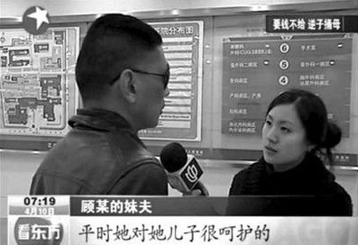
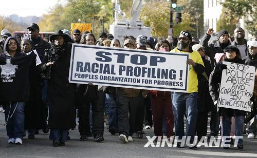

# 第十三期：祖国为我涨油价，我为祖国喝茅台

### 

### 

# 七星视点第十三期：

### 

## 祖国为我涨油价，我为祖国喝茅台

### 

### 

**七星瓢虫君：**

我怎么又出现了？我可是把七星背在背上的，是代言人哦。

本期是七星视点改款第一期。减少了新闻的数量，增加了评论的纵深。但你喜欢看什么样的新闻，或者你想发表自己的评论。@我一下，[瓢虫君](http://www.renren.com/profile.do?id=362359989&from=opensearch)随叫随到。

### 

#### 1.祖国为我涨油价 我为祖国喝茅台

### 

### 

### 

近日，中石化广东石油分公司购买几百万高档酒供私人支配，这批高档酒最后去向又不知所踪，引起网民的高度关注，如果你还不知道这件事，那就先听听这首歌吧《[我为祖国喝茅台](http://www.56.com/u54/v_NTk3OTI5NjM.html)》。 **【七星视点】** 不知道这条新闻还能对多少天朝子民产生强烈的震撼，相比较还是那盏[1200万元的吊灯](http://news.sohu.com/20090716/n265249200.shtml)给我留下了深刻的印象。也许越来越多的闽粤百姓怀念起赖昌星，包括他在觥筹交错后，回到办公室单单叫上一碗稀饭配咸菜的细节，也成了调侃三位油老大的好素材。 偏偏是在我看来一个没有吐槽点的新闻（稍有正常逻辑的人类都能认识到如此体制下，拉马影帝有权利可以把自己任何一次的左右脚互搏变作点球），经有关领导一解释，又被广大网民认为是侮辱智商的恶心行为。这些国字头的企业，在出事儿后的撤谎功力何止是原地踏步，真心建议各级领导内部学习一下“历史的先声”。对着[一张增值税普通发票](http://club.autohome.com.cn/bbs/thread-c-875-10182355-1.html)，不虚心表态也就罢了，反而在第一次表态——“[我们是卖酒滴](http://news.21cn.com/domestic/difang/2011/04/14/8239907.shtml)”——之后，又自掌耳光，由[北京总公司派出专员调查](http://money.163.com/11/0414/01/71IK2CRO00253B0H.html)；作出将鲁经理停职的动作后，又称“[购酒‘与鲁广余个人无关’](http://money.163.com/11/0413/19/71HST55R00253B0H.html)”。不知道唾面自干么？我们的万里挑一的高素质的国企高层们的表演怎么就这么对不起他们的高薪呢？ 据说中石化广东分公司正在进行紧锣密鼓的[抓内鬼行动](http://v.news.163.com/video/2011/4/Q/I/V70S3VMQI.html)，但，又是不巧，抓内鬼的动员大会又被线人爆出。让人情何以堪……我只能用最好的假设，猜想那500条狗狗是中石油紧急调够用来转移视线且成功的危机公关道具吧…… 

**By石三**

#### 

#### 2.因学费逆子刺母 众围观老外救人

#### 

#### 

#### 

刀，又见名刀。药家鑫的刀，一招八式，刀刀致命；[汪某的刀](http://news.sina.com.cn/s/2011-04-10/082822265642.shtml)，六亲不认，狠辣无比。

愚人节当晚，上海浦东国际机场到达大厅，一汪姓留学生从日本回国，见到前来接机的母亲不是热泪盈眶上前拥抱，而是三言两语不合之后拔刀便刺。据说汪某是因学费问题与母亲起了争执。母亲一句“没有钱”，逆子拔刀狠刺母。

在事发现场，汪某刺母逃走后，来往路人纷纷围观但无人出手相救，最终多亏一名老外上前救人。还有一个耐人寻味的细节便是，汪某亲属一开始纷纷诉苦说汪家四处举债供养孩子上学，汪某在外五年从未打过一次工，但在得知汪某被刑拘之后又[纷纷改口说汪某“勤勉、懂事”](http://www.china.com.cn/news/txt/2011-04/14/content_22359415.htm)，汪某母亲还说汪某在留学期间就曾患上了轻度抑郁症。现在警方已经正式依法对其提请司法精神病鉴定。

### 

**【七星视点】** 我经常怀疑，每天吸毒气、喝毒水、吃毒食的我们是不是已经开始慢慢变异了？我们生活的环境愈发不堪，今天以粪便浸泡食品出售给他人，明天因为缺钱刀捅生母，面对媒体，我们经常能看到照见对人情的冷漠、历史观的缺失、价值观的扭曲的镜象，我们的情感似乎越来越麻木，我们的观念似乎越来越混乱，我们的精神似乎越来越空虚，我们的追求似乎越来越莫名其妙，我们的“理想”似乎越来越引人发笑，我们的“口味”似乎也越来越重了。 平心而论，近日留日学生刺母的事件实当引起我们对近二三十年来教育理念与社会生态的变易进行再度的叩问与反思。常有年长的朋友说，而今出国留学与早些年的状况很不一样了，现在是“在国内混不下去的烂学生，家里又有钱，所以就出国混个文凭。”这种看法当然失之偏颇，可是往往这类留学生个体身上又反映出了当下年轻人心理与精神等方面的问题。 成长在新世纪的年轻一代大多具有良好的教育背景，但这一时期的教育恰恰是处于一种混乱无序、没有目标构设、缺乏价值系统撑持的状态，西方现代教育对传统文化的冲击，已经完全改变了“教育”的内涵。年轻一代的“高知”们通过嘲讽、对抗、厌弃、批判来使自己的看法能够引起成人世界的注意，而后又在获得理解与信任的基础上表达出自己对整个社会与世界的生涩或成熟的思考，他们注重感官的满足，注重即刻的，现实的感性的体验，同时又不能不投射成人世界对于他们将来成长为新的优秀劳动力的期望。需要即刻的消费满足，又在成人世界的面前有强烈的挫折感和逆反的意识，这些都是可以从某一角度为汪某刺母事件作一注脚的。 

**By 谷卿**

#### 

#### 3.三人行，必有人权教师爷

#### 

#### 

#### 

4月8日，美国发布了《2010年人权国别报告》，其中的中国篇引发了之后中美双方关于人权的又一次激烈交锋。为了捍卫我国尊严，不让那些吃饱了没事干的人对我们说三道四，我国媒体奋起反击！新华网发表评论《美国说人权，地球人都笑了》，《环球时报》社评《简单的人权口号必然导致偏执》，中国网《“人权教师爷”，别再喋喋不休》，与此同时新华社也发布了《2010年美国的人权纪录》，防守反击策略步步为营！ 

### 

**【七星视点】** 一年一度的中美人权互掐今年还是不免让我失望，所涉问题仍是老生常谈：美方称中国人权状况日趋不佳，中方马上回击美国请别当人权教师爷。孰是孰非暂且不论，就仅仅回到问题本身来看。人权，作为人之为人的根本，起源于避免公民遭到国家侵害，因此任何人都有责任介入并保护受到侵害的其他人。在我看来，指责任何国家的人权状况都是我国的权利，但同时也应该有气魄和胆量承受他国的非议。这无关谁是谁的人权教师爷，而是在开放的国际社会，即便夹杂着某种程度上的政治外交利益，互相监督人权状况仍是百利而无一害。中方每年都在美方公布相关报告后严词反对、强烈谴责，愚以为多此一举了。子曾经曰过，三人行必有我师，择其善者而从之其不善者而改之。且不说我国官方从未公开肯定过美国在人权方面所作的贡献，就连美方每年报告中所提及的各项事由也不曾正面予以回应。我不禁猜想，国新办此举究竟是为了单纯还击美国务院，还是真的有益于促进世界人权进步？如果是后者，那么不断改善自己的人权环境、虚心面对别国的警醒和指责，有则改之无则加勉，才是大国崛起应走的路。 

**By王倩茹**

"美国是世界上暴力犯罪最严重的国家，公民的生命、财产和人身安全得不到应有的保障。" "美国枪支管理松懈，泛滥成灾。" "枪杀事件高发，血案不断。" 枪支会制造暴力，会制造流血，会带来死亡，但枪支也代表了对话权。美国法律之所以不禁枪，是因为“美国人民有推翻暴政的自由”，与中国的《美国人权报告》观点恰恰相反，我认为不禁枪正是美国保障人权的体现。人民有权力对政府说不，有权力对政府进行监控，这是保护人权保障人权制衡牵制政府权力的表现，尽管为此美国付出了昂贵的代价每年都发生很多流血事件。枪本身并没有什么错，错只会错在开枪的人，开枪的军队，以及指挥开枪的人。大家总不自信的认为，中国要是开放枪支，必定会大乱，千万不要太低看自己哦。 

**By王斯王**

在解读“关于经济、社会、文化权利”这节之前，首先要理解美国视角里的几个概念。 第一个概念是“贫困人口”按美国2005年划分贫困线的标准：单身年收入低于 9570美元，两口之家低于12830美元，三口之家低于16090美元，四口之家少于19350美元，五口之家少于22610美元。资源所限，我只找到了2010年美国两口之间的是14570美元，所以我推测其它数据也较之增幅1500美元左右。 第二个概念是“购买力平价”购买力平价的出发点是，各个国家的物价不一样，同样的收入在不同国家的购买力不同。购买力平价就是要消除物价的影响，在相同物价水平下计算各国的收入。目前美国相对于中国的物价水平应该达到4.42左右，按照这个比率折算的话美国两口之家的贫困线在中国划算的话应该划分为23000元左右。 第三个概念是 “饥饿人口”，字面上好像饥饿人口就是忍饥挨饿的人口。实际上饥饿人口在文中既是贫困人口，文中的一些数据也暗合了这个对应关系。“2009年，美国领取食物券的人数为4200万人”与“2009年底，美国贫困人口达4400万人”但是他们忍饥挨饿么，至少从数据上看美国的贫困人口基本都享有政府免费提供的食物券。 这节有这样一个基本的逻辑关系：美国人失业情况严重，导致了美国贫困人口的持续增加。具体到社会表现形式就导致了买不起房子，吃不上饭，保险也买不起。 美国的四大自由里面有一个基本观点就是，民众有免于匮乏的自由。在上文的数据中我们可以发现，文中通过仔细的段落安排想表达的逻辑顺序也不怎么成立。贫困≠饥饿，在美国国家政府有责任有义务免费提供给穷人食物券，国家必须要救济这个群体，在文中我们可以看到类似的证明。贫困≠无家可归，02年数据贫困人口46％已购买并拥有自己的房子， 54％的美国穷人住在一家庭房屋中（独立住宅）；36.4％住在公寓中；9.6％住在汽车房屋中。政府提供了大量的救助中心，但是不得不承认还有广大一部分流浪者享受不到这个益处。但是确实贫困＝没有医疗保险，国家政府除了会给最穷的人免单，对于那些比较贫困的人来说医疗保险确实占了很大一部分收入比率。 

**By朱肖晨**

### 

### 

（采编：金吉男、陈造极、孙微阳 责编：刘一舟）

### 

### 
