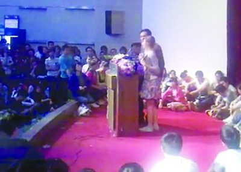

# 第十五期：唐骏南林演讲遭遇“踢馆”，快来瞅瞅大家怎么看

 

# 七星视点第十五期

## 唐骏南林演讲遭遇“踢馆”，快来瞅瞅大家怎么看

  **瓢虫君发广告喽：七星视点全新改版啦！每期选取一则社会热点，综合网络各方意见，就争议话题展开激烈讨论。正方反方，针尖麦芒，意领昆仑，粉墨登场！** 

#### **本期热点 ：**

** **“打工皇帝”唐骏南林演讲，却遭神秘女生小杜“踢馆”。一沓“西太平洋大学学位证书”，引发校园内外唇枪舌剑。冲上讲台的行为是否值得提倡？强抢话筒的手段是否恰当？知名意见领袖对此有何评论？文化昆仑从学理角度又作何感想？精彩不断，尽在本期七星视点~~~ 

#### 事件回放：

4月27日，“学历门”事件后较少在公众场合露面的唐骏现身南京林业大学，做了一场主题为“我的成功可以复制”的讲座。讲座临到尾声时意外出现，一位南京大学的大四女生当面质问唐骏的美国绿卡的由来，对“紫金矿业排污事件”的看法等，该女生还现场请唐骏在她复印好的一沓“西太平洋大学”学位证书上签字，未果后又与其朋友现场分发“西太平洋大学”的学位证书复印件。 （以上摘自网易新闻，详细请见：[http://tech.163.com/11/0430/11/72SQG9D1000915BF.htm](http://tech.163.com/11/0430/11/72SQG9D1000915BF.htm)l） 小杜同学的“踢馆风波”，可谓一石激起千层浪，不但南林南大两校同学议论纷纷，网络上的相关评论一时间也铺天盖地。瓢虫君撷取了一些具有代表性的观点，按争论的主题分列于下，希望大家能藉此对这次事件有一个全面的看法，也欢迎大家通过发表评论的方式参与到我们的讨论中来~~~ （全程视频：[http://boke.qq.com/play.html?v=76AGxIzQPK6](2011/05/01300000344477127858305939856-150x150.jpg)） 

#### 争议焦点之一：应不应该揪住唐骏的缺点不放？

 **倒杜派：** 盖茨与陈天桥看到的是唐骏的努力与能力，而你们看到的是唐骏的假文凭，你们应该多看他身上的闪光点，大众对公众人物的道德标准不应该高于普通人。 

by 网友

**挺杜派：**

事实正好相反，在场的人听了唐骏的忽悠，看到的都是唐骏的努力与能力，却没有人看到唐骏的道德污点和假文凭。杜同学所做的，恰恰让人们看到了唐骏光环背后的另一面。 

by徐超

#### 争议焦点之二：小杜同学的所作所为算不算羞辱唐骏？

 **倒杜派：** 杜同学是抱着羞辱唐骏的目的去的，是对演讲嘉宾的不尊重。为了炒作自己而不惜羞辱他人，自身道德就有问题。 

by 曾冉（有改动）

**挺杜派：** 杜同学的问题只能说是尖锐而已，国内外各种公开场合比这更尖锐的问题多了去了，反方真是少见多怪。炒作不炒作是“诛心之论”，过分的追究动机没有意义，应该看客观结果。 

by 徐超

#### 争议焦点之三：唐骏有没有资格进大学演讲？

 **倒杜派：** 不管怎么样，唐骏成功了，他身上肯定有值得学习的地方。而且对于商人而言，文凭不算什么 

by 网友

**挺杜派：** 通过不正当手段获得的成功，即使再辉煌，也是不值得称赞的。唐骏这种道德有问题的人根本没有资格到大学里去宣扬他的厚黑成功学，这是误人子弟。 

by 网友

**骑墙派：** 一所言论自由的大学应该既容得下唐骏的声音，又能包容杜同学这样的批判者。唐骏的演讲完成的是“取其精华”的使命，而杜同学完成的是“去其糟粕”的使命。两方都可以充分发表意见，具体怎么理解就由听众自己的理性来决定吧。 

by 徐超

#### 争议焦点之四：小杜同学算不算破坏秩序？

 **挺杜派：** 这里的“由主持人控制话筒”，并非明文规定的“法规”，不必遵守，每个人都有自己冲上台去的自由。而且唐骏本人是同意了的。 

by 王也

**倒杜派** 这种“规则”并非写成明文规定，更多的是根植于我们的常识中约定俗成的，而且有其必要性。由于提问的机会有限，如果不建立一个秩序，听众就会陷入混乱的争抢当中，这样一来谁都无法提问了。唐骏本人的同意是一种忍让，不能掩盖杜同学破坏秩序的行为，如果大家都像杜同学一样，现场就乱了。 

by 亦然

不能因为没有得到提问的机会，就可以抢上去，我所强调的仅仅是这一点。对伪君子、骗子的自由也要尊重，只要他们不违反法律。揭穿他们，可以用更符合程序、自由和文明的方式 

by罗文全

#### 争议焦点之五：当组织者暗箱操作时，我们是否可以拒绝遵守秩序？

 **挺杜派：** 南林的组织者搞暗箱操作，本身就已经违反了“自由提问”“随即抽取”的规则，杜同学理应起来抗争。如果否认这种抗争，就相当于否认了所有革命的合理性。 

by 陈纯（有改动）

**倒杜派：** 难道辛普森案判决结果下来之后，你也可以冲进法庭去羞辱法官吗？你想表达抗议，完全可以采取其他“合法”的方式啊，比如在场外举牌示威。 

by亦然

**骑墙派：** 在这个焦点问题上，正方和反方都有道理。什么时候可以违反秩序来反抗，什么时候必须遵守秩序，没有一个很明确的标准。我们每个人对这个问题的选择都有比较强的感情色彩，比如说同样被踢馆，我们对熊培云的态度和对唐骏的态度可能差别很大，虽然两件事情不完全相同，但是有一定的可类比性。 

by 徐超

### 【参考文章】

**骑墙派：** [《杜阿姨的灰色地带》](http://blog.renren.com/blog/250619671/724540321)by徐超 [《小议“踢馆门”中的“法”》](http://blog.renren.com/blog/250619671/724597055)by徐超 [《唐骏南林事件十五问》](http://blog.renren.com/blog/248657965/724378843)by王倩茹 [《关于唐骏南林事件的看法》](http://blog.renren.com/blog/220979054/724514329)by颜冬 **挺杜派：** [《法律不是挡箭牌，我是用来挡保安的挡箭牌，我有32陀话要说》]( http://blog.renren.com/blog/263686220/724178773)by王昊伟 [《作为昨天原本预定去提问唐骏的人，我有好几坨话想说》](http://blog.renren.com/blog/53708069/724480906)by张继州 [《SNN社论：只会装逼道德制高点的虚伪的民族让人感到恶心》](http://blog.renren.com/blog/255655171/724230491)by 王泓崧 **倒杜派：** [《那些提问名人的年轻人 ——写于唐骏先生南林讲座之后》](http://blog.renren.com/share/356643637/6213370306/)by曾冉-小P [《关于唐骏事件，我也说几句吧》](http://blog.renren.com/blog/53708069/724480906)by孔端男 

### 【小编曰】

关于这一次的“踢馆门”，真可谓是众说纷纭啊。其实小编个人呢，是很钦佩小杜同学这种勇气的。毕竟这种不给演讲嘉宾面子的行为，在欧美国家或许司空见惯，但在中国，还是件稀罕事，也挺有风险。小编觉得，对于这种新生事物，我们更多时候应该用一种宽容的态度去看待；只要别太过火，就不妨任其自由地发展。它究竟是好是坏，时间自会给出公正的答案。若是动辄掏出道德的大棒，一下子打死，岂不是抹杀了无限种美妙的可能？何况，那样的话，生活也显得太单调乏味了吧。  

（ 采编：徐超、陈造极 责编：王也）

  **PS：**这是七星视点尝试改版之后的第一期，必然存在着种种的缺陷和不足，还望各位读者见谅，也欢迎大家为我们指正。相信在大家的支持和督导下，七星视点会办得越来越好。 
