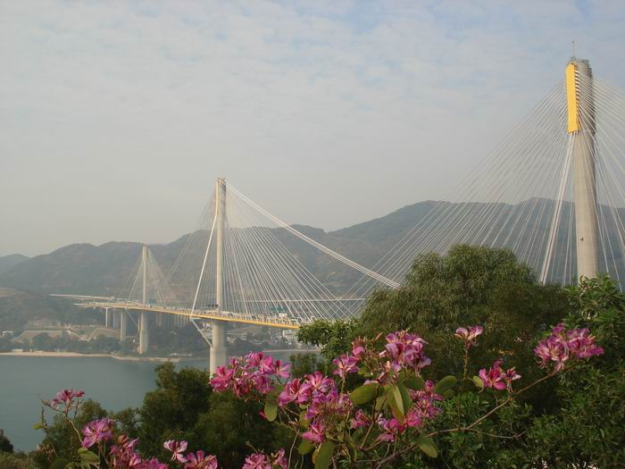
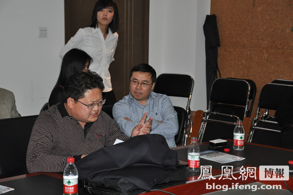
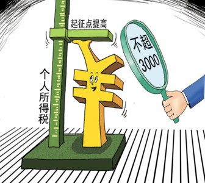

# 第十四期：香港老太逼停大桥的法治启示&叫板熊培云，小丑欲跳梁&减税了，多买几斤肉吧

ibeidou.org 

ibeidou.org

# **七星视点****第十四期：**

ibeidou.org

## **香港老太逼停大桥的法治启示&****叫板熊培云，小丑欲跳梁&****减税了，多买几斤肉吧**

**ibeidou.org** **ibeidou.org** **瓢虫君导读：** 香港老太凭一己之力逼停大桥建设，因为朱阿婆背后有香港高院的搀扶。确实给大陆“没牙的老虎”的环评体制上了一课。这一课是如何上的，请看王倩和张一粟两位法学学生的分析。王倩可是北斗法务部新人哦。 熊培云到对外经贸大学演讲，演讲后却被一个行政官员无理又无礼指责。王泓崧认为这体现的是高校行政系统对于学术系统的粗暴干涉。 个税起征点上调到三千元了，老百姓能多买几斤肉了。但经济政策的组合拳能打出什么效果，又有什么隐忧，请看号称北斗第一经济评论员的钱慕白、未来的经济学人也者乎之和罗天的分析。 ibeidou.org

#### **香港老太逼停大桥的法治启示**

ibeidou.org

****

ibeidou.org 日前，[港珠澳大桥香港段因香港老太朱绮华提起诉讼，质疑环境影响评价报告不达标胜诉，而需重新进行环评。](http://content.caixun.com/NE/02/jv/NE02jv9n.shtm)与此同时，港珠澳大桥的大路一侧已于2009年12月15日动工建设。香港段环评报告被诉无效后，[大桥的工期恐将延误，无法在2016年按时通车，造价也将增加5%左右。](http://www.s1979.com/news/china/201104/1913288419.shtml)普通香港老太凭借一己之力叫停几十亿的大工程的新闻在大陆激起了[轩然大波](http://roll.sohu.com/20110421/n306194759.shtml)，有评论指出这是香港社会为大陆的法治、公民政治所上出的生动一课，进而[联想到环境影响评价制度在大陆的步履维艰](http://comment.scol.com.cn/html/2011/04/011009_854499.shtml)。也有评论认为这一事件可以[让大陆的法律援助制度从香港得到借鉴](http://star.news.sohu.com/s2011/zhuqihua/)。 **相关新闻：** [港珠澳大桥曾为保护白海豚更改设计](http://www.hudong.com/wiki/%E6%B8%AF%E7%8F%A0%E6%BE%B3%E5%A4%A7%E6%A1%A5) [滇池卫士张正祥折射的环保之殇](http://hn.people.com.cn/GB/195196/14251669.html) ibeidou.org **【七星视点】** 按照1997年制定的香港《环境影响评估条例》，在大型项目的开建前，至少有两次公众参与讨论的机会，即使在经过两次讨论后环保署署长批准了环评报告，如果有居民认为规划侵害了自己的利益，也可就个案提出起诉，由法院做出裁定，这就是朱婆婆走的程序。 如果司法系统不独立，这个社会永远不可能完成任何类型的变革和自我纠正，因为它的尺度永远是变的。还好，起码这次事件里，香港司法没让人失望。大部分情况下，最坏的危险并非源自某种危机，而是源自控制欲，出现了错误可以纠正，最可怕的是掩盖错误不让人发现，就算发现了也不允许你说出来。我们今天老在说民主，但民主是什么？定义不好下，但起码的一点是有多少人可以参与到我们的日常生活中来，多少人能说不行、这样是不可以的。我们总是怀着一种行使自己权利的恐惧感，这种恐惧感我们不去征服它的时候它就会继续传播下去，如果今天可以因发展的名义牺牲一部分人的权益,那么总有一天所有的人都会被以发展的名义伤害。顺便向担心经济发展被破坏的人说一句，这只是司法审查为大型项目建设踩了脚刹车，但并不意味着项目被撤销了，而是建设方需要重新评估之前环评中没有考虑到的因素，使环境评估更完善而已。 最后，向勇于对着能创造无数GDP的700亿大桥挥舞小拐棍儿的阿婆和在她身旁搀扶着她的香港高院致敬。 

**By ****王倩**

ibeidou.org 普通公民逼停政府工程这样的新闻，事实上算不上新闻。因为这样的事情在法治社会里是一种常态。任何的公民都有权依据法律的规定对政府所做的决策提出质疑。对于环境有重大影响的工程，这把利器便是环境影响评价制度，这同时也是防止造成环境不可逆转损害的根本。环评要求对影响环境的要素进行全面的评估，并且需要纳入到司法监督之下,这是各国的普遍做法。但在大陆，环评不仅缺乏司法审查，更因为存在责令逾期补办手续这样的“先上车，后补票”条款，使企业往往先斩后奏，造成既然事实。又因为违法成本极低，通常情况下，违反环境影响评价制度的工程，大多以小额罚款和补办手续而告终。从而使得环评因此成了“没牙的老虎”。 反观香港，对于环境影响评价制度的完善和司法的有效监督，使朱老太逼停几十亿的大工程这样的事情成为可能，而这在大陆实际上是不可想象的。这也是为什么我们的媒体在看到这样一则在香港亦或是国外看来稀松平常的新闻时，会发出如此惊呼的原因。 我们当然不是要透过这一新闻，否定对整个港珠澳大桥项目所做的环境评价，也不是为了怀疑港珠澳大桥在建设伊始的环保态度。相反我们还看到了其在设计过程中为了保护白海豚而更改图纸这样让人温暖的细节。我们关心的，其实是这个合作建设的项目中，所折射出来的香港地区法治的现状和对司法的不同态度。我们希望的，是通过这样一则新闻，能够让不断被环境事件和其他更多事件侵扰的大陆公民理解到，完善的法律和有效地司法对于他们意味着什么。 

**By****张一粟**

ibeidou.org

**（采编：金吉男）**

ibeidou.org

ibeidou.org

**叫板熊培云，小丑欲跳梁**

ibeidou.org

****

ibeidou.org 著名青年学者**[熊培云](http://baike.baidu.com/view/958292.htm#sub958292)**应邀在对外经贸大学演讲，主题是[《青年中国说——这个社会会好吗》](http://blog.ifeng.com/article/10964065.html)。演讲结束后，[该校学工部副部长樊泽民当场批评熊培云水平不高，哗众取宠，不代表主流价值观](http://v.youku.com/v_show/id_XMjYwMTQyMzEy.html)。有现场观众欲反驳樊泽民，但被其打断，熊培云起身离场，互动环节提前结束。小编觉得，这位校领导的肚子，别说能撑船了，开艘航母也够啊，怎么气量这么小捏？ ibeidou.org ****【七星视点】**** 在正常大学学术独立的情况下，一名社会文化人在学校发表讲座，只要他的内容没有违反国家的法律和学校的规定、也不存在破坏学校的学术独立规范的言论，那就应该让他继续发表自己的言论。如有异议，你可以在活动结束后就其与你观点不同的地方展开交流和探讨。当然你也可以提前退席，回去做自己的事。而这名老师的行为就有点极品了，既没有因为观点不同而提前退席，而是在活动尚未结束的时候冲入场内一把抓起话筒对对方大加指责。 这次的事件，无非再次暴露了我国高校行政系统对于学术系统的粗暴干涉，而粗暴干涉的结果往往是正常的学术话语权被一群不懂学术的高校党工组织的负责人所霸占。就比如熊培云本来是应该在正常的报告厅里进行演讲的，而后却被迫改到了会议室，最后甚至连会议室都不行了，只能和学生露天拿把椅子和桌子座谈了。不过还好熊培云先生还是能够在饱受干扰的情况下在这所学校完成了活动的最后部分——同同学们交流，如果樊先生们再“MAN”一点的话，恐怕熊培云先生就会被强行架出学校了。 写到这里我心里也很不好受，因为我相信我们自己在现实中也遇到过高校学术文化同行政系统之间的冲突与矛盾。而身在其中的我们或许能力太弱小，往往无法找寻出一条解决问题之道。可是，那些真正有权力的人会把权力变成暴力，会把应当属于每个人平等拥有的话语权变成新华社通稿式语言发布。 在这次的PK事件后，我并不认为有谁成了赢家。中国高校学术不独立的问题再次在没有任何方案可能解决的情况下暴露，而这名樊老师，又何尝不需要面对民意的指责和校内师生们的鄙夷呢？ 

**By****王泓崧**

ibeidou.org

**（采编：陈造极）**

ibeidou.org ibeidou.org

#### **减税了，多买几斤肉吧**

ibeidou.org

****

ibeidou.org 全国人大常委会20日初次审议个人所得税法修正案草案，拟将个人所得税工资薪金所得减除标准，即免征额由现在的每月2000元上调至每月3000元，[“可以多买几斤肉了”](http://www.hkwb.net/news/content/2011-04/22/content_285912.htm?node=106)。中国人民银行也决定，从4月21日起，上调存款类金融机构人民币存款准备金率0.5个百分点，[“是中性而非紧缩政策”](http://finance.eastmoney.com/news/1350,20110421131616922.html)。 ibeidou.org ****【七星视点】**** 自从凯恩斯主义盛行，国家介入经济运行的程度就愈强，上调存款准备金率成为抑制投资过热从而抑制通胀的惯用手段。根据菲利普斯曲线，通胀和失业率是成反方向移动的。然而在经济危机爆发过后，中国的实际失业率还没有解决的情况下，抑制通胀会不会导致失业率攀高？或者更坏的估计是，通胀没有得到抑制，而失业率仍然攀高，从而使得滞涨得以发生？在一揽子经济刺激计划下，GDP仍然增速放缓，上调存款准备金率，使得中小企业获得贷款等融资渠道收紧，从一定程度上，反而阻碍了经济的增长。经济的起色着实惹人担心。 货币政策的工具（利率、存款准备金率、公开市场操作）将继续频繁使用，货币收紧将持续一段时间，由此导致投资的降温，尤其可能导致股市的持续下跌，会使得普通民众的收益进一步萎缩。靠政府投资撑起来的经济增的但是冰冷的数字背后，具体关系到民众利益的时候，还是物价和失业更为人所关注。一旦陷入滞涨，于国于民都是灾难。 虽然提高个税起征点使得居民可支配收入更高，能增加储蓄和消费，但是杯水车薪，仍然只是在数据上做文章。什么时候出台的一揽子经济政策能以民生为导向，那才是真正的政绩。 

**By ****钱慕白**

ibeidou.org 此次减税，我以为主要目的有二。其一，刺激消费，拉动内需，进而促进GDP的增长。税收少了，财富多了，人民消费的意愿自然会提高，则整个社会的产出也将相应上升。在货币政策不断收紧，GDP增长可能放缓的阴影之下，减税政策的出台，其实并不令人意外。其二，改善收入分配格局，缓和社会矛盾。个税起征点调高，无疑是中低收入人群的福音；可暂时转移他们对富裕人群和政府的敌视情绪，维护社会和谐稳定。 有趣的是，我国政府目前推行的政策组合，与80年代美国里根政府的选择极为类似。从经济背景上看，两国都面临着抑制通胀，同时稳定经济增长的艰巨任务，因而采用左手加息控物价，右手减税促生产的“组合拳”，也是应有之义。然而一个重要的不同点在于，里根政府在减税的同时，还实行了大规模削减财政预算的计划。政府不能生产，其收入的主要来源，就是税收和发行货币。收入减少而支出不变，冒出来的赤字该如何弥补？恐怕也只有增发货币这一条渠道了。如此看来，在未来一段时期内，物价上涨的压力或许会更大。 此外，羊毛出在羊身上，政府的开销不变，则减税造成的收支不平衡，最后还是靠要民众买单，只不过形式可能从个税变成了更为隐蔽的铸币税而已。如果人们意识到自己的财富实质上并无变化，是否还有增加消费的动力呢？经济学家关于这个问题的争论从未止歇，以后有机会再来详谈。 

**By ****也者乎之**

ibeidou.org 对里根减税的一个补充：里根政府减税的另外一个原因是所谓的“策略性减税”，共和党一向希望小政府小预算，但是由于USA的民主政治使得共和党政府无法保证自己的继任政府仍然是一个“小政府”派，为了避免继任的可能的“大政府型”开支，不妨减税+削减支出，使得联邦政府赤字高筑，于是继任政府哪怕想要大手脚花钱也心有余而力不足了。 对我国这轮减税的一个看法：诚如楼上所说，只减税不减支出是白搭，实际税负迟早会加上来，而且我国现在以流转税为主的税收所得组成也使得这次主要针对收入税的减税是雷声大雨点小。稅者，国之大事，向来是各位有良心的青年民间经济学家的争论焦点，机器人不才，不多置喙。只希望税负结构能多多优化，给点力吧ZF，要不然地主家也没余粮了。 

**By ****罗天**

ibeidou.org

**（采编：孙微阳 ****责编：刘一舟）**

ibeidou.org 

ibeidou.org
