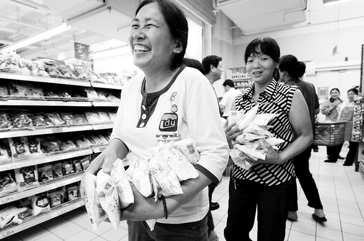
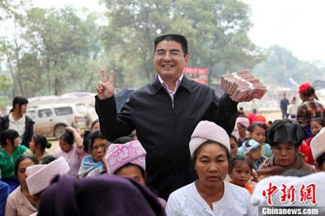
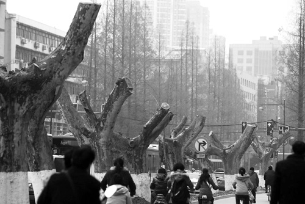
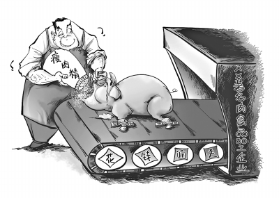
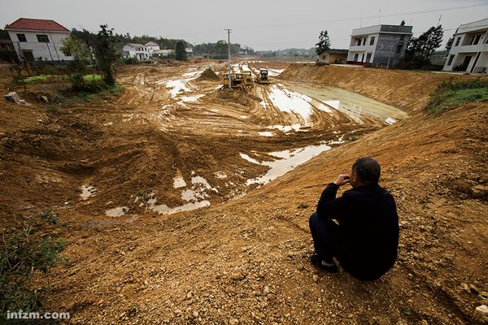
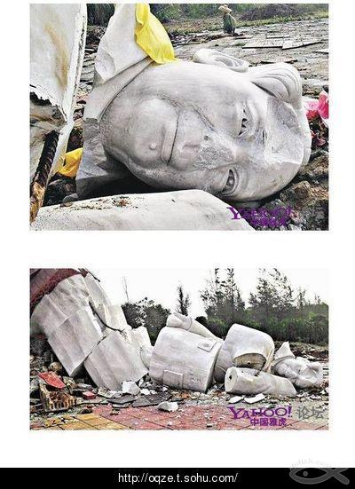

# 第十期：日本地震后的中国

# 七星视点

## 第十期：日本地震后的中国

### 1、“大核民族”与“盐荒子孙”

就在日本被地震海啸及之后的核电站危机整得焦头烂额之际。受日本核危机影响，从3月16日开始，神州大地突然挂起一股抢盐风。群众奋勇向前，万众异心：埋头抢盐的，嘲讽辟谣的，家里断盐发愁的，反思国民性的，各种阴谋论的，质疑政府公信力的，创作传播诸多欢乐盐段子的……刹时间，一场几乎可以说是全民参与的集体行动匆匆而来。 抢盐发展到这一步已经成了一个全民动员的公共事件，不过幸好，在抢购之路上，**[我们并不孤单](http://www.s1979.com/news/world/201103/1812439018.shtml)**。民主碘范，美国碘片告急；酒精考验，俄罗斯葡萄酒海带告急；藻谣生事，韩国海藻告急；至于太阳旗日本——卫生纸卫生巾告急……在大核民族的喷嚏面前，盐慌子孙们可以骄傲的宣布，我们不是一个人在战斗！！！不是一个人！！！ **七星视点：**** ** 这股由于日本核危机蔓延全世界的抢购潮，现在似乎已经告一段落。整个事情播种于危机谣言的散布，由于人们在无知下的恐惧而发酵。现代传媒与通信方式大大加快了恐慌暴涨的速度，整个抢盐风波发端，大概只用了不到24个小时。随着盐销售秩序的崩溃，不管你信不信盐谣，只要家里还得开锅做饭，秩序崩溃短缺来临时，也得奋不顾身的抢破头买。每个抢盐的人都是具体的为自己考量，不管这种考量是否建立在错误的根基上。个体的高度理性和群体的反理性并不矛盾，无论你作何想，集体的无意识，只能把洪流里的每个人裹挟向前。 **By ****图三** 抢盐发生后，我看到的评论基本都是“素质太差”。其实仔细想想这跟素质没什么关系，倒是跟脑子有点关系。在应对这类抽风的事情上，国人的脑子经常不大好使，而脑子又跟教育有关系。我们从小被教导要听话、要合群、要乖、要有城府、要会看形势，但从未被告知要有理性，要做出合乎逻辑的判断——从来没有。 关于“抢盐”我还有一种感觉，就是在令人哭笑不得的举动后面，隐藏着一代人对“大饥荒”的深刻记忆。必需品短缺、定量供应、供不应求导致吃不饱饭，形成了我们对“排队”这种形式的变态爱好。记得我从幼儿园就玩一种叫“抢位子”的游戏，及至长大成人，还觉得不管什么，只要是“抢”来的，都是最好的。 **By ****乐佳军** ** **

### 2、陈光标：有空咱到灾区洒洒钱去。

**[被冠以中国“首善”的陈光标又出现在了云南盈江地震灾区](http://news.sina.com.cn/s/p/2011-03-17/061622129944.shtml)**，一如既往，陈光标此次仍坚持现金捐助，受灾最严重的盈江县平原镇拉勐寨民众得到数万元捐助。陈光标从日本飞回上海后转机到昆明，连夜坐车赶到盈江，带着15万元现金向每名灾民发放200元现金。之后，他从一沓百元大钞中抽出两张并举起来，高声说：“**[请大家像我一样，将拿着钱的手举起来，我和大家合个影。](http://news.163.com/photoview/00AP0001/13608.html)**”此前，**[陈光标曾短暂出现在日本地震重灾区福岛](http://news.sina.com.cn/s/p/2011-03-14/025222108604.shtml)**，为日本民众捐款200万元。眼下因谣传碘盐能防辐射，中国又发生了盐荒，陈总是否正在给全国人民发盐的路上呢。 **七星视点：**** ** 从08年汶川大地震后迅速组织率领一批挖掘机、吊车等大型工程机械第一时间赶赴灾区，到去年高调宣称死后裸捐，再到如今在云南和日本两场地震中的表现，号称中国首善的陈光标，一直奉行高调行善的原则，为的是带动更多人行善。然而，他的高调未免带有作秀成分。陈光标与大量人民币现钞合影的照片已经出现了不少次，有的是成堆放置在身前，有的是发放到灾民手里高高举起，与其说是种视觉冲击，不如说是视觉暴力。更何况如今民间仇富心态不少，如此高调行善更可能产生逆反心理，带来厌恶。发现金是陈光标所喜欢的方式，但在灾区，各项物资缺乏，直接发钱很难说是最有效的救灾方式。此外，慈善应是种社会责任，是社会常态，在美国很多人每月都有固定的捐款额，企业家也都做慈善，而在中国，民众普遍没有这种习惯，慈善也有被曲解为富人的活动，这是观念的欠缺。慈善的关键不在于钱的多少，而是意识到自己需要承担社会责任。因此，高调行善，应该注意方式和侧重点，切莫搞成秀场和嘉年华。 **By ****登峰 ** 

### 3、南京梧桐去留考题

3月初，南京地铁新线破土动工，南京政府决定将长江路、太平北路等地铁沿线数个站点旁的梧桐树迁至别处。这一做法引发了南京市民及网友们的热切关注，许多人纷纷表达了反对意见，号召用绿丝带保卫梧桐树。 而南京的梧桐树风波，甚至引发了远在海峡对岸的[**国民党中常委邱毅的关注**](http://www.vos.com.cn/2011/03/18_166471.htm)。邱毅表示：这些立于南京市区的法式梧桐树，最早一批是为迎孙中山之灵而种，演变到后来，已经具有“护灵”的特殊意义。邱毅还说，自己要保护的不只是梧桐，更是想唤起同属中华民族的两岸同胞，对共同历史、文化、记忆的尊重态度。 17号南京市政府表示愿意公开征集民意，进一步优化建设方案，并制定《加强城市古树名木及行道大树保护的意见》，规定城市中的古树名木、行道大树，任何单位和个人不得擅自砍伐、移植。不过与此同时，网上诸多号召在19日静坐要求“保卫梧桐树”的帖子及微博，纷纷被屏蔽或删除。 **七星视点：** 城市发展与传统保护之间的博弈是一个永恒的话题。希望在南京地铁施工与保护梧桐发生冲突的时候，政府及施工方能够尊重南京市民们的意见，最终获得一个能够令市民满意的结果。毕竟，在城市里生活的，不是“权”，也不是“路”，而是“人”。 **By ****图三** 南京人常常挂在嘴边的话说“么的[哔—]事诶”，南京人的性格就如同这句话一样，有着对任何事都毫不在意的态度。但是这次却是在南京，有了一次这么大的公民活动，让杜阿姨对这座城市的好感度再次大涨到破表。从上海火灾过后的祭奠到这次南京人保护梧桐的行动，我觉得这是公民意识逐渐觉醒的过程。这不得不让人对未来产生希望。虽然最后还是在台湾的干预下，政府才说要重新制定规划。但是这样说来也未尝不是一个好结果。杜阿姨只是希望这次是真的听取市民意见，不要像那个笑话，猪问“能不移植么？”屠夫回答“你看又说偏题了吧”。 **By ****杜阿姨** 

### 4、讨伐百度

3月15日上午，包括贾平凹、刘心武、韩寒、郭敬明、李承鹏等在内的近50位中国作家联合发表**[《三一五中国作家讨百度书》](http://tech.163.com/11/0315/11/6V6DCGJ9000915BF.html)** ，称百度文库收录了上述作家几乎全部的作品，并对用户免费开放，但却没有取得任何人的授权，指责百度已经彻底堕落成一个窃贼公司，百度文库已经变成了一个贼赃市场。在这篇充满煽情的文字里，百度及百度文库被描述为一个无耻的小偷、骗子。而百度则按照**[“网络避风港原则”](http://www.yicai.com/news/2011/03/710296.html)**回应称，任何权利人都可以向百度方面指出其安全作品链接，百度会在48小时内审核并依法进行处理。不过，多位律师表示，百度的做法并不适用于“网络避风港原则”。 **七星视点：** 天下熙熙，皆为利来；天下攘攘，皆为利往。百度与作家们的纠纷，是一个利益问题，但更是一个权利问题。大多数正常人应该还无法像某些自由至上主义者那样潇洒的否认知识产权的存在，毫无疑问，百度文库的盗文行为侵犯了作者对自己著作的知识产权。当然，作为事实上的海盗党，每个网民都在享受网络盗版带给我们的便利。但只要这种便利以损害创作者的权利为前提，那终究只能难以为继。数字出版的大潮滚滚而来，需要转变观念的，有作家，有百度，还有我们。 **By ****图三** 

### 5、猪要那么健美干嘛！我们要的是健康猪啊！

央视《每周质量报告》的3·15特别节目**[《“健美猪”真相》爆料](http://news.xinhuanet.com/fortune/2011-03/15/c_121188586.htm)**，河南孟州等地惊现“瘦肉精”养殖的有毒生猪，并顺利进入双汇公司。消息传出，双汇公司在第一时间进行了**[危机公关](http://www.chinadaily.com.cn/micro-reading/dzh/2011-03-19/content_2062684.html)**，向消费者道歉，并宣称将召回“瘦肉精”问题产品。但并未涉及对消费者及社会的补偿问题。政府相关部门也开始了对“瘦肉精”问题的专项打击行动，河南抓捕了相关犯罪嫌疑人29人各地对生猪及熟食市场的检查行动也如火如荼。 **七星视点：** 从08年的三鹿事件开始，中国的食品安全问题就很难称得上乐观。市场秩序的混乱，与腐败和权力寻租之间脱离不了关系。不建设真正良好的市场经济秩序，不从根本上解决制度构建中的缺失，指望一次又一次的“专项行动”来解决问题，只能是缘木求鱼。 **By ****图三** ** ** 这又是一纸中国式的致歉声明。没有赔偿条款，没有整改期限，没有具体方案，只是表示，我知道了，保证以后没事了，你们这些群众也就散去吧。双汇公司似乎站在了一个权利的高处，来解释这次事件，而且又刻意淡化了其与分公司的关系，显得双汇集团本身也是无辜的，只是城门失火，殃及池鱼。事实却很可能是，瘦肉精已经是整个肉制品行业的潜规则了。 纸上谈兵的管理层重视和严格规章都是无用的，我相信国人的智慧能巧妙的周旋其中。但消费者的选择是有用的，请记着，市场是选择和被选择的，你做得不好，你就面临被淘汰。我们虽然没有选举权，但我们有购买权和不购买权 **By ****凤先生** 

### 6、中国重金属污染将实行总量控制

在浩浩荡荡的“十二五”规划中，一则**[《重金属污染综合防治“十二五”规划》](http://finance.jrj.com.cn/2011/02/2200459249105.shtml)**引人关注。除了具体的硬性指标，《规划》的主要内容包括两个方面：一，除了以往的重金属污染浓度控制，引入了类似碳排放的总量控制；二，明确地方政府是责任主体，并将根据指标制定相应的考核办法。 **七星视点：** 2010年浩浩荡荡的节能减排运动留下了一地鸡毛。而让人不安的是，一旦一级级的指标考核从上到下压下来，各级政府为了完成目标，恐怕什么都做得出来哦。结论一：中国的重金产业可能要开始大转移了，就像高耗能产业当初转移到中西部地区一样；结论二：尽管这个规划是想大力遏制污染状况，但我国的重金属污染状况，依然很难乐观。 **By **图三**** 

### 7、主席像被推倒

 近日，位于海南省文昌市龙楼镇南海边的毛泽东像被房地产开发商推倒。这座毛泽东的汉白玉雕像，高9.9米，于2008年10月1日树立。小编从网络搜索到的图片中可以看到，这座雕像已经被损毁的面目全非，身体裂成五段，头部和脸部损坏十分严重。而最先报道此事的**[中国广播网](http://china.cnr.cn/newszh/yaowen/201103/t20110314_507786756.html)**则点评称“希望当地官方能尽快给出一个正面的解释。不希望看到良知和民族自尊心在利益面前变得一文不值。” **七星视点：** 对毛泽东雕像的推翻，与其说是一个事件，不如说是一个象征。它让我们开始重新思考，在经历了高速的经济发展之后，这个时代还需不需要信仰，而我们信仰的，是金钱，是为利益至上，还是其他？我们是否需要在追求经济发展的过程中，开始关注自己内心的建设？ **By ****小南** ** ** 我也觉得这是一个象征。推倒毛泽东雕像的，是地产开发商，这是中国改革开放以来，轰鸣的资本车轮以不可抵挡的势力推倒原有的共产主义红色中国的象征。共产主义的梦想在这片土地上已经被驱逐，不管是喊着四项基本原则开着全国两会的代表委员，还是血汗工厂失足妇女尘肺病工人，大家都其实心照不宣。 **By ****杜阿姨** 听到这个消息，心里咯噔一下子。 **By Screw you guys I’m going home** 

**（随手评论，参与七星视点。投稿邮箱： ibeidouview@gmail.com）**

**（采编：钱思韵、杨再爽、陈造极、金吉男、刘一舟 责编：刘一舟）**
