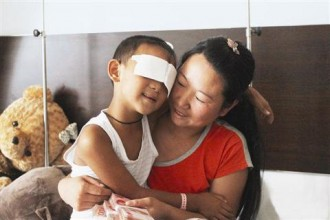

# 第四十六期：免除医药费后的慈善之辩

社会各界关注的双眼遭受伤害的汾西县男童小斌斌（化名）在父母和亲戚们的陪同下出院。医院已免除了小斌斌住院期间所有的医药费用6852元，并将包括其住院押金及多方捐款在内的近8.5万元交至小斌斌父亲手中。

与此同时，男童家收到了来自社会各界共计达一百余万的捐款。伴随这笔捐款而来的还有一阵不小的质疑声：

_@[七公李清晨](http://weibo.com/drliqingchen)：山西被挖眼男童出院 医院免去全部医药费——说句让大多数人不爱听的话——不！该！免！此例一开，以后但凡有被舆论关注的悲惨事件，医院若不免单，就必然遭到“正义人士”的口水。_

这条微博发出后引起了两派人士的激辩。

其中一方认为医院可以捐款但不可免费，因为捐天然具有自愿性，要求强捐必受道义谴责。免天然具有义务性，一旦开了先河形成惯例，以后遇到类似案例不给免费，也必受道义谴责。此举亦有给在职院领导政绩作秀的嫌疑。

而另外一方认为免或不免，都是医院的事，其他人无权置喙。医院借着免医药费做广告，借着男孩受害事件的传播广度的势打造正面形象。同时也给男孩送去温暖，一举两得。

与此事形成鲜明的对比：今年7月12日，武强县的赵先生帮助被抢劫的女子反遭歹徒砍伤，在医院花了两万余元的医药费，其中受害者家属给出了2000元，其余的只好自己承担。因无钱治疗，他手术后第9天就不得不办理了出院手续。而面对此事医院就没有采取减免的举措，对于无辜者和勇者的双重标准似乎并不能说明问题。在百度上搜索医院减免医疗费用，多达440余万的条目似乎又在说明众多医院对此也是有过相应举措和努力。

但在这些虚虚实实中，对于医院减免医疗费用的合理与不合理性，以及流动在其中的潜性规则就是需要弄明白的问题。

**该不该——医院的社会责任**

医院对病人、医务人员、其他雇员、当地区域、第三方付款者（保险公司或政府）、有业务或商业联系的单位等都有责任。

社会责任可指与大社会有关、具有社会意义的责任，包括对国家发展目标、公共卫生、社区健康及保护环境的责任。病人似乎是个个人，但病人可以构成一个社群，对病人的责任具有重要社会意义，因此也应是社会责任的一部分。

在谈到具体的社会责任之时，就得区分公立医院和私立医院的差别。私立医院作为盈亏自负的机构，所承担的责任主要考虑自身的生存和发展,兼顾社会公益事业。因此,民营医院承担社会责任应该注重扩大医院自身的利润,同时还要顾及社会效益的积累。最终与医院的运营挂钩的在于自身名誉。《生命时报》联合新浪健康、39健康网共同发布的网络调查显示，71.2%的居民不会选择私立医院，其中38.7%的人认为私立医院坑蒙骗人，19.8%觉得费用太高，18.9%表示私立医院多以男科和妇科等专科为主，16.2%不认可其医疗水平。因而私立医院在民众心中更多的是作为商业机构的存在而非单纯的医疗机构。这就对私立医院的常规运作提出了一些限制。

公立医院是有国家和集体所举办的具有公益性质的医疗机构，其社会责任主要反映医院与社会关系的责任，即医院对社会和政府机构所承担的责任。从具体行为上，公立医院所承担的事务就相对复杂的多。除了向患者提供医疗服务外，其还负责完成政府卫生指令性任务及计划、承担突发事件的救援任务以及出于人道主义考虑的慈善行为。

减免医疗费用，对于私立医院而言属于支援性责任，在自身运营健康，规范医疗行业的前提下，对于弱势群体实行救助对于自身的进一步发展具有建设性作用。而公立医院而言，尽管存在自愿性的要求，但是该行为也是其主要社会责任的一部分。但是无论性质如何，并没有明文规定医院必须去做这些事务。因而患者具有申请医疗费用减免的权利，但是并不意味着医院必须为此承担义务，任何医院是否做出类似行为取决于医院自身的考虑。

**钱哪来——医院的盈利机制**

我国公立医院自诞生之日起，就在计划经济体制下运作，其特征是公立医院作为国家事业单位，政府包办了一切。这其中包括划拨事业经费、投资基建项目、购置医疗设备等。不仅如此，卫生技术人员也由国家指派、分配和供养终生。在“收费越低、减免越多就越能体现社会主义优越性” 的福利观影响下，医疗收费价格多次大幅度降低。面对巨大的卫生需求，财政已经没有能力给医院以相应投入，直接导致医院运转困难，并由此造成上世纪六七十年代的“看病难、住院难、手术难”的三难问题。

为减轻财政压力，八十年代政府对公立医院由全额补偿转为差额补偿，实际上是让医院通过自身的业务活动在卫生服务市场上获得收入。政府为了刺激医疗供给，提高卫生服务的供给量，在财力不足的情况下采取了 “给政策不给钱” 的改革思路，使公立医院在改革中渐趋逐利性。同时通过建立职工医疗保险、城镇[基本医疗保险制度](http://baike.baidu.com/view/138010.htm)和农村合作医疗制度，使得公立医院的市场性和政策性都得到了凸显。

“我愿尽余之能力与判断力所及，遵守为病家谋利益之信条，并检柬一切堕落和害人行为，我不得将危害[药品](http://www.pharmnet.com.cn/product/)给予他人，并不作该项之指导，虽有人请求亦必不与之。”这是《希波克拉底誓言》，也一度是医者入行的誓言。八十年代医改之前，进入临床，做医生是崇高的职业，不像现在充满争议。而之后公立医疗机构对药品加成的依赖逐步增强，随后各种灰色利益的加入使得公立医院的盈利也不再单纯。

但抛开这些而言，公立医院减免医疗费的资金来源来自于两个方面：其一是政府指导下的减免性行为，带有政府资金补助；其二则是医院自身盈余拨出来的医疗基金。后者的带有一定的突发性，对此标准的探究将放置于后面讨论。

小斌斌的事件中，整个医疗方案的制定都是在山西省卫生厅的组织下进行，而随后卫生厅向山西省委省政府打报告，汇报患儿病情及家庭情况，并提出费用减免建议。由此可见，他的医药减免源于行政指令的参与和山西省眼科医院的配合。而相应的费用也由上述两部分组成。

**最终标准——大范围与小概率**

说到现在，就得回到一个问题上来，减免医药费的标准在哪？

大范围。大范围减免医药费主要是针对比较固定的特殊群体。首先是优抚对象，即残疾军人或遗属、特困户等。填报申请书，整合相关材料即可以享受到此服务。其次是针对贫困地区与农村家庭的先天性心脏病、白内障等特殊疾病。这些对象在相应地区均有政府条文加以确认，因而在补助上也有比较完善的保障措施。

小概率。新闻价值中的时新性和趣味性特征使得媒体将一些罕见性病例和具有社会关注价值的新闻放到了公众平台上。当一位患者得到的关注足够多时，他背后潜藏的价值就不再仅仅是一种疾病这么简单。罕见疾病治愈后的科学价值和知名度，重大舆情当事人的社会价值甚至其包含的政绩成分都成为了减免费用的口实所在。

小斌斌案件中突出的“电子眼移植”、“卫生厅建议免除医疗费”、“社会各界捐款100余万”正是这些因素的集合体。

小斌斌无疑是幸运的。发生在他身上的偶然性能证明的事情恐怕很少，也无法给后开者提供任何可执行的步骤。有关医院的减免政策实际上依然遵循着规律，有条不紊地进行。在医疗制度不断完善的今天，无论背后考虑如何，能够带给民众实在利益的就是好政策。祝愿小斌斌早日康复，也希望人们都能病有所医。

（编辑：方小华；责编：张山骁）
