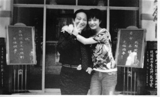

# 第四十四期：钱，大师与中国梦

钱，中国梦

人大概都有梦，我们为了梦趋炎附势，为了梦卑躬屈膝，为了梦扯大旗，为了梦装孙子。在一些深夜或清晨，我们会抛弃梦：“去他妈的，不干了。”但在熟睡或清醒后，我们总将梦重新揽入怀里。无论对梦有多少怨言，谁都不会否认，没有梦的生命是很无趣的。

梦不像文字、法律或政治革命那样会被一国或一民族限制住。梦不过是钱、性与权力以不同组合各种面貌出现的混合体，当它的特征越抽象，它就能传播得越广而不论当地的法律、气候和种族有何特别之处。

美国梦大概是指一种相信只要经过努力不懈的奋斗便能在美国获得更好生活的信仰。虽然我不知道中国梦是不是尽如官方所解释的那样，但我感到生活在中国特色的社会主义制度下的人们无论梦的抽象内容与美国人的如何相似，他们的梦的具体形式与实现途径必然大有不同。

柳传志说：“从现在起我们要在商言商，以后的聚会我们只讲商业不讲政治，在当前的政经环境下做好商业是我们的本分。”弗里德曼也在《商业的社会责任》中写道：“仅存在一种、而且是唯一的一种商业社会责任——只要遵守职业规则，那么它的社会责任就是利用其资源，并且从事那些旨在增加其利润的活动，也就是说，在没有诡计与欺诈的情况下，从事公开且自由的竞争。”他们的意见要求商人们在实现自己的商业梦时只关注于自己为消费者所提供的商品是不是足够好，商人们的唯一使命便是让消费者满意。

这种观点在理论上非常正确，然而在中国特色的社会主义制度里，在每件商品背后那只看得见的权力之手的提醒下依然持这种观点恐怕是掩耳盗铃之举。中国企业家的生存环境难言理想，我想这是个共识。

至于官员们，无论是要实现“为人民服务”梦还是“敛财泡妞”梦，升迁是最基本的。从小干事到局级干部，有多少人可以问心无愧地保证自己以非常体面的方式得到今天的地位？官员们追梦要钱，企业家们追梦要权，两者一拍即合，从此过上了幸福的生活。除非情妇搅局。

文火慢炖是大家追梦的通常方法，正如清朝诗人赵老根所言：“火候过了，事情就焦。”商人们有严重的不安全感，这感觉常常迫在眉睫火烧屁股但他们却要表现得举重若轻。炒菜先放油，送礼先掏烟是总不会错的。盘踞在党政机关住宅小区周围的礼品回收店就是名烟们二次流通的保证。

贵烟国酒香在特制过滤嘴中藏有蓝色爆珠，爆珠里是三十年窖龄以上的茅台酒液，品吸时将爆珠轻轻挤破即可酒香四溢。钓鱼台景泰蓝仅在钓鱼台国宾馆供应，一次限购两条，虽仅售250元，但因其特殊背景也成为了礼品回收市场中的硬通货。送了烟就可以送表送茶了，再进一步送车送房送名木，一个政界知音，多年的老朋友就这样结下了。

然而，但凡稍有常识略有警惕的领导都不会给生人送大礼的机会。初打交道讲究的是人礼分离，领导本尊可以见，厚礼则得通过中间人送出。这时候，渴望确保安全与方便的商人们与渴望财富高升的领导们便急需一个双方信任的中间人。

中间人的人选有很多，其中一个是大师。

 

钱，大师

在国内某二线城市的一座小山脚下，住着一位叫圭木的大师。他家楼下住着该市某官员一家，楼上住着央视某著名主持人的父母，再楼上是某国脚的父母。这片不起眼的小区里住了形形色色各种名人及名人家属。

为什么？

因为大师说那里风水好。

你信吗？

谁信谁傻逼。

 

王林的同乡邹勇是中国能源界与电力界的一号人物，也是江西省的人大代表。他说，08年他因崇拜王林，折服于他的断蛇复活奇迹而拜师王林。他交给王林500万拜师费以表诚心，后来更送了他700多万的劳斯莱斯和200多万的保时捷，之间各种黄金和红包不断。

王林给了他几本练功心法，其中一本是线装书，名为“万法归宗”，里面有各种符号和口诀。王林让他熟记于心。练功时，邹勇将红绳系在右手，伸展呼气三十六下，用小板凳拍前胸和后背各六下，如此往复。这叫“开气门”。

王林告诉他，开气门是第一层，第二层为练意念，到第三层则可施展法术了。

当然，邹勇什么也没有练成。现在，邹勇因经济纠纷起诉王林，而王林则否认邹勇为他的徒弟。王林一审胜诉。

咋一看，我们会发现有个词很精准地形容了类似邹勇这类人，叫傻逼。

甚至我们可以从这件事说开去，谈到信仰缺失和野蛮生长出的企业家们不仅知识水平不高，还智力堪忧。

然而事情是否真如邹勇所说，他是崇拜王林的神功才走近王林乃至反目成仇的呢？

2000年，邹勇成立萍乡市天宇燃料有限公司，经验煤炭建筑材料的批发零售，注册资本五十万元，员工十三名；2002年，邹勇结识了王林，王林放了高利贷，邹勇在三年之内收购了五座煤矿，05年他将天宇燃料改组为集团公司；自04年起，煤炭价格上涨，因国家对电力价格实行管控，煤炭行业开始限制各电厂的供给以保证高价。发改委开始协调煤电价格联动机制，赣西煤电项目因而摆上桌面。

06年，邹勇因王林结识了刘志军，在种种运作之后，邹勇拿到了江南地区最大的煤炭储运中心。这是北煤南运战略的重要组成部门，是为保证江西电力供应筹建的重要项目，更是06年发改委十大重点节能项目之一。此事后，邹勇酬谢王林50万元，房子一套。而王林对此则颇为不满，他表示邹勇因为他挣了二十个亿才给他一套房子，说不过去。两人因此结怨，其后两人又产生了各种纠纷，王林揭发邹勇是中国首个冈比亚籍人大代表，邹勇骂王林诈骗直至对薄公堂。

因商界精英们对“神功”趋之若鹜就归咎于社会风气与国民素质是没有意思的，商人们是深深地被大师的“神功”吸引着，但这“神功”并不是那些初级魔术，而是他们追逐梦的助力和工具。

    

大师，中国梦

当然，大师们也有梦，而王林，属于梦想实现的那一类。

王林不缺钱，他当着记者开口闭口几千万几个亿，显得并不把钱当回事。他放高利贷，借了某黄姓企业家一个多亿。而他借给芦溪县政府用来修路修河的几千万，利息甚至比银行还低。

但政府已经不敢向他借钱了，他的脾气不好，会提前索要借款，若未还清，就会大闹政府。早年的王林因诈骗罪入狱，现在的王林则能气壮山河地在政府机关里讨要欠款。从一个罪犯到政府债主的转身，不可谓不华丽。

他在芦溪县的豪宅叫王府，五层别墅，与县政府一墙之隔。王府里，有两层专门放他和官员明星的合影。明星太多，他有时都懒得向来访者介绍，而与他有交集的官员们，竟有身居常委职务的。他曾对原铁道部部长刘志军表示他可送他一块靠山石保证他官运亨通，永远不倒。

王林也热衷于慈善，他多时捐几百万，少时有几十万，坚持了十多年。他有一张贫困户的名单，他长期资助他们。如他所说：“有钱人多了，谁能像我坚持这么多年？我不放高利贷，哪来的钱给老百姓。”

王林甚至算得上一个有义气的人，他曾帮某企业家买地，领导批准后，他帮企业家送了该领导50斤黄金，后来他和企业家发生纠纷，企业家扬言将王林给领导送礼的事情曝光，王林为了息事宁人，拿了1000万给企业家。他自己感叹道：“我王林真是做了大好事，那领导听到都得哭。”

王林常爱说一句话：“我犯法了吗？”

收别人礼物犯法了吗？表演气功犯法了吗？介绍朋友认识犯法了吗？

不幸的是，焦点访谈回答他，你犯法了。

于是早已成为香港居民的王林离开王府到了香港。

作为一个隐秘圈子的核心人物，王林为商人和政客的梦想牵线搭桥，而一旦大师见光，就由小圈子中的“神”被贬为公众嘴里的“鬼”。王林被牺牲后，这个圈子散架倒台了，而原本依附于这个圈子的人们，恐怕又会找到一个新的核心，再次形成一个关于权力、金钱、梦想的交易平台。

王林错误地以为自己是主角，实际上他只是迎合他们需求的一个幌子和招牌而已。

我们并不清楚王林何时从香港回乡，甚至不能确定他是否还能回来，可是我们知道，当他回家，一定会发现新的大师已经继承了他的衣钵。

 

（编辑：张山骁；责编：刘迎）
