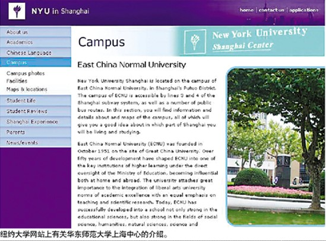
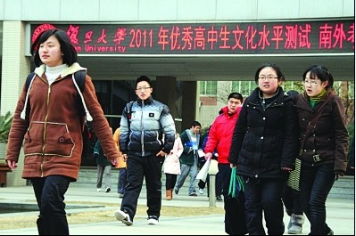
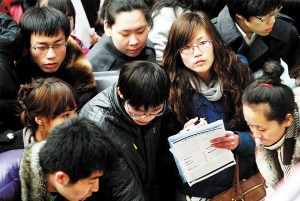
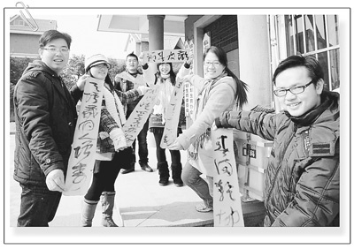
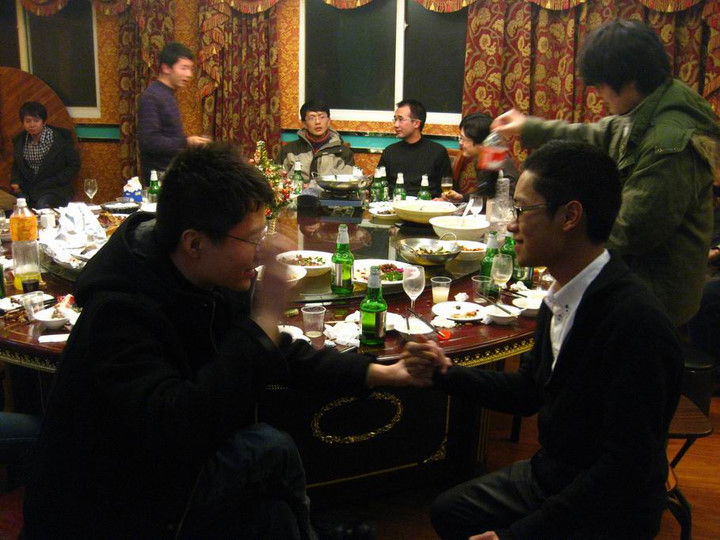

# 第四期：去上海留学纽约大学？

### 

### 

# 七星视点

### 

## 第四期：去上海留学纽约大学？

### 

### 

### 1、去上海留学纽约大学？

### 

### 

### 

去上海留学，小编可不是在说上海要变魔都公国这样的分裂言论。留学都是去国外的洋气大学，比如纽约大学神马的，而据说纽约大学要开到上海来了。 全球范围内招聘优秀教师和学生，本科期间有1~2个学期海外游学经历，跨文化环境下培养国际化人才，毕业后发上海纽约大学毕业证和纽约大学学位证……这好像不是以往的那种2+2的以出国留学为目的的合作办学模式。华东师范大学校长俞立中说，[上海纽约大学](http://baike.baidu.com/view/5114042.htm)办学模式和人才培养模式的探索，会给中国教育改革以及高校国际化发展带来深远影响。 **七星视点：**近几年，[中外合作大学](http://service.qianlong.com/48624/2011/02/10/6044@6625987.htm)如雨后春笋一般出现在经济最为繁荣的长三角地区。宁波诺丁汉大学，西交利物浦大学这样的名字听起来都很山寨。这些学校以预科加留学为主要模式，实际上是在打造一个快捷留学的的跳板。所以小编觉得他们还不能算是中国一种新形式的大学。中国高等教育还是在被各种公立大学垄断，这些学校都办成党校分校。新的办学方式的出现都被寄予厚望，比如[南方科技大学](http://baike.baidu.com/view/1215910.htm)。“到1952年以“院系调整”为名目的改革之后，中国大陆内大学就是清一色的国立化了。看到朱清时的艰难和国立的惰性，为何不索性搞多种所有制竞争？”（[贺卫方微博](http://t.sina.com.cn/weifanghe)） 那么这个上海的纽约大学不知道能不能办出新意，至少办得像与国际接轨的大学，为多种高等教育办学所有制助力呢？总之，改革开放告诉我们，尝试是值得鼓励的。 

### 

### 2、自主招生，名校生源战，培训新市场

### 

### 

### 

我们不像奶茶mm那么火，没法直接[保送上清华](http://news.163.com/11/0107/02/6POUA6R100014AED.html)，但我们可以参加[AAA测试](http://baike.baidu.com/view/4574393.htm)获得清华的自主招生资格。AAA测试本月19号开考，但复旦的[千分考](http://www.yangtse.com/news/jy/201102/t20110213_787477.htm)昨天已经开锣，名校生源战已经被拉开。 而只要是考试，中国人就有办法对付，自主招生考试自然也催生了社会各类[自招培训班](http://news.163.com/11/0213/14/6SPFE0HB00014AED.html)。 当然，中戏北影也开始招生了，2011年北影本科计划在全国招生488名，[报名人数已经突破两万](http://news.xinmin.cn/rollnews/2011/02/12/9272703.html)，在被潜规则的道路上，原来有这么多人前仆后继着。 **七星视点：**在如今，参加高考上名校还是大多数中国学生的首要目标。[高校自主招生](http://baike.baidu.com/view/215690.htm )已经实行多年，自招培训班也是时候出现了。自主招生被学校，考生，教育培训生意人关注是个好趋势。中国高教改革，办学方式多元化是好事，招生方式多元化也是好事。 

### 

### 3、“被相亲”了没？

### 

### 

### 

情人节快到了，你是计划跟恋人约会还是父母在计划给你相亲呢？ 过年放假回家，不少年轻大学生听到次数最多的一句问候是：“找对象儿了吗？”听到次数最多的关于朋友的消息是：“听说那XXX找对象儿了。”家长着急，亲友介绍，大学生屡遭“[被相亲](http://news.xinhuanet.com/edu/2011-02/10/c_121062009.htm)”。趁着放假[安排孩子相亲](http://news.163.com/11/0130/08/6RKP0R4G00014AED.html )也成了不少热心的“七大姑八大姨”过年最忙活的事儿。而有的父母让孩子去相亲的原因竟是[孩子自己谈恋爱不靠谱](http://edu.cyol.com/content/2011-01/28/content_4132279.htm)。 **七星视点：**韩寒曾经说：“中国的情况是，很多家长不允许学生谈恋爱，甚至在读大学了还有很多家长反对恋爱，但等到大学一毕业，所有家长都希望马上从天上掉下来一个各方面都很优秀而且最好有一套房子的人和自己儿女恋爱，而且要结婚。想的很美啊。” 有媒体说，中国进入“[渴婚时代](http://sdzg.inewsweek.cn/topics-79-2.html)”。适龄青年会面临成为剩男剩女的风险。大学生“被相亲”则反映了“渴婚”的低龄化。虽然现在学生不急家长急，而宏观来看，是社会在急。这是个原因复杂的问题，小编认为爱情观婚姻观的功利化既是表现也是原因。爱情观婚姻观功利化是什么？就是家长婚介所化，男青年求合体化和女青年马诺化。 小编突然心生一计，北斗正在酝酿网站改版，做靠谱青年的婚姻介绍网站肯定会火。 

### 

### 4、科技部撤销科技进步奖，方舟子趁机呐喊摇旗

### 

### 

### 

科技部近日以红头文件的形式对外宣布，撤销2005年国家科学技术进步奖二等奖获奖项目——“[涡旋压缩机设计制造关键技术研究及系列产品开发](http://www.most.gov.cn/tztg/201102/t20110201_84647.htm )”。撤销原因，学术造假。当事人，西安交通大学原教授[李连生](http://baike.baidu.com/view/198115.htm)被学校解聘。原来人家还是[长江学者](http://baike.baidu.com/view/193490.htm)。 打假斗士[方舟子](http://baike.baidu.com/view/263093.htm)就此事说：“在我掌握的可能造假的人中，有大学校长、副校长、两院院士，还有知名大学的著名教授，地位越高，越难处理。因此，需要更多的人出来举报。” **七星视点：**李教授真是倒霉，不仅倒霉在造假被人举报，还是倒霉在被举报了还被抓出来。当然造假被揭发被处理的这些教授也是活该，造假造得这么明显。当年那个上海交大的教授，从美国买了个芯片就说是自己做的，还叫[汉芯一号](http://sh.sina.com.cn/news/20030227/17366359.shtml)。帮帮忙哦，你们造假的时候用点心伪装的好点可以伐。 [中国学术界到底有多腐败？](http://wenku.baidu.com/view/fa98b3868762caaedd33d414.html)大抵和中国的官场是一样的，露出来的是冰山一角。方舟子认为官本位的科研体制是学术造假屡禁不止的重要原因。但是他再摇旗呐喊也改变不了这种根本体制。要改变中国的学术状况，也需要和进行政治改革一样的社会动力。唉，时无英雄，使方舟子成名。而且小编觉得造假教授教出来的学生也是别指望了，刚才还有同学拜托小编帮他写作业论文呢。 小编突然又心生一计，北斗正在酝酿网站改版，做文化昆仑代写作业网站肯定能火！ 

### 

### 5、节后招聘：淡定的农民工，焦急的大学生

### 

### 

### 

节后招聘会开始了。在上海，节后首场大型招聘会[用工明显短缺](http://money.163.com/11/0212/19/6SNEAIDA00253B0H.html)。同样2月11日上午，在济南市人力资源市场，以招收各种工人为主的企业早早占好了摊位，这是一场以农民工为服务对象的招聘会，可前来应聘的农民工却很少。让用人单位意外的是，不少[大学生前来应聘](http://www.chinanews.com/edu/2011/02-12/2838566.shtml)。大学生你们肿么了大学生？ **七星视点：**短缺的是农民工，找不到工作的是大学生。有媒体说这是大学生与农民工抢活干，可是人家农民工这些活还不愿意干呢，何谈“抢”活干。 前面第二期里说过，劳动力资源与经济需求不对应造成的结构性失业是中国劳动力市场的难题。同时这也是一个社会难题。有学者提出通过三本改技校来调整劳动力结构，看来这个办法确实是个方向，因为现在大学生部分群体已经被逼降低自己在劳动力市场中的位置了。放下身份的滋味，总是不好受的。 

### 

### 6、人民日报曰：大学生社会实践走马观花要不得

### 

### 

### 

寒假要过完了，小编又开始看着同学们准备寒假社会实践报告，没有亲身参与实践的，各种胡编乱凑；亲身参与过某些活动的，走个过场再各种胡编乱凑。小编觉得大学生社会实践是该反思反思了。没想到高屋建瓴，与时俱进的人民日报也是这么想的。人民日报发表文章[《大学生反思社会实践：“走马观花”要不得》](http://news.hexun.com/2011-02-11/127246787.html)。能跟人民日报想到一起，小编非常得意，但人家结尾是这么说的：“小实践，大作为。社会实践不是我们大学生群体的小事，而是整个社会的大事。真诚地希望全社会都来关注社会实践这门课，这不仅是大学生的心声，更是培养合格建设者和接班人的需要！希望大学生真正做到把出色的社会实践成果作为将来走向社会的一张响亮名片。”小编本来是想这么说：“你们这样搞实践，坑爹呢！” **七星视点：**关注北斗，关注七星视点，才是真正关注社会；发表自己的意见，参与北斗，参与七星视点，才是真正的实践。Get involved！ 

### 

### 7、襄阳好风日，留醉与北斗

### 

### 

### 

正月初六、初七，北斗网第七次全国聚会在湖北襄阳举行。大会内容是，在此省略若干字。大会在详和的热烈的气氛中闭幕，这是一届团结的大会，胜利的大会，奋进的大会。 **七星视点：** [“关于中国命运的宏大问题，正等待着当代青年给出自己的回答。我们的选择如何? ](http://blog.renren.com/blog/251347137/711014088) [在网络围观的背后，我们需要更努力地追求真相。在传播常识的同时，我们需要更努力地去接近真理。在不吐不快的同时，我们需要更勇敢地去面对现实。](http://blog.renren.com/blog/251347137/711014088) [我们必须了解，无论在何时，治理中国这片土地都不是一件易事。未来，当历史的重任放在我们肩头，我们能否承担得起？我们必须从现在开始积蓄力量。让我们从虚拟的网络，走向更加宽广的大地。让我们从一个又一个的圈子，走向更大的价值共同体。](http://blog.renren.com/blog/251347137/711014088) [崭新的2011，崭新的辛卯兔年，我愿意和你们携手同行。” ](http://blog.renren.com/blog/251347137/711014088)

### 

### 

（撰写：刘一舟、周辰 编辑：刘一舟）

### 

### 
