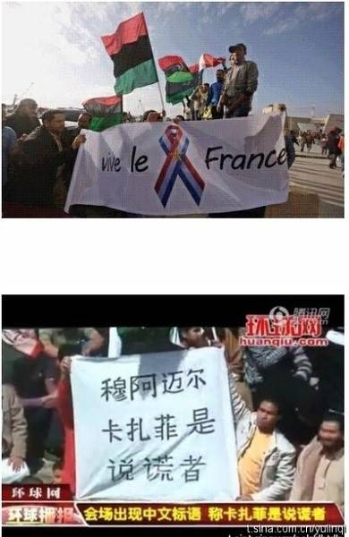
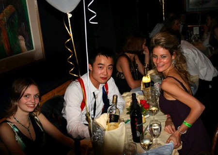
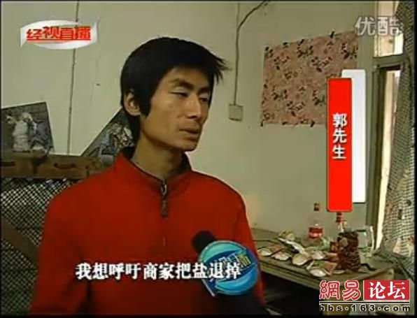
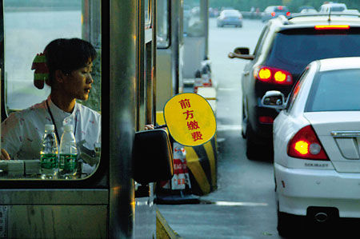
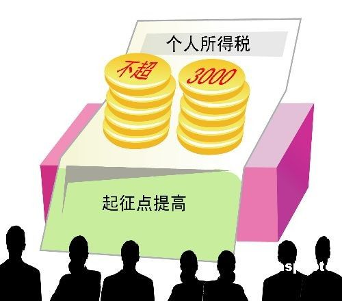
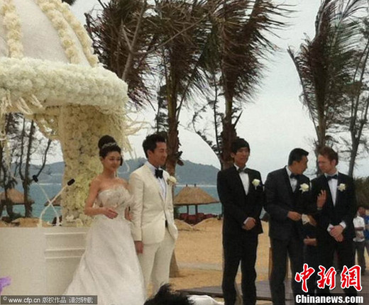

# 纵观世界风云，央视这边独好！

### 

### 

# 七星视点

### 

## 第十一期：纵观世界风云，央视这边独好！

**1. ****纵观世界风云，央视这边独好！** 国外比较乱套，成天勾心斗角； 今天穆巴拉克总统下台，明天菅直人首相又要被炒； 闹完敏感花革命，又要推翻上校领导； 纵观世界风云，央视这边独好。 

### 

### 

** ** **七星视点：** 我想问，“人权”、“主权”这个问题真的那么难吗？里面的哲学讨论我们真的关心吗？抽象地讲，确实难。具体地讲，很多时候一点并不难。当士兵向手无寸铁的平民开枪的时候，我想每个有常识的正常人都可以做出道德判断。 也就是说，什么是正义，其实大家都心里有数。我们的官媒在有意制造一种道德相对主义的假象，好像你有你的正义，我有我的正义。 复杂性其实来自另外两个地方：第一、干预者能不能有效地实施正义。第二、干预者是不是会在干预之后越权。 凭常识就知道，保护像生命这样的人权，说到天边都说得过去的。不过正义的捍卫者们，你们可得捍卫到底，不能搞到后来收拾不了烂摊子了就拍拍屁股走人，扔下一句：“你们自生自灭去吧。”那所谓的捍卫人权，基本上就是做秀了。 反过来，捍卫主权的各位，希望你们好好捍卫自家人民的各种利益。不要搞了半天是在捍卫自己并不光彩的历史问题。[原文点此](http://kaoputive.org/?p=13604) By **靠点儿谱：**[**徐阿懒**](http://kaoputive.org/) 国际法上，很不幸地从目前来看，好像真是主权的腰杆子是硬一些的：主权国家体系在1648《威斯特伐利亚和约》就产生了，而人权理论则是在一战之后才进入国际法领域的。 说起来书面上对人权的规定，也总觉得不够。我们挂在嘴边说的《国际人权宪章》，其实就是1948年《世界人权宣言》和1966年《国际人权公约》（其中包括三个人权法律文件）的合称：国际人权公约那三个法律文件中，就不像强行法那么有约束力了，比如《国际人权公约》当中的《公民权利和政治权利国际公约》贵国就光签了没施行；当中的《经济、社会及文化权利公约》贵国倒是签了也施行了，但它本来就没什么内容，不信你去翻翻。 难道人权就真的这么没地位么？ 不是这样。以纯粹的虚无论来谈国际社会和国际法的本质显然无法立足（因为支撑虚无论的纯粹国家主权论以及国家和国家间为无政府状态的观点，已经被国际社会华丽丽地证明是不现实滴了）。[原文点此](http://blog.renren.com/blog/313234546/718286010) By **[彭小晨](http://www.renren.com/profile.do?id=313234546)**

### 

**2.****中石油的分红“两重天”**

### 

### 

本周初，在中国石油的业绩说明会上，原本一度沉寂的[老话题](http://finance.qq.com/a/20110323/001448.htm?pgv_ref=aio)再度被推向前台——据坊间传闻的信息称，中国石油虽然在美上市时仅融资29亿美元，但上市头四年却累计向境外投资者分红百亿美元以上，而国内投资者却未获得同等“待遇”。 更为激烈的信息称，“中石油、中石化、中国联通最近四年向海外投资者分红高达1100亿美元，相当于每个中国人为美国人民贡献了约600元人民币。” **七星视点：** 作为风口浪尖上的常客，即使面对口诛笔伐，中石油也如往常一样淡定。别人说一千道一万，人家的利润一分不少，反过来还得向纳税人要亏损补贴。很明显，同样是投资者，一个境内一个境外，可分红待遇一个天上一个地下。难道说境外投资者的钱更值钱？非也。只不过是人家境外投资者多是我国出口出去的“精英”罢了。人家中石油本来就不是给我们这些小股民赚钱的。3年60万股东离场，从数据上看的确惊人。不过想想就知道，离场的股东里恐怕都是些小散户罢了。真正的大户们，都在打着境外的旗号坐享分成呢。有人想吃饱就得有人挨饿，我们也不必责怪中石油为啥每年都亏损为啥分红这么少。谁让咱生活在这么一个温暖的大家庭呢，有没中石油的钱还不如去多读几本书，也争取早日做个境外投资者。 **By ****小驴** **3. ****你都在公共场合喝酒了，还怎么入党！**

### 

### 

华东交大理工学院（难道这是华理，上海交大的合体么，有基情啊）规定，对公共场合饮酒、酒后滋事以及酗酒者，取消本学年评优评先资格，不得参加各类奖学金评比，已取得奖学金的要追回，不得担任学生干部，不得发展入党。师生们对此众说纷纭，有人认为[高校实施“禁酒令”](http://news.sohu.com/20110322/n279939013.shtml)，是在替家长履行管护责任，也有人认为，用“禁酒令”来管理大学生这个成年人群体，显得很“雷人”。 **七星视点：** 先有[谈恋爱实名登记](http://news.qq.com/a/20110308/000224.htm)，后有大学禁酒令，不禁令人想起龙应台的一篇文章[《幼稚园大学》](http://www.douban.com/group/topic/9772216/)，文中龙先生对大学生缺乏独立自主的行为处事能力与思考能力表示了担忧和焦虑，并呼吁，如果我们的教育渴望培养出“慎思、明辨、笃行”的栋梁之才，就不要把大学幼稚园化。如今我们的高校，思想管制自不必说，就连行为也开始受限了。恋爱等级与禁酒令，校方的理由都是为学生考虑，然而大学生作为成年人，具有完全行为能力，应当有行为自由，且必须为其负责。大学生总要踏入社会，如果在象牙塔受到百般呵护，上了社会又去哪儿寻找保护伞呢？个人独立不是朝夕之间的事，需要时间慢慢培养，作为进入社会前最后一站，大学又怎能像中小学那样来管理呢？学校怕学生没有自控力而禁酒，学生失去了自主行为并为其负责的权力和机会，无论从限制自由还是培养独立自主的角度说，如此的恶性循环，还是趁早解除的好。 **By ****登峰** ** ** **4.****准备好，下周又要开始抢了！**

### 

### 

从下月初开始，宝洁、联合利华、立白、纳爱斯四大日化品牌将对洗衣粉、洗衣液、洗洁精、沐浴露、洗发水等洗涤类日化用品[集体涨价](http://www.ccdy.cn/xinwen/content/2011-03/23/content_835432.htm)。 现暂未出现大面积抢购日用品的现象。 盐刚抢完，这又要抢日用品了！ 聪明的读者你会发现，我们只要囤积浴盐就可以高枕无忧了。 **七星视点：** 难道真滴如御用专家和五毛们所说，这就是争夺石油争出的恶果？是对利比亚的轰炸导致了连锁的涨价？怪不得中国不赞成用武力解决一切，原来是未卜先知，早有预见。据竞争法的垄断协议，不知四大日化巨头集体涨价是否就是万恶资本主义的卡特尔。即使是，也不足为奇，还有法可循，惩处即可。可中国，是一个什么都可能发生的国家。既然专家已经出来辟谣，还言之凿凿，集体涨价可能性不大，那我等也就姑妄听之，现实的走向怎样，不是你说了算，不是我说了算，物价早就无人驾驶，日化再涨点价，我们也体谅体谅，在中国混，啥都缺，就不缺税。而最终，还是在你我等头上拔毛，腿上割肉，即使是别人家的石油，我们也跟着激情燃烧。 中国，钱多，人傻，速涨。 **By ****上海蒲阳** “涨价”是我们看到的现象，切实地体会到，但有些东西我们却可以神不知鬼不觉地进行——比如通货膨胀。 让我们关注两件事： 1 前两年，中国囤积了大量的美国国债，随后人民币兑美元从1比8跌倒1比6.5，结果就是中国人的钱莫名其妙变成了美国人的钱。 2 国内通货膨胀，CPI高涨，人民币虽然汇率上涨，实际购买力却降低，负利率，结果就是中国人存在银行里的钱，莫名其妙成了政府的钱。 基于这样一个前提，如果保洁涨价确实出于原材料上涨，抑或通胀压力，那就无可厚非，不论是否是“默契涨价”。 国人生活在成天涨价的时代，对于这样的行为应该也视之常理了，没什么大惊小怪的。 解放区的天，是晴朗的天！ **By ****乐佳军** ** ** **5.** **96%****不花钱，就怕你走的是4%**

### 

### 

3月24日，交通运输部新闻发言人何建中在例行记者会上介绍说，“非收费公路体系”将会占到全国公路总里程的96%以上。交通运输部将研究和完善构建“两个路网体系”，即统筹发展以政府主导的高速公路为主的低收费、高效率的“收费公路体系”和以普通公路为主的体现政府普遍服务的“非收费公路体系”。其中，“非收费公路体系”占全国公路总里程的96%以上，主要解决通达的问题，以政府财政资金为主。 **七星视点：** 我们没有看到交通部的表态有何附带的时间表和具体行动计划。我们不知道这个数字何时可以实现，也不知道这个数字是如何得出的。因此这样的承诺，怎么看怎么像一张空头的支票，飘飘摇摇的出现在大众的风口浪尖，旋即就将被吹走。因此虽然我们知道政府言出必行说到做到，但是怎么也对这事到底有几分靠谱暗暗地打了一个问号。公路96%不收费，不是一件小事。涉及到方方面面的问题。我们当然也不希望96%的公路不收费之后，却又突然从哪里多出另外一个税费，把本来还给我们的东西又给拿了回去。总之我仍然希望有关部门在公布减免收费这样的好事时，不要再语焉不详。光明正大地把如何解决，有何安排，收费公路有多少，预计哪些公路以后将不收费，哪些仍将收费统统告诉我们。让我们心里也有底。这样作出的决策，才真的能让民众心服口服。 **By ****纳兰辰瀚** ** ** **6.** **个税起征3000****元**

### 

### 

近日[有媒体表示](http://info.yidaba.com/201103/261033001007100100000296331.shtml)，决策层已初步确定个税起征点为3000元。 而此前“两会”有代表提出个税起征点调到5000元基本不现实。有专家表示，这是为“十二五”预留更多的提升空间。 **七星视点：** 起征点提高到3000是否合适，窃以为，个税的意义是在于缩小贫富差距。而将起征点定在3000，仅比上海的最低人均工资高了一倍而已。无法解决实际问题。 再者，从新闻中可以看出，实际上专家也认同起征点3000，是可以再提高的，这次不提高，只是为了留待十二五去提高，这是典型的不作为，有问题不解决。当权者的视而不见，或者是大事化小，小事化了的水平确实是年年在进步的 **By ****凤先生** **7.****七星视点也关心娱乐界了，关心的是婚礼礼金哪去了**

### 

### 

大S、汪小菲的婚礼22日下午在三亚举行。在婚礼结束后进行的晚宴中，大S和汪小菲并没有出来和媒体见面，小S、蔡康永、阿雅等代表大S感谢记者，蔡康永和小S不仅澄清了大S奉子成婚的传闻，还表示大S和汪小菲会把婚礼上收到的礼金全部捐给日本灾区。 最近几天娱乐新闻的头条基本都在报道汪小菲大S的婚礼，本来是再正常不过的豪门明星配对，却因为二人的献爱心举动而触怒了众多网友。网上骂声一片，反反复复强调一个意思：你们收了那么多礼金，盈江那边需要帮助的人还那么多，祖国需要帮助的同胞还那么多，干嘛把钱捐给小日本，你们是在卖国。 ** ** **七星视点：** 这种论调看多了就越发觉得荒诞。礼金是人家的私产，人家捐多少怎么捐捐给谁，完全是人家的私事。国人似乎已经习惯了用家国大义来把别人绑上道德的十字架，反过来用另一套标准来说服自己心安。要不是明星、日本、捐款，这三要素凑到一块，也就不是什么新闻了。不禁联想到前几天标哥去日本亲自救灾的事情，是不是作秀暂且不说，最起码尽了一份力。我不禁想问那些所谓的爱国者们：你们捐了多少？是捐给了盈江还是日本？你们不屑的挥挥手，继续下片去了。 **By ****小驴** ** ** ** ** **小编日志：** 2011年3月25日起，[爱枣报](http://baike.baidu.com/view/1563063.htm)无限期停止更新。在此之前，爱枣报的网站已经多次被墙。爱枣报网站的编辑们坚持了三年多的时间。 “啊，朋友再见吧。我们会将你埋在高高的山岗。再插上一朵美丽的花。每当人们从这里经过 ，都说啊多么美丽的花。可你才是那最美丽的花，你将生命献给自由。”小编改编自《啊朋友再见》。这高高的山岗就在我们心里。 ** ** **（**出手评论，参与七星视点。投稿邮箱： [ibeidouview@gmail.com](mailto:ibeidouview@gmail.com)）**** ** **

**（采编：钱思韵、杨再爽、陈造极、金吉男、刘一舟 责编：刘一舟）**

### 

### 

** **
