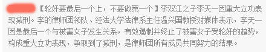
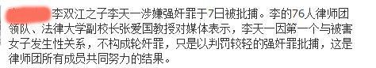

# 短评: 钓鱼不是挡箭牌！

最近李天一案在社会上引起了强烈的反响，这个坑爹货自上次打人被劳教之后再次以这种不光彩的新闻闯入人们的视野。那么针对社会上疯传的各种假消息、钓鱼贴，说法仅以理论的角度来做个分析。其中我们节选了近期流传颇广的两个钓鱼贴作为例子。

### 1.关于轮奸罪？

目前我国刑法里并没有轮奸罪这个罪名，根据我国刑法第二百三十六条：以暴力、胁迫或者其他手段强奸妇女的，处三年以上十年以下有期徒刑。奸淫不满十四周岁的幼女的，以强奸论，从重处罚。强奸妇女、奸淫幼女，有下列情形之一的，处十年以上有期徒刑、无期徒刑或者死刑：（一）强奸妇女、奸淫幼女情节恶劣的，（二）强奸妇女、奸淫幼女多人的，（三）在公共场所当众强奸妇女的，（四）二人以上轮奸的，（五）致使被害人重伤、死亡或者造成其他严重后果的。可以看到**我国目前刑法条文里只有强奸罪而没有轮奸罪这个罪名，轮奸是作为强奸罪的法定加重情节加以规定的。**

### 2.关于第一个强奸即不算轮奸？

有消息称李天一因是第一个强奸所以不算轮奸，这个也是十分荒谬的。根据刑法共犯理论，两人在共同故意的范围内承担同样的罪责。轮奸又称为集体强奸，是指二人以上违背受害者意愿，强行发生的性行为，所以**只要是两人共同故意强奸，那么就算轮奸，无论先后，同样承担轮奸这个加重情形。**

### 3.关于累犯？

累犯这个概念可能对很多人来说比较具有迷惑性，其实在刑法理论中，累犯是有着严格的条件的，一般累犯须满足以下几个条件：1.前罪须为故意犯罪并受到有期徒刑以上刑罚，2.在前罪刑罚执行完毕后五年内再次故意犯罪并被判处有期徒刑以上刑罚。而**李天一之前的打人事件被劳教只是一种行政处罚，并不构成犯罪，亦未受到尤其徒刑以上刑罚，所以并不具备累犯条件。**

### 4.关于立功、减刑？

立功确实是刑法中明文规定可以减刑的一种情形，具体表述在第六十八条：犯罪分子有揭发他人犯罪行为，查证属实的，或者提供重要线索，从而得以侦破其他案件等立功表现的，可以从轻或者减轻处罚;有重大立功表现的，可以减轻或者免除处罚。可以看到刑法中认为立功的表现为“揭发他人犯罪行为”，“提供重要线索，从而得以侦破其他案件”等行为，至于具体的种类，若有兴趣，读者可以去翻阅最高法98年颁布施行的《最高人民法院关于处理自首和立功具体应用法律若干问题的解释》及10年颁布施行的《最高人民法院关于处理自首和立功若干具体问题的意见》。而在**这个贴子中所称的情形，即使用最普通的思维来考虑也是不可能成为法律上认可的立功行为，事实上这个是个犯罪行为，怎么可能为立功行为？！**

最后，针对这两则钓鱼贴的其他槽点，我们觉得有必要来说明一下，首先**中国并无所谓的“法律大学”、“经法大学”**，其次，** “76人”**，如果这个贴子只是以这个给这个律师团队命名的话，我们认为**更像一个篮球队的名字**，而不是一个法律团队的名字，如果是为了表示律师团队人多的话，那么不好意思，根据我国刑诉法第三十二条的规定，**犯罪嫌疑人、被告人最多只能聘请2名辩护律师**。

“法律面前人人平等”，相信这句话很多人都知道，也都视之为真理，但是每次碰到名人犯案时，绝大多数人却用自己的实际行动在践踏这句他们所信奉的真理。试问，如果说一些富人、名人、掌权之人因为他们的财富、地位、权势被法律所饶恕是对这句话的践踏，那么他们因为以上的因素而被重判，是不是也是对这句话的践踏呢？所谓平等，就是不偏不倚，不能因为任何因素而又任何偏差，轻了不行，重了也不行，我们只信奉法律，不考虑与之无关的任何因素，这才是法律平等的真谛。当名人犯案时，我们能不能将其华丽的外衣褪去，只把他当作一个普通的犯罪嫌疑人、被告人？监督是必须的，人们对于中国法治现状的不信任也是可以理解的，但是当这种善意的初衷裹上仇富、仇官的外衣，肆意的信谣传谣，煽动民意时，我们是不是应当反思，我们是在维护公平正义，还是在肆意宣泄仇恨？

PS：可能有人看完文章说：认真你就输了，可是说法认为，不认真就不会赢。如果你还在为你的钓鱼贴钓上来几个傻逼而沾沾自喜的话，那么我们真为你的恶趣味感到捉急。

  七星说法编辑部 **P.S.****加入****“****七星说法读者群****”****，我们一起说法！群号：****262980026****。**
