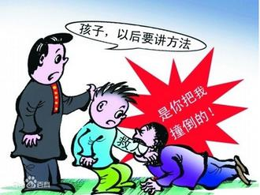
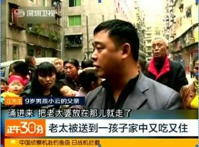

# 第一百零三期：讹人与恶人

编者按：近日，一则北京中年妇女讹诈外国人的传闻又一次将“碰瓷”推上了舆论的风口浪尖，此时“三小孩扶老太”的新闻似乎很快已经被遗忘。碰瓷碰得瓷片在传媒舆论中不停地发出破碎声。中年妇女是否真的“讹诈”，尚不明晰，在此以“三小孩”案，本文将以法说说“碰瓷”这回事儿。

前段时间，网上一则“三小孩扶起摔倒老太婆，反被诬陷索赔”的帖子引起了大家广泛的讨论。事件发生的时间是2013年6月15日，家住四川达州城区65岁的蒋婆婆摔倒在地，造成大腿根部粉碎性骨折。蒋婆婆摔倒后，手里死死抓住一个9岁小朋友的手，并声称是被抓小孩在内的三个小朋友撞倒了她；但小孩的家长却称小孩并未撞倒蒋婆婆，而是看到蒋婆婆倒地后前去救扶。

双方各执一词，在此后数月展开了拉锯战，蒋婆婆甚至一度住进其中一个小孩的家里，并对其家人声称“要么给钱，要么就住下来”。

但是小朋友一方家长坚持表示，3个孩子当时是去搀扶老人却被诬陷，老太太则称是小孩子们打闹将自己撞倒摔伤，要求赔偿医药费。

一、习惯

事实上，在中国，此类案件并不少见。高中生自习路上目睹路人遭遇车祸，骑车前去救援，被伤者死死拽住，要求赔偿。公交车上中年妇女从车门失足跌下，抓住扶起她的路人，声称是路人将其推倒。河北邯郸，一位七旬老人摔倒在路上，在长达半个小时里行人们视而不见。途经此处的出租车司机王铁军将老人救起后，老人说的第一句话是：“谢谢你，放心吧，我不会讹人！”

被救者不思感谢，救人者深陷困境，不讹人竟然已经成为了足以自豪的壮语了。

此言一出，何其痛哉！

这样的现象正在成为一种常态，正在成为一种习惯。究其原因，究竟为何？恐怕还是应该倒转回当年的**“彭宇案”**。

**该案的一审判决词荒谬的使用了一个逻辑“如果不是你撞得她，那你为何要扶她呢？”**

一时间群情激奋，舆论哗然。虽然在之后的审判中，错误得到纠正，但是该案的后续影响却并未消除。人们开始担心，假如自己去做了好事，是不是也会遇到这样的情况呢？紧接着，又有数个相似的案件冒出，人们心中恍然，哦，看来这好事确实是做不得。同时，还有一些人恍然，哦，原来发财还有这种门路。

正如培根所说，一次不公正判决比10次犯罪的危害还大。犯罪只是片段性质的污染一段河流，然而不公正的判决则是在污染了河流的源头。自“彭宇案”以后，救人被讹事件层出不穷，所用的套路不外如是。同时见死不救的人们也有了新的托词，害怕沾上麻烦。

**相比较而言，依照之前判决的推断，讹人者付出的法律成本极低，甚至可以说完全没有。，然而救人者反而要付出昂贵的代价，在进行了道德与利益的核算之后，自然就有了答案。**

趋利避害为人的天性，而谋求不法利益终于又有了新的名目。

一个社会形态的习惯，因为无数不合理判决，逐渐在中国社会站稳了脚跟。

二、作用

不过说到底，这还是一个现实生活中的小案子，它真有那么大作用，真的值得在此大书特书么？

让我们先把视线从这个案件转向书本上的知识。

**人们总结法的作用的时候，常常会归纳为以下几点。**

**指引作用、评价作用、预测所用、强制作用、教育作用。**

如果就这么看上去，似乎觉得这样的表述仅仅只是文字性的，并没有实际意义，然而结合这次的案件而言，却能发现，一个普普通通的案件，何以影响个人，甚至社会的整体走向。

在之前的相似的案件中，施救者援手者勇为者遭了秧，一个案件判决后，其经过人们口耳相传，媒体放大，自然就落在了公众眼中。公众通过案件最后的结果得知，原来依照法律的规定，并不倾向于好人。

紧接着，案件的影响对于好人好事的评价也趋于负面，原来做这些事，没有人会表彰的。

再然后，人们就会预测，假如自己做了相同的事情，会如何呢？

到最终，太有教育意义了，千万不能做好人啊。

**上述的几个案例到最后完完全全的体现了法的几大作用，但是偏偏是从极端的反面教材进行的。**中国虽非英美法系国家，天然以案例为基准，然而结合中国国情而言，在媒体的放大镜下，却往往起着更为明显的宣传作用。

所以在这种情况下，我们更加需要一个案件，一个处理，一个事实，以正视听，以还本源。告诉公众和社会，法律本身依然在维护公平正义。

在四川老太太摔倒这起案件的最后，当地警方认定三个小孩是救扶者而非肇事者，蒋婆婆及其儿子则诬陷三个小孩涉嫌敲诈而被行政拘留。综合调查相关情况，蒋某某及其儿子的行为属于敲诈勒索行为。达州市公安局达川区分局根据《治安管理处罚法》第四十九条之规定，决定对蒋某某给予行政拘留7日的处罚（因违法人员蒋某某已满70周岁，依法决定不予执行），同时对其儿子给予行政拘留10日、并处罚款500元的处罚。

这样的处理结果，无形中终于为本已坍塌的法律信任重新打好了地基。

让那些讹诈者都受到应有的惩罚，为自己的偏差行为支付代价，是法制建设的题中之意。惩罚讹诈者，既增强了法律的震慑力与约束力，提高了法律的使用价值，也向全社会传递出惩恶扬善的价值理性，有助于消减“后顾之忧”，提高人们做好事的信心和动力。

虽然只是星星之火，但万望它能燃起。

三、声音

在研究案件意义的同时，也有一个很有意思的现象值得关注。

**老人一家在得知处理决定后，赌咒发誓“要是骗人死全家”，并且坚决要求行政复议。针对这样的情形，不少网友评论说，这就是不要脸耍无赖。**

**法律层面而言，通过行政复议来表达自己的内心诉求，这是其合法权利，同时客观来说，进行行政复议，也有利于公安机关加大侦查力度，搜集更多的事实证据，让此案以更具体的细节，更让人信服的解释给公众和当事双方一个合理的交代。**

**同许多案件一样，一个合理的法律诉求，被迅速贴上道德标签，使得本该由行政或司法机关再次裁量的案件，瞬间异化成了一场公众的道德狂欢。**正如学者评价所说：公众的逻辑或许是出于对道德现状的担忧，因为南京彭宇案的教训仍历历在目。但是，担忧并不能成为乱贴标签的借口，尤其是在一个具体的事件面前，我们应该还双方一个自由的言论空间，让他们尽可能多地表达自己的内心主张，尽可能真实地还原事故现场。

**案件决定已出，这确实值得我们赞扬，但动辄给老太贴上“无赖”标签的行为，却值得反思。一者，不管老太是不是讹诈，她申请行政复议的权利依然是值得尊重和保障的，舆论影响司法的负面作用尤其明显。**

四、讹与恶

在当今的复杂社会，如何更好的还原案件，更好的处理当事人纠纷，恐怕还需更多的法律和技术手段支持。但是，面对不正义，我们依然希望法律能够为我们保障应有之权利。

美国法学家弗里德曼曾这样形容我们当下的“陌生人社会”：“当我们走在大街上，陌生人保护我们，如警察；或陌生人威胁我们，如罪犯。陌生人扑灭我们的火灾，陌生人教育我们的孩子，建筑我们的房子，用我们的钱投资。陌生人在收音机、电视或报纸上告诉我们世界上的新闻……”对于陌生人的信任如何保障，正是通过法律进行的。

我们依然希望法律能够通过越来越多的判决，指引我们去做更的好事，使得讹人者被识破恶的面目，好人也依然有勇气去做好事，做了好事，会被表扬。

不由得想起窦娥冤里的台词，暂且做了本文的结尾吧。

“今日个将文卷重新改正，方显得王法不使民冤。”

七星说法NO.103（编辑**：**戴正阳；**责编：**陈澜鑫、何盼盼）

** P.S.****加入****“****七星说法读者群****”****，我们一起说法！群号：****262980026****。**
