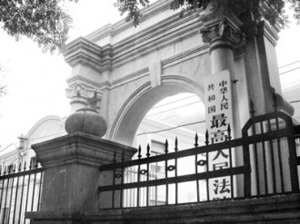

# 第一百零二期：行政位泾，司法在渭

在近日召开且圆满落幕的十八届三中全会中，建设法治中国成为关键词之一。审议通过的《中共中央关于全面深化改革若干重大问题的决定》（以下简称《决定》）这份改革的纲领性文件指出，建设法治中国必须深化司法体制改革，加快建设公正、高效、权威的社会主义司法制度，维护人民权益，要维护宪法、法律权威，深化行政执法体制改革，确保依法独立公正行使审判权、检察权，健全司法权力运行机制，完善人权司法保障制度。这一决定的发布再度将司法改革的号角声推向高潮。聚焦于司法权与行政权的长期胶着状态，以及其浓厚的地方色彩，何以分离，仍值得深究。

这些年来，司法大局风云变幻，更迭不断。例如庭审方式上引入“抗辩制”，庭审公开信息透明度进一步增强，法院管理体制上的“非行政化”，司法监督强化等各类司法改革措施层出不穷。前段时间闹得正沸扬的“薄都督一案”也算是司法改革路上的里程碑式的实践性成果，颇受褒奖。余热过后，再观该局，不免有些杯水车薪的失落感。

因为火远不止一处。笔者且不论法律实体方面制度体系的匮乏之处，单从其程序方面以及管理体制上来说，其诟病也不胜枚举。司法公信力不高，司法腐败严重，司法灰色收入高，效能低下，司法不透明，受法外权力影响大以及司法不公，如此种种，正是因为司法改革的滞后所不得不付出的惨痛代价。追根溯源，关键在于司法独立。

司法独立是司法公正的必要条件，是法治的基本准则，司法权若被另一权左右，则必然对其产生偏袒之心，而对该权以外的受众是为不公，由其主观意向的倾斜所做出的裁判，是为不正。如同人总会对利益密切相关的人有巴结谄媚的潜在冲动的道理一样。独立一词，是常识，是底线，不可回避，不可退却。而事实的严峻在于司法权在我国的实践中一定程度上仍倚重于行政权，其具备着挥之不去的行政色彩和地方色彩。

### 一、 司法权与行政权溯源“一家亲”？

首先，简要介绍一下何为司法权。司法权是指特定的[国家机关](http://baike.baidu.com/view/652695.htm)通过开展依其法定[职权](http://baike.baidu.com/view/635613.htm)和一定程序，由[审判](http://baike.baidu.com/view/556847.htm)的形式将相关[法律](http://baike.baidu.com/view/17641.htm)适用于具体案件的专门化活动而享有的权力。它从广义上看是包括[检察院](http://baike.baidu.com/view/18978.htm)在内的，但目前通说认为，人们提到的“司法权”多指狭义司法权，即虽包括[检察权](http://baike.baidu.com/view/1210035.htm)在内、但却明显偏重于审判权，或仅仅指[审判权](http://baike.baidu.com/view/408933.htm)（即以[法院](http://baike.baidu.com/view/18971.htm)为相应机关）。我国的司法权独立性原则，虽然并没有排除立法权及政党对司法权的干涉，但还是在宪法中被确立下来。

再而，从司法权的含义特性分析看来，它个性鲜明且具备独立的“人格”。而为何其与主体截然不同的行政权有着千丝万缕斩不断的牵扯？得从源头说起。司法权本质来源于政治权力——作为一种支配控制的力量，是政治的核心，且需服从服务于政治权力，是其组成部分。政治权力最为直接的支配者又为行政权，二者服从于一者，这是第一层联系。

中国尚未采纳西方三权分立的结构制度，而是以“三权制约协调”的说法含糊其辞。“弱肉强食”的法则放在此处却有契合之处。事实是这样的：一方面，行政首长从中央到地方同时是党的领导人，前文提到中国的司法独立性不排除党的干涉，则不排除行政权力借以党的权威干涉司法权的可能性；另一方面，在法定级别上，同级行政领导级别高于司法机关的领导级别，所谓“官大一级压死人”。在此种传统文化氛围渲染下，行政权对司法权的干预不可避免；同时，法院、检察院的经费开支来源于地方财政。“吃人嘴短、拿人手软”，在行政权的屋檐下，司法权没法不低头。这是第二层联系，也是司法技术性改革并未触及之地，司法独立性不能贯彻的根因所在。

司法权与行政权的纠葛不仅来源于法理、现实，甚至存在于深远的历史之中。从“当尧之时，皋陶为大理”“理，治狱官也”“士，夏曰大理，周曰大司寇”中可见古代中国司法直接由行政首脑执掌。虽千年变迁，社会关系日渐复杂，司法结构体系日渐庞大，但历史根深蒂固，脱掉这标签是极其不易的。

###  二、 看行政权如何破司法独立

某种角度来看，司法权有特别的独善其身意味。司法独立要求任何个人或组织不得干预司法，包括职能独立、组织独立、法官独立。司法权由专门独立的机关行使（狭义范围内即为法院），区分于行政权以及立法权存在。在职能层面其具备完全的独立性要件。

但是，行政权果然是不甘寂寞的。

在组织独立方面，一方面，法院应该在制度上独立于立法、行政机关以及政党、团体和个人，从而为司法权的独立行使提供组织保障；另一方面，法院内部应相互独立，为法官独立行使职权提供保障和排除干扰。（具体包括：法院根据事实依照法律独立裁判案件，不受任何组织包括上级法院直接或间接的干预和不当影响；法院对案件拥有管辖权，并自行依法判定争议是否可诉；法院独立依法决定司法程序问题；法院独立处理司法管理事务，国家为此提供必需的财政保障。）

而长此以来，法院内部一直架构着司法裁判的行政审批模式。在此模式中，行政权对司法权的干涉主要具体体现在以下两个方面。

第一，关于对合议庭裁判权的干涉。副院长、审判委员会委员、庭长、副庭长、甚至审判长，仍然在按照行政层级进行着司法行政的决策活动，合议庭往往难以独立行使审判权。审判委员会委员、院庭长甚至审判长可以推翻合议庭的意见，并责令合议庭按照其所授意裁判方案做出最终裁决。这种职权赋予司法权被干预的无限可能性，法院没有尘埃落定之权，其裁决随时可能翻盘，审理与裁判明显被割裂开来。

第二，法官的独立性面临的困窘之境莫不如是。法官的意见和宣判结果也被司法行政领导的决定左右，除去原本法律以及良知的约束，还有来自于层级高低差异的官位“压迫”，这让法官有如哑巴吃黄连，噢不，也许正是乐得其所。

司法裁判的行政审批模式的长盛不衰正是行政权对司法权长期的绝佳侵入点。首先，从主体来看，司法行政管理与司法裁判职能集于一身的院庭长可以轻易用其的行政角色干涉案件的司法裁判权，一人分饰二角，弄混淆自身的职权常有发生。其次，一贯倡导的监督哲学——上级监督下级，限制法官的自由裁量权更是助长焰势。助长一种官权来压制另一官权的结果是：前者的腐败代替后者腐败的可能性，这并不能从根本上解决问题。何不完善控辩双方诉权，让程序正义由此突显的淋漓尽致呢？

由行政权的不合理干预衍生开去，司法权同时还具备了不可忽略的浓厚地方化色彩。地方性法院在特定场域中、在宪法框架和法律体系内充分发挥积极性、能动性，展现出司法适用中的地方化。某种程度司法的地方化是一种必然，不可剔除。而我国的现状有部分超出常规的必然性，滋生了不合理性。其一，法院的司法体制，即法院在机构设置、经费来源、法官产生等方面只属于地方不属于中央。其二，法院区划同行政区划的设置划分如出一辙，其设置依据——地方性内在地弥漫于各级法院的组织架构中，意味着各级法院的财政支助、人员进出与调配等都受地方政府架构中其他权力机构的约束。

行政权采取功利主义思维，司法权则要退回坚守本分，以其法律正义的价值观平等对待一切，弥补立法缺陷，矫正行政不当举措。若两者不幸搀和在一起，甚至行政权有遮天蔽日之嫌，味道则大不如想象了。

### 三、 还众人一个“独善其身”司法权

前文所写并非笔者一人之见，社会如此呼声正日益高涨，司法改革的举措前仆后继。2013年11月12日中国共产党第十八届中央委员会第三次全体会议通过的《决定》的三十二条三十三条对症下药，对于司法大局的关键症结给出了良方，具体如下：

_ (32)确保依法独立公正行使审判权检察权。改革司法管理体制，推动省以下地方法院、检察院人财物统一管理，探索建立与行政区划适当分离的司法管辖制度，保证国家法律统一正确实施。_

_ 建立符合职业特点的司法人员管理制度，健全法官、检察官、人民警察统一招录、有序交流、逐级遴选机制，完善司法人员分类管理制度，健全法官、检察官、人民警察职业保障制度。_

_ (33)健全司法权力运行机制。优化司法职权配置，健全司法权力分工负责、互相配合、互相制约机制，加强和规范对司法活动的法律监督和社会监督。_

_ 改革审判委员会制度，完善主审法官、合议庭办案责任制，让审理者裁判、由裁判者负责。明确各级法院职能定位，规范上下级法院审级监督关系。_

_ 推进审判公开、检务公开，录制并保留全程庭审资料。增强法律文书说理性，推动公开法院生效裁判文书。严格规范减刑、假释、保外就医程序，强化监督制度。广泛实行人民陪审员、人民监督员制度，拓宽人民群众有序参与司法渠道。_

其侧重点放在了司法独立，是司法去行政化的本质解决之道，从脱离行政区划辖区、财政人力统一管理出发，具体深入到法院各级的职能监督、法院内部审判裁判权的归一。早在1997年,党的十五大就已经提出“推进司法改革,从制度上保障司法机关依法独立行使审判权和检察权”。多年易逝,效果颇微，因改革之处被利益的藩篱所羁绊,为思想观念和体制机制所约束。攻坚关口更不可以此为借口避之不及，反之，猛烈的言论炮轰倒可能现其光明。

目前而言，司法行政权与司法审判权的分离是迫切需解决的，破灭混淆集于一身两权的可能性，将行政权归属于专门的司法行政机关；在二权分离的基础之上，将司法行政权收归省级甚至中央层面统一管理。其一，以此彻底摆脱地方政府干预多年的阴影；其二，司法行政权的剥离，内部人员地位平等的保障则是其纯粹行使司法权的前提。实现司法权行政权的“泾渭分明”之态。

恩格斯用“人类对自身的恐惧”一语概括司法独立的起源。将司法权与行政权绝对分开的人性追究则在于此。同时，两权的结合会造成一人分别扮演告发者，侦查者，审判者的混乱景象，难以解决。告发者，侦查中与案件有着无法言喻的利害关系，任其充当审判者，下场可充分预见，司法公正则无处可觅。

行政位泾，司法在渭。本应分流却夹杂奔去，司法权则失去了自我的意义，改革更是无从谈起。揪出司法的“自我”而后“善其身”，可能我们会收获意想不到的硕果。司法根源上去行政化的完成必定带来司法领域空前的进步与光明的前程，司法腐败，监督不力等技术性改革方面自是迎刃而解 。当然，这暂且是笔者喷涌而出并泛滥不已的想象，路仍漫漫。

（编辑：胡逸娴；责编：陈澜鑫、戴正阳）
