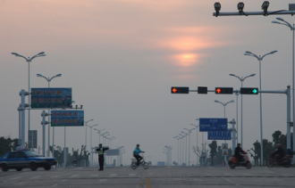
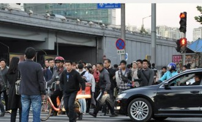
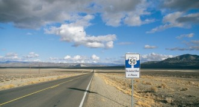
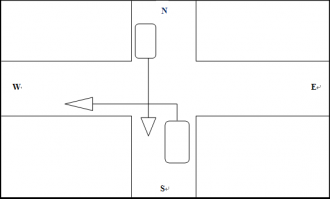
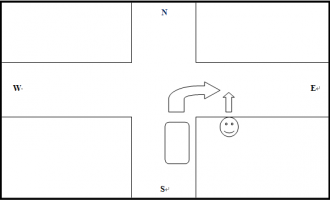

# 第一百零五期：交通事故归责的法理分析

这篇文章主要谈谈交通法规以及**交通事故责任划分的司法实践**对**交通事故发生率**的影响。

交通事故发生率是个笼统的概念，细分一下可以分为**1.人口事故率**：一定范围内一年内每10万人中发生的事故次数或死亡人数；**2.车辆事故率**：一定范围内一年内每一万辆机动车（本应为机动车，下一段引用的数据姑且谈汽车）中的事故次数或死亡人数；**3.运行事故率**：每1亿车·公里发生的交通事故次数或死亡人数（主要以死亡人数为主，因为死亡人数是最直观、最具说服力的因素）。其中**运行事故率是与交通行为的安全性成负相关的，交通行为越安全，运行事故率越低**。但是运行事故率的数据很难找，我们往往还需要通过诸如车辆事故率等数据以及其他数据来旁证。

我们拿中美的交通事故发生率做一个对比：**中国**2011年因交通死亡人数为62387人，每十万人死亡4.55人，**每一万辆汽车死亡5.88人**；**美国**2011年因交通死亡人数为32367人，每十万人死亡10.4人，**每一万辆车死亡1.13人**。

这样说中国的交通行为较之美国更不安全（即中国的交通参与者的安全意识更淡漠）是不太公允的，因为人口事故率和车辆事故率还需要考虑的因素有：（1）车辆平均安全性；（2）人均/车均道路资源的多寡：道路资源越多，交通单位之间起冲突的机会就小，发生交通事故的可能性就低一些。那么我们来看看第二个因素：**中国**的公路总里程是423万公里（2012年末），**车均40米**；**美国**公路总里程（2,734,102 miles of paved public roads in the United Sates, with an additional 1,324,245 miles of unpaved public roads）合651万公里，**车均27米**。看来美国的道路资源还没有中国丰富（但是分布更均匀，不像中国这样大城市堵死小地方百里不见一辆车）。

还有一个非常值得关注的数据是，中国因交通事故死亡的人中，只有不超过15%为汽车驾驶员，有超过一半、将近6成为非机动车驾驶人和行人；而美国因交通事故死亡的人中，有超过一半（几年前的数据为52%）为汽车驾驶员。这也说明，中国的机动车-非机动车/行人之间发生的事故数量极多。

机动车-非机动车/行人之间发生的事故数量的最相关因素恐怕就是交通参与者的交通安全意识以及在交通中的行为了。接下来我们谈谈**“中国行人过马路怎么这么不规矩”**这件事。

有的数据指出中国的机动车-非机动车/行人之间发生事故的主要原因是机动车驾驶员超速、占道、疲劳、酒后驾驶等因素，占事故发生原因的70%-80%，我不否认这个数据，并且这个数据是符合常识的。但是这样表述是不全面的——实际上这个数据的得来是从交通事故的司法处理中机动车驾驶员一方是否负超过法定最低10%的责任（**现行《道路交通安全法》规定该类事故即使机动车驾驶员一方没有责任也要负10%的赔偿**）来判断的，**也就是说，在这个数据中，机动车驾驶员一方只要有所疏漏，哪怕有一丁点过错，尽管事故的主要责任在于非机动车驾驶人或行人一方，也通通归因到机动车驾驶员一方了。**

尽管没有详细的数据支持，但是在生活经验和司法实践中，机动车-非机动车/行人之间发生的事故，非机动车驾驶员/行人一方有过错的情况是很常见的，光闯红灯一项，2012年前十月便有798人死于此（详情）。然而《道路交通安全法》这部法律是明显偏袒非机动车驾驶员/行人一方的，该法实行**“无过错责任原则”。无过错责任原则是指行为人对因自己的行为造成的损失，不论其是否有过错都应承担民事责任的一种归责原则。**根据《民法通则》的规定，机动车作为高速运输工具，对行人、非机动车驾驶人的生命财产安全具有一定危险性，发生交通事故时，应当由机动车一方承担民事责任。

我们再看看美国各州对相同类型交通事故的处理惯例。由于美国属于英美法系，以判例法为主，并且各州情况各异。整体上，美国的交通事故归责原则适用过错原则（详情）：

_第一类，责任过半认定制，即**涉及事故的一方一旦被认定应承担５０％以上的责任，那么就应承担事故的全部责任**。实行这个制度的包括科罗拉多州、内华达州等占美国半数以上的州。在这些州，**行人如果违规在先，那么在绝大多数情况下必须责任自负，得不到任何保护。**_

_第二类，**责任比例分摊制，即根据事故具体情况确定事故涉及者的具体责任比例，并按照相应比例分摊赔偿。**事故的责任比例由警方和交通安全管理部门的专家认定。实行这类制度的包括加利福尼亚州、路易斯安那州、阿拉斯加州等１３个州。但在这些州，不管行人是否违反交通规则，行人的路权总是高于机动车的路权。_

_第三类，**简单多数制，即事故中承担责任比例最多的一方负全责。**实行这一制度的有阿拉巴马州等６个州。这类制度强调机动车和行人各守其责，谁违法在先，谁就得担负全部责任。在这几个州，行人违规在先，则必须承担全部责任。这种制度比第一类更为苛刻。_

（这里需要注意的是，美国的机动车保险机制比较完善，上了保险的机动车车主，在被责任认定之后，在保险金额范围内可以获得理赔，详情）

下面我们说说**“路权”**这个概念。尽管在很多人的印象中，美国的机动车是绝对避让行人的，各州交规在“行人路权绝对优先”这一点上很一致，在交规考试中，避让行人也是很重要的考点。但是行人**路权的绝对优先并不代表行人的绝对优先**，机动车驾驶人的避让义务也只是**权利对权利的让步**，**并不代表正当权利要对违规让步，要对非法让步**。这样说得太笼统，具体来讲是这样的：路权指的是当道路信号灯系统无法完全机械地分配道路资源的时候，（比如十字路口只有一个红绿灯，便无法调和南向西左转的机动车与北向南直行的机动车之间[**如图一所示**]、南向东右转的机动车与南向北直行的行人之间的矛盾**[如图二所示**]），因此有了**左拐让直行、右拐让直行的规则**。**在双方通行都处于合法通过的情况下，机动车的路权要给行人的路权让步，这是合情合理的**。但是，**当行人闯红灯、横穿有隔离带的马路时，机动车没有义务为行人让路，因为此时行人的行为是违法的，行人在违法的同时也丧失了路权。这世界上没有违法的权利，也没有人有义务为违法行为让路。**

图一

图二

诚然，在道路上行驶的人或各种交通工具中，机动车是最安全的。在发生相互的碰撞事故时，机动车驾驶员是最不容易受伤的，而行人和非机动车驾驶员往往会受到直接的人身伤害。也正因此，机动车驾驶员应当负有比其他交通参与者更多的义务，包括避让义务、注意义务。与此同时，在机动车-非机动车/行人双方均有过错时，机动车驾驶员承担一定程度的、大于过错比例的责任也都是可以理解的，**这代表着机动车驾驶员要在正常行驶的时候需随时注意道路中其他有可能被其他交通参与者正当利用的道路资源**。但是，当非机动车驾驶员/行人违法占用道路资源时，因机动车驾驶员正常的行驶，在常人看来来不及反应的时间内没有采取措施而造成的后果，去追究机动车驾驶员“没有尽到注意义务”的责任，是不符合法律精神的——**法不强人所难，法律不能让机动车驾驶员对其他人可能存在的非法行为做出预判**。本身由于机动车高危的特殊属性，法律给机动车的驾驶加上诸多限制条件——如限速、限制驾驶员精神状态（饮酒吸毒之后不得驾车），但是机动车驾驶的正当权利也是需要保护的，当非机动车驾驶员/行人的非法行为成为了交通事故的主要缘由，机动车车主的角色应当定位于受害者而非加害者——尽管可能造成的严重伤害后果是由于机动车不可控的高速撞击。

美国诸州的立法精神多由于此，不管是按责任比例分配，还是“简单多数制”，都是责任分明、定义明确的。相比之下，中国不管是法律的制定还是司法实践中都相当含糊其辞，无过错原则、公平责任原则，这种原则的应用不光出现在交通事故的处理中，也在“扶老人”的案例中大行其道（[详情见](http://rrurl.cn/2lND82)**“但还不够，几个典型的司法判决存在巨大争议，暴露改进空间”**一段。）

我再次强调一遍，路权是基于合法行为的权利，**非机动车驾驶员/行人等弱势群体的合法权利能得到更充分的法律保护，这不意味着弱势群体就天然正确，就可以为所欲为。**如果由于他们的过错而造成的损失有很大一部分能由他人来买单，那么会产生什么样的后果？在国家行为中，政府超发货币导致的通货膨胀需要全民买单，而假如政府不会因此下台，群体性事件不会因此高发，维稳成本不会因此提高，那么政府就没有动力纠正错误，甚至有动力让错误一错再错——当超发货币能为政府解决其他棘手的问题时：比如堆积如山的地方债。在交通行为中，假如行人因自己违法而机动车驾驶人未违法受到的伤害全由行人自负，那么可想而知，行人在闯红灯之前会有更充分的考虑。正因为法律对弱势群体不遗余力甚至过分的保护，才使得弱势群体可以肆无忌惮地冒着反正是由别人埋单的风险违法、扰乱交通秩序。**弱势群体并不是天然错误的，可更不是天然正确的，弱势群体犯错的时候你还送糖喂奶，这就是对他们的犯错进行激励了。**

有人说，非机动车驾驶员因被机动车挤占道路而不得不违法的情况怎么办呢。比如汽车把非机动车道占了停车，自行车只能跑机动车到上行驶，这一点在人均道路资源稀缺的大城市尤为严重。我本人也深有感受，在北京十余年，超过一万公里的骑行经历中，我基本上没有哪次出行是不占机动车道的，这是因为实在被逼得没办法。违章停车是没法限制的事情，堵也堵不住，只能罚；而另一方面，道路建设本身就是重机动车道轻非机动车道的，在大城市中这个问题是个死结。但是从另一个角度想，**交通事故极少是因为非机动车驾驶员/行人被动的交通行为，即便因此，司法实践中也会减轻非机动车驾驶员/行人的过错；与非机动车/行人相关的交通事故往往是因为这些人的主动违法**，尤其是造成重伤或死亡的案例:闯红灯、横穿马路、公路，进入主路等——这总不能说是被逼的吧！

另一方面，我们需要反思中国的道路建设，对非机动车道建设的不重视、对机动车侵占非机动车道、人行道甚至盲道的违法行为惩治力度不够等；以及很多配套设施的缺失，如较大十字路口的人行道需在人行道中间设置等候带等，做得都不够，这往往使得非机动车驾驶员/行人不得不违法，这是值得注重的安全隐患。鉴于此文主要不是谈这个问题，延伸的阅读[见此](http://www.21its.com/Common/DocumentDetail.aspx?ID=2011081215422901945)。

这一段中我有两点没有进行论证:1.非机动车驾驶员/行人更规矩可以使得交通事故发生率降低，这点我之所以没有论证是因为我觉得我没必要论证。2.对机动车驾驶员更宽松、对非机动车驾驶员/行人更严厉的立法可以让后者更规矩，这点从激励机制说明即可，这里就不细说了。

七星说法NO.105（采编：王卜玄；责编：陈澜鑫）

** P.S.****加入“七星说法读者群”，我们一起说法！群号：262980026。**
