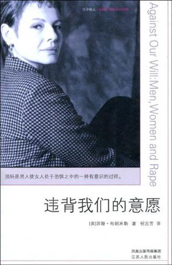

# 第七十一期：强奸，又见强奸——兼两性关系思考

** **

为什么强奸是一种犯罪？按照一般刑法通说，其侵犯了女性的性权利。但是在追求性别平等的现代社会，这种流行的理论似乎并不能完全解答该犯罪中的种种疑点：性快感如今有如此多样的取得方式，传统“插入”之外的手交、口交、同性之间等等，是否也能构成犯罪？作为最典型的性犯罪，为何男性的性权利却被“强奸罪”的法律规定排除在外？贞操观念是利是弊，受害人是否应当获得“精神赔偿”？在今日女性主义潮流的冲刷下，“强奸罪”的未来又将何去何从？

### **强奸、婚姻、性竞争**

**强奸之所以为罪，首先并非因为客观的生理伤害。**排除受孕和疾病传染风险，单纯的奸淫（不包含暴力行为）对身体造成的生理伤害是轻微的（对男性几乎不存在生理伤害），即使是处女膜修复手术现在也廉价到几盒感冒药的价格。但是法律对强奸罪的惩戒，往往并不实际追求其生理伤害程度地与重大的暴力犯罪并列，如我国《刑法》规定未满16周岁也不能免责的特定罪名的第17条第2款：“已满14周岁不满16周岁的人，犯故意杀人、故意伤害致人重伤或者死亡、强奸、抢劫、贩卖毒品、防火、爆炸、投毒罪的，应当负刑事责任。”再看基本刑罚，“三年以上十年以下有期徒刑”，也是与“故意伤害他人身体……致人重伤”相同的罚格，算是相当严重的惩戒。也就是说，**强奸罪的定罪，与暴力程度无关（满足“暴力”“胁迫”要件即可），与受害人身体伤害程度无关。仅仅出于客观生理伤害，显然无法解释。**

**在人类社会规范产生以前，是不会存在强奸问题的。**动物世界中物种交配，并不含有太多动物自身掌控性的主观意志，因而被看做是一种自然的繁衍行为。而**婚姻制度是一种基本而又重要社会规范，其规范的是人类最基本的行为——性行为，维护的是构成社会的最小单位——家庭，因而也最贴近人类生活。**早在建国初的1950年，法制十分不健全的时候，这个国家尚且没有民法刑法甚至没有宪法（只有一部代宪法），却早早颁布了《婚姻法》，可见即使是冠冕堂皇庄重严肃的立法行为，也不能阻止性问题走在立法者和民众们脑子的最前头。而**强奸作为一种典型的性犯罪，是对性行为社会规范的违背，其产生于关于婚姻的社会规范成型之后。**

一种规范的出现，必然是为了维护某种秩序，而阻止无序的混乱。动物世界没有强奸问题，就在于其除了自然法则之外，性行为原本就发生在无序状态下，因而也就无所谓强奸。**秩序的产生，是基于一定程序上合理的分配规则；性秩序也同样。**恐怕重口味者们会说：动物世界的性混乱不是也挺好的？当人类出现竞争意识之后可不会这么想。**性资源在人类个体可利用的范围内是极端有限的（这一点在今天也没有发生实质上的变化，所以才会有著名的“注定孤独一生”屌丝感叹句），有幸获得性资源者（“人生赢家”），为了确认后代的归属（防止“喜当爹”），需要对性资源实现占有和阻止他人占有。**

上述那种对婚姻的理解，经康德在《法的形而上学原理》中的阐述而流传甚广。在他眼中，婚姻直白而露骨，只是两个不同性别的人**“为了终身互相占有对方的性器官而产生的结合体”**。 有人仍觉得理解表面，更进一步地认为，这种占有的目的是排他，就是防止他人插足自己的“结合体”。为了避免同性（主要是富有攻击力的男性之间）因争夺性资源发生冲突，从而为性资源界定占有的归属。也就是说，**阻止同性间的相互侵犯，才是婚姻最基本目的**。发生学意义上，把婚姻理解为一种性资源的“产权制度”，以规范性竞争。养育子女或者依据性别的劳动分工等等可以借助其他来实现的目标，只是额外福利功能而已。

**由此可见，说到底，强奸犯罪根本上还是社会问题。**

良性的性竞争，客观上会导致优胜劣汰的生物进步。恶性的性竞争，却会引起社会暴力和对秩序的重大威胁。此时，**强奸即可以理解为对性资源不正当的恶性性竞争，其所能诱发的灾难性社会后果才是法律予以严厉惩戒的深层次原因。**

###  **为什么是女性？**

** **

**《刑法》第236条对“强奸罪”定义为“以暴力、胁迫或者其他手段强奸妇女”，也就意味着把男性排除出了强奸受害者的范畴。**于是在动辄以叫嚣“人人平等”“性别平等”来彰显自己姿势水平的网络言论领域，也充斥着把男性加入受害者范畴的要求，还有不少法学大学生还凭借这一命题得以完成学年论文。然而，目前来讲，现行立法如此规定自有其很大的合理性，以至于修法这个美梦，男人们恐怕还要做很长一段时间。

**在为防止性资源受到侵占的性竞争中，具有竞争关系的往往是同性，而女性之间性竞争的手段和程度往往都比男性更为含蓄温和**（详情可见以《甄嬛传》为代表的后宫戏。在男权社会，女性之间的性竞争还时常会受到男性鼓励），**其社会危害程度并不显著**。当然，男性赢得性竞争的优势也有很多种途径，比如通过积累财富的手段参与竞争，这就属于良性的竞争手段。（所以说“干爹”现象其实是给了外貌缺乏性吸引力的“男屌丝”以翻身的机会。如果世上没有纯粹为钱财权势动心献身的的女人，丑男将成为“处男”的同义替换词，这将多么可悲）这样的方式也是间接婉转的，需要耗费时间精力而不能立刻见效，因此缓解了性竞争的激烈程度。然而**恶性的性竞争，简单直接粗暴而不遵循规范，追求即刻有效，客观上只有男性有能力产生这种偏向。**当然，同性恋现象日益常见，也说明异性也可能成为性竞争的对手。即使在这种情况下，性别生理构造客观地决定了最具有威胁性和攻击性的性竞争依然只能发生男性之间。

也许正是这个原因，其他类型的性竞争并无必要引起刑法上的更多重视。当国际通行以“男强奸女”为立法规则时，恐怕对男性“受害者”的忽略实乃有意为之。

那则新闻不知读者还记得否：成都有位女子，夜里酒醉之后当街强暴了一名过路男子。这还并非亮点。亮点是新闻报道出后，第二天该强暴发生的街道桥头坐满男人，徘徊守候不去，苦等被奸，甚至呼叫“姐姐快回来”。可见即使在男人们眼中，这也分明是天上掉下来大馅饼，树桩旁捡到了死兔子，那些没中到大奖被“强奸者”临幸的，满脸都写着羡慕嫉妒恨。既然还有如此众多的男人渴望被“广施恩泽”，你又怎能瞬间换一副嘴脸、要求法律严惩“施恩者”呢？

###  **贞操值几钱**

**贞操是一种权利？**这样的言论今天看来无论如何也是荒谬的。但在2001年5月的广州深圳，确实有这么一个案子，一审基于原告张丽（化名）生命健康权和贞操权受到侵犯，判决犯罪人赔偿受害者“精神损害”8万元（当时还没有金融危机楼市泡沫，通货膨胀也没有现在这么严重，这算一笔不小的钱款了），被称为大陆首例贞操损害赔偿案。

何谓贞操？打开网页，连度娘都会告诉你**“是关于伦理道德的产物”**。它**要求一名女性的性资源应当在婚内由一名男性完全而独占的享有。**然而，翻遍法律，没有一个条文出现过“贞操权”这个字眼。**贞操原本就不是一种权利，而是一种社会观念，在男权社会伴随广义的婚姻制度应运而生。**

根据这种观念，女性所提供的性资源会因遭受强奸而产生瑕疵。社会会因这种性资源瑕疵而对其产生歧视，从而给女性造成巨大的心理压力。在上文张丽案中，被害人称：“事情发生后，我的精神几乎崩溃，我不敢面对任何人，包括我的家人，因为这件事同样会令我的父母精神崩溃……”而未婚女子尤甚，因为除了与已婚被害人相同的精神压力之外，未婚女子还将面临在婚姻市场的价值被降低的风险。张丽说“我至今不敢谈恋爱”，也是很容易被理解的。

尽管如此，绝大多数的理性人们还是都会承认被害女性的无辜。既然无辜，社会为何坚持借助贞操观念对其施加巨大的心理压力呢？

贞节牌坊

借助一种社会舆论压力，贞操观念强化了强奸的危害后果，使得女性遭受强奸时产生强大推动，激励其奋力反抗。**通过对女性施加影响，它保护着男性占有的性资源不受侵犯。**波斯纳说：**“强奸这种违法行为是剥夺了父亲或丈夫有价值的资材——其妻子的贞洁或女儿的贞操。”**

作为一种以保护男性所占有的性资源不受侵犯的社会观念，**贞操在本质上仍然是男权社会的产物。**然而，强调性别平等、解构贞操观念，并不意味着贞操观念毫无价值和用处。苏力说：**“由于对贞操的强调，作为一种意识形态和社会舆论，就会对可能的性犯罪者构成某种程度的心理和舆论制约。”**如果没有贞操观念，社会对强奸的惩罚不会如此严厉，以至于影响到法律的定罪量刑；“强调贞操在历史上从功能上对防止对妇女的性犯罪从而保护妇女身心是有一定作用的。”当然，“面临强奸时奋力反抗”这一贞操衍生物是否科学（或者说反抗是否更有利于保护女性生命健康）仍然是有待商榷的。

**即便如此，身为一种旧道德的产物，贞操观念在当代社会并不应当左右法律的适用。**当法律并无规定其为一项权利时，绝不可望文生义凭空捏造。自由裁量并不是无中生有，法律在适用时也应当与伦理道德、社会观念划清界限。难道排除贞操观念的影响，该案中受害女子就得不到公正的补偿了吗？

犯罪人的赔偿应包含侵害所造成的经济损失。在强奸犯罪中，也就意味着犯罪人应当支付强奸致使被害人伤害的医疗费、流产或生育及营养费用、或者感染性病的治疗费等。具体到本案，根据被害人张丽的描述，其状况被一些美国学者认为存在精神伤害的强奸创伤综合症，包括急性期和历时长久的重组期。不管生理疾病还是心理疾病，既然有病就应当治疗，犯罪人负责支付治疗费用即可。具体到本案，完全可以作为心理疾病的治疗费用，或者直接指派心理医生（当然，在国内心理医生并不常见的状况下，后一种尚有待日后业界发展）。

有病看病。在贞操价值每况日下、以“掉节操无下限”为乐事的今天，利用捏造出的“贞操权”寻求公正，实乃十分不明智的选择。

### **通奸何以不为罪？**

**依照上文说法，通奸似乎更有理由成为犯罪。与他人妻子通奸的男子往往相对于丈夫，对该妻子具有更大的性吸引力，性竞争威胁力似乎更为实在。**然而在我国，通奸并非一种犯罪。非但如此，各国流行的经典文学作品也孜孜不倦地在爱情关系中利用“通奸”（也就是“婚外情”）给予男女主角更大更精彩的性格表现（如《红字》《安娜·卡列尼娜》）。**可以说，相对于强奸，社会显然给予了通奸更大的包容度。原因何在？**

**强奸存在的性竞争威胁，主要针对不特定多数，因而在社会范围内造成的危害后果更多的是突发性、不可控的。通奸对婚姻另一方构成的性威胁则针对特定人，可控性更强。**当危害在一定家庭范围内可控时，便显得不如强奸行为后果那么广泛和重大了。法律在做出强制规定之时，会为类似家庭或单位这种人类团体预留私密自主空间（如公司法中的企业自治原则等）。

密尔在《论自由》中提到：“个人的行为只要不涉及自身以外什么人的利害，个人就不必向社会负责交代。他人若为着自己的好处而认为有必要时，可以对他忠告、指教、劝说以至敬而远之，这些就是社会对他的行为表示不喜或非难时所仅能采取的正当步骤。” 这也与刑法理论的通行解释相照应，**认为通奸不为罪的原因是其乃双方自由行使性权利的结果。**

乱交、吸毒、多妻、制作销售购买色情书刊也被密尔定义为仅仅涉及自身的行为，仅用“法律不应干预仅仅涉及自身而不妨碍他人的行为”理论来解释这些犯罪活动显示出极大的局限性：难道法律对这些自身行为就没有惩戒了吗？

答案显然是否定的。

**二人通奸，在小范围内出现第三者与婚姻中一方共享性资源，法律并不制裁；但是如果扩大性行为范围，多人同时通奸，所谓“聚众淫乱”，虽然也是特定人的自愿性行为，依然会受到法律惩处**，而上述理论就解释不通了。

如果这样扩大通奸范围，性资源将在一定程度上被共享，在此情况下性竞争并不会消失，而是将处于混乱无序的状态，婚姻制度则应当被重新定义。这样的后果，显然是目前人类智慧设计出的社会规范所无法容忍的。也就是说，通奸是否为罪的根本原因，取决于其社会秩序危害的严重程度。如果隐蔽、轻微且可控，法律才会纵容这类的自身行为。在一般的通奸行为中，当事人或者社会利益都不能成为受害者时，法律又何必多此一举呢。

###  **“断了强奸的后路”**

**这是苏珊·布朗米勒《违背我们的意愿》全书的最后一句，意在向男权社会开炮。**在以她为代表的女性主义者眼里，男权社会中的强奸是一种对男女性别关系的逻辑表达。**仿佛解构了强奸，就能够击败男权，获得女性主义的胜利似的。**

不可否认，强奸在两性关系的解读中一个至关重要的命题。强迫性行为是人类文明未开化时期的杀戮掠夺在两性关系上的体现。本人也并不否认，前文的分析无可避免地受到女性主义潮流的影响（当然，或许机会平等派与差异派兼而有之）。《违背》一书中女性主义者最汲汲于心的几个法律问题，目前都已经有了一些尝试：婚内强奸，在国内已经出现了相关判例；在司法实践中，强迫肛交和强迫口交被归入强迫猥亵妇女罪量刑，适用刑法第237条规定，处罚较强奸罪略轻；**年青一代、尤其是女性的性行为自由程度大增，贞操观念地位骤降。然而这就意味着男权已经日益衰微了吗？恐怕姑娘们高兴得太早了。**

**拿贞操观念的变化为例，本人看来，其式微依然是深受男权主导影响的结果**——社会资源的不合理分配和流动性差，导致很多先天不具有优势的男性很难在性竞争中占上风，渴求性资源的他们又不愿触碰道德法律警戒线，于是偷偷改变了警戒线的位置：嘲讽“老处女”，贬低保守姑娘在市场上的价值，追捧性道德淡漠的女子，“跪舔”“黑木耳”臭脚。本人看来，**这完全是披着鼓励女性性自由的外衣，迫使女性在“新女性”的社会压力下开放更多的性资源。**女性对自身性资源并不见得更加自主，但却着实更为廉价。

设想即使存在女权社会，强奸行为恐怕依然会发生，因为导致强奸的不只是男权体制，还有男性生理构造；女性强迫男性的性行为可能会增加，但是即使能够构成犯罪，在男性生理构造的制约下恐怕也会是“诱奸”，归入现有的“强奸罪”罪名也会显得异常别扭；性秩序重新定义之后，婚姻制度的存在与价值也会被重新定义。

所以说“断了强奸的后路”？还是先实现共产主义吧。

（编辑：王卜玄；责编：石味诗、林骥）

** P.S.****加入****“****七星说法读者群****”****，我们一起说法！群号：****262980026****。** ** **
