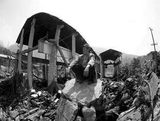

# 第七十七期：地震后,我们应该怎么办?

**一、 房子意外灭失怎么办？**

这个是重灾区群众普遍面对的一个问题，但是也要根据具体情况，区别对待。

在物权标的物意外灭失风险责任负担问题上，主要规则是，意外灭失标的物的所有权在谁手里，谁就应当承担风险责任。具体问题是：

1.如果房屋已经交付，但业主并没有取得所有权，即没有进行过户登记取得房产所有权证书，其房屋的所有权尚在开发商手中的，应当由开发商承担物权标的物意外灭失风险责任。

2.如果房屋的所有权已经办理了过户登记，业主取得了房屋所有权和土地使用权，则意外灭失风险责任应当由业主负担，承受物权标的物意外灭失风险责任。

3.如果房地产的权属证书已经取得，即房屋所有权和土地使用权均已过户登记，但所有权和使用权在贷款银行手中抵押的，则所有权仍然在房屋所有权人即业主手中，抵押的房屋所有权客体意外灭失，应当由业主负担意外灭失的风险责任。那么，对于已经灭失的房屋，还要按月交纳月供吗？

对此，财政部《金融企业呆账核销管理办法(2010年修订版)》专门有做了相关规定：

第四条 金融企业经采取所有可能的措施和实施必要的程序之后，符合下列条件之一的债权或者股权可认定为呆账：

(一)借款人死亡，或者依照《中华人民共和国民法通则》的规定宣告失踪或者死亡，金融企业依法对其财产或者遗产进行清偿，并对担保人进行追偿后，未能收回的债权。

(二)借款人遭受重大自然灾害或者意外事故，损失巨大且不能获得保险补偿，或者以保险赔偿后，确实无力偿还部分或者全部债务，金融企业对其财产进行清偿和对担保人进行追偿后，未能收回的债权；

因此，因为在这次芦山重大地震中损失巨大的应当适用上述条款。

**编者说：**其实这个问题就是一个风险转移的问题，谁获得了所有权，谁就应该承担风险，事实上绝大部分的交易风险承担都是如此。而如一些学者和律师所言，应该由银行承担损失，因为银行承受风险的能力更大。编者认为这是不恰当的，风险自理是基本的契约精神，这是基于契约双方平等关系的基础，不会因为某一方在实际中较为弱势而改变，因为即使是弱势的一方在契约中也是平等交易的。

而换个角度想，如果你不是向银行借贷，而是向朋友借贷，如果不是房屋而是别的小件物品，也可以因为遗失损坏而不用还钱了吗？银行的确承担风险的能力较强，但并非能力较强者就有义务承担他人的损失。

 **二、人失踪了怎么办？**

《民法通则》第二十三条规定，公民有下列情形之一的，利害关系人可以向人民法院申请宣告他死亡：

（一）下落不明满四年的；

（二）因意外事故下落不明，从事故发生之日起满二年的。

因此，在2015年4月20日后，利害关系人就可以向法院提出申请，宣告失踪人死亡。宣告死亡后，失踪人的民事权利能力、行为能力丧失；与配偶的婚姻关系自然结束，其配偶有与他人再婚的权利； 配偶取得单方送养孩子的权利； 财产继承立即开始。

**编者说：**值得注意的是，宣告失踪和死亡是可以撤销的，尤其在自然灾害中，有很大几率人其实是会生还的，但由于失去联系而宣告失踪或死亡。那么如果人活着回来了，宣告死亡被撤销了会怎么样呢？首先婚姻关系自动恢复，但如果配偶已经再婚则不自行恢复；子女被收养的，收养人和被收养人都同意的情况下可以终止收养关系；原有财产应当返还，但第三人合法取得的，不返还。

简单地说，宣告后又撤销其实还是挺麻烦的，所以可以理解有的家属等了很多年依然不肯申请宣告死亡。

 **三、遇难者的财产应如何继承？**

根据《继承法》第五条和第十条的规定，继承开始后，按照法定继承办理；有遗嘱的，按照遗嘱继承或者遗赠办理；有遗赠扶养协议的，按照协议办理。

法定继承：

遗产按照下列顺序继承：

第一顺序：配偶、子女、父母。

第二顺序：兄弟姐妹、祖父母、外祖父母。

继承开始后，由第一顺序继承人继承，第二顺序继承人不继承。没有第一顺序继承人继承的，由第二顺序继承人继承。

**编者说：**地震后产生的继承关系并没有特别之处，但因为地震中会出现一家人全部遇难的情况，所以会由关系较远的亲属继承财产，此时继承关系会较为复杂些。

 **四、地震中父母均死亡的未成人由谁抚养？**

根据《婚姻法》第二十八条、第二十九条的规定，有负担能力的祖父母、外祖父母，对于父母已经死亡或父母无力抚养的未成年的孙子女、外孙子女，有抚养的义务。有负担能力的孙子女、外孙子女，对于子女已经死亡或子女无力赡养的祖父母、外祖父母，有赡养的义务。

有负担能力的兄、姐，对于父母已经死亡或父母无力抚养的未成年的弟、妹，有扶养的义务。由兄、姐扶养长大的有负担能力的弟、妹，对于缺乏劳动能力又缺乏生活来源的兄、姐，有扶养的义务。

 **五、收养震后孤儿，应具备什么条件？**

根据我国《收养法》的相关规定，下列不满十四周岁的未成年人可以被收养：

（一）丧失父母的孤儿；

（二）查找不到生父母的弃婴和儿童；

（三）生父母有特殊困难无力抚养的子女。

收养人应当同时具备下列条件：

（一）无子女；

（二）有抚养教育被收养人的能力；

（三）未患有在医学上认为不应当收养子女的疾病；

（四）年满三十周岁。

有配偶者收养子女，须夫妻共同收养。无配偶的男性收养女性的，收养人与被收养人的年龄应当相差四十周岁以上。

只要满足上述条件，收送双方均系自愿，也征得了年满十周岁被收养人的同意，基本上就可以收养了。

**编者说：**前面已经提到了被宣告死亡者即使生还，也不能单方面主张收养关系无效，这样是为了保证收养人的权益，鼓励收养孤儿，而不必有太多法律上的顾虑。

由于篇幅有限，很多问题不能展开，一一阐述，如果大家还有任何相关的问题，请关注“法律小常识”微信公众平台：flxcsggzy，我将免费进行解答。

 

相关法律法规：

1.《中华人民共和国民法通则》

2.《中华人民共和国婚姻法》

3.《中华人民共和国继承法》

4.《中华人民共和国收养法》

5.《中华人民共和国物权法》

6. 财政部《金融企业呆账核销管理办法(2010年修订版)》

参考阅读：

中国新闻网2008年5月27日：杨立新：地震引发的民事法律后果分析：孤儿收养关系等

（撰稿：温少博；编辑：马特）

[【灾难沉思录】〈七星视点〉第三十七期：地震思考录——救灾中那一只“看不见的手”](/archives/34988)——结合市场自发的交易和价格信息的流动，依靠市场的自发的秩序，加上灾区人民的辛勤劳动，我们有理由相信，灾区一定会重新焕发活力，新的雅安将在不久之后重新站立在人们面前，让我们为雅安祈祷 。。

[【灾难沉思录】七星百科〉第六十一期：道德绑架——何谓“道德绑架”，“道德绑架”又是怎样界定的？本期百科将为读者解释。 ](/archives/35219)
