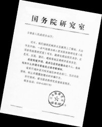
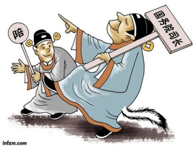

# 第七十三期：义举还是犯罪？

今年3月8日，国务院研究室发文，“**接到反映并从互联网上了解到，从去年年底开始，赵锡永冒充国务院（或国务院政策研究室）司长、副部级巡视员，在昆明、玉溪、澄江、通海等地区调研并发表言论**”。国务院研究室否认这个人的存在，但是这个“骗子”已经行走于多地，堂而皇之地顶着副部级官员的帽子多时。这到底是怎么样的一个人，在过去的几年他做了些什么？

赵锡永是辽宁沈阳人，今年58岁，患有严重的糖尿病，不抽烟、不喝酒、很少吃肉，家境殷实。**曾考过公务员但以失败告终。曾担任国企厂长，在任期间大力改革，治理有方。**从上个世纪九十年代开始，赵锡永组建了三家企业，建立“赵氏弹簧”系。**2003年，沈阳弹簧厂发生变更，任职厂长的赵锡永离任。**

目前可以查到的赵锡永冒充国务院官员是**从2010年3月开始的**，他以国务院发展研究中心研究员的身份出席湖南金华车辆公司与北京宏基万国汽车有限公司的签约仪式。2010年10月11日，参加由中国煤炭机械工业协会、中国煤矿煤城发展工委主办、沈阳北方交通重工集团承办的“2010全国煤矿机械与救援装备高层论坛”，身份为**国务院研究室司长**。2012年10月26日，参加由科技部、工信部及国务院发展研究中心支持，同济大学汽车学院与《汽车财经》杂志联合承办的“第三条路线——2012年首届中国绿色柴油机产业发展论坛”，职位为**国务院研究室正司级巡视员**。而在**2013年2月27日，赵锡永赴玉溪“把脉”玉溪经济社会发展战略，此时他宣称的职位已经是国务院研究室司长、副部长级巡视员。**

郭靖对杨过说，“我辈练功学武，所为何事？行侠仗义、济人困厄固然乃是本份，但这只是侠之小者。江湖上所以尊称我一声‘郭大侠’，实因敬我为国为民、奋不顾身的助守襄阳。然我才力有限，不能为民解困，实在愧当“大侠”两字。你聪明智慧过我十倍，将来成就定然远胜于我，这是不消说的。只盼你心头牢牢记着“为国为民，侠之大者”这八个字，日后名扬天下，成为受万民敬仰的真正大侠。”

一袭白衣，一柄剑。这应该是最原始的侠士的形象，但何曾想到，我辈活到今天居然看见了这样一位大腹便便、天庭饱满，地阁方圆的“大侠”——赵锡永。你初听闻他的事迹，你会觉得这绝对是个演技一流的骗子。从东北到湖南，再到云南，赵锡永一路向西。

**有人说他招摇撞骗，居然假称副部级官员去诈骗真的公务员，还各地去做演讲，欺骗企业；有人说他匡扶国运，他的各种行为都在一定程度上有利于企业的发展和地方的发展，他没有害到谁，反而帮了很多企业的忙。他是大侠还是犯罪人？**

我国刑法第二百七十九条作了以下规定：** 冒充国家机关工作人员招摇撞骗的**，处三年以下有期徒刑、拘役、管制或者剥夺政治权利；情节严重的，处三年以上十年以下有期徒刑。冒充人民警察招摇撞骗的，依照前款的规定从重处罚。这一罪名归属于扰乱公共秩序罪之中，但其在司法理论界和实务界颇有争议，对它的争议焦点主要集中在下面几个方面：

**（1） 犯罪客体是国家机关的威信和正常活动，还是公民、法人及其他组织的合法权益** **（2） 本罪保护的法益是什么**

对上述焦点的意见将直接影响赵锡永案件的定性，由于此案还未进入司法程序，人民法院也未对事实进行查明，笔者就只对本案经媒体报道所呈现的事实进行法理分析。

招摇撞骗罪这一罪名在我国历史和他国法律中均有出现，《唐律》第九篇中就出现了“诈假官”和“诈称官”的罪名，其对于骗取官称，假冒官员的行为已经进行了完备的法律规制。而从国外法律来看，外国刑法中对于本罪的规定大多只关注于犯罪人假冒国家公务人员身份这一事实上，对于其借此所获得的利益要求较少，或言犯罪人通过假冒行为获利并不是本罪的构成要件。

而在国内，对于这一罪名，刑法学界的权威们也各执一词。张明楷教授认为，“冒充国家公务人员进行招摇撞骗的，**原则上是不包括骗取财物的现象**，即使认为包括，也不应该包括骗取数额巨大财物的情况”，但王作富教授却认为本**罪是指以谋取非法利益为目的**，冒充国机关工作人员的身份或者职务，进行招摇撞骗，损害国家机关威信、公共利益和公民、法人及其他组织合法权益的行为。

笔者首先从我国现行的刑法文本来考虑本罪保护的法益和客观要件是什么。招摇撞骗罪归属于刑法条文第六章“妨害社会管理秩序罪”中第一节“**扰乱公共秩序罪**”，而这一节中所涉及到的其他所有罪名无一例外，**皆是对严重损害政府管理和国家安全的行为，其他罪名中的犯罪构成均无犯罪行为必须谋利**，而且**从本罪的陈述来看，也并没有提到是行为人通过此行为获利。**

再次，我国的《治安管理处罚法》中还规定了对一般招摇撞骗行为的行政处罚，该法的第 51 条规定：冒充国家机关工作人员或者以其他虚假身份招摇撞骗的，处五日以上十日以下拘留，可以处五百元以下罚款；情节较轻的，处五日以下拘留或者五百元以下罚款。冒充人民警察招摇撞骗的，从重处罚。”由此可见，并非所有的招摇撞骗行为都构成犯罪，对于那些情节显著轻微危害不大的招摇撞骗行为，按《治安管理处罚法》给予行政处罚即可。

明确了这两点规定之后，我们就可以得出这样的结论：**招摇撞骗罪所要保护的法律是国家行政机关的正常工作秩序和威信，而公民、法人或者其他组织在行为人招摇撞骗的过程中利益受损则不属于本罪所保护的范围**。究竟是触犯刑法的招摇撞骗罪还是仅仅是一般的违法行为，关键是要看行为人招摇撞骗情节是否严重。

回到我们讨论的事实上来，据媒体目前的报道，我们可以确定的事实有以下几点：

赵锡永假称自己是国家工作人员并从事了相关招摇撞骗行为；

赵锡永的行为似乎并未给涉案的政府和企业带来损失，甚至其行为在客观上有可能是有利于这些组织的；

赵锡永的犯罪动机尚不明确，但从其家庭情况和生平经历来看，**他并没有危害社会和扰乱公共秩序的主观目的，更没有谋利的想法**。

基于这样的事实和我们之前的分析，笔者是同意赵锡永构成了招摇撞骗的行为，但是否构成犯罪呢？我觉得就行为人的**主观恶性和客观行为**来说，其并没有对社会的正常秩序造成恶劣的影响，反而有可能在客观上帮助了企业、政府，于国无害反而有利。故，**笔者且认为赵锡永的行为只是一般的违法行为，并不构成犯罪，只需要按照《治安管理处罚法》进行处理即可**。

作为对比，我们还查到了与之类似的案例。**湖南一男子因冒充国家发改委副司长多次骗取他人钱财和接待，犯招摇撞骗罪，被判处有期徒刑1年6个月。**各位读者可自行对比两个案例，自会有个正确的看法。

很可惜，上述的分析只是单纯基于法理上的说理和分析，就像其律师主张无罪辩护但未必真的会无罪，我国人民法院经常在办案中要考虑审判结果的社会影响是否良好。这件案子如果再加上一些现实考量的话，可能结果就不是那么简单了。

本案的行为人如果只是借国家公务人员的名号去行诈骗行为，人民法院不会对其如何重视，说穿了，只是图财的小贼而已，小贼于民有害，与国无尤。但是赵锡永这人却不图财，似乎还行事低调，办了些实事，广大群众必将会将其行为与合法的国家公务人员的行为进行对比，从而产生对政府不利的看法。社会矛盾不断加深扩大，政府本身已经处在舆论的风口浪尖，赵锡永之流的存在只会让政府面临更大的考验。所以，**笔者对这位“行义举”的赵锡永前路并不太乐观，人民法院在人民政府的压力下说不定会认定其社会影响极其恶劣然后重判之，这都是未可知的事情。**

中国古代有丰富的游侠，义侠文化，而各代政府对这些侠士们往往进行各种限制。在统治者眼中，**一个大中国只能有一个政府，一个为人民服务的人，你充大头地做了我政府该做的事情，人民都信你了，谁来服从我的管理啊？**再用现代的话说就是，**公共行为和个人行为之间是有界限的**，属于国家管的事情，你个人就不要来掺和。但问题是，赵锡永并不是像古代侠客一样为民除害去了，他似乎是想和国家一样为人民服务的，我们都知道剥夺公民生命的权力只能由国家所享有，但为人民服务什么时候也成了国家的专属权力？笔者承认赵的行为扰乱了政府正常的管理秩序，但是只是扰乱不是破坏，从客观结果来说，还有可能是有利于政府的统治秩序的。

为国为民，侠之大者。赵锡永在谁的眼中是侠，在谁的眼中又是犯罪人，大家自会明白。此事还需要我们进一步探讨的是，我们如何替天行道。先行者已经用自身惨痛的教训告诉我们不要冒充国家工作人员去行侠仗义，但我们又将面对一个很现实的问题，如果不这样做，我们如何接近高层，如何让他们相信我们，相信我们的建议？不给自己披个外衣，怎么能混进决策层实现抱负呢？难道举个牌牌请愿示威吗，辽宁的那群女人们才刚刚停止了哀嚎。

这是个问题。

（编辑：何盼盼；责编：马特、伍永兴）

P.S.加入“七星说法读者群”，我们一起说法！群号：262980026。
