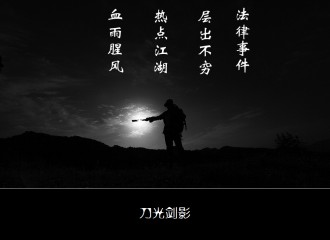
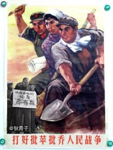
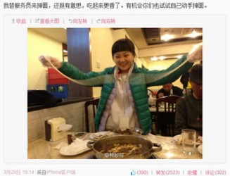
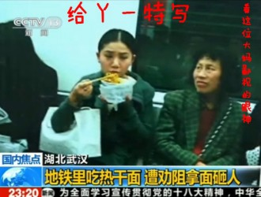
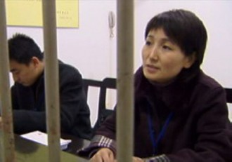
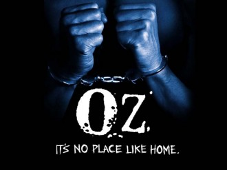

# 第七十二期：初春法律热点笑谈

有人的地方就有江湖，有江湖的地方就有恩怨。如果这么说，**2013年的三月份至今，江湖上一定是腥风血雨刀光剑影。**从央视怒骂苹果到律师因违反庭上纪律被拘留，法律事件大大小小、林林总总竟然不下数十件。面对这么多的资讯，列位看官难免花了眼睛，在此小的选出具有代表性的几个热点，为列位看官盘点一二。

一、央视与苹果

每年的“3.15”晚会，其实都挺热闹。**今年央视的“3.15”晚会的剑锋直指苹果售后服务，指责其违反我国法律法规，无视消费者的权益。**然而苹果却冷淡处理，慢慢悠悠颇有打太极之势。这下可惹恼了咱CCAV，央视新闻、财经各个频道陆续推出相关栏目批评苹果公司的做法，兼有人民日报为人民说话痛骂落水狗，一时间一股围剿苹果的态势在全国范围内迅速形成。

乔帮主仙去之后，这苹果难道真的世风日下人心不古，从此不再把消费者权益放在心头了？这苹果究竟违反的是中国什么法律，哪条哪款呢？ 

__

其实苹果公司的维修合同主要有这么几个问题：**维修可用翻新件、旧件归属自己定；维修造成产品损坏仅赔维修款；运输损坏不能免费维修；逾期未取机视为消费者放弃所有权；代替消费者做选择，自行限定责任范围等。**

因此中消协认为，苹果公司要求消费者同意其“可使用**新的、使用过的或修理过的部件**”维修产品的规定，**混淆了部件和零配件的概念，使消费者无法确切知道维修中使用零配件的真实情况**。此外苹果公司还**混淆了三包期内和期外的法律责任**，因为根据《修理更换退货责任规定》，假如是在三包期内，修理者“应使用与产品技术要求和质量标准要求相符的**新的零配件**。”

另外，我国从2001年11月15日起开始施行的《移动电话机商品修理更换退货责任规定》第20条：“**换货时，应当提供新的商品**”，在今年4月26日国家质量监督检验检疫总局给天津市和平区消费者协会的回函中，明确指出苹果所谓的**“更换整机维修”应为换货，也就是说，无论是换零件，还是换整机部件，都应换全新的。**

小的认为，媒体监督提高商家服务质量那是无可厚非。但是能够有消费者针对苹果霸王条款内容去法院起诉，**由法院进行裁定的话，可能更有利于苹果公司的整改。**毕竟央视和人民日报虽然号称为人民说话，但是往往人民是被代表的。俗话说的好“自己动手丰衣足食，央视挑刺无效到死”。大概就是这么个道理。现如今，苹果公司高层已经发表了整改声明，但是具体效果如何，央视是否会死磕到底，咱们拭目以待！

二、林milk和言论自由

接下来咱再说说前段时间微博上风生水起的林妙可同学。这位小朋友被帝吧的同学们黑，已经不是一天两天的事情了，那些耳熟能详的名字譬如——一介P夫、大狸子、彩笔哥，基本上都参与了黑林行动，这一次只是换了个场景罢了。

林妙可同学在微博上发了一张掸面的图片，有猥琐男网友转发并回复道：“妙可下面好好吃。”这个**一语双关的黄段子一石激起千层浪**，林妙可怒发微博，**要求保障自己合法权益，删除不良言论**。黑林派和挺林派也就此展开了激烈的争论。究竟是侮辱林妙可同学，还是言论自由调侃一下，无数微博大V就此打起了嘴仗。

小的认为，甭管这个人您是多讨厌，无论她是奥运假唱说话装嗲，又或者成熟圆滑腹黑心计，**调戏小姑娘的黄段子和言论自由是无关的。**

言论的自由**一定是以不侵犯他人的合法权益为底线**。言论自由从来不是脱离了法律的自由。我国民法通则明确规定，**禁止用侮辱、诽谤等方式损害公民的名誉。公民的名誉权受到侵害的，有权要求停止侵害、恢复名誉，消除影响，赔礼道歉，并可以要求赔偿损失。**这在网络领域也是适用的。另外侵权责任法对于网络侵权行为也作出了规定，**网络用户如果利用网络侵害他人民事权益，也应当承担侵权责任。**如果侮辱、诽谤他人，情节严重的，还可能涉嫌导致刑事责任。

君不见当年帝吧的一介P夫，就被林妙可同学告上了法庭么？**新浪面对这种情况，收到了举报后，也应当立即删除，维护用户的合法权益。**小的觉得，面对一个小女孩儿，收起自己猥琐大叔的面目，不要起请她看金鱼吃棒棒糖的心思，遵纪守法，比什么都强。

三、地铁和热干面

一姑娘一地铁一手机一照片一碗面。

这事儿就这么简单，姑娘在地铁上吃热干面，一个乘客提醒后姑娘不理，乘客掏出手机想要拍照，结果被姑娘泼了满头满脸的热干面。这事儿出来之后，引发了许多网友的讨论。有的人说就应该拍照曝光这种不文明的行为，也有人说这是侵犯了这个姑娘的肖像权，还有人说瞎拍什么谁知道你是不是色狼啊。

在此小的可以明确的说，**在地铁上拍这位姑娘吃面，还真没侵犯肖像权。**

我国法律对此是有规定的。**认定肖像权被侵害，按照中国民法通则规定，需要符合这样三个要件：一是有损害事实的发生。**如被摄者肖像权受到侵害后，受害人的名誉、地位、身份受到打击带来了精神上的痛苦，主要体现为肖像权人就其肖像获取财产利益的可能性减少，这里包括直接和间接的损失、包括精神损害和物质损害。**二是侵权人主观上有过错。**即摄影活动中确有法律、法规禁止的行为，非法侵害他人肖像权的，即可认定有过错。**三是损害事实和侵权行为之间有因果关系。**这种有因果关系必须是摄影者的行为与损害结果之间的内在、本质、必然的联系。

但在满足上述条件的同时，还要看**是否有阻却违法事由情况的存在**。比如在地铁上吃面，该行为是违反社会公共秩序的典型代表。公共交通工具人多拥挤，小的仍然记得公交一个急刹车后被吃面的同学泼了汤汤水水的惨痛回忆！如此不文明的社会消极现象，对此进行披露，对于社会的进步是有利的。任何公民对于这种不利于社会文明建设的行为都有进行新闻报道的权利，而拍摄新闻照片，正是新闻报道的手段之一。**拍摄这种场面照片，属于为了社会公共利益使用他人肖像，不构成侵害肖像权。**

小的特此做打油诗一首，对这位姑娘表示严正抗议。“公交车上你吃面，拍照曝光又耍贱，没侵犯你的肖像权，你却泼我头和脸，手哥负分可预见，请你赔礼又道歉。”

四、单身汉的悲惨遭遇

这一个热点，请容小的暂且讲一下国五条。

说起国五条，大家对这个名词也都不陌生。它是指在2013年2月20日**国务院常务会议确定的五项加强房地产市场调控的政策措施**。当然能够引起轩然大波的倒不是整个政策措施，而是**政策的细则**。

北京楼市国五条调控细则在2013年3月30日正式出台了。规定自2013年3月31日起，**禁止京籍单身人士购买二套房；严格按个人转让住房所得的20%征收个人所得税，出售五年以上唯一住房免征个税；进一步提高二套房贷首付款比例，新旧政策以存量房买卖合同网签时间为准。**

禁止京籍单身人士购买二套房。单从法律的角度而言，其实这一规定还是有许多问题值得研究的。为什么是京籍？一条法律的规定，是不是应该划定省级范围？这一规定是不是包含有歧视性条款的含义？什么是单身人士？结婚之后又离婚的算不算？订了婚要结婚的算不算？

从前大家为了买房结婚，如今竟然沦落到结婚离婚都买不到房的地步了。对于这一条款的解释，究竟如何，大概就连颁布的专家学者也没有研究明白。只不过我们单身汉招谁惹谁了？我们生性活泼，天真烂漫，爱好和平，与人为善，上能打航天飞机，下能扛大煤气罐，就这么一种人见人爱、花见花开，车见车爆胎的有为青年，还歧视我们？

当然，仔细琢磨一下，其实也不算歧视。

禁止购买二套房？

小的连一套房都买不起！

五、东方红，太阳升，中国出了个聂海芬

聂海芬。

曾经被央视做专栏节目称作女版福尔摩斯的女人，号称破案率百分百无懈可击的警官，手下从来没有出现过冤假错案的奇人。这次算是摊上事儿了，她摊上大事儿了。

这事儿还要从十年前说起。**2003年杭州发生了一起“强奸致死案”，嫌疑人有两个，二审分别被判死缓和15年徒刑，到今年为止服刑已近10载。然而今年却峰回路转，3月26日上午，浙江省高级人民法院依法对张辉、张高平强奸再审案公开宣判，撤销原审判决，宣告张辉、张高平无罪。**

关于这个案子，早在2006年4月13日，中央电视台第12频道《第一线》栏目就推出**“浙江神探”系列报道之“无懈可击聂海芬”**进行报道。节目讲述了聂海芬参与侦破“5·18奸杀案”时，**如何在没有找到任何物证的情况下，通过“突审”，让张氏叔侄认罪”，进而从“细节”入手，获得了证据。**

在节目中，聂海芬说：“人刚刚到案，处于惊魂未定的状态下，经过突审，开口了，两个人都讲了。”

到了今天，张氏叔侄终于讲出了缘由，原来突审就是刑讯逼供。

更为可笑的是法医提取了死者的指甲做DNA鉴定，结果发现，其手指甲里留有男性的DNA，可是这份DNA却与两名犯罪嫌疑人无关！在这种情况下，**咱们的神探聂海芬同志依然坚信自己的判断，将二位无辜的嫌疑人押往法院。**

刑事诉讼法明确规定了非法证据排除的具体标准，**“采用刑讯逼供等非法方法收集的犯罪嫌疑人、被告人供述和采用暴力、威胁等非法方法收集的证人证言、被害人陈述，应当予以排除”。**除此之外最高人民法院关于执行《中华人民共和国刑事诉讼法》若干问题的解释中第61条、人民检察院刑事诉讼规则第140条等法律条文均有明确规定**禁止刑讯逼供**。

追求破案率？想升官发财？要奖章慕名誉？我们已经无法揣测聂海芬的内心世界了。现在新的刑诉法已经颁布，其中增加了有关辩护的重要内容。**“自司法机关对犯罪嫌疑人、被告人采取强制措施之日起或是司法机关对犯罪嫌疑人、被告人进行第一次讯问后，犯罪嫌疑人、被告人就可以请律师为其进行辩护。”**我不知道这条法律能不能够为消除刑讯逼供做出微末的贡献，哪怕只有一点点，也是好的。

因为哪怕只有一点点，也可以让黑暗中的人们看到些光亮，不至于堕入绝望。

聂海芬这样的人，少吗？

我想答案一定是否定的。

六、死、水、微信

短短几天时间，**相继有三个农民死于开发商的车轮之下**。一起发生在河南中牟：3月27日，村民宋合义在自家承包的土地里被河南弘亿庄园的人用铲车活活压死，此前，双方因承包地补偿问题产生纠纷。另一起发生在湖北巴东：3月30日，农民张如琼又因财产补偿诉求与宜巴高速29标段项目部发生纠纷，被水泥罐车碾轧致死。还有一起在四川：2013年4月3日,四川西昌村民宋武华因为开发问题也被碾死！

为了捍卫自身的合法权益，付出的竟是生命的代价。这几位朴实的农民或许到死都想不明白，为了这点微不足道的诉求，何以招致如此疯狂的对待？这几个案件几乎重复着相同的事实：企业需要占用农民的土地，而农民对于补偿额不满意，双方陷入争执。然而正常的经济纠纷，完全可以通过协商来解决。最终却迎来了血和死的结局。

从司法角度来看，这些事情所涉及到的法律规定是容易梳理清楚的。按照我国刑法第二百三十二条的规定：故意杀人的，处死刑、无期徒刑或者十年以上有期徒刑；情节较轻的，处三年以上十年以下有期徒刑。故意杀人罪是行为犯，只要行为人实施了故意杀人的行为，就构成**故意杀人罪。**

但是相关政府的调查报告却并未从犯罪者的角度入手，反而**大书特书被害人的责任，比如“体内检测出酒精”**，“态度凶狠，不予配合”。这些当然**无法成为减轻犯罪者责任的依据，只能更加坚定被害人家属通过法律的渠道公开解决问题的决心**。

因为只有法律才是弱者最强大的武器，进入法律的轨道，用法律才能真正捍卫农免于“碾死”的权利。一方面，这几起命案都可以启动异地调查，以避免地方政府可能的干预，保证案件能够得到公平公正的处理，另一方面，要本着“违法必究”的原则，查清每一个犯罪行为，追责每一个犯罪分子，并以最大的信息公开。

法律如果不能保护弱者，那么正义的意义又何在呢？

说完了这三起案件，咱们再来聊聊**下面两个热点的时事。**

河北沧县张官屯乡小朱庄村井水出现铁红色，村民养的鸡陆续出现死亡现象，村边的洗车厂都不敢用这样的水洗车只好关门。县环保局长邓连军在接受媒体采访时，用“水煮红小豆”来比喻红色井水未必不达标，当记者追问到底水质如何的时候，他轻巧的回了一句：**不告诉你。**

虽然我国**现行宪法没有直接规定公民的知情权**，只是仅在宪法第41条规定：“中华人民共和国公民对于任何国家机关和国家工作人员，**有提出批评和建议的权利**，对于任何国家机关和国家工作人员的违法失职行为，**有向有关国家机关提出申诉、控告或者检举的权利**。”可是这是否代表，我们，光荣的中华人民共和国公民，连知情的权利都没有呢？

中国国务院新闻办公室2012年12月9日发表《中国的司法改革》白皮书，中央司法体制改革领导小组办公室负责人姜伟当日介绍白皮书发表有关情况时表示，**为保障当事人的合法权益和社会公众的知情权、监督权，中国完善了司法公开等多项制度。**

姜伟说，中国宪法规定，中华人民共和国的一切权力属于人民。知情、表达、参与、监督也是公民的基本权利。知情是监督的前提，公开透明已经成为司法的共识。

我应该知道的，请您一定要告诉我！

微信要收费？无数媒体围绕着着这个话题，展开了讨论，人人微博上也都出现了无数的辟谣贴，造谣贴，打脸贴，再次打脸贴。小的并不是理科生，关于技术层面的问题绝对不敢多谈，只不过千呼万唤始出来的**工信部部长苗圩终于说话了，工信部已经要求运营商提交相应的解决方案，监管部门总体上会站在用户的角度，微信有收费的可能，但不会大幅收费。**

根据《政府价格决策听证办法》第3条规定，**对关系群众切身利益的公用事业价格、公益性服务价格和自然垄断经营的商品价格，属于政府价格决策听证的项目。**而电信运营商欲对“微信”收费属于典型的**“关系群众切身利益的事业”和“垄断经营的商品”的政府定价和政府指导定价项目**。因此按照相应的规定，这类服务价格的政府定价或政府指导价**必须先经听证、征求意见后方可确定。否则就是“擅自定价”和“非法定价”。**

价格听证会是国家价格决策机关充分听取各方意见，制定较为科学合理的价格基础。参与价格听证的代表应具备广泛性、代表性的特征。一般由经营者代表、消费者代表、政府有关部门代表以及相关的经济、技术、法律等方面的专家、学者组成。使得各方利益群体能够准确充分地表达所代表的利益集团的真实意思。

希望工信部部长在作出最终决定后，能够充分听取听证会意见，毕竟所有人都不愿意再重蹈“喜闻油价上涨”的覆辙。

七、律师的囚牢

就在近日，一位律师身陷囹圄。他的名字叫王全璋。他因为违反了法庭秩序，而被靖江市人民法院拘留。

最开始靖江市人民法院给出的解释是：**该律师咆哮法庭，扰乱了法庭秩序。**一时间众多法律人产生了疑问，嗓门大难道也算是扰乱法庭秩序？

在网友的追问下，靖江市人民法院公布报告称，当天王律师在法庭上**多次咆哮打断合议庭成员以及公诉方的询问**。同时还**在辩护时用手机对于文书进行拍摄**，最终该法院决定，鉴于王律师的行为违反法庭秩序。依据《最高院适用刑诉解释》第二百五十条第（三）（四）款规定，予以拘留。

然而王律师所代为辩护的当事人家属发话了，**拍照是在休庭时候，因为文书不全予以记录，休庭可不等于辩论，怎么会扰乱法庭秩序呢？**

众多律师继续追问了，法庭能否将当时的法庭录像予以公布呢？法庭的当然是：NO！最后还是王律师自己道破天机，**原来是法院要求更换辩护人，然而家属也不愿意，且王律师尽职尽责，这才惹下了大麻烦。**

到本稿发布为止，**法院以王律师在拘留后表现好为由提前解除了对王律师的拘留**；王律师出来后陈述了被法院拘留的事由；但我们却没有看到靖江法院对王律师个人陈述及先前律师们公布的自行调查结论的回应。我们所能见的，只是王律被拘后，很多律师以各种方式声援王律；随后，**法院解除了拘留决定。**

我想人们更希望看到的是，法院公布庭审录像，充分结合《刑诉解释》的条文，对王律师的行为和自身出发予以论证。假如王律师真的违反了法庭记录，那么对其予以拘留无可非议，假如没有违反，那么应该由王律师自己判断是否施行诉讼的权利。

法官和律师，犹如同出一门的师兄弟，都是维护法律公正的代表。然而本次事件却呈现出成水火不容之势，不知该做何解。即使因为立场不同，也应恪守法律之规定，将秉公执法和维护正义放在首位。这既是对法律的尊重，也是身为法律工作者的必然要求。

** 只愿法官律师能兄弟同心，好好发挥法律正义这一武林绝学！而非相互拆台，学那华山派的令狐冲和林平之。**

结语：

黎叔说：“人心散了，队伍不好带啊！”

近期法律案件大大小小接连爆出，从每一个地方刺痛着人们的神经，这队伍是不是越来越不好带了？小的不敢说，列位看官自己下评论吧。

咱们下期热点，不见不散！

（编辑：戴正阳；责编：陈澜鑫、何盼盼）

P.S.加入“七星说法读者群”，我们一起说法！群号：262980026。

