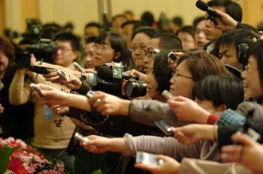
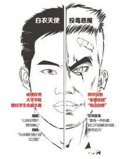
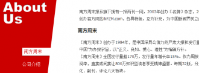
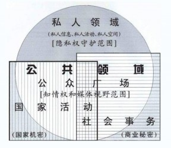

# 第七十六期：莫把话筒作法槌，复旦投毒案的“未审先判”

### **媒体的狂奔**

**在犯罪的问题上，知情权与窥私欲几乎只在一念之间。**每个人都想做福尔摩斯，头戴布帽，口衔烟斗，默作沉思状，香烟燃起，“真相”就这么一点一点在头脑中构建出来。一起案件如今同一场球赛、一部电影一样，也能够成为口中谈资。这边媒体“信誓旦旦”，那头自有读者的“足智多谋”。

近来，复旦投毒案的悲剧又引发了公众的关注，媒体工作者们开动头脑，各处奔走，各路宣扬,又为读者们奉献了一场“信息盛宴”。4月16日，复旦大学通过官方微博发布了黄洋不幸去世的消息，第二天清晨，多家知名报纸就出现了题为[《复旦研究生遭室友投毒身亡》](http://news.21cn.com/caiji/roll1/a/2013/0417/14/21120704.shtml)的文章，**短短十二个字的标题就将犯罪人和犯罪手段确定下来**。而警方的反应却似乎总是要比媒体慢好几拍，4月19日，警方才向检方提请逮捕犯罪嫌疑人林某。

4月18日，上海警方表示，由于案件仍处于侦查阶段，并未对外披露嫌疑人林某作案动机等相关信息，请公众切勿盲目揣测和传播。然而，**此时的媒体早已开始传播所谓的“三大动机”，如同学术主张一样公然提出“情杀说”“竞博说”“误杀说”。**（[《网友猜测复旦投毒嫌犯动机：情杀误杀竞争3版本》](http://news.xhby.net/system/2013/04/19/016962298.shtml)）

**时间一点点流走，犯罪嫌疑人林某的形象却在急速地丰满着**，“家境殷实”“曾追班花被拒”“长期单身”“多面性格”......他在网络上发布的每一条状态、微博都被人们翻出来尝试着去解读，去从中探析这位“杀手”的“犯罪之路”。他的同学、亲人都被媒体找到并进行采访，媒体试图从多方构建这位“投毒者”的人生。**就这样，似乎大街小巷在一夜之间就已熟识了这位“投毒恶魔”。**

比起媒体从业者的日夜兼程，警方的动向似乎显得有些停滞和笨拙，在媒体的信息轰炸下，似乎林某的一切都已经板上钉钉，只待马上开庭、速速宣判。**媒体在着急什么？为何急着将话筒当作法槌，策马奔腾地将司法程序远远甩在后面？**

### **从“侦查密行”到司法公开**

有意思的是，如今的媒体狂欢在两百年前的法国也许是难以预料到的。

**1808****年的《法国治罪法》（即刑事诉讼法典）是大陆法系国家刑事诉讼制度的奠基之作，这部法典的第十一条规定：““除法律另有规定的外，侦查和预审一律秘密进行。”**这样的侦查密行原则不仅仅是针对普通公众的，侦查的进展甚至对于嫌疑人也不能透露。在对外严格保密的要求之下，每一个程序的参与者都被要求保密。

**然而，新闻自由、诉讼人道化的思潮随着民主政治的发展逐步占据主动，侦查过程提升公开性的要求逐步得到各国法律承认。**必须要说，侦查程序的公开是社会公众知情权的要求，对于监督司法运作、增强司法认同的确有着十分重要的作用。司法公开也有基于保护犯罪嫌疑人基本权利的考量，在公众的监督之下，一切对于犯罪嫌疑人作出的行为都应当在法律上论证其正当性。

这其中，美国对于新闻自由的维护表现地最为突出，在1976年中内布拉斯加出版社案件的判决中，指出对媒体报道的禁止是一种对于表现自由的事前限制，应进行严格的[违宪审查](http://baike.baidu.com/view/481771.htm)。可以说，美国对于新闻自由价值的维护程度超过欧陆的其他国家，这也导致了美国在处理新闻自由和犯罪嫌疑人人权的冲突时采取了与欧陆较为不同的模式（慎用事前限制，主要依靠事后弥补和制裁性措施）。

1994年国际法学家委员会在马德里制定了《媒体与司法关系的马德里准则》，其第一条指出：**“表达自由（包括媒体自由）是每一个宣称是民主社会的社会必不可少的基础。媒体的权利和责任是搜集和调查公众信息，对司法管理加以评论。包括在不妨害无罪推定原则的前提下，对审理前、审理中、审理后的案件加以评论。评论司法的权力不应受到任何特别的限制。”**

在当下的中国，可以发现，随着新媒体的不断发展、传统媒体的不断革新，在司法过程中司法机关（含公安机关）的确在信息公开方面有所进步。从复旦投毒案中可以看出，警方正在关注着媒体舆论的走向，并且主动地发布信息以正视听。当然，进一步的司法公开仍然是可以期冀的，司法机关在司法过程中也应当更加积极、主动。

### **当新闻自由遇上无罪推定**

**可是，司法公开大步流星，似乎一不小心就会扯到无罪推定的蛋。**

大家应该都知道刑事诉讼中的无罪推定原则，意大利法学家贝卡利亚在《论犯罪和刑法》一书中首次明确表述了这一原则，我国《刑诉法》第12条规定：“未经人民法院依法判决，对任何人都不得确定有罪。”

**但当我们审视媒体报道时，依然会在报道中发现许多“犯罪嫌疑人”和“罪犯”不分的情况，更有甚者会出现明显的“未审先判”。**例如在2001年，新华社以全国通稿的方式发布了《[沈阳“黑道霸主”覆灭记](http://www.people.com.cn/GB/shehui/20010119/382559.html)》一文，这篇文章以公布罪状的方式一一罗列了刘涌的恶行，**“在日常生活中，刘涌流氓成性，随意砍杀，滥伤无辜”**，而发布文章之时警方都还没有移送检察机关审查起诉。

这样的新闻报道是否违背“无罪推定”呢，或者说这样的新闻报道是否会影响诉讼中的“无罪推定”？

朱苏力教授在1997年的《读书》杂志上发表了一篇名为《罪犯、犯罪嫌疑人和政治正确》的文章，他提出无罪推定仅仅是一个司法的原则，“普通百姓、新闻工作者、甚或是政府官员和法律工作者——只要不是以公职身份代表政府或法院就某案说话（或者不会给人以这样的错觉）或在法律的专业场合——没有任何理由必须按照司法术语来严格区分罪犯和犯罪嫌疑人，他完全可以凭着自己的直觉、感情、司考、判断甚至便利而自由地使用所愿意使用的任何一个语词。”

然而真的应该是这样吗？媒体为何不能够通过自己的判断、分析来作公众的福尔摩斯？

在1966年，美国发生了一起案件，即**“谢泼德诉麦克斯韦尔”**（Sheppard v. Maxwell），这起案件在审判前和审判过程中都吸引了媒体的广泛关注，报纸用醒目的标题和冗长的篇幅对谢泼德的残忍谋杀行为和其他情况发表了煽动性文章，并且在开庭审理时众多的记者进行了采访。报纸还深入报道了谢帕德惯于玩弄女人感情，以此来暗示他的作案动机。最后，**联邦最高法院认于定被告人处于一种非常不利的境遇，本案应由另一未受偏见影响的地区重新审判。**（但认为防止“由报纸做出审判”的责任在于司法人员，而非新闻界自身。美国采取的方式较欧陆各国更注重对新闻自由的维护，而欧陆各国在立法上确定了更为有力的媒体限制。）

偏见？依据司法独立的原则，从理论上来说司法过程的确不应当受到任何其他因素的干扰。一个合格的法官应当不受新闻媒体的任何影响，只依据法律作出裁决。**然而事实上，审视司法实践，我们当然会发现：完全“不受影响”实在是太过天真。**在最近才得以申冤的;张高平、张辉叔侄冤案中，正是由于舆论压力过大，侦查人员才草草定案，又在媒体压力下，将证据不足的案件赶鸭子上阵送上法庭。在正在复查的“两梅案”（[《“铁案”疑藏“沪版佘祥林”》](http://www.infzm.com/content/89383)）中，据退休检察官刘炳华透露：“检方办案人员清楚，顾敏黎从未指控过小叔子梅吉杨，内部讨论时一度产生分歧，有过数次退查、补充，最后经政法委协调，考虑到梅吉扬同犯的情节已上电视，才原封不动地将其列为从犯。”

在司法独立本就难以实现的我国，许许多多的因素都会影响案件判决，舆论自然也不会例外。在“谢泼德诉麦克斯韦尔”一案中，司法独立程度更高的美国也不得不承认媒体的报道使得“被告人处于一种非常不利的境遇”。**本就羸弱的司法力量不会敢于也没有能力去直面“民意”，而有能力挑起“民意”的媒体如果做出不当报道，所引发的影响必然影响司法裁判。**因而，媒体行业有必要在维护新闻自由，发挥其“第四种力量”的过程中，避免“妨害无罪推定原则”（《马德里准则第一条》）。**《中国新闻工作者职业道德准则》第六条中也明确指出：“****维护司法尊严，依法做好案件报道，不干预依法进行的司法审判活动，在法庭判决前不做定性、定罪的报道和评论。”******

然而，就在4月23日，《博客中国》杂志发布了一篇名为[《完美学生的不完美谋杀》](http://photo.weibo.com/1594590224/wbphotos/large/photo_id/3569934686390326?refer=weibofeedv5)的专题报道，这篇文章一开头就做了这样的表述：**“****4****月****16****日下午****3****点****23****分，复旦大学准博士生黄洋死了，在愚人节当天，他喝下一杯含有极高浓度****N-****二甲基亚硝胺的水，这杯水里的毒剂由他的室友——一位严谨而优秀的医学生林****X****（此处七星说法栏目将其隐去）投下。”**斩钉截铁，毫不动摇。

这样的报道如何才能说不是以话筒作法槌，僭越了司法权呢？

### **仅仅是无罪推定？**

媒体对于案件的不当报道，仅仅是妨害了诉讼中的无罪推定吗？

不尽然，我想媒体“未审先判”的恶果绝不仅仅只限于审判之中。如果一个人以罪犯的身份出现在大量带有倾向性描述的新闻报道中，会引起公众怎样的情绪？厌恶、愤恨、鄙夷，这些都无法避免。那么，**如果这个人最后被宣判无罪，当他走出法庭重回自由的时候，那些针对他的负面情绪能够和公权力对他的人身限制一样瞬间消散吗？**

当然不能，一个人跟犯罪扯上关系尤其是杀人强奸这种恶性人身侵害犯罪，即使被宣告无罪，也难以回到过去的正常生活了。他身边的人难免对其侧目，带着“人人都是福尔摩斯”的思维琢磨琢磨这人是不是从法网之下“侥幸逃脱”。**而新闻媒体一旦将犯罪嫌疑人的各种信息向公众透露，这种“社会性制裁”的机能将会被无限扩大。**法庭之上终于尘埃落定，法庭之外却是跳进黄河，也洗不清了。

在面对案件时，无论是媒体还是一般公众，其实需要常常需要问一句“万一”，万一，他是被冤枉的呢？万一，他没有犯罪呢？因为这样的“万一”，在具体案件中很可能就是那完整的一。而媒体透露那些不在公众知情权范围内，公众根本无需得知的消息，**无疑是在剥夺那些无罪之人的“社会复归权”。**

再退一步，即使犯罪成立，犯罪嫌疑人成为罪犯，那么他们的一切是否都能够被报道呢？当然不是，**罪犯也有人权，有隐私权。在一个投毒案中，犯罪嫌疑人追没追过班花、拿过几次奖学金、发的微博、发表的论文、他父母的工作，这些和犯罪本身又有什么关系呢？**从药家鑫案到本案的犯罪嫌疑人，为何媒体总要试图将他们的一生翻个底朝天？为何要把他们的一生经历彻底暴露在公众的视野之中。这些，是和公众知情权、监督司法运作有关呢，还是和满足窥私欲、追求利益有关？

4月25日，《南方周末》这份全国发行量最大的新闻周报又对投毒案的犯罪嫌疑人作了“深度报道”——[《与自己的战争 ，复旦研究生为何毒杀室友》](http://www.infzm.com/content/89908)。这篇报道的第一句话就如同《博客中国》的报道一样，**透露出新闻从业者无穷的自信**，“2013年3月31日中午，林决定下毒。目标是他的室友、复旦大学医学院研究生黄洋”。更为可怕的是，这份报道不仅仅展现了这家媒体所掌握到的案件“真相”，**还披露了大量犯罪嫌疑人的私生活信息**。母亲卖废品、被同窗评论为“书呆子”、与异性交往不顺（具体到一次聚会上被一个女孩拒绝）、合唱比赛自顾自大声唱、爱读的小说、爱看的电影、在网络社区的发言......他发布的每一条微博、爱读的书、爱看的电影，似乎他的一切都指向着他的“终点”——一个投毒犯。

**对于无罪推定的无视、对于司法独立的威胁，乃至于对个人隐私的侵犯，这些承载在它超过170万的发行量之上，真乃一枚重炮。**告诉170万个读者投毒案的犯罪嫌疑人16岁时在读毕淑敏，在聚会上被姑娘打枪是对于公众知情权的满足吗？这些信息是否符合媒体所谓““正义、良知、爱心、理性””的理念？

不能忘记，**媒体作为社会中的重要元素，他的常规运作并没有价值偏向，他们绝不是单纯的知情权服务员，而是有着自己独立利益趋向的主体。**他们为了制造轰动效应甚至会窃听、会偷拍。此外，媒体的报道往往也受着外界因素的影响而有着明显的选择性，例如，在新闻立法较为成熟的国家往往对于官员隐私权的保护较普通人更弱一些，而在我国，被一次次拉到媒体摄像机前被扒个精光的似乎总是普通人，对于同样有犯罪嫌疑并且处在司法过程中的一些重要官员却闭口不发一言。

**监督司法运作、维护知情权毕竟是媒体所发挥的客观作用而不是他们本身的价值需求，妨害司法过程中的无罪推定、侵犯犯罪嫌疑人人格权的可能同样是客观存在的。**《新闻法》的呼唤似乎已是老生长谈，然而在此我们至少提出两个针对新闻自由的紧箍咒——无罪推定和个人隐私。我们也希望新闻从业者能够加强自律，维护司法权，握紧手中的话筒，尊重庭上的法槌。

【深入阅读】

1.[《侦察适度公开原则与犯罪新闻报道》](http://www.cnki.com.cn/Article/CJFDTotal-ZFXK200704012.htm)，易志华，载《政法学刊》2007年8月刊；

2.[《刑事侦查阶段的犯罪新闻报道及其限制——基于犯罪嫌疑人人权的分析》](http://www.cnki.com.cn/Article/CJFDTotal-WFXZ200506006.htm)，周长军，载《中外法学》2005年第6期。

P.S.加入“七星说法读者群”，我们一起说法！群号：262980026。

（编辑：陈澜鑫；责编：林骥、伍永兴、胡逸娴）
