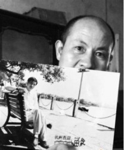
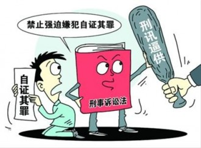
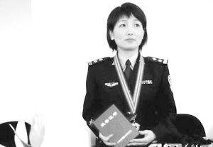
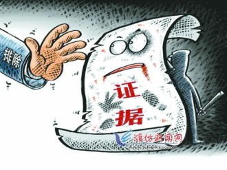

# 第七十四期：埋葬十年，记神探的诞生

2003年，张辉27岁，有一位未婚妻。

2003年，张高平38岁，妻子刚刚怀上4个月的孩子。

“5·18”像是一场从天而降的噩梦，无辜的叔侄俩一夜之间成了奸杀案的犯罪嫌疑人。生活从此换上了一副狰狞的面具。

2004年4月12日，杭州市中级人民法院一审判处张辉死刑、张高平无期徒刑。

2004年10月，浙江省高级人民法院终审改判张辉死刑，缓期2年执行，张高平有期徒刑15年。

二审判决书下达的当天，张高平的妻子与他离婚，胎儿也被打掉。而张辉的未婚妻，从此一去不返。

**张辉&张高平：权利如何救济？**

2005年，张高平被送往新疆石河子监狱服刑。其间张高平情绪激动，一直向别人喊冤，引起石河子市检察院检察官张飚、魏刚等人重视。张飚等分析案情后，坚持帮助申诉，终于促使浙江省高院启动了再审程序。张飚等人的努力被认为是叔侄冤案能够平反的“催化剂”。

**在狱中蹉跎了近十年，张氏叔侄终于等到了迟来的正义。2013年3月26日，在无罪判决作出后，浙江省高院副院长现场向叔侄俩鞠躬道歉。紧接着，浙江省公安厅也作出表态：向当事人及家属致歉。**

忍不住想到道明寺的那句：如果道歉有用的话，那还要警察干嘛？而今“世道变了”，忙着道歉的正是公权力的执掌者——法官和警察。

其实这位大少爷的口头禅不无道理，说到底，道歉与接受道歉对于救济的意义是微薄的。举个很简单的例子，如果甲把乙揍了一顿，乙通常会选择：

A忍。不管是因为甲揍完乙之后，又跑来鞠躬下跪磕头认错外加痛哭流涕，还是一个慈眉善目方丈式人物站出来慢悠悠地说了一句“阿弥陀佛，冤冤相报何时了”，总之乙的怒火分分钟被浇灭，于是大家化干戈为玉帛从此江湖太平。类似这样的矛盾解决方式确实非常“和谐社会”，可惜我们不能寄望于所有被侵权者都是“宰相肚里能撑船”，否则长此以往，社会正义的天平必将处于严重倾斜的状态。

B忍无可忍，无需再忍，干脆利落地把甲揍一顿还回来。这算是**私力救济，即当事人认定权利遭受侵害时，在没有第三者以中立名义介入纠纷解决的情况下，不通过国家机关和法定程序，而依靠私人的力量实现权利，解决纠纷。分为自决与和解两种。此种情况算是自决了。**

C去法院起诉甲，要求赔偿侵害人身权造成的损失。典型的**公力救济，是指当权利人的权利受到侵害或者有被侵害之虞时，权利人行使诉讼权，诉请人民法院依民事诉讼和[强制执行](http://baike.baidu.com/view/45449.htm)程序保护自己的权利的措施。**相对于私力救济而言，公力救济通常成本会比较高，但是当严重的非正义情况发生的时候，前者是现代社会所不允许的，而且后者也会显现出它的优势。除非你活在武侠世界或者希腊神话里，成天幻想着自己是乔峰或者俄瑞斯忒斯。

公开道歉意味着承认错误的良好态度，但也只能表明一种态度。表面文章我们都看得太多了，更多的是低个头认个错后就大事化小，小事化了。尽管**张高平自己表示：“我不要钱，我始终坚信法律是严肃公正的，我只想让该负责的人负责。”**但是要想真正实现权利救济，尽快把承诺的国家赔偿落实到位才是真的。

**根据《中华人民共和国国家赔偿法》第17条，“对公民采取逮捕措施后，决定撤销案件、不起诉或者判决宣告无罪终止追究刑事责任的;依照审判监督程序再审改判无罪，原判刑罚已经执行的，要依法给予国家赔偿。”**

**“严肃公正”和“负责”都是抽象概念，张高平的想法就像秋菊想要的那个“说法”，只有通过国家赔偿等方式才能得以具体实现。因为国家赔偿体现的正是国家代替国家工作人员承担责任，给受害者以在一定程度的弥补，从而实现社会公正。**

然而国家赔偿的钱从哪里来呢？自然是纳税人的钱。华南理工大学法学院院长葛洪义在接受采访时提到：“司法体制有必要进行进一步的改革，司法人员一定要贯彻责任制，避免责任不明确，内部一定要职责职权一致。现在我们经常是集体决定，责任不明确，出了事就找不到责任人，追究不了，这是体制上的问题。**最终往往事情就不了了之了，由财政用纳税人的钱安抚当事人，这件事就算过去了。**”

**因此，对司法工作人员的问责与对当事人的救济同样重要。**至于如何问责？下文会给出一些方向。

**袁连芳：被忽略的关键人物**

张辉说：“我当时刚进号子，看见袁连芳的第一眼就觉得他不是好人。我说我没有杀人，他听了就让另外两个人打我，让我好好说，每次被打完，他就跟我重新说一遍案子的‘经过’，‘细节’比我还清楚，还画了图纸。每次提审回来，他都知道我说了什么，质问我是不是翻供了，只要我一翻供他就叫手下两个人把我拉到厕所里打，打下身。那种痛苦非常惨，我都讲不出来。要不是他，我也不会吃这么大的苦。我们恨牢头狱霸，也恨指使牢头狱霸的人，牢头狱霸没有这个权力，肯定是办案人员指使的，我自己都不知道的事情，牢头狱霸全知道，肯定是办案人员跟他说的，他们串通一气，我绝对不能容忍，太过分了。”

从张辉的叙述和后来检察官张飚的调查中，人们逐渐发现，这个叫袁连芳的人其实很不简单，他在冤案的形成过程中也发挥了非常重要的作用。他的身份是一个“**狱侦耳目**”，或者叫“**线人**”。

**在看守所内，狱侦耳目一般分为两类：一类了解人犯动态，主要用于防止各类事故的发生，保证监所安全，名为“控制耳目”；一类配合预审，主要用于突破重大案件或疑难案件，名为“专案耳目”。袁连芳正属于后者。**

滥用狱侦耳目，对保障犯罪嫌疑人的权利极为不利，对此法学界早有警惕。

北京理工大学法学院教授、博士生导师徐昕认为，**这种做法从制度上来讲是不应当肯定的，甚至从立功角度来讲，都不应当过度强调。这是一种非常不好的告密文化的延续。**

中国犯罪学会副秘书长、中国政法大学教授王顺安在谈及看守所问题时，也曾表示：**看守所在监舍里安排“耳目”，以获取破案线索和维护看守所秩序，但由于公安机关强调高效率的侦审合一，往往会滥用“耳目”，这些“拐棍”和“耳目”，均容易形成牢头狱霸。** 袁连芳的案例也的确印证了上述观点：不只是张辉张高平案，之前他也在其他案件中以“大哥”、“号长”的身份参与促成过嫌犯承认“罪行”。

**聂海芬：应用题还是证明题？**

“聂海芬同志是杭州市公安局自1960年以来唯一荣获全国‘三·八红旗手’称号的女民警。近五年来牵头主办的重特大案件达350余起，准确率达到100%。经她审核把关的重特大恶性案件，移送起诉后无一起冤假错案。”

从“女神探”到“女魔头”，从众星捧月到众矢之的，而关于聂海芬的一切毁誉都指向了刑事诉讼程序的重中之重——证据。

2006年，中央电视台《第一线》节目讲述了杭州市公安局刑侦支队预审大队大队长聂海芬参与侦破“5·18奸杀案”时，**如何在没有找到任何物证的情况下，通过“突审”，让“惊魂未定”的张氏叔侄交代“犯罪事实”，进而从“细节”入手，获得了“无懈可击”的证据。**

说到证据，我国刑诉法的规定当中有两个重要的“排除”：**一是排除合理怀疑**（第53条)，这是新修改的刑诉法吸收了英美法系所要求的证明标准的结果。“排除合理怀疑”（beyond any reasonable doubt）是英美法系国家采用的证明标准，最早产生于18、19世纪。这一证明标准的基本内容是，在刑事诉讼中，起诉方证明被告人所犯被控之罪行，必须达到排除合理怀疑的程度。换言之，**只要辩护律师能够提出哪怕一点“合理怀疑”，被告也能得以无罪判决，这种证明标准显然对保护被告是有利的。**

**二是非法证据排除**（第54条）。这一规则同样源自于英美法，于20世纪初产生于美国。**它要求在[刑事诉讼](http://baike.baidu.com/view/424857.htm)中，侦查机关及其工作人员使用非法手段取得的证据不得在刑事审判中被采纳，也就更不能作为定罪的依据。**

可惜立法者的愿望是善良美好的，现实则是惨不忍睹的：在聂海芬的办案过程中，依靠刑讯逼供得到的张氏叔侄的认罪口供没有被作为非法证据排除。在没有直接人证、物证的情况下，甚至在死者的8个指甲内还检出了一名陌生男性的DNA。这起分明疑点重重的案件居然就被办成了“铁案”。

这样的证据岂止经不起推敲，简直是“一击即溃”，不过更让人匪夷所思的地方还在后面。

参与推动冤案平反的新疆石河子市检察院监所检察科科长魏刚说：“这个冤案似乎很“偏执”，不是证据的认定出现了问题，而是似乎是设定了一个方向，大家都在朝这个方向去做，是有一个方向性的错误。这是一个比较奇怪的现象。”

的确，在鉴定结论已经证明：死者指甲里的男性DNA与张氏叔侄以及受害者生前接触的亲属都无关的时候，“女神探”竟然也没怀疑抓错了人，反而执著地从其他角度去证明张辉、张高平有罪。

聂海芬说：“侄儿讲，他实施强奸的时候，是在汽车的前排，当时叔叔是在后排。那么叔叔的讲法，他说实施强奸的时候，他们三个人同时都在前排。第二点，犯罪嫌疑人张辉讲，实施强奸的时候，把被害人的上衣全脱了，而他的叔叔讲，只脱了裤子，衣服没有脱。”

对于这段相互矛盾的口供，聂海芬的对策是组织了一场在当地人大代表见证下的“指认现场的”。“(请人大代表见证可以)保证指认的这个过程的客观真实性。不是他作案的，他不可能说得那么细，关键就是他不能说得那么准，你在一个点上准了，你不可能每个点上都准。”

发现了吗？**“女神探”的思维方式很像是解一道证明题。先把要证明的结论固定下来，也就是先在内心形成张氏叔侄就是罪犯的确信，然后再想方设法去证明这个结论是对的，说服自己也说服别人这个结论就是对的。可是看过侦探小说的童鞋都知道，破案的过程其实更像是解应用题的过程，利用已知的各种条件，去求解真相，找出凶手。**

**应用题和证明题的思维模式区别直接导致了侦查人员“疑罪从无”观念的淡薄。当你已经从心理上认定了破案是一道证明题，而答证明题是没有对错的，只有证得出来和证不出来。没有谁会因为自己的证明有瑕疵而轻易怀疑证明题本身的真假，因而在“做证明题”的思维模式下，疑罪从无根本无从谈起，“疑罪从有”才是那些逻辑不甚严密但又不想丢分的学生会做的选择。**

根据4月9日的最新消息，随着浙江省政法委针对张辉、张高平错案联合调查组的成立，作为该案件的审核人，聂海芬将面临政法调查。姑且不论政法委是怎样一种神奇的存在，由它出面对冤案进行善后以及问责是否适当，只关注两个问题：向谁问责？承担什么责任？

刑法上的**刑讯逼供罪是指司法工作人员对犯罪嫌疑人、被告人使用肉刑或者变相肉刑，逼取口供的行为。**聂海芬未必能构成这个罪名。可是作为一名公务人员，行政系统内部的处分恐怕不可避免。还有那些和聂海芬一起办案的其他人员呢？甚至检察系统和法院系统的负责人恐怕也难辞其咎。问责不该只是针对聂海芬一人。在考虑诉讼时效的前提下，已出狱的袁连芳是否构成故意伤害罪也是一个值得认定的问题。问责没有尘埃落定，事件就不算结束。

笔者无意也不赞成贬损聂海芬的人格，也不想凭此一案全盘否定她的专业能力，不过是就事论事地指出这起案件侦办过程中存在的问题，无论程序上还是意识上。**毕竟，一个神探的诞生，不应当依靠埋葬别人的一整个十年。**

**张飚：走在“第三条道路”上**

在人们忙不迭地声讨聂海芬或者吐槽坑爹的司法时，[律师张凯](http://weibo.com/lawyerkai)翻出了自己在2011年10月发的一条微博：

“到新疆，一位老检察官请我吃饭。小饭馆、大盘鸡、自备酒，全部老检察官自费。老检察官语重心长的和我讲几年前的一个冤案，希望我可以帮助翻案。席间，我几次眼睛湿润，如今这样有良心的检察官实在太少了。”

这里说的老检察官正是为帮助叔侄俩平反奔波6年的石河子市检察院驻监检察官张飚。

遇到张飚是一个偶然，如果没有遇到他呢？叔侄俩还是否有被平反的可能？

**实事求是地说，目前在我国能得到平反的冤案，几乎无外乎这两种情况：受害人“起死回生”（如佘祥林杀妻案）或者真凶浮出水面。换句话说，唯有把赤裸裸的真相摆在面前，让司法系统面对无可回避的错判事实，纠错的程序才会启动。**

《新京报》的一则评论文章中提到：“**从制度上说，我国的刑事再审程序的启动，事实上只以生效判决“确有错误”为前提，这有很明显的主观主义色彩；从程序上说，一般由司法机关通过书面检查启动，没有当事人律师、证人直接参与的听证程序。哪些新证据能证明原判“确有错误”，由司法机关，甚至是由原审法院来认定，这就增加了翻案难度。**因此，如果不是新疆检察官的一再坚持，不是媒体报道的推动，或许这起冤案至今沉冤难雪。”

因此，张氏叔侄的案件，在当前的司法实践中已经算是一个“可喜”的例外。既没有受害者“起死回生”，也非凶手突然自投法网，仅仅凭着当事人年复一年的坚持，检察官一点一滴的努力，艰难地启动了再审程序，实现了实践中冤案纠错的“第三条道路”，而这本该是一条最合法，最顺理成章的路，却由于制度和程序的不足“通途变天堑”。

显然，要想推动冤案的纠正，**我们需要的是更多制度性保障，而不能寄望于偶然性。比如，明确和细化再审程序的启动条件；增加规定审判监督程序中原判决、裁定的中止执行制度；允许并鼓励非营利性组织对冤案的独立调查等等。此外，将律师介入时间提前到侦查阶段，对讯问过程进行录音录像等新刑诉的规定如果能得到落实，也许将会从源头上降低冤案发生的可能性。**

张飚坚信：我国的法律在不断地完善中，即使有可能做了错误的判决，但总有一天会纠正的，无论发生在什么地方。

是啊，仿佛一场关于未来的天真的梦，可是正如柏杨先生所说“**天真是一种动力。我们这个伟大的时代，就建立在每个人都有天真的梦之上。**”

 【深入阅读】 《退休检察官7年追“真凶” “铁案”疑藏“沪版佘祥林”》 [http://www.infzm.com/content/89383](http://www.infzm.com/content/89383) 《命案必破，疯人顶罪？》 [http://www.infzm.com/content/44611](http://www.infzm.com/content/44611) 《付建波:浅谈修改后刑诉法对证据制度的要求》 [http://www.chinapeace.org.cn/2012-12/09/content_5951578.htm](http://www.chinapeace.org.cn/2012-12/09/content_5951578.htm) 《浅议刑事再审程序的启动》 [http://www.chinacourt.org/article/detail/2006/11/id/224834.shtml](http://www.chinacourt.org/article/detail/2006/11/id/224834.shtml) 柴静：张家叔侄十年 [http://blog.caijing.com.cn/expert_article-151598-50149.shtml](http://blog.caijing.com.cn/expert_article-151598-50149.shtml) 《冤案无人认错，平反只能靠等》 [http://view.163.com/special/reviews/innocent0123.html](http://view.163.com/special/reviews/innocent0123.html)  

（编辑：于轶婷；责编：马特、戴正阳、陈昱嘉）

P.S.加入“七星说法读者群”，我们一起说法！群号：262980026。

    
