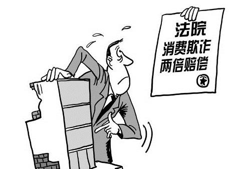
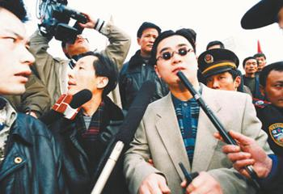
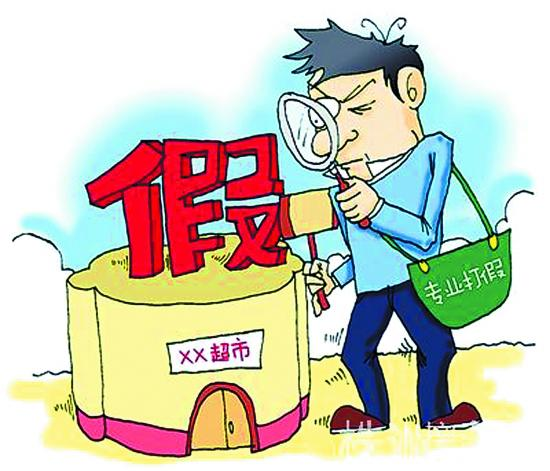
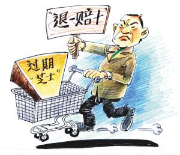

# 第七十期：假货？要的就是假货！

**从《消法》第49条说起**

一切从这里说起，我国《消费者权益保护法》第四十九条条文如下：

“商家或者经营者有**欺诈行为**的，应当按照[消费者](http://baike.baidu.com/view/99548.htm)的要求**增加**赔偿其受到的损失，应增加赔偿的金额为[消费者](http://baike.baidu.com/view/99548.htm)**购买商品的价款或者接受服务的费用的一倍。**”

当消费者遭遇商家的欺诈行为，有权要求获得赔偿，并且赔偿的金额是原价款、费用的两倍，即商家承担双倍赔偿责任。**如果你还不知道这一条规定，那么你可以试着记住它，指不定下一刻就有机会派上用场。**

这一条文是我国法律中**首次出现惩罚性赔偿制度**，对于接受大陆法系传统的国家，长久以来并没有惩罚性赔偿的立法例。然而1993年公布的《消法》却颇为大胆地吸收了这一存在于英美法系中的制度。

那么，什么是惩罚性赔偿呢？从法理上讲，赔偿的首要功能当然还是补偿，摔坏了东西要么陪物要么赔钱，打折了我的腿，留下医疗费用。这一切天经地义，听上去似乎正确得毫无余地。不然还想怎样呢？难道还想从损失中获益，折了腿反而赚了钱？

还真是。惩罚性损害赔偿指的就是**“由法庭所做出的赔偿数额超出实际的损害数额的赔偿”**。凭什么？就拿《消法》第49条来说，凭的就是你经营者的欺诈行为本身就是恶意的不法行为，凭的就是惩罚性赔偿能够威慑经营者，鼓励消费者对抗不法经营者。

再说了，试想下，你精挑细选，为了省下钱来勒紧裤腰带，终于在情人节向女友献上精挑细选的礼物。女友一打开，却发现是假货！闹心不？伤感不？愤怒不？第二天商家就算给你换回真货，但那一夜的浪漫甜蜜温馨能买回来吗？那一夜气氛的尴尬、女友的臭脸、自己的狼狈能退回去吗？你的精神无疑受到了严重打击，只可惜，这样的精神损失似乎在任何一个国家的法律制度下，都难以拿到精神损失赔偿。还好，第二天拿着双份的礼物去博女神一笑吧，这也算是一种弥补。

此外，一顿地沟油大餐吃下肚，对你的身体健康造成了什么损害？即便你花了大把银子从上检查到下，拿X光把自己射个通透，又真的能够为你收到的健康损害举证吗？然而地沟油对你的身体必然是有不良影响的。又或者，一场官司打下来，对方可能承担诉讼费，却不会完全承担车费、律师费，这些惩罚性赔偿在一定程度上是可以弥补这些权利成本的。

以上就是一般所认为的惩罚性赔偿的功能：**惩罚、预防、鼓励、补偿**。当然，由于其与传统民法理论的冲突，惩罚性赔偿的适用范围必须受到严格限制。但在《消法》这样一部对消费者实行倾斜性保护、保护消费者权益的法律之中，一切都显得那么美好。

然而，2004年第6期的《中国法学》刊登了应飞虎教授的一篇论文，文章公布了他向浙、粤、川三地718人所做调查的结果——**“在上述地区，《消法》第49条在实践中事实上处于无用状态”**，718人中尝试运用过第49条的只有4个人，其中3个人半途而废，剩下的一个人最终也失败了。

为什么？消费者为什么不去运用这条规定，拿到双倍赔偿？应飞虎教授分析得出的原因有三，其一是**“多种类的成本及不确定的收益”**，简单说就是麻烦不说（权利成本的存在）还不一定要得到钱（收益不确定）；其二是**“利益上的最低标准线”**，说白了就是具体到购买的商品，即使赔两倍还是觉得没多少，划不来；第三是**“信息不足”**，被坑了也不知道。

这是一件让人灰心的事情，可以想见，这一制度当初在设计时是被寄予了相当期望的。但想想也是，自己平时经常被坑吧？你有试过找商家要过双倍赔偿吗？个中缘由，细细想来，无非以上三点。

想要克服以上的缺陷，似乎需要让消费者与经营者在信息上处于一个相近的水平，又要不嫌麻烦不怕风险，如果能拿到较多的赔偿就更好了，那就有更多的动力推动第49条的运用。于是乎，这篇应教授在这片2004年发表的论文中，如同许许多多谈到这个问题的学者一样，**又开始不可抑制地思念起1995年春天忽然出现的那个戴墨镜的年轻人——王海。**

**“英雄王海”**

1995年的春天，当时还是山东一家工厂的业务员的王海来到首都北京出差，无意间，他看到一本介绍《消费者权益保护法》的普法读物，翻开来，一段文字正映入眼，这就是本文一开始所介绍的《消法》第49条。“增加赔偿的金额为消费者购买商品的价款或者接受服务的费用的一倍”，双倍？王海买下书，又隐入帝都那汹涌的人潮中。

然而正是这本书改变了王海的人生轨迹，自那之后，他成为第一位中国保护消费基金会设立的“消费者打假奖”的获得者，成为众所周知的电视节目《实话实说》的首期嘉宾。1998年时任美国总统克林顿访华，他甚至有机会和克林顿握手交谈。据报道称，当克林顿握住王海的手时，笑着说：“久仰大名。”（[《成长中的王海》](http://guangmingdaily.cn/content/2004-10/08/content_102349.htm)，中国青年报）与此同时，中国前所未有地出现了一批以“英雄王海”为首的威武霸气的“打假英雄”，一改消费者迟疑犹豫的形象。这中间，到底发生了什么？

还要回到那本书说起，看完那本书，山东青年王海一直琢磨着第49条在实践中究竟是否可行。很快，他开始了他的尝试。在北京隆福大厦，王海看到了一种标明“日本制造”、单价85元的“索尼耳机”，怀疑有假。他买回一副，找到索尼公司驻京办事处，果不其然，经对方验证，确定为假。王海这时返回隆福大厦，又买了10副相同耳机，然后要求商场按照《消法》第49条规定加倍赔偿。商场最终只同意退回第一副耳机并赔偿200元，但拒绝对后10副给及任何赔偿。商场认为王海“钻法律的空子”。出师不捷，此事最终并没有进行诉讼，但王海似乎从此下定决心走上打假之路。

经过了一整个夏天，王海又来北京了。这一次他四处出击，购买了他认为是假货的商品，经证实后就像商家索要双倍赔偿，在此过程中，他开始成功了，承担双倍赔偿的商家多了起来。**媒体的摄像机也开始对准永远带着墨镜的王海，他被许多普通百姓甚至经营者当作英雄看待。**

1996年初，“英雄王海”决定挥师南下，以同样的方式在各大商场索赔，然而这一回他似乎又遭遇了许多挫折，多数情况下都无功而返。英雄似乎极为迅速地“气短”了，所幸此时另一个事件启发了王海。

这起事件的主角名叫何山，是全国人大法工委的官员、民法专家，他切实地参与了《消费者权益保护法》的立法工作。有趣的是，**这位参与了《消法》立法的官员，居然以身试法，成为了将“知假买假”送入诉讼程序的第一人。**1996年4月，何山在经营名人字画的乐万达商行仅花费2900元购买了两幅作为徐悲鸿先生真迹出售的国画。基于一个书画爱好者的常识，何山意识到，这家商行不断出售名人字画可能有诈。在何山的要求下，该商行在发票的商品栏中分别填写了"卅三年暮春悲鸿独马"及"悲鸿群马"字样。一个月后，何山以“怀疑有假，特诉请保护”为由向北京西城区法院提起诉讼。法院依据《消法》第49条，判决商场支付双倍赔偿。

打官司？“英雄王海”立马开始打官司。很快，他就在天津的一家法院成为了胜利者。他状告伊势丹公司销售电话有欺诈行为，获得了双倍赔偿。王海自此一路高歌猛进，基本一直胜诉。

可是1998年，王海却输了，天津市第一中院认为王海——**不是消费者**（准确的说是《消法》所保护的消费者）。

**“知假买假”的悖论**

王海是消费者吗？如果他不是消费者，是什么？这样一个问题，一时吸引了许多民法学界大佬们的兴趣，王卫国（[《中国消费者保护法上的欺诈行为与惩罚性赔偿》](http://www.110.com/ziliao/article-59549.html)）、杨立新（[《王海现象”的民法思考》](http://www.lawtime.cn/info/lunwen/jjfqtjjflw/2010092767532.html)）、王利明（[《消费者的概念及消费者权益保护法的调整范围》](http://www.chinalawedu.com/news/21602/8800/93/2004/5/ma1444918341425400216663_115518.htm)）、梁慧星（[《消费者权益保护法：第49条的解释适用》](http://www.110.com/ziliao/article-17405.html)）都在论文中对于消费者的概念进行了探讨。

什么是消费者？《消法》第二条对该法的调整范围作了界定：“消费者**为生活消费需要**购买、使用[商品](http://baike.baidu.com/view/68843.htm)或者接受服务，其权益受本法保护；本法未作规定的，受其他有关[法律](http://baike.baidu.com/view/17641.htm)、法规[保护](http://baike.baidu.com/view/369391.htm)。”条文很清楚的表示只有符合该条定义的消费者，才受到《消法》的保护。

天津中院何以认定王海不是《消法》所保护的消费者？很显然，**他们认为“知假买假”行为并非是“为生活消费需要”。**你买这个东西不是为了日常使用，而是为了索赔，这能说是生活需要吗？大意如此。

然而仔细分析下，“为生活消费需要”看上是去对动机和目的作的限定，可是在法院审判中如何能够辨别购买行为的动机和目的？人心隔肚皮，对动机、目的的判断，一向是个难题，对于主观的判断归根结底需要一定的标准去衡量。

以什么标准来判断，购买行为是“为生活消费需要”？学者们的观点基本上可以分为两种，一个是“消费品标准”，一个是“动机标准”。

什么叫作判断动机的**“动机标准”**？说白了就是**依靠法官的“经验法则”来对动机作判断**。比如说，一个人买了1台IPHONE一般都是作个人使用，那如果买了1000台呢？应该不属于生活消费需要了吧？王海购买一副耳机很可能处于个人消费需要，但买100副呢？然而以“经验法则”来判断主观动机，以主观定主观，必然会出现很多问题。比如王海买了10副耳机，他就不能够送给他的亲朋好友吗？不能用坏一副再换一副？就动机或目的而言，实际上，若非购买者自己承认，他人如何能够得知？

**“消费品标准”**似乎简单明确一些，**只要购买商品是生活消费品就可以认定为“为生活消费需要”**。买一辆大吊车、买一架机床能是为了生活消费需要吗？但是，事实上有的商品既能作生产消费，又能作生活消费，例如砖、钢材等等。

当学者们纠结在判断是否“为生活消费需要”的时候，有人提出了一些非常有趣的观点。比如南京大学李友根教授认为 ，“知假买假者不为消费者”的判断中存在着一个悖论：**如果知假买假者不是消费者，他就没有资格依据《消法》请求退货，那么他就只能使用他，而这样一来，又成了一个不折不扣的消费者。**（《消费者权利保护与法律解释——对一起消费纠纷的法理剖析》，载《南京大学法律评论》1996年第2期）

除此之外，许多学者都意识到了一点：**真的存在“知假买假”吗？**一个消费者怎么能够知道他将要购买的物品一定是假货？在大多数情形之下，是难以做到的，**最多也只能说是“疑假买假”**。在司法过程中，认定一件商品是否是假货归根到底是通过审判确定，一个人即使具备较强的鉴别能力，法律又有什么理由将其区别对待？

以上只是对于许多探讨消费者定义以及“知假买假”问题的论文所做的一个简单评述，那么在司法实践中情况如何呢？根据笔者所查找到的资料，多年来，“知假买假”在司法判决中并没有达成共识，判决结果差异很大。

2002年“上海王海”王海东开始败诉，上海第二中院认为王海东购物时特地带上公证员同行，明显是为了获得诉讼证据，其行为不是普通的个人消费。（[知假买假不受保护 上海封杀“王海”引争议](http://www.people.com.cn/GB/news/8410/20020715/776597.html)）；2006年上海阎家明被一审法院认定以诉讼为方法、以营利为目的的非消费行为，不属于消费者权益保护法调整范围，被驳回（[上海一市民“知假买假”状告超市被判败诉](http://finance.sina.com.cn/roll/20060125/0332526432.shtml)）；08年职业打假人高文军被驳回（[打假者知假买假索赔被驳回](http://lady.people.com.cn/GB/1089/7011354.html)）。“知假买假”的胜诉率越来越低。

而与此同时，在一些地区，“知假买假”也在迎来它的胜利，《浙江省实施<中华人民共和国消费者权益保护法>办法》第五十一条中规定“经营者因提供假冒伪劣商品承担加倍赔偿责任的，不得以消费者购买商品数量过多为由免责。”2008年深圳中院甚至在判决书中明确地作了一下陈述：“即使被上诉人存在“知假买假”行为，但其购买商品并非用于销售，其购买杀商品的动机和目的并不能成为影响其消费者身份的因素，且不会影响其他消费者的权益，故不应否认其为消费者。”（[链接](http://spaq12315.blog.163.com/blog/static/25518115200921273149391/)）

**又起波澜**

**现如今，《消法》第49条已经不是中国法律中唯一的惩罚性赔偿制度了**，09年《食品安全法》实行，其九十六条条文如下：

“违反本法规定，造成人身、财产或者其他损害的，依法承担赔偿责任。

生产不符合食品安全标准的食品或者销售明知是不符合食品安全标准的食品，消费者除要求赔偿损失外，还可以向生产者或者销售者要求支付价款**十倍**的赔偿金。”

从两倍到十倍，消费者在食品领域似乎又有了强大的法律武器。

然而12年11月作为行政机关的质检总局发布了《产品质量申诉处理办法(征求意见稿)》，向公众征求意见，一时却引起许多争议。为什么？这份征求意见稿的第七条中规定，**“****申诉人购买产品时知道或者应当知道产品存在质量申诉所涉质量问题的****”****，****“****质量技术监督部门应当不予受理****”****。**

笔者以为，这条规定实在是让人摸不清头脑，质监部门的职能之一就是打击问题产品，和消费者的主观心理有什么关系？作为行政机关，又有什么理由拒绝申诉？该条意见面向公众征集了85条意见，但国家质检总局网站上依然没有发布正式版本。

不过就在今年3.15之前，南京市江宁法院判决了一例消费者状告超市售卖过期玉米香肠要求十倍赔偿的官司，超市方则以消费者“知假买假”为由拒绝十倍赔偿。法院判决消费者胜诉，并作出裁决：**购买动机不影响维权，能不能获赔关键看食品质量合不合格。**

《产品质量申诉处理方法》还未正式发布，我们可以继续关注。我以为更加紧迫的是从“王海现象”发生起学者就一直呼吁的相关法律解释一直不见踪影，各方学者在《消法》第二条的解释也各执己见，这就导致了各法院之间甚至同一法院经常对于“知假买假”问题的处理差别巨大。笔者以为，“知假买假”需要被保护，相关的法律解释应该尽快出台。从《消法》的立法目的出发，在公力打假能量不足的时候，更多的王海似乎对消费者无害，也能够形成消费者维权、市场规范化的助力。因为，这其中的问题实际不仅仅关系到“职业打假人”能否生存，还**关系到消费者以法律途径来维权的积极性**。如果“知假买假”就不属于《消法》所保护的消费者，不属于《食品安全法》中的消费者，那就意味着**每一个消费者在维权的道路上会首先面临对其动机的考察**，在这样的考察面前，有多少消费者的维权热情会被浇灭，又有多少会坚持到法律程序的完结？想想04年应飞虎教授的调查结果，或许就能略知一二。

我们需要王海吗？社会需要王海吗？更多的王海是否能够改变目前当下假货横行、问题食品层出不穷的现状？“知假买假”是法律问题，更是社会问题，你猜相关法律解释为何迟迟不出台？我猜也许他们也琢磨不透，更多的王海对于社会，是好，还是坏？你说呢？

深入阅读：

  1. [《中国消费者保护法上的欺诈行为与惩罚性赔偿》](http://www.110.com/ziliao/article-59549.html) 王卫国
  2. [《王海现象”的民法思考》](http://www.lawtime.cn/info/lunwen/jjfqtjjflw/2010092767532.html) 杨立新
  3. [《消费者的概念及消费者权益保护法的调整范围》](http://www.chinalawedu.com/news/21602/8800/93/2004/5/ma1444918341425400216663_115518.htm) 王利明
  4. [《消费者权益保护法：第49条的解释适用》](http://www.110.com/ziliao/article-17405.html) 梁慧星
  5. [**《****知假买假行为适用惩罚性赔偿的思考——基于法经济学和法社会学的视角****》**](http://www.lichangqi.net/wz/wz.asp?id=427)** 应飞虎**

（编辑：陈澜鑫；责编：戴正阳、王卜玄）

** P.S.****加入****“****七星说法读者群****”****，我们一起说法！群号：****262980026****。**

** **
