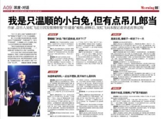
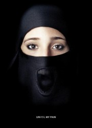

# 第九十一期:网炸漫游指南

在这篇文章还没写完的时候，吴虹飞已经到家了。

吴虹飞这个名字对于诸多混迹于社交网站的小清新和重口味来说，应该并不陌生。前两年看过一篇文章介绍吴虹飞的《活得像个笑话》，就觉得能把黄段子写成本书的姑娘真是不一般，后来听了她的歌看了她的采访，更是觉得这姑娘疯疯癫癫有趣得紧。如果打开她的百度百科， 在长长一串组乐队、任《新京报》首批记者、任《南方人物周刊》创刊记者、发N张摇滚专辑、出N本访谈录、写N本小说/随笔/散文……丰富而散乱的经历下面，你会看见最有违和感的一条：2013年7月22日，因涉嫌在微博上宣称炸建委，被公安机关拘留。

事情是这样的：2013年7月21日03：08，吴虹飞发了一条新浪微博“我想炸的地方有北京人才交流中心的居委会，还有妈逼的建委。我想说，我不知道建委是什么东西，是干什么的，不过我敢肯定建委里全是傻逼。所有和建委交朋友的人我一律拉黑。还有我想炸的人是完全无节操的所谓好人。我才不会那么傻告诉你他的名字，等他炸没了上了新闻你们就知道了。”——就是这句话招来横祸。紧接着，03：13她又发过“我想炸的人应该列一个名单的，鉴于我的记忆力不好，这个名单的人又多，所以我就渐渐放过了他们，想不起这个世上有过罪恶。感谢这个世上的所有恶人，你们人一多，做的恶都要被我逐渐忘记了。”后来第一条被删掉了，15：56她又发了“我想炸——北京人才交流中心的居委会旁边的麦当劳——的鸡翅，薯条，馒头……” 

然后，7月22日她被北京市朝阳区公安分局刑事拘留了。

开始的时候媒体疯传的都是“警方以编造虚假恐怖信息罪将其刑拘，女歌手或被判五年以下有期徒刑”，后来7月29日律师会见后说吴虹飞“涉嫌的罪名是寻衅滋事罪”，到现在警方将吴虹飞的“刑事拘留”改为“行政拘留”，对吴虹飞行政处罚的内容为第一，行政拘留10日，期限为2013年7月23日至8月2日，前面刑事拘留的时间予以折抵；第二，罚款500元人民币。

不知各位看官作何感想，这事儿是吓了我一跳的，不是因为姑娘嚷着要“网炸”建委，而是因为无处不在的网络警察和超级严厉的执法。我们来说道说道。

 网炸的罪与非罪 

首先要明确，法律是不惩戒思想的。只要不付诸行动，思想可以最流氓。无论你在大街上盯着姑娘上三路下三路地视奸多久，她都不能过来抽你嘴巴（当然各地民风有差别）。

如果把内心那些龌龊的小想法表现出来了，即“犯罪意愿”的表露，这被称为“犯意表示”。但是，在行为人没有实施犯罪的情况下，并没有办法查证其表露的想法、内容是否真实，无论是从行为人的主观意图还是客观表现上看，犯意表示都不是在为犯罪实施创造条件，不具有社会危害性。所以，犯意表示不属于犯罪的某一阶段，不应当受刑法的评价。也有学者认为，犯意表示必须是行为人真实犯罪意图的反映。因为在“实践中，有许多场合是行为人出于某种心理需要说气话或者逞能话，以抒发或者满足内心感受，其实并无犯罪意图。因此，这类表达不能统统称为犯意表示。”也就是说，若某人将其犯意存在于内心，则法律不能加以制裁；若仅表示其犯意，但未采取实际之行动时，因其仅为个人表示，亦以不入刑为原则。

但如果行为人已经紧锣密鼓的开始行动，这就是完全不同的概念了。这个阶段被称为“犯罪预备”。即行为人已经开始实施犯罪的预备行为，为犯罪的实行和完成创造便利条件的行为。我们不难看出：犯意表示是指以口头、文字或其他方式对犯罪意图的单纯表露，而犯罪预备行为具有社会危害性，已具备特定的犯罪构成，要作为犯罪处理。

具体到此次事件，我们姑且以最大恶意揣测吴姑娘真的想实施爆炸，但其微博内容最多只能算是是“犯意表示”，也就是把发布微博的行为认定为真实犯罪意图表现于外部——如果每个想犯罪的人都这样明确表示一下那就真的世界和平了——但即便如此，这种“网炸”也只是犯意的单纯流露，不是爆炸罪的犯罪预备。

这时可能有博学的看官问了，刑法上不是还有一类“举动犯”吗？像是煽动颠覆国家政权罪，内个获诺奖的刘某某，还有各种形形色色的某某们，不都是消失于……嘘！噤声！敏感词的这趟水太深了，欧豆豆们哟，尼桑没办法把你们的欧机酱带回来了，我们还是讨论第一个问题吧。

各种罪名按照达到既遂的标准不同可以分为这样几类：结果犯、行为犯、危险犯、举动犯。它们达到既遂的标准分别是：有危害行为并发生法定的危害结果（故意杀人罪、盗窃罪）；完成危害行为（强奸罪、诬告陷害罪）；危害行为造成法定的危险状态（纵火罪）；一旦完成犯罪预备开始着手实行行为即告完成和完全符合构成要件，从而构成犯罪既遂（参加恐怖活动组织罪、煽动颠覆国家政权罪）。这个排列是按照刑法的严厉程度递增的，最后这种刚有点举动就被认定既遂的罪名是极少数的。

那我们来看看这次事件涉及到的两个罪名吧。

刑法第二百九十一条之二：投放虚假的爆炸性、毒害性、放射性、传染病病原体等物质，或者编造爆炸威胁、生化威胁、放射威胁等恐怖信息，或者明知是编造的恐怖信息而故意传播，严重扰乱社会秩序的，处五年以下有期徒刑、拘役或者管制；造成严重后果的，处五年以上有期徒刑。

刑法第二百九十三条：有下列寻衅滋事行为之一，破坏社会秩序的，处五年以下有期徒刑、拘役或者管制：

(一)随意殴打他人，情节恶劣的; (二)追逐、拦截、辱骂、恐吓他人，情节恶劣的; (三)强拿硬要或者任意损毁、占用公私财物，情节严重的; (四)在公共场所起哄闹事。造成公共场所秩序严重混乱的。

纠集他人多次实施前款行为，严重破坏社会秩序的，处五年以上十年以下有期徒刑，可以并处罚金。

仔细看看，这两个罪名都是实打实的结果犯，要求“严重扰乱社会秩序”或者“造成公共场所秩序严重混乱”，那么吴姑娘的行为有没有达到这个程度呢？

央视网新闻中心就吴虹飞是否应该被判刑发起网络投票。截至7月30日中午，在参与的3万多名网友中，有81.6%的人认为吴虹飞言论虽然不妥，但不至于被判刑；18.4%的人认为其恐怖言论已危及公共安全，应该判刑。

当然我们并不赞成民意绑架法律，但本案中的民意调查可以直观的反映另一个问题：恐慌达到的程度。我个人认为，一个做摇滚的姑娘半夜三点发的一句疯话，一般人都不会当真，更遑论“严重混乱”。

所以这些刑法罪名是怎么看都不成立的。公安机关也就从善如流的把刑事拘留改成了行政拘留，于是吴姑娘的行为就违反了《治安管理处罚法》第25条第三项的规定：扬言实施放火、爆炸、投放危险物质扰乱公共秩序的，处5日以上10日以下拘留。

有的看官可能要抓狂了，这什么跟什么怎么一会儿刑事拘留一会行政拘留什么犯罪跟违法的不都是只有公安局一个主角出场的嘛！那我们就再简单理一下这里面的关系。

公安局与刑拘、行拘那不得不说的二三事

先来看“违法犯罪”，这两个经常放在一起说的词其实是有本质区别的。犯罪是指具有社会危害性&触犯刑法&应受刑罚处罚的行为，是个很严格的概念；而违法的范围就广了，一切违反国家的宪法、法律、行政法规和行政规章的行为都是违法行为，这些都是轻微的，社会危害性不大的小鱼小虾。

刑事拘留针对犯罪，是一种暂时性的强制措施，它并非法律制裁，其目的是通过限制现行犯或重大犯罪嫌疑分子的自由，以保证日后法院审理案件的顺利进行，刑事拘留期限届满，被执行人一般要被提起刑事诉讼。普通刑事拘留不得超过14日，对流窜作案，多次作案，结伙作案的重大嫌疑分子的拘留期限不得超过37日。

而行政拘留针对一般违法行为，是行政处罚中最严厉的处罚，作为一种行政行为，其目的在于通过法律制裁防止违法行为的再犯，拘留期限届满，对违法行为人的制裁即告终结。行政拘留的期限最长为15日。

公安机关对两个拘留都有决定权以及执行权，作为一个绝对权力主体，随着案情的进展，根据案件的性质转换二者自不在话下，尤其还没有进入起诉审判阶段。如果你问我公安机关为何如此神通广大以及他职权的界限在哪里的话，我也说不清，这大约应该被归为“公安局与刑拘、行拘那不太好说的二三事”吧。

顺便说说媒体的用词错误，例如：“吴虹飞改判行拘有望10天内获释”，这个“改判”用的是不对的，目前这只是把案件性质变了下，还远没有审查起诉法院判决那一步；“因警方并未向北京朝阳区检察院提请批捕吴虹飞，现律师请求从“刑事拘留”转为“行政拘留”已被批准。”这句话简直就是开玩乐，公安机关大权在握，哪有律师提出这种逆天请求的份儿啊？

对于吴姑娘受到的行政处罚，其实大家也是有争议的，并且这种祸从口出的事儿还真不少，比如更近一点的：“2013年7月30日，25岁的宁夏人李某因对女歌手吴虹飞发微博被拘有异议，日前在微博上模仿吴虹飞，发布‘去北京炸地铁’等言论，被警方行政拘留。”真是网炸需谨慎。就像吴姑娘律师的原话：“歌手吴虹飞女士微博不当言语遭刑事拘留一案对于厘清互联网上言论自由与违法、犯罪意义重大”，那么如何界定言论是否足以造成社会恐慌？构成违法甚至刑罚的标准是什么？这些案件中言论的危害程度能否达到该标准？

这就不可避免的又要展开言论自由与法律界限的讨论了，而言论自由，真真是一本理不清扯不完的烂帐。

我要你的言论，快来加入自由family

对于言论自由，我想这篇文章就不需要过多讨论了，毕竟这个话题早就不新鲜，几乎每个人都能发表一番高见。事实上，这件事之所以引起如此大的关注，关键的原因就在于警方的执法在无意中给公众造成了某种不敢发言的“恐惧”，这比吴虹飞扬言炸建委给社会造成的恐惧更大。

确立言论的边界是一个国家不断明确公民言论权利的过程，它通常要经历较长时间的摸索变更。以美国为例，其在言论界定上的“明显而即刻的危险”原则，即建立在不同层面的讨论、不同时代各种判例的累积和修正的基础上。在舍弗诉合众国案中，霍姆斯和布兰代斯大法官一致认为：“有罪的判决，必须能证明被告的言论，确有导致实际危害的明显而即刻的危险，仅仅认为它是有‘恶劣倾向’是不够的。”1927年的惠特尼诉加利福利亚案中，布兰代斯大法官又不失时机地阐明了“明显而即刻的危险” 的标准：“政府要压制言论，就必须有合理的根据，认为所说的危险是紧迫的；必须有可能对国家造成严重危险。只要言论的主张不具有煽动性，也没有迹象表明会按这一主张采取行动，就不能把言论拒之于保护之外。”

诚然，政府部门如果对恐吓言论不闻不问，就是对公共安全的漠视，但是，任何对公共舆情的监管和介入，都应该具有一个人性且量化的限度。一旦为了某一目的而采取极端方法，那么这些方法也会在其他情况下得到采用，目的将会证明手段的正当性。

在文章快结束的时候想起看过的一篇科幻，主角通过模拟宇宙大爆炸发明了“镜像”，那是完全相同的一个平行宇宙，可以窥见我们生活的世界的任何一个角落、过去和未来，通过它可以侦查到任何一宗罪恶。主角利用镜像去看百年后的未来，却只看到落满灰的房间，桌上相片是一家三口，穿着纯黑的中山装，眼神空洞表情全无。

每每想到那个所有人的一切思想都会变得透明的世界，我的脊背上总是会升起寒意。

【深度阅读】 羊城晚报：吴虹飞案带来的言论尺度思考 [http://cpc.people.com.cn/pinglun/n/2013/0730/c78779-22376731.html](http://cpc.people.com.cn/pinglun/n/2013/0730/c78779-22376731.html) 凤姐要“烧了美国移民局”却并未获罪？“炸楼女”：言论虽不当但刑拘也无据  [http://bbs.news.163.com/bbs/guoji/340670972.html](http://bbs.news.163.com/bbs/guoji/340670972.html) 视频: 《MOGO风神榜人物》吴虹飞专访《再不相爱就老了》 [http://v.youku.com/v_show/id_XMjU2ODIwNjMy.html](http://v.youku.com/v_show/id_XMjU2ODIwNjMy.html) 警方已将吴虹飞“刑事拘留”改为“行政拘留” [http://news.sohu.com/20130802/n383208116.shtml](http://news.sohu.com/20130802/n383208116.shtml) 

（编辑：石味诗；责编：林骥）
