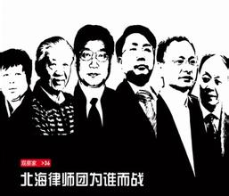
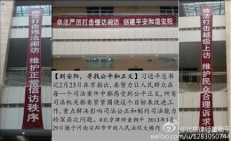

# 第九十七期：律师角色两面观

有一个群体无论是在社交网络中还是在现实社会之中，都在越来越多地受人关注——律师。或许是得益于律政剧的广受欢迎而留下了为正义呼号、在法庭上叱咤风云的法律精英形象，又因为“为坏人辩护”而永远需要背负对其职业本身的“原罪”质疑，似乎再没有哪一种职业如同律师一样，其工作方式、工作目的、职业道德都盘旋在一般民众认知的边界。医者疗伤、师者育人，律师到底是怎样工作的？他们的工作在多大程度上是与其薪酬相符的？他们为何要“为坏人辩护”，又是如何“为坏人辩护”的？

在当下，有在法庭门外绝食的律师，有给法官送红薯的律师，有让公诉人一早上连起诉书都读不完的律师，有“死磕派律师”“勾兑派律师”“形式派律师”“艺术派律师”“死夹派律师”以及法律行为艺术大师，本就争议多多的律师群体似乎在当下的舞台上愈加“得意忘形”。在近来引发巨大争议的夏俊峰案中，有质疑的声音认为夏案辩护律师选择的无罪辩护策略对夏本人造成了负面影响，甚至有人说这样的辩护策略是导致其被判死刑立即执行的重要因素；在一审刚刚结束不久的李某强奸案中，当事人的法定代理人因坚定地要求作无罪辩护而相继解聘了两任律师，出庭律师作无罪辩护之后，似乎也未对案件审判造成实际影响，李某被判十年有期徒刑。到底做不做无罪辩护，谁说了算？

关于律师的种种问题笔者无意也无能力一一阐述，本文将从两个角度探讨律师的角色定位，试试在大戏之后拉开律师们换装的后台，悄悄翻一翻他们的剧本。

** ****作不作无罪辩护，谁说了算？**

李庄案第一季二审中，嫌疑人李庄突然当庭认罪。陕西华南虎照片一案中，被告“周老虎”周正龙同样在二审中忽然当庭认罪。被告认罪了，“坏人”都伏法了，还要律师干什么？被告在庭上说着自己有罪，对于控方的指控一一笑纳，律师纵有天妒奇才，还能折腾出一朵花来？

李庄案和“周老虎”案的辩护律师在此情况下，却作出了同样的选择——依然为当事人作无罪辩护。于是法庭出现了颇为吊诡的一幕，这厢被告“我有罪”，那头辩护人“他没罪”，被告人都已伏法了，律师缘何在此搬弄是非？为何在这两起案件中，律师的辩护策略与当事人的意志表现出明显的差异？拿人钱财却不听人使唤，为何会发生这样的事情？

然而中华全国律师协会制定的《律师办理刑事案件规范》中的第五条规定：“律师担任辩护人或为犯罪嫌疑人提供法律帮助，依法独立进行诉讼活动，不受当事人的意志限制。”同样由该协会颁布的《律师职业道德和执业纪律规范》中第二十七条规定：“为维护委托人的合法权益，律师有权根据法律的要求和道德的标准，选择完成或实现委托目的的方法。”在当前的司法体制之下，所谓律师的独立辩护权是得到承认的，在我国学界中，辩护人具有独立的辩护地位也本是通说，也就是说，即使被告认罪，辩护人仍然可以为其作无罪辩护。至少，这样做既不违反法律，也不会遭到大多数从业者的强烈质疑。

可是问题在于，这样的做法，其辩护的有效性情况又怎样呢？

即使是受过专业训练法官在法庭上面对被告人确已认罪、辩护人却做无罪辩护的情况，难免也会觉得荒唐，难免会留下辩护人困兽犹斗、作无谓努力只为给被告人家属交待的印象，这样的辩护真的利于被告人吗？为何不可根据被告人的当场反应及时调整，作与其供述并不矛盾的罪轻辩护？著名的刑诉法学者陈瑞华就提出了这样的质疑：“被告人要向左走，律师未经与被告人的协商，非要向右走，这不是开玩笑吗？这种相互矛盾的辩护结果只能是相互抵消。这是常识。”

而无论是李庄案辩护律师陈有西还是“周老虎”案辩护律师顾玉树，给出的回应都是同样的——辩护人地位的独立性。

辩护人独立性理论得到了大陆法系传统理论的长久认可，以德国尤甚。陈虎教授在《独立辩护论的限度》一文中指出大陆法系采取独立辩护论的立场，与大陆法系职权主义的诉讼模式紧密相关。职权主义的诉讼模式中，法官以及控辩双方并非是直接对抗的关系，而是分别在其程序定位上都被赋予了发现真相的不同功能，因而认为律师在角色定位上不仅仅是当事人所雇佣的代言人，也是诉讼中真相的探求者，辩护人对法院负有真实义务，且这种真实义务甚至大于其对当事人的忠诚义务。这样一来，就比较容易解释为何律师在被告人自辩无罪时，仍可以从当事人利益出发为其做有罪辩护。

可是在李某强奸案中，当事人的法定代理人不惜两次撤换律师坚持为其子作无罪辩护，与所谓的探求真相义务并无关系，只是当事人自身做出的选择。此前被撤换的律师多次表示难以作无罪辩护乃是基于其职业素养的判断，与所谓真实义务并无关联。在2012年8月，北京青年阮某被控被控提供预测彩票号码“包中”服务进行诈骗，阮某始终坚持自己无罪，律师在庭上为其作罪轻辩护引发当事人与律师间的冲突，阮某当庭解除了委托关系。这两起案件所反映出来的问题似乎并不是职权主义诉讼模式所带来的思维方式，而是律师作为专业人与当事人作为责任人在辩护策略上发生的直接冲突。

辩护策略，到底听谁的？事实上，律师无论是“独立”辩还是“协商”辩，当事人都可以与其解除委托关系，因而律师在多数情况下都是愿意与当事人沟通协商，共同应对的。当事人付钱，谁会故意和钱过不去？在这个意义上，辩护策略归根结底还是取决于当事人。可是问题似乎在于：辩护人的专业意见比起当事人的意见是否就真的更具合理性、更有利于当事人利益？夏俊峰案的辩护律师如果选择罪轻辩护是否真有可能使夏免于一死？这两个问题虽然重要，可是又是无法准确回答的，律师的专业能力参差不齐、当事人的法律认知程度也不相同，当事人在信息拥有上当然有着独特的优势，因而说当事人的意见一定不比律师的专业意见，无疑是武断的。夏某也已被执行死刑，枪下哪有如果可言？说到底，辩护策略对审判结果的影响性本身都是大可怀疑的。

网络舆论中或是遮遮掩掩，或是大声疾呼的疑问其实是：当事人是否被律师“忽悠”了？是律师“忽悠”了当事人，在庭上作不利于其自身的辩护吗？这样的发问是对当事人与律师委托关系本身的质问，可是为什么，为什么律师要去“坑”当事人？难道说律师与当事人的利益并不完全一致？

似乎终于可以给出一个肯定的回答了。律师当然有自己独立于当事人的利益，例如取得更大的名声，又或者说是一个理念......陈虎教授6月15日在微博上发问：“如果法院与律师协商，只要配合审判，不死磕程序问题，放弃质证，就承诺轻判，如果拒绝合作，则判处被告极刑，您会怎么选择？答：你让我想想。”有ID义正言辞地回复说：“死磕程序问题，即便被判极刑，也可以二审再审，即便最后还是被判极刑，从大局上看，这是避免不了的牺牲。如果不死磕，程序将一直存在问题，律师将一直妥协，真正的人权将永远处于黑暗之中。”陈虎回复说：“当事人花钱请你推进法治？”

谁能保证明天你请的律师不会为“人权”而在你头上做“避免不了的牺牲”？在司法实践极端复杂的我国，探讨律师伦理，是一个多么复杂而意味深长的话题。笔者言不能及，只提出一些问题，就此打住。

** ****死磕，到底能磕出些什么？**

5月6日的《人民法院报》上刊登了最高院常务副院长沈德咏的文章《我们应当如何防范冤假错案》，明确提出“宁可错放，也不可错判”，引起了热烈的反响。在这篇文章中，沈德咏还提出：“现在出现了一种非常奇怪的现象，律师不与公诉人对抗，反而同主持庭审的法官进行对抗，甚至演变成了‘对手’，律师要‘死磕’法官，社会上有人说现在的律师与法官关系是‘像雾像雨又像风’，深层原因在哪里？”

从理论上来看，律师与法官当然不是对抗的关系，无怪乎沈德咏将律师“死磕”法官看作是“一种非常奇怪的现象”。与此同时，“死磕派律师”的代表人物杨金柱在蛇年春节发表文章称要“磕出一个法治中国”。什么是“死磕”，什么是“死磕派”？“死磕”到底能磕出些什么？

律师杨学林发微博称中国刑辩律师的办案风格可以分为“死磕派”“勾兑派”和“形式派”，形式派是说光拿代理费念念辩护词，“轻松完成任务”，在当下的刑事诉讼中似乎是在“走形式”；“勾兑派”是指找法官沟通关系、上下送礼，以“有关系”为拿案、办案的第一法宝。那么，所谓的“死磕派”呢？必须说明的是，杨学林自身就自诩为“死磕派”，所谓的律师三分法往往也是由“死磕派”在社交网络上传播的。

打开新浪微博，搜索“死磕派”，可以发现“北海律师伪证案”的当事人杨在新的ID名为“中国死磕派律师杨在新”，有自诩“死磕派公民”的，可以看到微博上无论是学者还是律师，“死磕”这个词出现的频率都出奇的高。

说起“死磕”这个词就必须说起轰动一时的11年北海案，四名刑辩律师被以伪证罪刑事拘留，此时在互联网上引起关注后，一些激愤的律师前往北海为此案辩护、声援。迟夙生、杨学林这些参与北海案的律师，在日后也成为了“死磕派”圈子的核心人物。真正使得“死磕派”形成的也许是12年初的贵阳小河案，在这起案件中被告有50多名，88名律师出庭辩护，庭审持续40多天。在这两起案件中，律师都对庭审程序、证据来源提出了全方位的几近苛刻的质疑。在小河案中，庭审一开始辩护律师就针对合议庭提出回避，法庭不断拒绝回避申请，而当公诉人一开始宣读起诉书时，辩护律师就重新提出回避申请，一整个上午公诉人竟然连起诉书都没有宣读完毕。或许正是这样的举动，使得参与该案的律师们产生了要“死磕” 的觉悟，也使得“死磕派”圈子真正开始形成。

“死磕”究竟磕什么？从“死磕派”的辩护方式来看，大多是利用庭审程序中一切可以提出异议的机会，从诉讼程序的合法性上进行“死磕”，最为普遍的方式如申请回避、申请证据排除、申请证人出庭作证等。因此“死磕派”律师面对质疑时往往认为“死磕”只能磕程序而不能磕实体，一切的“死磕”都是符合法律规定的正当辩护。然而一些“死磕派”似乎已经逾越了依法磕程序的界限。善于运用社交网络的律师们也许是习惯于长时间随手发布微博，而把这样的习惯带到了庭审之上。根据12年11月5日最高院发布的刑诉法解释第二百五十条的规定：“未经许可录音、录像、摄影或者通过邮件、博客、微博客等方式传播庭审情况的，可以暂扣存储介质或者相关设备。”从小河案开始就长于制造微博攻势的部分“死磕派”们在新刑诉解释出台后依然不舍得在庭上放弃这一阵地，不惜因此与法官发生冲突。

当然，不能否认的是，大多数“死磕”是符合程序法的正当要求。不过行为正当归正当，其效果如何呢？有质疑声认为“死磕”恶化了法庭气氛，容易给当事人造成不利影响，可是有趣的是，同样需要“维稳”的法庭似乎对于携网络之势的“死磕”心怀忌惮，使得“死磕”在许多案件中都收到了良好的效果。退一步说，许多“死磕派”“磕”名在外，当事人委托他们辩护，也是出于对“死磕”的认同。

笔者认为，“死磕”无非是辩护方式的一种，在当事人认可且其辩护是从当事人利益出发的情况下是无可非议的。然而许多“死磕派”以及他们的支持者似乎寄予“死磕”以极大的期望，甚至主张”死磕“能够磕出法治中国。对于诉讼程序的严格要求必然是法治的应有之义，然而“死磕”看上去似乎能够实现一些案件的诉讼程序规范化，可是实现正面效果的实质动力无非还是法庭之上的“维稳”。

在高校法学院中学者、教师们常常提及所谓的“法律职业共同体”，无论是法官、检察官、还是律师，都在高校中接受相同的专业学习，通过同一个司法考试，因而在专业知识乃至于法治理念上有许多共同背景。对已法律职业共同体的追求实质上反映出一个良好法治社会对于司法从业人员的要求——良性互动。今天的“死磕派”之所以招人非议我想并不仅仅是由于其工作方式过于招摇、浮夸，而也许是因为一味的“死磕”既无法实质性地优化法治环境，还会使得法律职业间的关系变得过分紧张。

这样的“死磕”也许能磕出个案正义，但似乎磕不出法治中国。

（编辑：陈澜鑫；责编：林骥）
