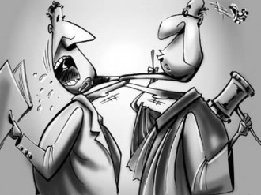
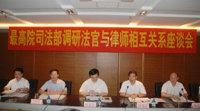

# 第九十九期：法律人的江湖恩仇

**同是天涯法律人**

9月26日，广东省佛山市法官协会、检察官协会、律师协会及法学家代表齐聚佛山市中级人民法院,共同签署**在全国尚属首份的《佛山法律职业共同体一致行动纲领》，围绕如何建立法律职业共同体发出****8****条倡议,****强调构建法律人之间的良性互动关系。**

**（尾注注释[http://lincb.fyfz.cn/b/772695](http://lincb.fyfz.cn/b/772695)）**

法律共同体不算是个新概念。民法泰斗梁慧星老师曾经在他的演讲《怎样进行法律思维？》的引言中提到：众所周知，现代社会有一个法律职业群体，称为"法律共同体"或者"法律人"，包括法官、检察官、仲裁员、律师、法学教授、企业法律顾问，等等。这些职业差异很大，律师是自由职业者，法官是国家公务员、执掌裁判权，为什么把他们归入"法律共同体"当中呢？因为他们共有一个思维方式，就是法律思维。

如果说“共有法律思维”还显得太抽象，那么具体又通俗地说，大多数法律人在本科阶段学的都是民商，刑法，行政法，诉讼法等主干课程，教材上的通说观点也相差无几，都参加过灭绝人性的国家司法考试或者更早期的律考，还有一套让外行人云里雾里的法律语言，比如把树上结的苹果叫孳息或者把学雷锋做好事称为无因管理等等。

与其去研究枯燥的学说和定义，不如看看法学家强世功对于法律职业共同体的一段精彩的描述，从感性上感知一下这个群体的特质：

**他们是一群刻板而冷峻的人**，如同科学家一样，他们孜孜研究自己的发明工具，努力提高这种工具的性能和技术，他们希望这个工具扶助弱者保护好人，但即使服务强者放纵坏人，他们也无动于衷，他们称之为形式理性；

**他们是一群唯恐天下不乱的人**，他们对于那些为两毛钱打官司的淄珠必较者大加赞赏，他们看到那些"知假买假"、"打假护假"的王海式的"刁民"以及为履行合同要割下他人胸前一磅肉的夏洛克就喜心于色，他们不断的鼓励人们滋事生非，还美其名曰"为权利而斗争"；

**他们是一群虔诚的人，**如同教士信守圣典一样，他们也信守自己的圣典和教条，他们小心翼翼的解释这些圣典上的文字，即使这种解释似乎显得不合时宜，但是他们毅然坚信：信守伟大的传统比媚俗更符合这种圣典的精神，他们把这种死板的愚忠称为“坚持正义”；

**他们是一群神秘的人**，如同秘密社会，有自己的切语和暗号，有自己的服饰和大堂，我们不屑于使用日常语言，他们把鸡毛蒜皮的小事上升在神圣的原则层面上来讨论，外人并不知道他们在说什么，为什么这样说，他们把这种以远离日常生活的方式来关注日常生活称之为‘专业化’。”

在政治家看来，他们是政治秩序中异己的力量，对政治统治权威的合法性时时构成挑战；而在街头演说家看来，他们是暴虐的帮凶、专制的工具；在人文知识分子看来，他们仿佛是一台机器，没有情感和良知，没有任何人文的关怀，这正是现代人文精神丧失的明证；在那些理性最大化的经济学家，他们仿佛是一堵墙，唯一的作用就是增加了社会交易的成本；在商业资本家来说，正是这些人妨碍他们为追逐最大利益而实行垄断；而对于目不识丁的小民来说，他们仿佛是高高在上的遥不可及的神。

** **

**两大门派的恩怨情仇**

尽管这个群体有很多鲜明的特征和共性，但法律职业共同体的各方之间的利益纠葛从来都异常复杂，绝不是“利益共同体”和“信仰共同体”可以概括的，这两个说法甚至有学者痴人说梦的嫌疑。单说律师和法官的纠葛，恐怕就不亚于婆媳矛盾的世纪难题。

抛开理论上对于构架法官与律师关系的美好“幻想”，慕容雪村在小说《原谅我红尘颠倒》里描绘的就是另一幅景象。这是一部现实主义作品，鲜血淋漓而痛感尖锐。

小说开头，律师魏达被同所的另一名律师拉去陪法官打“业务麻将”。所谓业务麻将，其实是律师变相给法官送钱的一种手段。用魏达自己的话说“有牌不敢和，有听不能上”，只能输不准赢。

如果你看到法官律师围坐一圈打起了业务麻将，一般来说肯定是律师有案子在在座的法官手里，案子标的大小通常与麻将输赢的大小成正比。除了麻将这种外人看来隐晦实则局内人都心知肚明的手法以外，根据法官的个人喜好和具体要求，律师一般来说当是“有求必应”。问题是，律师大笔花钱让法官舒坦了，是不是诉讼就一定能赢？未必，这在很大程度上还取决于对方律师是不是比你更不心疼钱。既然官司输赢系于法官一身，做律师的自然“宁可得罪亲爹，绝不得罪法官”。

看来，经验丰富的大律师语重心长地告诫小学徒“功夫在庭外”倒也别有深意。

当然，以上只是小说情节，如与现实生活有雷同，纯属作者太有才华。

可是换个角度看，法官这厢也要叫苦不迭。小说里也提到：“其实法官也挺可怜，专业跟律师一样，干活比律师还多，收入最多只有律师的十分之一。”

关于这一点，我们不妨拿数据来说话：法官的工作量到底有多惊人？在去年年底的一篇报道中，据南方周末记者统计，全国一二线城市法院法官的年人均结案量普遍高于100件。**以****2011****年为例，北京市法官人均结案157****件，浙江省148****件，深圳市348****件，而到了基层法院，平均数更大：上海闵行区280****件，深圳宝安区高达409****件，为广东省的“结案冠军”。**

人均每年结案409件是什么概念？意味着你就是一年365天全勤，每天确保审结一个案件，但是对不起，你还是拖了全法院的后腿。这样的工作压力之下，且不说判决书水平如何，会不会有“案结事不了”的后遗症，恐怕基层法官“过劳死”都不奇怪。

再看收入方面。法官收入的特点是旱涝保收，但同时这也意味着其收入与少数成功律师相比是很微薄的。《法官法》规定，法官根据“审判工作特点”，享有工资、审判津贴、地区津贴及其他福利待遇，并实行“定期增资”制度。南周的报道中说，现实情况是，法官列入公务员序列管理，实行阳光工资，津贴及福利却普遍低于同级政府机关公务员。

顺便说一句，最近有媒体称：在全国10多个行业的职工平均工资中，公务员的排名竟然仅处于中下位次。其中安徽、贵州的公务员平均月收入应该在1000元以下。当然，这个数据的真实性读者们可以自行评估。

不过，绝大多数法官的生活状态比起名律师来要差了一大截是肯定的。换做是谁，都难免心里不平衡。当法官的不仅要和律师一样通过司考，还得多经过一重公务员考试的考验，结果你们自由潇洒，还赚得盆满钵满，我们却累死累活，抱着那点死工资不撒手，凭什么呀？

这不，有人总结得非常到位：其实律师和法官就是一对天生矛盾，谁也瞧不上谁，但谁也离不开谁。

** **

**良性互动：打破傲慢与偏见**

尽管被冠以某种“里程碑“式的意义，在笔者看来，佛山这份纲领仍然是在道德层面的小敲小打，本质上无异于重申一次法律人的职业道德。本来嘛，纲领性文件干的从来就是概括抽象的活儿，不可能用来解决法律共同体内部的利益纠葛。

不过说到法共体内部的关系，纲领第五条里有四个字倒是切中要害——良性互动。说到底，**法律职业共同体各方之间最理想的关系是怎样的？就是这四个字：良性互动。**

除了律师被法院拘留这种直接冲突的案例以外，上文提到的“业务麻将”，属于典型的“非正常的、有损司法公信力的交流行为”，其弊病也是显而易见的。法官和律师打着“业务麻将”，司法公正就荡然无存。以此类推，公检法在办案时称兄道弟，犯罪嫌疑人的权利保障也无从谈起。

问题是良性互动究竟如何实现呢？指望法律人的自律？固然可能有一定作用，但是没有摆在眼前的后果和责任，有些人恐怕没有自我约束的动力。举个很简单的例子，中央禁止公款吃喝消费高档白酒，不是照样有人把茅台倒进矿泉水瓶里喝吗？

要想让法律共同体之间形成真正的良性互动，可能有很多具体的做法，比如佛山市律师协会副会长何万龙建议“将协会之间的联席会议制度固定下来,定期研讨社会热点、疑难案件等”，或者佛山中院副院长谢阿桑提出“法院出台的指导性文件也要征求律师、检察官意见，佛山中院在选任审判长时也充分吸纳检察官、律师的意见。”这些都是有建设性也有可行性的措施。也别小看这些是小打小闹，罗马不是一天建成的，理想又规范的关系当然也不是，能有点滴的推进之功，已属不易。

若要大刀阔斧地破与立，法律共同体的构建必然会牵扯到“司法改革”的宏大课题，暂且点到为止，感兴趣的话推荐阅读贺卫方的一篇讲稿《法律职业共同体建设的困难》。读完之后，笔者以为其中分析的六点原因今天看来也不乏道理。

(全文见：[http://blog.caijing.com.cn/expert_article-151302-10323.shtml](http://blog.caijing.com.cn/expert_article-151302-10323.shtml))

为了和天朝做个对比，这里也简单介绍一点美国的情况。先说律师和法官吧。在中国，有一部分法科学生毕业后会选择先进入法院工作几年积累人脉，然后再跳槽当律师赚钱，而美国则是反其道而行之，不是“先法官后律师”，而是“先律师后法官”。事实上，美国最高法院几乎全部大法官均出身于律师。出现这种情况，确实是因为国情大大的不同。总体来说，美国法官地位尊贵，收入颇丰，算是个说出去“有面子”，口袋里“有票子”的职业。至于美国的律师，那简直是多到恨不得抓到实验室里当小白鼠用。

说到美国的法律职业共同体，就不得不提到美国律师协会（American Bar Association，缩写和美国篮球协会的缩写一样）。这是全美最大的律师组织，世界上最大的自愿性律师职业组织，拥有数十万成员。更重要的是，它也是法官和律师之间的桥梁纽带。因为它不仅仅是执业律师的组织，其成员还包括数万名法官、法院行政人员、法律教师、公设律师、法学院学生等。建立于1878年的这个律师自治组织，目的是推动法律科学、提高律师素质、完善司法管理、促进立法与裁判的统一性，并加强成员之间的社会交流。

哇，这不就是一个标准的“法律职业共同体”吗？如果说中国的法共体目前还停留在法学家的YY层面，那么大洋彼岸的ABA岂不是给我们提供了一个现实的模板？

就像广东宝慧律师事务所主任律师蔺存宝评价这次的共同体宣言时所说，法律共同体的提出和构建，不失为一种有益的尝试。但效果如何，尚不得而知，只有拭目以待。

路漫漫其修远兮，法律人何妨共同求索？

  

（编辑：于轶婷 ;责编：林骥）
