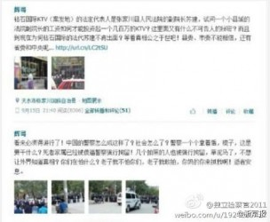

# 第九十五期：怎一个五百次了得

“两高司法解释后转发500次获刑第一案”的爆出让舆论界一片哗然，众人对于9月9日出台的关于办理信息网络实施诽谤等刑事案件的司法解释的唇枪舌战以此为阵地更为激烈且有理有据。因言生怖的恐惧感立马笼罩了这个网络发达的现实与虚幻交织的世界，让言论的自由无处可遁。该案件具体案情如下：甘肃张家川县初三16岁学生杨某曾发微博质疑该县一男子非正常死亡案件有内情，警方不作为且多次与群众发生争执、殴打群众等信息被转发500次以上。日前，杨某被警方以涉嫌寻衅滋事罪刑拘。

此案件的发生略显无厘头，16岁的初中生被拉出来以儆效尤，给大V们一个警示，未成年人保护法也因当事人身份的特殊性被翻了出来为人说道。而抛却社会纲常对此的衡量评价闭口不谈，光从法理上来说上几点，这短短十条的解释要如何定位，如何做出较为恰当的评判。笔者将从诽谤，寻衅滋事二者的解释方面入手浅谈几句。

一、 诽谤一词是非多

“诽谤”，是指故意捏造事实，并且进行散播，损害他人人格和名誉的行为。所谓“捏造事实”，即无中生有，凭空制造虚假的事实。诽谤除捏造事实外还要将该捏造的事实进行散播，散播包括使用口头方法和书面方法。

引“刑法第二百四十六条 以暴力或者其他方法公然侮辱他人或者捏造事实诽谤他人，情节严重的，处三年以下[有期徒刑](http://china.findlaw.cn/bianhu/xingfazhonglei/youqituxing/)、[拘役](http://china.findlaw.cn/bianhu/xingfazhonglei/juyi/)、[管制](http://china.findlaw.cn/bianhu/xingfazhonglei/guanzhi/)或者[剥夺政治权利](http://china.findlaw.cn/bianhu/xingfazhonglei/bdzzql/)。前款罪，告诉的才处理，但是严重危害社会秩序和国家利益的除外。”来看，其一，捏造事实的行为与散播行为必须同时具备才构成本罪。如果只是捏造事实与个别亲友私下议论，没有散播的，或者散播的是客观事实而不是捏造的虚假事实的，都不构成本罪。本罪是故意犯罪，诽谤行为针对的也必须是特定的人。其二，依照本款规定，构成侮辱罪、诽谤罪的行为，都必须是情节严重的行为。这里所说的“情节严重”，主要是指侮辱、诽谤他人手段恶劣、后果严重或者影响很坏等情况。其三，一般情况下，诽谤罪是作为亲告罪之一。

对比此次的司法解释第一条来看“具有下列情形之一的，应当认定为刑法第二百四十六条第一款规定的‘捏造事实诽谤他人’：（一）捏造损害他人名誉的事实，在信息网络上散布，或者组织、指使人员在信息网络上散布的；（二）将信息网络上涉及他人的原始信息内容篡改为损害他人名誉的事实，在信息网络上散布，或者组织、指使人员在信息网络上散布的；明知是捏造的损害他人名誉的事实，在信息网络上散布，情节恶劣的，以‘捏造事实诽谤他人’论。”从最为基本主客体犯罪构成上来说，解释之中指出的网络散布的确是一种不同传统“口口相传”的新型散播方式，捏造事实加之网络散播在构成要件方面的确满足。然而我们不能忽略“情节严重”这关键的四个字。邻里之间互吵胡闹，粉丝之间的狂轰乱炸，网络上的“诽谤”其实就长在我们的生活里，近在咫尺。如果这些都归其罪，未免小题大做了。那么“情节严重”的界定，如手段恶劣，后果严重等词，词义相当宽泛且抽象，在以往的案件处理中，是具有相当浓厚的主观色彩的。此次司法解释一改“大、空”的诟病，明确将“同一诽谤信息实际被点击、浏览次数达到五千次以上，或者被转发次数达到五百次以上的”作为“情节严重”的标准之一。

二、 五百次的奇异世界

被浏览点击五千次或者被转发次数达到五百次以上，五千次，五百次的标准从何而来是我们见其的第一个疑惑。

本解释的制定者为最高人民法院以及最高人民检察院，由最高人民法院审判委员会、最高人民检察院第十二届检察委员会会议通过。全国人大赋予“两高”司法解释权，可以确保法律的适用需要。但不同于人大立法的公开性，法律没有强制规定制定司法解释必须公示，制定机关就有义务向公众详细说明。我们不得不合理质疑该“空降”数据是否有详细科学的调查分析报告作为基础，有合理的制定理由。我们也不得不怀疑调研的群体范围，征求意见的对象，都是些谁，能否代表广大的网民，而非一般意义上的人民群众和过于专业的法律界人士？抑或这只是是信口拈来的“幸运”数字？

五千次，五百次的标准是否合理是我们见其的第二个疑惑。

首先要提的是，这几年，国内互联网确实存在一些问题。谩骂、侮辱诽谤、人身攻击等现象比较普遍，甚至说是靡极一时。极力鼓吹西方国家制度优越性的偏激行为超越了政府民主容忍度，这些不理性的越轨行为是制定一个标准的必要性以及迫切性所在。社会在向前发展，我们要跟上科技信息以及公民行为的节奏，推进法治以及公平正义的脚步。

五百次应运而生。然而不能以互联网其乱糟糟的景象，乱语丛生的现状为由，完全依赖于刑事手段强力惩治一些不与其刑罚相称的行为。“轻罪重罚”无疑是对民心的莫大伤害。转发五百次或点击五千次相较我国14亿人口来说，即使扣去不享有网络设施服务的人数，也远只是冰山一角。以“寻衅滋事罪”等处以重罚未免有“大炮轰蚊子”的小题大做之嫌。该标准如此看来实在过低，“矫枉过正”的可能性倒是超越了其原本的打击意图。

从“第一案”意外“捕获”初中生来看，这标准的实行结果的确出人意料，更加印证了该标准的不合常理所在。转发五百次好似轻而易举，而且也并未造成能毁天灭地的严重后果，更何况此案之中当事人只是发出了对行政执法、司法的质疑之声。而此刻，受到《宪法》保护的公民的批评监督权也竟变成“诽谤”一词的刀下亡魂。

一、 寻衅滋事一锤定音

前文一直在阐述某些行为以XX论是否合理，而直接面对“ 利用信息网络辱骂、恐吓他人，情节恶劣，破坏社会秩序的，依照刑法第二百九十三条第一款第（二）项的规定，以寻衅滋事罪定罪处罚。编造虚假信息，或者明知是编造的虚假信息，在信息网络上散布，或者组织、指使人员在信息网络上散布，起哄闹事，造成公共秩序严重混乱的，依照刑法第二百九十三条第一款第（四）项的规定，以寻衅滋事罪定罪处罚。”明文的定罪处罚四字不由让围观者抖上三抖。我们似乎意识到了问题的严重性，发博发帖早已不是随口说说那么简单，谨言慎行是我们必然的座右铭。

如果说网络言论的虚假散播与诽谤因为同是言字旁同为捏造归为一类，我们基本可以领会其密切的相关性。而此，跟我们常定义的与小混混厮混一起，聚众斗殴之类的寻衅滋事罪紧贴在一起，实在是有些费解了。

寻衅滋事罪，是指肆意挑衅，随意殴打、骚扰他人或任意损毁、占用公私财物，或者在公共场所起哄闹事，严重破坏社会秩序的行为。“两高解释”将利用信息网络辱骂，恐吓他人的恶劣行为主要归在了寻衅滋事罪的第四种客观表现之中——在公共场所起哄闹事，严重破坏社会秩序的行为。笔者在这里就不谈什么叫严重破坏社会秩序了，这又是一场主观色彩浓厚的论战。

我想谈谈何为“公共场所”，网络这个平台隶属于“公共场所”之下么？根据我国《刑法》第291条、293条表述，公共场所是指车站、机场、码头、公园、会展场所、剧院、商场集市、集会或聚会等现实生活人群密集场所。两高把互联网虚拟空间解释为互联网公共平台，继而延伸为公共场所显然超越了原条文的规定边界，做出了扩大化解释，违背了解释本身的细化操作解释原条文的职能。该种超越上位法的越权行为所做出的关于寻衅滋事定罪处罚的解释，其效力有待商榷。毕竟司法解释权不同于立法权，“两高”只能就审判工作和检察工作中具体应用法律的问题进行解释。有些问题的解释，若已超出立法本意，则当提请人大研究。而这条解释事实并没有提请到人大这一层次。

另外，一般情况下诽谤之罪作为告诉才处理的罪名，相关部门对于网络的直接监管继而执法是对特定的被诽谤之人诉权的一种干涉。也是该解释有待完善的一处。

解释的出台是对以往立法的进一步完善，是一个不可忽略的具化过程。为适应社会新情况的变化，应网络各种犯罪渐猖獗，关于信息网络的侮辱诽谤刑事司法解释的出台的确是民心所向。其是保护公民合法权益，维护社会秩序以及有明确法律依据打击犯罪的需要。这正是迈出的一大步。

最高法院发言人介绍，“两高”进行了一年多的深入调研，广泛征求各方意见，经过反复研究论证，出台此司法解释。不过，这些咨询活动的广度、深度和密度，以及最重要的咨询结果没有公布。我们或许该积极的看看，相较以往，已然是有些许进步的。越是影响深远的司法解释，越要审慎地考虑。而这背后，需要我们适度的宽容，给予他们更多的时间，支持他们一步步做得更为出色。

我现在只不过为“初中生”沦为法治进程中的一星炮灰仍有些不甘罢了。

后记：在笔者截稿之时，该初中生又被转为了行政拘留，继而被释放，这样一场事件以这样一个方式结尾，有人评论说这也是对两高司法解释的一个颇具讽刺意味的戏谑。从这整个的事件中我们也可以看出，在中国的法治进程中，权力的力量绝非想象的那么大，立法机关、司法机关若不能真正忠于法律的精神，那么很有可能换来的就是响亮的耳光。至于这个司法解释到底能在以后的司法实践中产生多大的作用和影响，我们也将拭目以待。

（编辑：胡逸娴；责编：林骥）
