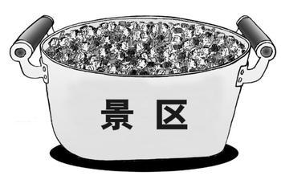
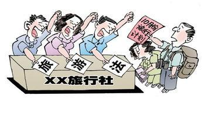

# 第九十八期：《旅游法》与中国式旅游

九寨沟游客滞留，香格里拉强迫消费，“法海被挤到了西湖里”，伴随着服务业GDP的强势增长和满满的出游人群，《中华人民共和国旅游法》（下称《旅游法》）也在这个黄金周开始施行。有人说《旅游法》第一次大考失败了，“黄金周”依然乱象丛生，也有人说《旅游法》让旅游市场的沉疴得到了缓解。笔者并不急于对这些说法给出一个定论，何况这部新法才实行了不到半个月，我们所关心的是：《旅游法》是否可以解决中国目前的旅游问题。

** 旅游，也有中国特色**

旅之游之，优哉游哉。国人对于旅游的期待可以用“优哉游哉”来概括，毕竟没有人会想着为了见识中国有多少人，高速路上有多少车，方便面能卖多贵去旅游，当然作为一种极具中国特色的风景，外国友人还是可以把它当作人文景观来瞻仰的。旅游，是一件多么具有美感的事情，在全美最孤独的公路是独自驾车前行，在漠河看冬至日的太阳升起，但是在中国特色的旅游中，这些浪漫文艺的场景全都变成了人和人的摩肩接踵以及人群中的密不透风。西湖断桥上没有了初遇和重逢的爱情，作为新时期的改编，法海被热心的游客挤下水去，于是白娘子和许仙幸福地生活在一起。梦想中的旅游美轮美奂，我们现实中的中国式旅游也有不少特色：

一是人多且扎堆集中。我国是一个人口大国，所以中国社会问题的任一方面都离不开人多这一基础特点，人口基数大，出游的人数就很庞大，所以地广人稀的国家不会出现太严重的旅游井喷现象。人多的现实不可改变和逆转，而且旅游者往往扎堆在十一长假出游（自从五一黄金周被取消后），庞大的旅游者群体在同一时间段集体出游，这种现象对于社会管理的配合和跟进提出的要求不亚于我国另一个人文景观——“春运”。这两个名词摆在一起之后，我们不仅可以充分理解到了游客井喷对社会管理和景区管理产生的巨大影响，也还可以认识到当前在国家层面对旅游市场管理的第一个显而易见的漏洞：重视不够，社会管理和景区管理协调配合不够。这不是一件小事，“春运”如何筹备和运作，“黄金周”旅游就要达到如何的水平。

二是空间和时间上景区的客流量差异。国人出门旅游大多会挑选知名度较高的景区，譬如苏杭周庄，九寨香格里拉等，这些热门景点热门线路便很容易出现黄金周客流量井喷的现象，但是一些知名度并不太高或者旅游资源开发不太完善的景点可能客流量会比较少，比如同为四川省内知名景点的九寨沟和稻城亚丁的客流量便是相距甚远的。不同景区客流量冰火两重天的景象加剧了地域交通调度和其他社会管理工作的难度，如果不能认识到这一点，依然按照常日的情况发送交通车辆可能对于热点景区的游客来说其需求并不能得到满足。从这个方面来说，认识到地域的差距，在空间层面实现对社会资源的调配是加强我国旅游市场管理的重要工作。

对于同一个景区来说，不同时间客流量的差异也是很明显的。以四川九寨沟景区为例，九寨沟风景区最佳游览时间是每年的十月份左右，而这段时间正好会遇到每年的十一黄金周，最佳游览时间加七天长假的组合，使每年黄金周九寨沟的游客人数屡创新高。所以站在景区管理者的角度上，我们就产生了这样一个困惑：旺季交通车供不应求，淡季交通车大量闲置，如果要应对景区的游客高峰而配备相应数量的交通车，那么交通车的购置和维护费用就会作为经营成本的一部分最后还是转移到了消费者的身上，而且以旺季人数为参考购置的交通车在淡季的大量闲置本身也并不符合现代管理方法，造成社会资源的浪费。对于景区不同时间客流量的差异并不是单纯的景区管理的问题，而涉及到了国家层面上的休假制度。关于我国休假制度的存在的问题将在后文中进行详细的分析和解答。

**《旅游法》规定了什么？**

《旅游法》的出台无疑是对国内旅游市场的管理起到了重要的促进作用，这部法律到底规定了什么，对普通的消费者和旅游产业的经营者会产生什么影响，笔者将会摘取《旅游法》中的重要和核心法条，告诉各位读者《旅游法》对我们的影响，对经营者和旅游市场的影响。

旅游者：权利义务明确 

《旅游法》第二章八个法条对旅游者的权利和义务进行了规定，《旅游法》并没有像《消费者保护法》一样过度偏重于消费者的权利，忽视消费者在消费过程中的义务，这部法律第一个亮点就是权利义务都很明确，充分保障旅游者的权利但也要求旅游者履行文明旅游的义务。旅游者对于旅游产品内容享有充分的知情权，对强制交易行为可以予以拒绝，老人儿童残疾人应当受照顾，但是新法同时也明确对旅游者的义务进行了规定，尤其是第十三条：“旅游者在旅游活动中应当遵守社会公共秩序和社会公德，尊重当地的风俗习惯、文化传统和宗教信仰，爱护旅游资源，保护生态环境，遵守旅游文明行为规范”，笔者认为着重提出旅游者在旅游活动中应履行的文明义务与近年来我国游客在国内外景区的不文明行为不无关系，毕竟旅游资源是人类社会的共同财富，维护景区的古迹完整和环境良好是每个公民理应的义务。新法对于旅游资源的保护和国家对于环境资源的保护出发点是相同的，二十余年粗放的经济发展对于我国各项资源的破坏相当大，对于经济发展方式的改革最终也要落到每个公民对于社会资源的保护和对自身消费方式的转变，社会在改革，每个人也要改变。

经营者：市场管理要规范 

最近主流媒体借“黄金周”和《旅游法》颁布大谈旅游市场的乱象，对于目前市场的状况，不用笔者赘言，各位读者都会略知一二。长期以来，我国的旅游市场管理混乱，旅游社和景区经营者、餐饮住宿行业经营者相互勾结分瓜旅游市场利润，而导游为了自己的生计，强迫游客消费降低旅游产品标准的事情也屡见报端。在国内各行业基本实现行业自律和良性发展的时候，旅游市场不规范之处还比比皆是。对此，《旅游法》在三十五条对旅行社以低团价吸引诱骗消费者，通过安排购物或者另行付费旅游项目获取回扣的手段进行了禁止，并在后文中对于旅行社此类违法行为作出了责令改正、没收违法所得、责令停业整顿和罚款等严厉的处罚措施。对导游则提出了全程陪同，不得擅自变更旅游行程或者中止服务活动，向旅游者索取小费，强迫旅游者购物或者参加另行付费旅游项目等。对景区经营者提出了根据景区情况设置最大承载量，对景区游客人数进行限制，对景区收费项目的政府调控等限制。

列举完《旅游法》对旅游市场管理的规范，笔者有一个很强烈的感觉：为什么笔者觉得这部立法是在打补丁呢？形象地来说，这部法律相当于在破了好几个洞的旅游市场那块布上认认真真地找了几块形状大小都能恰好盖住这几块洞的布，缝了上去便有了新法。当然我们不可否认的是这部法律提出的文明旅游，对旅游者行为方式的引导具有创新性，但是从整体来说还是一个“补漏”的法律，并未给日后的适用留下足够的空间，如果出现了这些漏洞之外的其他问题，可能还是需要依靠有关部门的司法解释去拓展回答。当然，我们必须要承认的是这部法律有立法者所宣称的里程碑意义，对于总量居世界第一的我国旅游市场来说，太需要这样一部法律对这个大市场进行管理和引导，但是笔者的担心也可能是这部法律立法技术上的小瑕疵，时间和实践会对它进行检验。

《旅游法》可以解决中国式旅游的问题吗？

中国式旅游最大的问题是什么？

从立法者的角度来看，他们会觉得总量这么大的一个市场没有有效的管理是个很大的问题。作为一个普通的旅游者来说，我倒觉得以前那些增加消费项目，导游强制消费等旅游市场的乱象是可以理解的，如果你参加的本来就是“低价团”，那么商家的成本肯定要在旅途当中有所体现，只不过有些导游或者旅行社做的有点过了而已。但是，我觉得我本来抱着看风景的心态去优哉游哉，结果去了景点之后我除了人啥都看不见，这不是坑爹吗？我直接在家看新闻也是一样的，何必去受罪呢？所以对于中国式旅游来说，最大的问题还倒不在于这个市场管理的不规范，新法出台之后这个市场肯定会慢慢地正常规范起来，这是毋庸置疑的事情。但是，我们需要的旅游，需要的优哉游哉呢？如果没有了旅游的内容，旅游市场管理得再好，我们还是会说这是次失败的旅游，不，应该说这就不是旅游了。

中国式旅游出现的根源我认为在于国家层面职工休假制度的不合理。目前我国有五一，十一，清明，端午，中秋，元旦，春节七个长假，春节和十一为七天长假。但是我们要注意到这些长假并不是在那段时间给你三天或者七天假期，而是将前后的周末进行调整，凑成假期，放假前后的周末往往要照常工作。考虑中国的国情，春节七天假期大家往往都要回家团聚，走亲访友，加之正值隆冬很少有人出去旅游。而其他三天假期对于长途旅游来说时间并不充分，所以在这样的情况下，十一七天假期就成了多数人进行长途旅游的唯一选择，在这段时间各景点出现井喷现象也不足为奇了。中国式旅游并不是在每一天都上演，甚至在五一期间像九寨沟这样的景点人流量也并不是很大，而只有在十一期间整个中国大大小小的景点都会爆满，这真不是《旅游法》可以解决的问题。休假制度的调整和职工带薪休假的落实才是解决这一问题的根本。当然，像九寨沟景区今年十一期间出现的旅客滞留现象也可以进行个案分析，九寨沟景区是有人流限制要求的，其最大承载量为每天4.1万人次。但是奇怪的现象是，笔者同学今年十一去九寨沟旅游，当天已经发生了游客滞留情况，但是当其到达售票处时依然可以买票进山，后来景区管理人员说还不到最大承载量。这里的猫腻和怪异也提醒我们注意到景区公布的最大承载量是否经过科学客观的核算，是否存在景区经营者为了获取利润而虚增最大承载量的情况。从他们的角度来看，景区大多数时候都在惨淡经营，游客人数和旅游收入都很低，每年唯一捞钱的机会就是十一黄金周，那么他们会去主动限制旅游者进入景区吗？这似乎是不太符合市场经济的运行规律的，有关部门在制定最大承载量的要求是是否考虑到了景区经营者的需求呢？况且当游客花费了高昂的交通费用到达景区时，却被告知不能进山，这也是很不合情理的。

我们的十一黄金周在假期挤人流，节前节后忙调休中度过，这样忙忙碌碌的样子真得不知道哪里配得上休假二字。劳动者都有休息休假的权利，但是目前的休假制度必然会极大地影响到我们休息，而且黄金周集中休假的做法虽然会拉动服务业产值的增长，但是大多数行业甚至政府在黄金周期间类似“停摆”的状况从全局来说，整个社会的产值并不一定会得到提升。解决中国这么多人的休假问题，集中必然不可行，要怎么休假是每个人自己的事情，为什么国家非要揽下这么艰巨的任务，不让公民们自己决定呢？每月休一天和一年集中休假十二天虽然休假时长是一样的，但是对于社会管理的运行影响是明显不同，哪个更有利于我们身心的放松也是不言而喻的。当然这只是我们的粗浅的建议，相信政府比我们更聪明，现在不都开始征求大家的意见了吗？

（编辑：何盼盼；责编：林骥）
