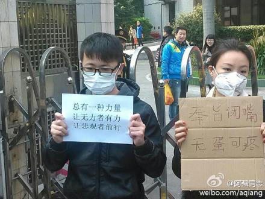

# 第六十一期：南周事件：舆论G点后的法律反思

轰轰烈烈沸沸扬扬的南周事件，终于逐渐降温。若把“复刊”作为收场，似乎显得太过平淡草率而不相适应了——其极热闹时，各大网站争相“藏头”，各路明星纷纷表态；甚至至本文写成，搜索“南方周末”四字仍会出现“部分搜索结果未予显示”。而这一切的起源，不过是一篇“新年贺词”。

### 

### 从“言论自由！”到宪法适用

与“嗯”“啊”“oh yeah”有所不同，**这一次，亢奋中的人们高喊的是“新闻自由”、“言论自由”**。如果非要问凭什么、权利从何而来，请诸位拿出《中华人民共和国宪法》，翻到第二章第三十五条：**“中华人民共和国公民有言论、出版、集会、结社、游行、示威的自由。”**但是人们自由吗？众所周知，我们在宪法之下还有《中华人民共和国集会游行示威法》。这部1989年10月31日通过并公布实施的法律从实践中打消了民众行使“集会、结社、游行、示威的自由”权利的可能性。除此之外，互联网“防火长城”会自动审查国内网站内容，有“不适”言论者将受到政府强制干预；尽管《南方周末》报“新年贺词”被改、众多大报刊被要求转发《环球时报》评论，**大陆至今否认其实施新闻审查**（最近的声明见1月4日外交部例行记者会上发言人华春莹的作答）。

这起事件尤其引发了人们对宪法所赋基本权利——言论自由的关注。但在确认宪法权利是否写了白写之前，首先我们需要确认一下“宪法”这个概念。随便问一个读过点书的“什么是宪法”，他可能都知道诌上一句“是国家的根本大法”；碰巧问到的是个法学生，他可能还会告诉你“具有最高的法律效力”。这些都对，因为它们不幸都是我国《宪法》中的原话——请翻至“序言”最后一段。但是如果你再问，怎么证明它“具有最高法律效力”，他可能在回复你个“制定程序最严格”之后便一蹶不振。

这个问题的答案，每个法学生的宪法期末考试可能都背过，各大法学院的自编教材上也不外乎就那几点回答。但奇怪的是，**制定程序和法律效力其实没有必然的逻辑联系**。好比制作药剂，难道工序越严格，药效就越强劲？这显然说不通顺。也有人会以“来源论”来解决问题（即：不同位阶的法有不同的制定来源，比如一般狭义的法律来源是全国人大，而行政法规的来源是国务院，来源高低的不同决定了其产生的法的不同位阶。比如国务院位阶在全国人大之下，那么行政法规与狭义的法律发生冲突时，选择适用狭义法律），这一方法论虽然有“龙生龙凤生凤，老鼠儿子会打洞”之嫌，但也拥趸者甚众，这里暂时按下不表。那药效的最佳体现是什么呢？当然是要吃了之后才知道。同样，对于宪法的最高法律效力，其体现不仅应当是来源或者程序，更应该体现在适用上。

于是我们谈到了宪法的适用。宪法能不能适用，一直是一个理论界争论不休的问题。不过，在我看来，这就如同在讨论facebook能不能用来约炮一样，虽然不是陌陌微信，毕竟也是一种社交工具，说不能约炮的大多不过是方法不对，或者根本就在墙里用不了——这也不是facebook本身的问题。

**宪法当然应当适用，但不能是全部都能用。**翻开一本《中华人民共和国宪法》从头看，你会很快被“序言”中一系列特色词汇弄呕，以为翻的是党章。作为一部法，它无可避免地包含了许多政策性宣示性的东西，这在任何国家的法律中都无可避免；而宪法由于规范的是国家机构、公民权利以及二者关系，将更容易写的像本政治宣言。这类条款，可用性极差不说，即使适用起来也会是一场灾难。

不过，只要排除了这些条款，宪法的可适用性不会受到根本性影响。**张千帆教授认为，只有具备普适性、明晰性、可实现性与相对稳定性的宪法条款，才能够适用，政策性条款理应排除、并且“将属于立法的还给立法”。**

举个例子，第五十三条：“中华人民共和国公民必须……爱护公共财产，遵守劳动纪律，遵守公共秩序，尊重社会公德。”这是在规定公民的义务。但是何谓“劳动纪律”“公共秩序”“社会公德”？这些概念不仅含糊宽泛，很难清晰认定其法律含义，而且带有很大宣示意味，仅仅是在表达的是一种理想状态。试想，哪一个土生土长的纯正中国人没干过乱穿马路、随地吐痰这种与“社会公德”大相径庭的事？哪一间电影放映厅不会放着放着突然响起某个人清晰显著的接电话对白？尽管每当此际我都恨不得依照宪法把那位没公德又不识相的浑球给执行了，但这不过是电影《GOD BLESS AMERICA》里面的剧情，而且这剧情不科学。

**宪法能用了，对我们来说意味着什么？意味着每个符合条件的公民都可以真正参与选举，意味着被人冒名顶替上了自己考的大学可以依据宪法胜诉，意味着小两口在家一起看AV甚至模仿着演也不能被警察随便“扫黄”扫走。**落实到这起事件，也就意味着那些不服气贺词被改或者不乐意添《环球》狗屁的当事人可以不用这么到处哭鼻子喊冤，直接依据宪法一纸诉状告之即可。

**这是宪政的题中之义，也是所谓“中国梦”的题中之义。**不管事件中包藏祸心和肝胆可鉴哪个才是真相，如同温汤中被煮的青蛙头上忽然被浇上一注沸水，半死不活的人们瞬间被戳中一根叫做“自由”神经，忍不住纷纷叫痛并妄图趁机跳脚出锅。这让我想起当年广场上那些激愤的青年，为这个自由那个自由争红了眼，说到底要的不过也就是一个词——宪政。这是中国人自己的“美国梦”，是每个少年国人情窦初开时春梦中的少女，是铁屋里的做梦人在《南方周末》每一篇新年贺词的字里行间百般猜度出的梦和外面世界存在的痕迹——而那个不解风情的头目居然妄图打破他仅存的捉迷藏的乐趣，这难道还不罪该万死？

### 从南周到传媒业监督

传媒业监督，其实就是舆论监督。这里单单把“传媒”拉出来，就是为了突出以《南方周末》为代表的传媒业，在舆论引导方面的突出表现。**这起事件，换其他任一报刊，都难以收获这种效果，因为它们都不是《南方周末》。**

南周是一份什么样的报纸？2000年克拉玛依大火，它率先引爆那句臭名昭著的“让领导先走”；2003年一篇《被收容者孙志刚之死》直接引发了对收容遣送制度的大讨论，并导致了《城市流浪乞讨人员收容遣送办法》在这个几乎缺乏任何形式违宪审查的国度，靠着舆论的巨大推力，被废止了。

的确，**在众多陈词滥调的纸媒中，南周显得独树一帜风格鲜明，它的价值体系年轻粗犷，带着令人难以抗拒的鲜味。**在其他媒体依然在大肆借助性器官暴露（如爆乳美女）、道德人性沦丧（如家庭伦理悲剧）、名人丑闻等等低劣庸俗的卖点吸引日渐流失的观众时，南周就开始以人权、自由、宪政等等格调高雅又与敏感词擦边暧昧的字眼，屡屡搔中每一个满腔热血又心不安分的中青年阅读者的痒处。这份报纸敢用半页半页的版面给汽车手表做广告，也一样一边增设分印点一边一报难求。甚至在网媒中，只要冠以“南方周末”之名的文章，必定能火；而能有幸冠以“南方周末撤稿”之名的文章，不管是真是假质量好坏（——还记得那篇北京大水的“撤稿”吗？文笔一般深度也一般。还记得那篇炮轰河南高考“枪手”的“撤稿”吗？真实度偏差大到让人对作者胆子之肥瞠目结舌——）则势必得要火得摧枯拉朽义不容辞。

**传媒业手中掌握着引导舆论走势的作用。**我们笨嘴笨舌只有一腔热情和朴素正义感的民众，于是往往就被代表、被误导了。“宜黄钟家拆迁事件”水落石出，而媒体依然汲汲于制造看点、捧杀“弱者”；“李刚门”“药家鑫案”真相久久扑朔迷离众说不一，因为说明白了就有碍于媒体煽动情绪。最近一期《南方周末》，一则“患者用家里的厨具自制了血液透析机活了13年”的报道格外惹眼。最基本的医学知识告诉我，这注定又是一篇包装为医患关系与医疗机制中矛盾尖锐的报道，连事件主角胡颂文自己，都觉得焦点跑偏。的确，这样煽情的报道引起了关注引发了争鸣，轻易就能戳中不明真相围观群众的G点，但事情的结果并没有因为人为制造的焦点矛盾而得到改善，并且完全起到的是相反作用。

**纸媒如此，网媒尤甚——他们借助网络自由开放的特性，充分刺激着人们去碰触平日不敢不能碰触的“敏感词”禁忌。网民们仿佛进入了AV制片现场，在这种人工搭建而成的疑似“自由”“民主”“公正”“真实”的环境中亢奋得欲仙欲死。**即使有防火墙也不能阻挡网民们发泄快感的智慧，大家利用错别字谐音字藏头等等文字游戏，创造出一种只有资深网民才能看懂的语言系统，连大牌门户网站也投身其中，并且玩得不亦乐乎。天天刷着人人微博，总让人不时感觉沸反盈天大厦将倾；可是当你关了电脑走出家门，菜市场里仍旧一片热情吆喝和讨价还价声。地球照转，国戏照唱，你在媒体上读到的，也是中国，但仿佛只在隔壁。

于是乎，我们不禁要诧异——是谁让我们对世界的感知竟如此不同？

我们的传媒业煞费苦心，竟然并非在做准确客观地旁观和记录，而是像电影《楚门的世界》一般，人工搭建着一个大影棚？

尽管有着诸多错误失误和不足，《南方周末》凭借其胆识和犀利，已堪称传媒业中的“公知”。然而在这起事件中，这个“公知”的所作所为却充斥着种种疑点；那些被激发出的冲动和热血，又纯良得让人扼腕叹息。**而问题的关键在于——这样的举措（我不是说“这一”，即是说类似这样），真的让人们获得了想要的自由和宪政吗？最后复刊这样低调而狭隘的结局，对众人来说不知是幸还是不幸。**

不可否认，南周是一份业绩突出十分优秀的纸媒，能在网媒的步步紧逼下依然维持今日地位。但他就像恃宠而骄的少年，容易被盛名冲昏了头脑，为“犀利”而“犀利”，为“胆识”而“冒险”。诚然，一份报纸要做到“真实”“客观”“高效”实属不易，但是这不意味着放弃、漠视。**我们需要传媒业，不是因为我们需要挑起矛盾造成对立、刺激人们肾上腺，而是因为我们需要真实信息的自由流通，因为整个社会需要良知监督下的运转。**

 【深入阅读】 1.张千帆《论宪法的选择使用》http://www.aisixiang.com/data/58216.html 2.程雪阳《荷兰为何会拒绝违宪审查——基于历史的考察和反思》http://www.aisixiang.com/data/58110.html 3.陈柏峰《传媒监督权行使如何法治——从“宜黄事件”切入》 4.《健康报》：《“钢的肾”，被南方周末曲解的极端样本》http://www.yiliao365.net/info/shownews.asp?newsid=306491 5.吴法天：《再揭南方周末的谣言》http://page.renren.com/601459758/note/892090788?op=pre&curTime=1357825602000 

七星说法NO.61（编辑：王卜玄；责编：戴正阳、陈澜鑫） **P.S.加入“七星说法读者群”，我们一起说法！群号：262980026。**
