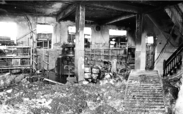
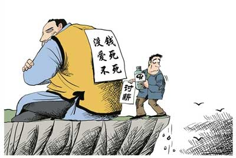

# 第六十期：都是欠薪惹的祸

### 14位花季少女火口丧生

2012年12月4日下午15时31分，汕头市潮南区陈店镇新溪乡政府一内衣厂(小作坊)发生大火，汕头消防支队出动13台消防车84名消防员到场进行援救，经全力扑救，下午4点大火被扑灭，事故共造成14人死亡，1人重伤。死者均为18到20岁的花季少女。6个多小时后，纵火者刘双云落网。**据其交代，老板在结算工资时经常少算给他，至今作坊老板陈某欠他3000块工资，在多次追讨未果后，刘某终走向万劫不复的地狱之旅，作坊的老板陈某目前在逃。**

这位刘姓员工的行为已经触犯了刑法，他将会受到法律的严惩，但是我们应该反思这事件出现的深层次原因。14名少女，本是青春风华之时，而仅仅因为“工资拖欠”问题，就凋谢在内衣厂。我们不仅仅要为这14名如花般的生命的消逝而感到惋惜，更重要的是思考什么原因导致了这除了员工变态的纵火心态，“工资拖欠”从来都是备受关注的问题。想想不该发生的事情，就这样发生了，这是一种多么可怕之事？

### 劳动报酬权的法律规定及其缺陷

我国《宪法》第四十二条规定：**中华人民共和国公民有劳动的权利和义务，也就是劳动权，即从事劳动并获得相应报酬的权利。**

我国《劳动法》第三条规定：**劳动者享有平等就业和选择职业的权利、取得劳动报酬的权利、休息休假的权利、获得劳动安全卫生保护的权利、接受职业技能培训的权利、享受社会保险和福利的权利、提请劳动争议处理的权利以及法律规定的其他劳动权利。**该条文明确规定了劳动者享有取得劳动报酬的权利，即劳动报酬权。

11年《刑法修正案（八）》获得通过，恶意欠薪入刑，并于5月1日正式实施，其中规定：“**以转移财产、逃匿等方法逃避支付劳动者的劳动报酬，或者有能力支付而不支付劳动者的劳动报酬，数额较大，经政府有关部门责令支付仍不支付的，处 3 年以下有期徒刑或者役，并处或者单处罚金；造成严重后果的，处3年以上 7 年以下有期徒刑，并处罚金。**”这可以说是从刑法的角度来保障劳动报酬权。

应该说劳动报酬权是我国法律规定的一项重要权利，而劳动报酬也是人们在工作中的最基本的物质追求，农民工背井离乡来到城市寻求新的就业机会，一般都是为了获得更高的劳动报酬，在农村务农获得的收入不及出来务工的收入强。**而根据我国法律，并没有过多的规定对农民工的劳动报酬权进行特殊保护，在农民工的劳动报酬权问题中我们一般都是根据现有的劳动法等法律法规进行保护。**但是在现实生活中，农民工处于我国的社会的底层，是典型的弱势群体，一般法律意识淡薄，维权能力较差，在进入城市后他们的合法权益很容易受到侵害，现有的法律并没有考虑到农民工问题的特殊性。那么现在法律保护劳动报酬权的缺陷是什么？

笔者认为主要有两点：

**一是在发生薪酬纠纷时，农民工很难进行举证。**有的企业在招聘时拒签劳动合同。他们作为用人单位，为逃避责任，钻法律空子而不愿签订合同。而在企业拒绝签订劳动合同的情况下，依据工作证、服务证等证件来认定劳动关系难度很大。并且很少有农民工曾经有过保留过这些证件，农民工提出解决劳动报酬等争议的请求时，往往因提供不出相应的证据而败诉。

**二是刑法恶意欠薪罪的规定，不利于对农民工权益的保护。**第一，此罪“数额较大”中的数额规定不确定，究竟拖欠工资多少算数额较大？如果这个问题不明确，刑法的规定就不可能有效实施。因为针对不同财产状况的人“数额较大”的含义不同，靠救济为生的人1000元可能就算数额较大，而经济状况较好的人上万元才算是“数额较大”。并且这里的“数额较大”是计算拖欠人数的总数，还是对于一个劳动者来说的，不明确。不利于农民工作为弱者本应得到特殊保护。

### 欠薪是罪魁祸首？

犯罪嫌疑人刘某是来自湖南的农民工，在案发当日的上午，其给陈姓老板发短信称：“钱你要还给我，否则，你逃过今天逃不过明天。”老板没有理睬他，结果下午惨剧就发生了。

在仍然较为传统的中国农村，人们在遇到纠纷时，一般都是先想到双方说理，讲究以理服人，不到万不得已一般不会去诉诸法律，而这些问题一般基于简单的伦理道德就可以解决。来自农村的农民工同样一般也乐意保留这种方式，在被欠薪时，农民工一般都会选择恰当的时机直接去找雇主说理，讨要劳动报酬。但在城市这种生人社会中简单的“欠债还钱”的道德伦理在欠薪者那不一定都会起作用，现实生活中存在很多被称为老赖的欠薪者，他们往往抓住制度的漏洞趋利避害，想尽一切办法拖欠农民工的工资。

在农民工找到雇主讨薪时，很多欠薪者或对农民工表现得态度傲慢，对其不理不睬，或者当面辱骂，甚至更有甚者亲自或找人拳脚相加。**作为强势方的欠薪者而言，他们一般认为农民工胆小怕事，素质低下，其利益诉求一般可以忽略。受到蔑视的农民工在通过其他途径无法或预期不能得到劳动报酬时，年轻力壮的他们往往会在绝望中选择同归于尽式的暴力讨薪方式。**他们会对雇主采用绑架、伤害、甚至杀人等方式或者对欠薪者财物进行损毁或威胁损毁的方式逼迫欠薪者尊重其报酬权，或者直接暴力抢夺欠薪者财物等等……这些原本合理的讨薪行为也时常瞬间变成危害社会的犯罪行为。这类犯罪是农民工在其生存、发展受到威胁、权益受到严重侵害的时候，为了维护自己合法权益而出现的违法行为，对于此，我们在谴责万恶的欠薪者的同时，更多的是对农民工兄弟给予同情。

农民工一般没有其他社会保障，工资基本是唯一收入，被拖欠工资，权利无疑是受到了严重侵害，面对相对强大的欠薪者和社会对其援助的缺位，他们时常感到讨薪无望，而这种强烈的财产被剥夺感，使得他们难免会采取暴力的行为。这种讨薪的方式代价可谓昂贵，甚至不惜犯罪。那么我们应该从哪些方面去解决这个问题呢？既能够保证农民工的劳动报酬权得以实现，又不存在以犯罪的方式来讨薪？

### 可行性对策

**（一）加大普法力度，提高农民工的法律素质**

农民工生长的广大的农村，而中国广大的农村是熟人社会，奉行的是中国的传统礼教，在熟人社会中，欠债是可以要回来的。但是农民工进入城市后，在这个陌生人组成的城市，他们的思维习惯已经不适应高度发展的城市经济，因此当其劳动报偿权实现受阻的时候，其所依据的是“欠债还钱，天经地义”的传统，而向欠薪者讨要劳动报酬遭拒的时候，其恼羞成怒而采取了过激的方法。这凸显出来的是农民工的法律意识比较淡薄，法律素质较低。

农民工在商品经济发达的城市中，在陌生人社会中的法律面前处于完全的弱势地位，他们没有足够的法律意识和知识来要求劳动合同的签订并完成权利被侵害后的调查取证等过程，他们对法律还心存畏惧。他们在法律面前的这种弱势地位很容易被雇主利用，而后者肆无忌惮地侵犯他们的合法权益。当农民工的合法权益被侵害后，对法律的无知和畏惧，也阻碍了他们去拿起法律的武器来维护自己的合法权益，最后他们总是会选择一些非常规的甚至是犯罪的手段来为自己讨回劳动报酬，维护自己的劳动报酬权。

因此，各地的劳动部门可以**定期免费组织农民工进行法律培训**，着重对《劳动合同法》、《劳动合同实施条例》和《工伤保险条例》、《工伤认定办法》等有关法律法规进行辅导和讲解，并可以结合现实的生动实例和发生在我们身边的经典案例，向广大农民工讲解如何保护自身合法权益，另外也可以针对用人单位进行培训以及告知用人单位如何依照国家法律法规制定规章制度，构建和谐劳动关系等知识，进一步维护用人单位和劳动者的合法权益。

另外，各地劳动部门工作人员可以深入厂区、工地、小作坊等工作区间向农民工等发放**劳动保障政策宣传资料**，并向他们讲解当地的最低工资标准，农民工签定劳动合同的规定，如何参加社会保险等知识，并且可以在劳动部门的大厅设立咨询台，现场解答前来的农民工兄弟的相关问题。

通过这样的形式可以提高农民工的法律素质，提升他们对法律的认识，强化他们的维权能力。

**（二）完善法律援助制度**

据有关调查显示，**农民工讨薪的法律维权成本至少是其收益的三倍**。这么高的维权成本显然会直接阻碍农民工通过法律途径维权。可以这么说，农民工劳动报酬权难以实现从而导致犯罪行为的出现，其中有一个原因是难以得到专业的法律援助。农民工劳动报酬权被侵害时，本身作为弱势群体的他们没有专业的法律知识来维护自己的权益，这就需要有专业的法律人士来帮助他们。但是，由于专业的法律工作人员收费比较高，而农民工在被拖欠工资的时候一般都很难有经济实力来邀请律师等法律专业人士，没有专业人士的帮助他们也很难通过法律途径来成功的维护自己的权利。在这个时候国家的法律援助应当在农民工的权益受到损害时提供应有的帮助。

我们必须完善我们的法律援助制度，在现有的法律援助制度外我们可以在城市设立专门的农民工法律援助中心，这种中心可以由司法部门、劳动部门和各个大学的法律援助中心来设立，以此为农民工提供专门的法律服务，简化受理程序，降低申请门槛，真正将农民工的法律维权落到实处。而这种专业法律服务的出现，也能更好地使农民工顺利的通过法律的途径来维护自己的权益，降低他们的维权成本，减少他们通过非常规的途径去来维护自己的合法权益。当然，农民工法律援助中心的运营资金应当由政府财政来支持，另外，在确定欠薪后，可以要求欠薪方支付一定律师费用，这一方面可以增加欠薪方的违法成本，另一方面，这种鼓励性的制度措施也可以促使农民工法律援助工作中的律师等和农民工一起去维护农民工的合法权益。

**（三）加强劳动执法力度**

**各级政府部门和劳动执法单位要高度重视劳动法律的贯彻实施和对农民工劳动报酬权的保障。保障农民工兄弟的劳动报酬权的实现是各级政府部门不容回避的责任。**首先，各级政府部门和劳动执法单位要从农民工劳动合同管理、工资拖欠等方面开展工作。对侵犯农民工欠薪案件，应当做到及时立案，及时查处，并迅速执行，依法保护农民工的劳动报酬权。

其次，在农民工问题上，劳动保障行政部门要依法履行监察职责，综合运用法律和行政手段，依法纠正和处理欠薪及欠薪后逃匿的行为，对欠薪资的用人单位，责令其限期发放农民工工资，并按规定支付经济补偿金和经济赔偿金。在处理农民工问题上要加大劳动保障监察机构的工作力度，严厉惩处雇佣者的违法行为。

最后，加强劳动保障监察执法工作，强化劳动保障监察职能；健全举报制度，认真做好群众举报案件的受理和查处工作；全面开展劳动保障年检，对严重违法的用人单位和直接责任人要依法严厉惩处，切实维护和保障农民工的合法权利。

### 结语

当一桩普通的欠薪纠纷最终酝酿成惊天大案，虽说这仅仅是个案，但背后的深层次的问题必须高度关注，为避免悲剧再次发生，我们的政府部门不能对欠薪事件再一无所知或是置若罔闻，我们必须将视线投向广大的农民工兄弟的工作和生活背景，保护他们的合法劳动报酬权得以实现。

 【深入阅读】 [汕头内衣厂大火14名少女遇难 纵火人已认罪(图)](http://edu.qq.com/a/20121205/000176.htm) [广东汕头大火解析：一个欠薪职工的愤怒和十四条命](http://heze.dzwww.com/xwjj/201212/t20121209_7774898.htm) 依法保护农民工的劳动报酬权 孙学朝 《实事求是》2007年第5期 我国农民工劳动报酬权法律保护问题研究 黄华庚 硕士论文 

七星说法NO.60（编辑：伍永兴；责编：马特、陈澜鑫） **P.S.加入“七星说法读者群”，我们一起说法！群号：262980026。**
