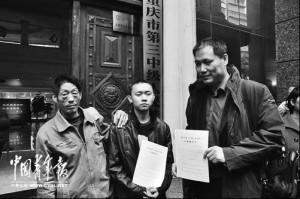
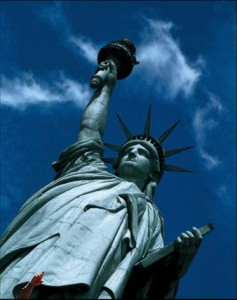

# ：“不自由，毋宁死”

** **

### 大学生村官“因言获罪”

用”飞来横祸“来形容任建宇的遭遇也许并不为过。这个年轻的大学生村官大概永远不会预料到自己有一天会因为“煽动颠覆国家政权”这样严重的指控被判劳动教养。

这又是一起很典型的因言获罪的案例。因为根据现有的资料，任建宇的全部罪证，除了那件“不自由毋宁死”的文化衫，就是网络上的“一百多条负面信息”。

因言获罪的情况在中国历史上并不少见，从北宋苏轼的乌台诗案到清末新闻界的“苏报案”，说白了就是各种形式的“文字狱”。

即便是在过去，缺乏现代法治观念的人们仅凭借最基本的是非判断，也大多会将因言获罪的案子归为“冤案”。站在今天的法治角度来看，任建宇的获罪就更是荒唐，但是它确实发生了，而且无疑给当事人带来了巨大的精神折磨。任建宇在接受采访时说：进去之后，（出来）不适应这个环境，害怕、恐慌，然后就不在心，和人说话的时候眼睛就闪躲、慌乱。

当人们众口一词的指责劳教制度的时候，有没有想过：**任建宇的案子其实不止暴露出劳动教养制度这样的“法外之法”的巨大危害性，更警示我们言论自由尽管顶着基本权利的“光环”，实际上却是多么脆弱和不堪一击。**

 

### 言论自由，没那么简单

**《中华人民共和国宪法》第三十五条 中华人民共和国公民有言论、出版、集会、结社、游行、示威的自由。**

这个言简意赅的法条曾经被无数人引用过无数遍，因为**它是我国现行法律体系中唯一明确规定了公民言论自由的条文，也是维护言论自由的唯一依据。**然而无论在何时何地，自由的实现从来没那么简单。说起言论自由，大家都知道这是根本大法里规定的基本权利，但是往往很少有人看得清在现实生活中实现它的重重困境。

作为一国法律制度之母法,宪法自然要在保障言论自由这一公民基本权利上发挥他的作用，但要真正保障言论自由，但仅仅有宪法“罩着”是不够的。

**为什么会不够呢？**

因为在我国宪法是不能直接适用的，这里就有必要先引入“宪法诉讼”的概念了。**所谓“宪法诉讼”，是指针对违反宪法的行为提起的诉讼。它为维护宪法的尊严而进行的诉讼。当公民认为宪法赋予其的基本权利受到[国家机构](http://baike.soso.com/v398119.htm?ch=ch.bk.innerlink)及其[公职人员](http://baike.soso.com/v2955234.htm?ch=ch.bk.innerlink)侵害时，该公民可以向法院提起诉讼以求得最终救济，法院依据宪法受理案件并作出判决或裁定。**

**问题是，中国目前并没有宪法诉讼。**所以我们在生活中只能见到刑事诉讼，民事诉讼，行政诉讼等，而从来没有那个律师说自己要去打“宪法官司”。而宪法诉讼实际上是使宪法走下高高在上的神坛，在司法实践中发挥更具体的作用。还有一个相关概念叫做**“宪法司法化”，**也就是将宪法作为法院裁判案件的直接的法律依据，说的是同样的意思。

**因此，我国宪法诉讼制度的不健全成了影响公民实现言论自由的一个重大不利因素。**

关于这一点，有兴趣的读者可以去参考前些年发生的**齐玉苓案**及其后续，就可以理解宪法司法化在中国是需要怎样的一个艰苦的过程才能得到实现。

可能又有人要问了，既然宪法不能直接适用，那宪法保证的公民基本权利怎么实现呢？在目前中国，宪法规定的公民基本权利，是通过在宪法框架下制定相应的部门法来保障的。比如公民的受教育权，我们是通过《中华人民共和国教育法》、《中华人民共和国义务教育法》、《中华人民共和国高等教育法》等法律来保障的，而在言论自由权方面，**对不起，我们没有相关的部门法来保障，倒是有一套虽散见于各法律法规规章，却行之有效的新闻管制制度，以及“煽动分裂国家罪”这样以言论定罪的刑法罪名。**所以，宪法保护我们的言论自由，很好，然后，我们抱着宪法条文反复看两遍就当完事儿了吧，认真，你就输了。

那反观大洋彼岸，号称言论最自由的美国，他们又是如何保障言论自由的呢？

众所周知，美国的宪法由正文和27条修正案组成，正文主要规定了国家的政治、经济等基本制度，后添加10条修正案规定美国公民的基本权利的，因此也被成为“权利法案”，再其后又被扩充为27条，依靠着英美法系判例法的独特传统和美国最高法院独有的宪法审查权，这短短的“权利法案”支撑着美国走过了200多年的历史。在著名的“焚烧国旗案”中，我们可以看到这种模式的威力，最高法院以5:4维持了德克萨斯州刑事上诉法院的判决，认为焚烧国旗的行为属于公民的一种“象征性言论”，受美国第一修正案保护，而相应的德州关于保护国旗的法律违宪而无效，并以此形成了一个判例，从此，美国公民不会因为焚烧美国国旗而获罪，因为，这是他们行使言论自由的一种方式。所以，综上我们可以看到，在美国，“宪法修正案的直接适用+最高法院宪法审查权所带来的解释+判例的约束力”，可以使得短短的一条保护言论自由的宪法条文幻化出无数种可能，保护日新月异的言论表达方式，从而使保护言论自由的信条得到忠实的信守。

**而在中国，我们所拥有的仅仅就是一部不能直接适用的《中华人民共和国宪法》，其他的？或许还在路上。**

两种模式差异的后果？看看下面的案例对比，或许我们都会有所感触。

这是在美国历史上发生过的一个挺有意思的关于言论自由的案例。

**1791年，美国宪法第一修正案规定：“国会不得制定关于下列事项的法律：确立国教或禁止信教自由；剥夺言论自由或出版自由；或剥夺人民和平集会和向政府请愿伸冤的权利。”**

1987年，美国3K党群体想要通过电视演讲来宣传自己的种族理论。3K党的领袖马昂宣称要成立一个纯白人的国家，并且公然表示：在他理想中的这个白人国家里，只有和政府一致的言论才是被允许的。

按说马昂的言论显然是违背了大众对言论自由的基本理解。但是根据言论自由的原则，无论你说什么，只要没有付诸实际行动，你都可以畅所欲言。于是就出现了这样一个难题：让他说吧，就意味着要让一个可能极具煽动力的演讲者在电视上大肆宣扬言论“非自由”；不让他说吧，你又等于直接地限制了他作为公民的言论自由。

对于这个问题，作为3K党辩护律师的斯蒂芬•潘弗的经典回答是：**如果你因为害怕一个不自由的时代，因此就不给他们言论自由的话，那么，这个不自由的时代已经开始了。是你自己给它开了头。**这位律师还说过：**言论自由就是言论自由，对于流行的观点和非流行的观点都是一样的。我们不可能一边宣称这是一个言论自由的国家，一边又将言论划分成可接受的和不可接受两种。**

这个案子在堪萨斯市引起了悍然大波，从而引发出了美国历史上规模很大的一次关于言论自由的争论，最后该市市议会的表决结果通过了该电视演讲节目的继续播出。

反观任建宇案，警察竟然对任建宇的女友王娟说了这么一句话：**“你男朋友脑子是不是有问题，否则好好的一人怎么想到自由，想到去死呢？！”**

虽然发生在不同的时代，但是对比显得更加鲜明：在美国，保护言论自由已经成为深入人心的观念，甚至普通老百姓也觉得这是毋庸置疑的。因此，即便在两难之中，他们往往也能做出符合宪法立法本意的选择。而在今天的中国，身为司法人员，对言论自由的认识和理解却浅薄得可怜，几乎让人哭笑不得。

 

### 个案的意义与启示

**也许是因为人的思想和行为的复杂性，个人的言论自由有时会与社会整体的安全，稳定，和谐之间形成冲突，在这样的状况下，我们就更需要对现实的理性认知以及对维护言论自由的坚定，尤其是后者。显然，在任建宇的案子中，我们的司法机关既缺乏理性的认识活动，又没有坚定维护公民言论自由的信念，这才造成了任建宇的悲剧。**

还记得2003年孙志刚案件的影响力让实施了二十多年的《城市流浪乞讨人员收容遣送办法》在数月内被废止，并促使《城市生活无着的流浪乞讨人员救助管理办法》诞生，我们有理由相信任建宇案对劳教制度的改革也会产生极大的推动力，**但是我们不禁要问：任建宇案能在推动言论自由的方向上起到多大的作用呢？**毕竟劳教制度直接针对的是人身自由，而如果对言论自由的保护仍然原地踏步，即使废除或者改革了劳教，也还会有其他的制度对言论自由的行使产生威胁。

《环球时报》总编辑胡锡进在微博上说：“希望任建宇案在互联网时代产生判例的长远影响，终结“因言获罪”的政治和文化传统。不涉及侵权和无任何实际行动的政治性言论和言论传播应获得绝对不被治罪的权利，换句话说，如果“删贴”还不得不维持一段的话，那么各种“因帖治罪”应彻底结束了。这应是通往更高言论自由的一个关键性台阶。”

任建宇自己也在微博中说，希望自己的案例会成为一个判例，用着15个月换来所有人的安康。

判例，在中国这样的成文法传统国家，自然是不可能成为法律渊源而对后来的类似案件带来什么帮助的，但是，**正如孙志刚案一样，任建宇案能否成为我们改革乃至废除劳教制度，反思乃至建立保障言论自由制度的一个开端呢？**

**所以笔者认为，在我国，对于像自由，平等这样的“天赋人权”的保护，说到底，只有两条路可走，要么完善具体的立法，要么确立宪法诉讼制度。总之，不能让宪法在保护言论自由的斗争中“赤手空拳地孤军作战”，要么给它同伴，要么给它武器。**

目前，任建宇的案件其实还没有画上句号。11月20日，在重庆市第三中级人民法院以超过诉讼时效为由驳回了他对重庆市劳教委的起诉之后，任建宇表示自己还会继续上诉。

那么，就让我们用一段采访来结束本次是说法吧。

——11月25日，央视《面对面》

**记者：**那你知道你之后要面对的上诉之路是什么样的吗？有想过吗？

**任建宇：**我会一直坚持的，不管结果如何，从最高人民法院一路上诉，如果最终结果还是一个处理不当，我最后一定会坚持的。

**记者：**你坚信你一定可以得到？

**任建宇：**坚信我可以得到。

我们也坚信，坚信我们一直所信守的，祝任建宇好运，祝中国的言论自由好运。

 

### **【深入阅读】**

任建宇案：宁要众声喧哗 不要万马齐喑 [http://news.ifeng.com/opinion/gundong/detail_2012_10/13/18222241_0.shtml](http://news.ifeng.com/opinion/gundong/detail_2012_10/13/18222241_0.shtml) 南方周末：重庆“不正常”青年 [http://www.cnhan.com/content/2012-10/18/content_1714132.htm ](http://www.cnhan.com/content/2012-10/18/content_1714132.htm)任建宇案，重建话语的尊严 [http://www.zhxf.cn/info/1012/110844.htm ](http://www.zhxf.cn/info/1012/110844.htm)任建宇案：让正直的人免于恐惧 [http://news.ifeng.com/opinion/special/renjianyu/](http://news.ifeng.com/opinion/special/renjianyu/)  

### **【推荐书目】**

《历史深处的忧虑》 林达 《言论的边界——美国宪法第一修正案》 安东尼•刘易斯  

### P.S.

致亲爱的七星说法读者们： 

“七星说法读者群”业已上线，群号：262980026。在这里，你可以去和你喜欢的编辑搭讪，可以咨询法律问题，可以认识许多学法律的孩纸，可以问问怎么考华政的研究生或者司法考试的复习方法，可以探讨法律高深的理论或者有意思的故事，可以和一群有意思的人一起组织法律项目研究，最重要的是，可以深入了解一个有着专业知识但又很有趣的团队——七星说法团队。毕竟，结识朋友，永远是我们来北斗最欣喜的一件事儿。

 

（编辑：于轶婷；责编：林骥、陈澜鑫）

 
