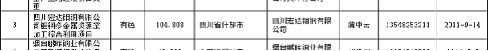
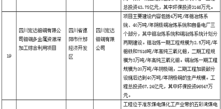
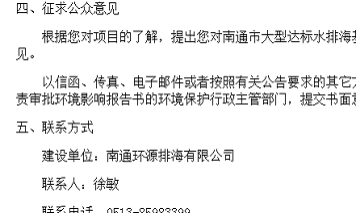
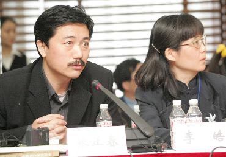

# ：“你们没有告诉我！”“不，你已经同意了。”

### 

### **无言的追问**

2012年，7月初的什邡、7月底的启东、10月的镇海，一波未平，一波又起，环境群体事件在汹涌的浪潮中被推入我们的视野，海内外媒体铺天盖地的报道、论坛上热烈的讨论、微博上的激愤呼喊以及一篇又一篇的北斗文（详见北斗网“什邡专题”[/?cat=5132](/?cat=5132) “宁波PX专题”[/?cat=5560](/?cat=5560) ）。然而除去这一切，有一些东西早已静静地存在于互联网上，它们大多温顺地诞生在开着空调、放着茶杯的办公室里，它们在繁杂的字句中欲言又止，它们像是一个个不说话的谜语，当你回头细细端详它们，会发现一直暧昧蜷缩的它们，似乎一直在预示着、在追问着什么。

 

2011年9月19日，一份题为《2011年9月5日—9月16日环境保护部受理环境影响报告书情况》的文件悄然发布在国家环保部网站上。（[http://hps.mep.gov.cn/jsxm/xmsl/201109/t20110919_217430.htm](http://hps.mep.gov.cn/jsxm/xmsl/201109/t20110919_217430.htm)）其中的序号3中，能够看到一个西南小城的名字——什邡，我们还能从中找到什邡事件钼铜项目的负责人以及联系方式。

2012年2月28日，什邡的名字再一次出现在环保部网站发布的文件上，这一次是标题为《关于2012年2月28日拟作出的建设项目环境影响评价文件批复决定的公示》的文件([http://hps.mep.gov.cn/jsxm/npzxmgs/201202/t20120228_223978.htm](http://hps.mep.gov.cn/jsxm/npzxmgs/201202/t20120228_223978.htm)），在22个获批项目中，“四川宏达钼铜有限公司钼铜多金属资源深加工综合利用项目”名列其中。

若你有心打开江苏省南通市政府网站，检索“达标水排海”，能够找到69条结果。从2007年4月的“正在积极论证建设大型达标水排海基础设施工程的可行性”（[http://fgw.nantong.gov.cn/art/2007/4/19/art_10334_239565.html](http://fgw.nantong.gov.cn/art/2007/4/19/art_10334_239565.html)）到同年9月的《市政府组织召开排海管道工程环境影响评价公众参与座谈会》（[http://fgw.nantong.gov.cn/art/2007/9/5/art_10320_243389.html](http://fgw.nantong.gov.cn/art/2007/9/5/art_10320_243389.html)），乃至08年1月的最为重要的《南通市大型达标水排海基础设施工程项目环境影响公众参与调查公示》（[http://hbj.nantong.gov.cn/art/2008/1/10/art_9883_405149.html](http://hbj.nantong.gov.cn/art/2008/1/10/art_9883_405149.html)），以及08年5月的“第二次评审会 ”、08年10月的“环评报告书核准听证会”、09年4月的“海域使用论证报告书专家评审会”......林林总总，不可谓不细致。不光如此，在《南通市大型达标水排海基础设施工程项目环境影响公众参与调查公示》中，已经较为详细地提供了施工期和营运期的环境影响，也同样提供了详细的联系方式以“征求公众意见”。

而在宁波市环保局网站，你还无法找到关于“镇海炼化一体化项目”的正式环评文件，这是因为：这一次，建设项目环评还没来得及展开，项目还处于规划阶段。（南方周末：宁波镇海回应炼化一体化项目：下一步将进行环评[http://www.infzm.com/content/82434](http://www.infzm.com/content/82434) ）

一份份文件、公告悄然出现在长久无人问津的政府网站上，虽然这些网站的建设近年来已经取得了很大的进步。然而在什邡、在启东、在镇海，许多人对于那些将要在自己的家乡起建的大型项目仍然一无所知，他们感到被隐瞒，于是怒火变得更加不可控制。从什邡到启东，后者至少在网站的信息公开上做得比前者更好，却仍然没能改变引发群体事件的后果；再到镇江，无言的谜语更加无言，它们已经被扼杀在政府办公室的电脑硬盘里，还没来得及龟缩在这个事件的角落，这更加印证了它们存在的无力和荒谬。

**它们为何一再地在打字声中被制造出来，又一次次被扔进角落，无人问津？它们，到底为什么而存在？**

### “合法审批”

什邡事件发生后，项目负责公司四川宏达股份有限公司发出公告，称：“钼铜项目环境评价严格按照国家现行相关法规及最新标准编制和评审，**已经通过国家级技术评估和行政审批**。”

启东事件中的“大型达标水排海基础设施工程”实际也已经过多年论证，**拥有“全套审批许可手续”**。

在这些审批许可中，被反复强调的，就是**环评**。

环评，即环境影响评价。这是一个年轻的制度，从它首次得到国家法律确认（1969，美国《国家环境政策法》）算起，连五十年的时间都没有，但现在，世界大多数国家和有关国际组织已经通过立法或国际条约采纳和实施了环境影响评价制度。2002年10月28日，《中华人民共和国环境影响评价法》通过，2003年9月1日起开始施行，自此我国在法律上确认了环评制度。

简单的说，环境影响评价制度要求规划以及建设项目必须对其实施时和实施后可能造成的环境影响进行分析、预测和评估，提出相应的预防或者减少不良环境的对策和措施，并形成跟踪监测的制度，以环境影响评价书、评价表或是登记表的形式交由环保行政主管部门进行审查、审批。根据《环境影响评价法》第十六条的规定，**建设项目环境影响评价书、报告表、登记表是由项目建设单位组织编制的，建设单位可以委托具有资质的环评机构进行编制。环保行政主管部门的审批则是工程重要的行政许可。**

环评不仅仅是一项客观的科学评价，在提出“对策和措施”和过程中，同样也是社会性的协商、协调，是科学理性和社会理性的合一体现。**在环评制度中，“公众参与”、“利益相关方”介入一直被认为是基本原则。**公众参与对于环境影响评价具有重大的意义，或者说环境影响评价本就是公众参与公共事务的方式之一。通过环境影响评价的公共参与机制的完善作用，能够保障环评的民主性和公开性，也有助于提高决策的科学性。

我国《环境影响评价法》第五条规定：**“国家鼓励有关单位、专家和公众以适当方式参与环境影响评价。”**这一规定，是我国环境立法中首次使用“公众”一词，它明确了公众在环境保护中的法律地位。

在建设项目领域,《环境影响评价法》对于公众参与的法律规定只有第二十一条：“除国家规定需要保密的情形外，**对环境可能造成重大影响、应当编制环境影响报告书的建设项目**，建设单位应当在报批建设项目环境影响报告书前，举行论证会、听证会，**或者采取其他形式**，征求有关单位、专家和公众的意见。 建设单位报批的环境影响报告书应当附具对有关单位、专家和公众的意见采纳或者不采纳的说明。”

可以发现，在《环境影响评价法》中，对于公众参与的规定十分粗疏（规划环评有与第二十一条的建设项目公众参与条款相对应的第十一条，加上第五条的原则性规定共三条），不仅将范围限定在“对环境可能造成重大影响、应当编制环境影响报告书的建设项目”，而且就公众参与的形式也并未做出强制性规定，建设单位可以不采用论证会、听证会的形式，而寻求“其他形式”。甚至在“法律责任”部分，根本没有规定未依法进行公众参与程序的法律责任。

2006年，为弥补公众参与在《环境影响评价法》中的缺失，环保部又发布了《环境影响评价公众参与暂行办法》。可是在第十条有关环评信息公告方式的规定中，我们还是可以见到**“其他便利公众知情的信息公告方式”**这样的兜底条款，对于信息发布的方式仍然没有明确的强制规定，给建设单位留下了巨大的选择空间。

更为遗憾的是**在“公众参与的组织形式”部分中，到底是采用调查问卷、座谈会和论证会或是听证会的形式完全由建设单位或其委托的环评机构决定**。不难想象，在实践中发放调查问卷就成了首选。调查问卷这一形式限于其内容和对象的有限性，往往连使公众知情都达不到，很容易沦为“走过场”。2007年北京六里屯一垃圾焚烧发电场项目中，就采取了调查问卷的作法，发出了100份调查问卷，收回来85份，超过百分之七十以上的人同意，于是乎这“公众参与”就这么完成了。（北京六里屯垃圾焚烧场：专家质疑环评报告[http://news.sohu.com/20070415/n249450042.shtml](http://news.sohu.com/20070415/n249450042.shtml) ）

**在本就由建设单位主导的环评中，无论是信息的公开方式的选择权还是公众参与的组织形式的选择权，仍然由建设单位牢牢把持着。在建设单位的巨大利益趋势之下、在环评机构缺乏公正性的现实之下，环评进行阶段的公众参与依然脆弱得不堪一击。**

公众参与的最后一根稻草就这么压到了环保行政主管部门身上，等到建设单位提交环评报告书，由行政主管部门受理后，行政主管部门根据《暂行办法》第十三条还可以以各种形式再次公开征求群众意见。然而很可惜，无论是在什邡还是在启东，政府对于环评公众参与热情似乎并不高。即使是咨询意见也主要是针对专家学者，而非受影响最大的普通民众。

当然，他们必须履行《暂行办法》第十三条所规定的职责“在其政府网站或者采用其他便利宫中知悉的方式，公告环境影响报告书受理的有关信息”，“公告的期限不得少于10日”。

**而这，正是那一份份公告、文件的秘密，它们悄然地诞生在办公室的打字声中，它们与建设单位寥寥的调查问卷相得益彰。行政主管部门与建设单位两方各自走出了“恰到好处”的一步，合法的公众参与制度就完成得如此轻而易举！**

### 谁来告诉我！

然而项目迟早会动工，项目的开工典礼有时还显得颇为隆重，公众不会永远无知，有意无意的隐瞒只会引起更强烈的怒火。在办公室中传来断断续续的打字声时，总有人为了公众参与，为了公众参与所必须的公众知情权而奔走呼告。

09年南通启东排海工程施工招标并且破土动工时，启东本地论坛“启吾东疆”已经引起了种种不满和反对。“这么重大的项目为什么我都不知道！”生养当地人的土地将迎来改变其命运的大项目，当地人却对此一无所知，这不能不说是一种羞辱。在线下，当地网民已经开始了积极的行动，他们在自家代步工具上贴抵制标签，向渔民宣讲这个项目的负面影响。他们还努力地寻找到这个项目的涉嫌违法违规之处，提起行政诉讼，无奈被驳回。与此同时，一些人大、政协代表也开始发挥作用，提交提案，但均石沉大海。他们奋力争取到听证会的举行，所面临的却是政府部门的避重就轻。最终，一份《告全市人民书》开始在网络流传，数千份传单在当地分发，迎来了启东环境群体事件的爆发。（以上详见《潇湘晨报》2012年8月3日所载《启东“排海工程”七年博弈》一文[http://epaper.xxcb.cn/xxcba/html/2012-08/03/content_2643653.htm](http://epaper.xxcb.cn/xxcba/html/2012-08/03/content_2643653.htm) ）

当公众的知情权不能从环评中的公众参与制度得到保障，而更多的只能通过民间自发的信息传递时，公众参与制度的价值就已经完全落空了。

**“这么重要的项目，你们没有告诉我！”**

**而法律却允许主管部门手指其网站上的一份份文件、公告，回应说：**

**“不，你已经同意了。”**

此时，面对民间的各种声音，主管部门的避重就轻、遮遮掩掩，使他们完全丧失了重回公众参与的可能。最终，拥有合法审批的项目反而在没有法律依据的情况下被匆忙叫停，既侵蚀了环评的公信力，也引发了外商对华投资环境的担忧；既让人民激愤地上街，又让官员丢了乌纱帽，让人不得不一声叹息。在事件发生后，无论是什邡还是启东，当地政府急着找来专家论证，试图说明重大项目在科学上并不那么可怕，**然而，他们无法逃避的是科学理性与社会理性的分野，理应构建起后者的具体制度早在悄无声息间就被虚化、架空了。**

### 强制听证与“稳评”

值得高兴的是，改变似乎正在在一点点地发生着。

在什邡事件和启东事件发生之后，2012年8月15日，环保部发出《环境保护部关于发布<建设项目环境影响报告书简本编制要求>的公告》（[http://www.zhb.gov.cn/gkml/hbb/bgg/201208/t20120823_235124.htm](http://www.zhb.gov.cn/gkml/hbb/bgg/201208/t20120823_235124.htm) ）。公告要求自2012年9月1日起，建设单位在报送环评报告书时应当提交报告书简本，各级环保部门在其网站上公示项目受理情况，并且同时公布报告书简本，附上审批部门联系人及联系方式。公告还提供了详细的简本内容要求。

**现在，当你进入各级环保行政主管部门网站，你应该能够发现网站上所列出的各项目环评报告书简本，它们已经成为这些网站的主要部分。**与之前《环境影响评价公众参与暂行办法》第九条中所规定的向公众公告“查阅环境影响报告书简本的方式和期限”的规定相比，不得不说是一种进步。

但这当然还不够，早在08年1月，我们就能看到江苏启东事件争议项目的一些具体情况了，它们也基本符合环评报告书简本的要求。也许是痛定思痛，江苏省环保厅似乎越来越认识到公众参与的重要性，2012年10月29日，他们下发了《关于切实加强建设项目环境保护公众参与的意见》，在第一项中就提出了“充分认识环保公众参与工作的重要性”。（[http://www.jshb.gov.cn:8080/pub/root14/xxgkcs/201210/t20121030_217406.html](http://www.jshb.gov.cn:8080/pub/root14/xxgkcs/201210/t20121030_217406.html) ）在信息公示环节，该《意见》规定“建设单位在开展环境影响评价的过程中，应通过网站、报纸等公共媒体和相关基层组织信息公告栏等便于公众知情的方式，向公众公告项目的环境影响信息。对重大环境敏感项目，应在地方主流媒体公示相关信息”；在公众参与的组织形式方面，该《意见》规定“对化工集中区（园区）、重金属专业片区以及铅蓄电池、生活垃圾焚烧发电、生活垃圾填埋、危废焚烧、危废填埋等社会关注的热点项目、环境敏感的化工及污水处理厂项目，建设单位或者其委托的环评机构在环境影响评价阶段**必须通过听证方式公开征求公众意见**”以及“**听证会必须邀请持不同观点和意见的代表参加**”。

在江苏省环保厅的这份《意见》中，通过在信息公示环节利用起地方媒体以及在公众参与的环节中引入的强制听证，所展现出的制度架构较之《环境影响评价公共参与暂行办法》要有力得多。11月29日的《南方周末》刊登了其对江苏省环保厅环评处处长的采访（[http://www.infzm.com/content/83317](http://www.infzm.com/content/83317) ），这位潘处长称：**“意见的出台既有2006年以来贯彻环保部文件的整体思考，又有一些项目实施过程中积累的经验，也不能排除近期发生的一些事件的影响。”**

除去媒体合作、强制听证，江苏省环保厅的这份《意见》还有一个值得注意的地方，就是所谓“社会稳定风险评估”。《意见》规定：“重大敏感项目，应由所在地环保部门报请同级人民政府按照《江苏省社会稳定风险评估办法（试行）》进行社会稳定风险评估。对社会稳定风险等级评估结果属于较高风险的敏感项目，依照规定暂停受理和审批其环境影响报告书”。根据这样的规定，重大项目的审批又多了一道闸门，分担了环评的重任。毕竟，环境群体事件的发生往往是多维度的，民众的诉求也不仅仅限于环境保护。

### 结语

几乎每一部法律法规都在第一条中运用了这样的句式：“为了．．．．．．制定本法（条例/办法）。”这些法律目的条款明确了法所追求的目标，法所期望达成的目的，然而那些后面的条文所规定的制度、程序是否真能有力地捍卫法律的价值、追求法律的目的呢？这是一个法理念的问题，也是是一个法技术的问题。**我们或许可以期待2012年的环境群体事件能够推动环境影响评价制度中公众参与的进一步完善，期待江苏省刚刚开始实行的“强制环评”、“稳评”能够有所作为，甚至最终能够被写入法律。**

我们还可以期望民众的知情权逐步得到保障；期待在多元化多渠道的具体制度之下，公众得以参与公共事务决策的机会越来越多。诚然，环评不应也不能作为公众参与的唯一途径，但进一步完善环评制度的公共参与，至少能让我们扎扎实实地朝向民主社会，又迈出了那么一步。

### 【深入阅读】

1.《中华人民共和国环境影响评价法》(全文），[http://zfs.mep.gov.cn/fl/200210/t20021028_84000.htm](http://zfs.mep.gov.cn/fl/200210/t20021028_84000.htm) ； 2.《环境影响评价公众参与暂行办法》（全文），[http://www.gov.cn/jrzg/2006-02/22/content_207093_2.htm](http://www.gov.cn/jrzg/2006-02/22/content_207093_2.htm) 3.《环评听证，要强制，更要审核》，载于2012年11月29日《南方周末》，[http://www.infzm.com/content/83317](http://www.infzm.com/content/83317) ； 4.《“开窗”，求解环境群体性事件》，载于2012年11月29日《南方周末》，[http://www.infzm.com/content/83316](http://www.infzm.com/content/83316) 5.《论公众参与与环境影响评价法律制度的完善》，陈仪，载《苏州大学学报（哲学社会科学版）》08年3月第2期。 

七星说法NO.56（编辑：陈澜鑫；责编：石味诗、陈澜鑫）

### P.S.

致亲爱的七星说法读者们： 

“七星说法读者群”业已上线，群号：262980026。在这里，你可以去和你喜欢的编辑搭讪，可以咨询法律问题，可以认识许多学法律的孩纸，可以问问怎么考华政的研究生或者司法考试的复习方法，可以探讨法律高深的理论或者有意思的故事，可以和一群有意思的人一起组织法律项目研究，最重要的是，可以深入了解一个有着专业知识但又很有趣的团队——七星说法团队。毕竟，结识朋友，永远是我们来北斗最欣喜的一件事儿。
