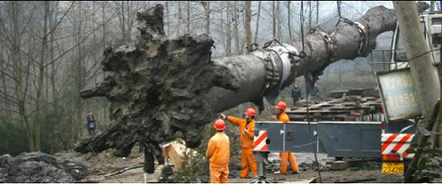
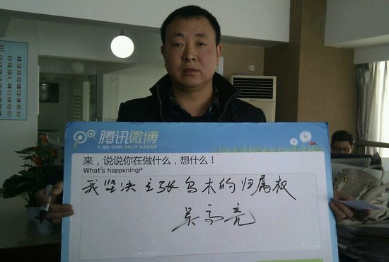
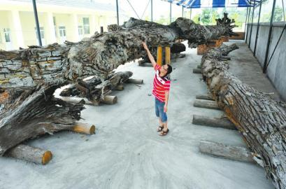

# ：与民争利？

### 天价乌木案的由来

2012年春节,四川彭州农民吴高亮在河边散步,无意之中发现了阴沉木（乌木）,该阴沉木的主体位于吴高亮和他姐姐的承包地里面，两人于是雇用挖掘机开挖。但当地政府领导认为地下埋藏物属国家所有,2012年7月3日,由四川省彭州市国有资产办公室对外宣布,奖励发现者7万元人民币。经过中国林业科学研究院木材工业研究所鉴定,该农民发现的这批阴沉木是“金丝楠木”,在市场上非常抢手,有人愿意出资1200万元购买。于是吴高亮向法院起诉,状告当地镇政府滥用职权,行政违法,同时提起民事诉讼,要求政府归还自己发现的乌木。由于三个月的诉前调解未果。11月27日，这场持续了近10个月之久的“天价乌木案”终于开庭，在当天的庭审过程中，当事双方主要围绕是谁发现了乌木、发掘乌木的地点和通济镇政府是否存在违法行政行为三大焦点问题进行了举证，之后，法院选择休庭，择日再开庭。

### 天价乌木的归属：发现者所有VS国家所有

对于这天价乌木的归属，双方各执一词。

**吴高亮认为在自家承包地发现乌木，并且作为乌木的发现者,乌木理所当然的应当归属自己。他最先所依据的是民法的先占原则**，即是指以所有的意思，先于他人占有无主的动产，而取得其所有权的法律事实。并且吴高亮认为，根据《物权法》第四十九条规定：“法律规定属于国家所有的野生动植物资源，属国家所有。”换句话说，法律没有规定的国家动植物资源，就不属于国家所有。就像捡垃圾箱的塑料瓶子一样，应该先占着先取得所有权。

而**后来其所主张的是乌木不属于文物、矿产、化石，不属于法律规定的归国家所有的野生植物资源，也不属于埋藏物、隐藏物、漂流物、遗失物，也不属于无主财产，他们是承包地里的天然孳息**，根据《物权法》的规定，天然孳息，由土地承包经营权人取得，因此，乌木应该归属于他们。

而镇政府及彭州国资办认为乌木应当归国家。其所依据依据的是民法通则第七十九条：“所有人不明的埋藏物、隐藏物，归国家所有。”并且政府并不认同是乌木是在吴高亮家的承包地所发现。而是在河道里面发现的。而**宪法第九条规定，矿藏、水流、森林、山岭、草原、荒地、滩涂等自然资源，都属于国家所有，法律规定属于集体所有的森林、山岭、草原、荒地、滩涂除外**。存在于河道里的乌木，因为河道是属于国家所有，因此就属于国家。

### 学界观点

### 认为归发现者所有

**“一项财产如果要当然归属于国家所有应该有明确的法律规定。物权法第四十五条规定:法律规定属于国家所有的财产,属于国家所有即全民所有。物权法采用列举的方式规定了哪些财产归国家所有,如矿藏、水流、海域、城市的土地等。**”中国政法大学民商经济法学院教授尹志强认为,乌木不在列举之列,因此不能认为其当然属于国家的财产。

我国民法通则第七十九条规定了所有人不明的地下埋藏物和隐藏物归国家所有。尹志强分析,乌木不属于埋藏物或隐藏物,因为“埋藏”或“隐藏”是人有意识地将一定的物品埋藏起来,是人为的行为,但乌木显然不能解释成有人故意将其埋藏或隐藏于此。因此不能视为埋藏物,更不能将其视为隐藏物。如果国家主张这是埋藏物或隐藏物,那么就应该举证证明是有人埋藏或隐藏的,而这显然无法证明。

尹志强认为,对于乌木这一类财产应视为如同蘑菇、杂草等,属于无主物,而对于无主物的归属应适用法律的一般原则,即先占原则,谁先占就应该归谁。虽然我国在法律上没有明确规定有所谓先占原则,但法律规定了禁止通过先占原则来取得所有权的财产,比如说珍贵的野生动植物。除这些法律明确规定归国家所有、不能通过先占取得所有权的财产以及无主埋藏物或隐藏物外,其余的财产从严格意义来说是可以通过先占原则来取得所有权的。乌木虽然价值很高,但并不在法律限定财产之列。因此,谁先发现就归谁最具有合理性。总之,就法律而言,无论从哪个角度分析,该乌木都不宜当然收归国有。

另外对于吴高亮主张乌木是其自家承包地的天然孳息。尹志强认为：“孳息是由原物生产而来,如存款利息,母畜所生幼畜、土地所长庄稼等。依照法律规定,原物属于谁,孳息物就归谁。乌木如果作为孳息物,其原物是什么以及归属于谁是不清楚的。并且乌木也不适合理解为土地的孳息物。”中央财经大学副教授尹飞也表示“这肯定不是孳息”。天然孳息是指因物的自然属性而获得的收益，与原物分离前，是原物的一部分，如果树结的果实、母畜生的幼畜。而乌木在地下沉睡千年，“认定为这块承包地上的天然孳息说不过去”。

### 认为归国家所有

全国人大环境与资源保护委员会法案室主任翟勇认为，乌木来自自然，形成于自然，它属于自然资源。我国宪法和法律规定，自然资源的开采要经过授权以后才能进行。“由于政府的长期不作为导致公民挖掘乌木成为默许行为。实际上，无论是谁发现、在哪里发现，如果没有经过授权，任何人和部门都无权开发自然资源，自然资源不论在哪里发现，都不承认归个人所有。”针对乌木挖掘的地点是否是关键，翟勇认为，**宪法只承认国家所有和集体所有，除明令点出之外的归集体所有的自然资源外，其他都依法归国家所有。对于个人非法获取的国家所有的乌木资源，应当予以没收。**”

著名民法学家、物权法核心起草人梁慧星教授称，**政府引用民法通则第七十九条，吴高亮引用先占原则，都是不恰当的**。

他解释，埋藏物、隐藏物的前提必须是人为埋藏、隐藏，但物权法第一百一十六条规定：“天然孳息，由所有权人取得；既有所有权人又有用益物权人的，由用益物权人取得。”“孳”是繁殖的意思。该乌木既不属于化石、矿产，也不属于文物。另外，村民在河道中发现乌木，河道属于国家所有，乌木就应由河道所有权人国家取得。同时“先占制度”未写进物权法，且“先占”的前提必须是“无主物”。而该事件中，“乌木有主”。

### 不归个人所有:但应给予奖励

我国民法通则第七十九条规定,所有人不明的地下埋藏物和隐藏物归国家所有。接收单位应当对上缴的单位或个人给予表扬或物质奖励。物权法也明确规定,对于发现的埋藏物或者隐藏物,应当返还权利人,而不能为发现者所有。中国政法大学法律硕士学院院长、博士生导师费安玲教授认为,作为迄今均为有效的法律规范,无论是1986年的民法通则还是2007年的物权法,在近30年中一直都是秉持着埋藏物或隐藏物所有权不是归发现人所有的处理原则。但对发现者应该给予足够的奖励。

中国人民大学副校长、博士生导师王利明教授认为,**乌木的归属应主要看其被发现的土地是归谁所有,如果在集体土地上发现的,既不属于国家专有的矿产资源,又不属于所有人不明的埋藏物、隐藏物,则应属于土地的所有人即村集体所有。但对发现人应当给予特别的奖励。**

而政府部门只对吴高亮奖励7万元，其中，彭州市奖励五万元，镇政府奖励2万元，这7万元相对于价值上千万元的乌木来说，只是皮毛，因此，吴高亮一直诉状将镇政府告上了法庭。可以接受调解，但是政府需要给予他400万的奖励。

**对于天价乌木案，笔者认为，要确认其归属，就要从两个方面来：一是乌木的属性该如何确定？二是在于埋藏物的规则如何适用？**

文物具有三价值，一是文化价值，二是艺术价值，三是历史价值，文物一般具有三种价值之一，能够反映当时的文化繁荣或者艺术工艺水平或者能反映当时的历史情形。而乌木没有这三种价值之一，所以不是文物。

再者，乌木也不属于矿产资源，从一般意义上来说矿产资源具备的特性和价值，比如工业用途，乌木并不具备，乌木一般用来加工为艺术品以供欣赏。

另外，乌木是金丝楠木埋藏在地下碳化而成的，不属于化石，文物保护法第2条规定，具有科学价值的古脊椎动物化石和古人类化石同文物一样受国家保护。依照这个规定，这一范围并不包括植物化石，更不包括还不是化石的乌木。

**乌木既不属于文物，也不属于矿产，也不属于古生物化石，它是因为自然因素所形成的，乌木的所有人不明，即所有权不明的物，如果有一点价值的话，从民法来看，可视为无主物。综上所述，乌木应当认定为埋藏物。依据我国民法通则第七十九条规定,所有人不明的地下埋藏物和隐藏物归国家所有，因此，乌木应当归属国家。**

或许这有点牵强附会，毕竟在法律上并没有明确具体的规定，也没有相关的司法解释，但是却是出现了这样的问题，因为法律具有滞后性，社会一直在发展，法律也就并不能解决任何的社会问题，总会留下一些死角。这就需要我们根据法理对法律进行限制解释或者扩大解释，在司法实践中应该灵活运用处理案件，法律才能真正产生准确而有效的约束力。

那么要是以后再出现这样的情况，希望国家能够出台更加合理的奖励原则,而不是现在一个很笼统的一句给予奖励的话。对于那些发现贵重物品的居民实施巨额奖励,以此来实现权利的社会公平配置。然而,相对于天文数字的金丝楠木价格而言,政府的奖励多少才算合理呢?

### 政府奖励:应确立一定的比例标准

我国民法通则虽然规定对于发现者应给予表扬或奖励,但对奖励标准没有明确的规定。给予物质奖励这个概念很模糊,法律虽赋予发现者有获得奖励的请求权,但只是笼统地规定了给予物质奖励,而没有设定奖励的比例,这就会出现奖励给予的多少是由所有人说了算的现象。而且不管给多少,奖励的行为都已经完成,那么,民法通则赋予发现者的获取奖励请求权也因此而消灭,这对发现人而言是不公平的。

我国的民法通则或者物权法应当在赋予发现者获取奖励的请求权外,还应当确定一个比较适宜的奖励标准或者比例,比如所发现物价值的10%或者10%至20%。所有者应该按比例给予奖励,从而达到相对的公平。

或许这对于中国传统的拾金不昧的道德标准产生一定的影响，但是反过来想想，给予发现者或者拾得者奖励，恰恰在一定程度上会反过来促进道德的发展，促使他们把遗失物或者发现物归还给原所有者。

 【深入阅读】 1.《[天价乌木归属“悬而未决”， 法律空白致观点各异](http://www.sc.xinhuanet.com/content/2012-07/12/c_112422594.htm)》 2.《[专家详解“天价乌木案”三大庭审焦点](http://epaper.legaldaily.com.cn/fzrb/content/20121206/Articel08001GN.htm)》 3.《[天价乌木案触及物权法立法原则](http://npc.people.com.cn/n/2012/0711/c14576-18490821.html)》 4.《[四川彭州“天价乌木”案开庭](http://npc.people.com.cn/n/2012/1128/c14576-19718556.html)》 

七星说法NO.57（编辑：伍永兴；责编：马特、陈澜鑫）

 P.S. 致亲爱的七星说法读者们： 

“七星说法读者群”业已上线，群号：262980026。在这里，你可以去和你喜欢的编辑搭讪，可以咨询法律问题，可以认识许多学法律的孩纸，可以问问怎么考华政的研究生或者司法考试的复习方法，可以探讨法律高深的理论或者有意思的故事，可以和一群有意思的人一起组织法律项目研究，最重要的是，可以深入了解一个有着专业知识但又很有趣的团队——七星说法团队。毕竟，结识朋友，永远是我们来北斗最欣喜的一件事儿。

 
