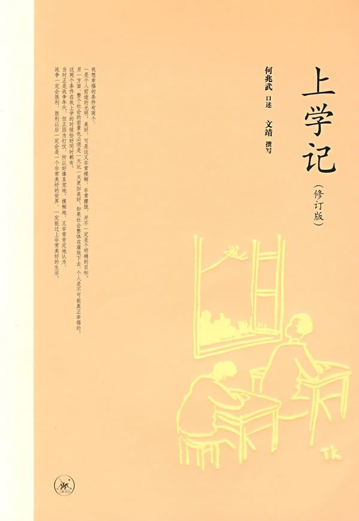
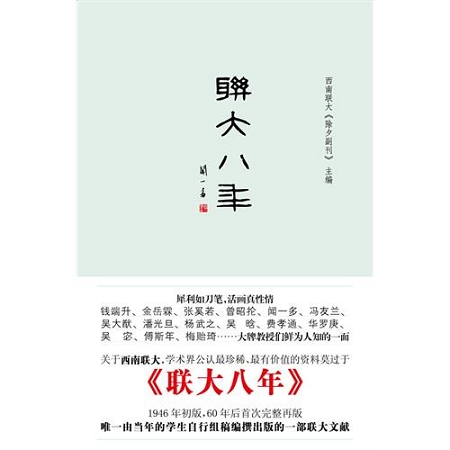
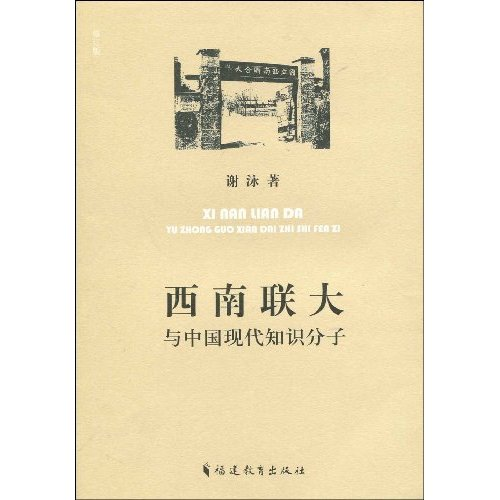
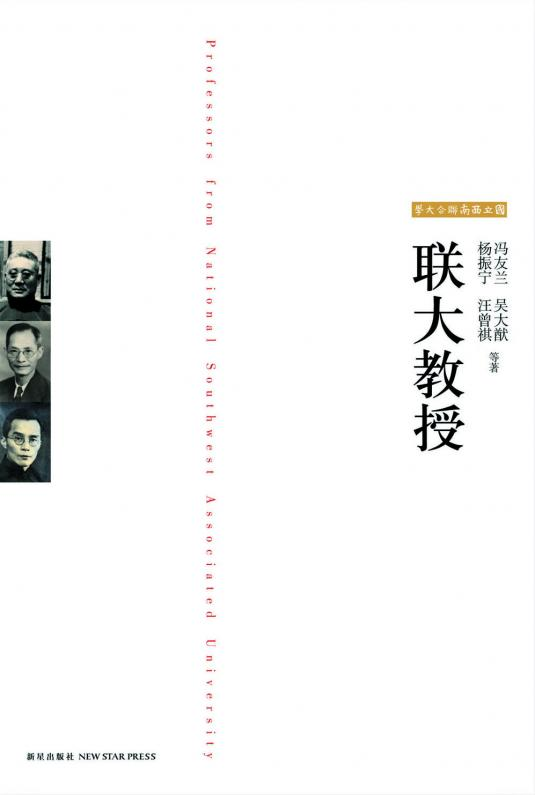
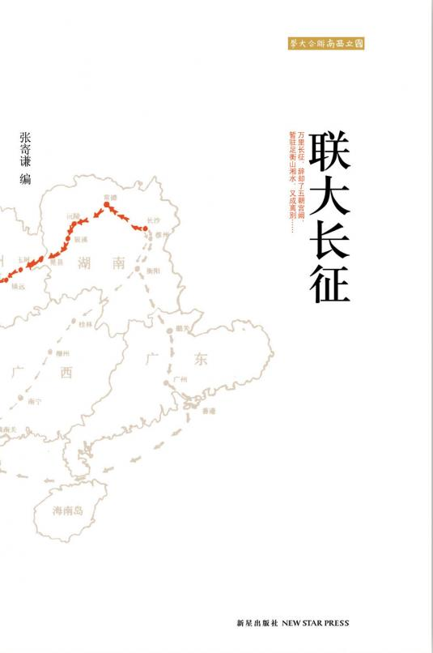

# ——本期主题：西南联大（附相关讲座通知）

# <北斗电子书推荐>

## 本期主题：西南联大（附相关讲座通知）

1937年8月，北京大学、清华大学、南开大学在长沙组成国立长沙临时大学；次年西迁，4月更名为国立西南联合大学，简称“西南联大”。西南联大总共存在8年零11个月，在校生约8000人，毕业生约3800人。狼奔豕突的年代，战时的学者来了走，走了来，很少有在联大待满八年的，但建国后各领域的专家、院士近百分之八十有联大背景，其中甚至有诺贝尔奖得主。

时至今日，西南联大已然成为中国学人的精神图腾，更有人称之为“中国最好的大学”。西南联大的魅力，最主要的就是继承了“兼容并包之精神，转移社会一时之风气”的特点。

而西南联大那对于中国大学的精神领军意义、不畏强权的自由、充满个性的教授、以及那段动荡光辉的历史，还有着许多故事要向21世纪的大学生们诉说。。。  
（感谢黄霄同学提供本次好书推荐）

### 推荐书籍（点击书目可下载）：

**1、 [《上学记》](http://ishare.iask.sina.com.cn/f/11904919.html)**

**2、 [《联大八年》](http://ishare.iask.sina.com.cn/f/11729705.html)**

**3、 [《西南联大与中国现代知识分子》](http://ishare.iask.sina.com.cn/f/11729708.html)**

**4、《联大教授》**

**5、《联大长征》**

** **

  
**[《上学记》](http://ishare.iask.sina.com.cn/f/11904919.html)**

** **

****

2006年，西南联大校友、清华大学教授何兆武先生的《上学记》一纸风行。他用了很多篇幅谈到西南联大的生活，其中的关键词只有两个字———“自由”。“无论干什么都凭自己的兴趣，看什么、听什么、怎么想，都没有人干涉，更没有思想教育”，这位先后就读于土木、历史、中文、外文四系的“见异思迁”的学生这样回忆。

** **

**[《联大八年》](http://ishare.iask.sina.com.cn/f/11729705.html)**

** **

****

本书由西南联大《除夕副刊》主编，初版于一九四六年七月，是唯一由联大学生自行组稿编撰的联大文献，闻一多亲笔题署。本书文字朴实，内容丰富，主要由“历史回顾”、“联大生活”、“联大教授”三部分组成。

**[《西南联大与中国现代知识分子》](http://ishare.iask.sina.com.cn/f/11729708.html)**

** **

这本写于九十年代初期的学术著作，在十几年后关于西南联大的研究蔚然成风的今天，或许许多史料、掌故已成老生常谈，在福建教育出版社2009版的《再版后记》中，谢泳也并不讳言其中史料的平淡，但是，其学术价值以及著者谨严的治学精神时至今日仍无法让人忽视。本书在09年度在北京《新京报•书评周刊》学术排行榜获第三排名。

** **

**《联大教授》**

** **

本书皆为联大师生之作，或描摹同事之神气，或状写师长之风采，旨在显出联大上下艰苦卓绝之精神。

** **

**《联大长征》**

** **

一九三八年二月十九日，北大、清华、南开三校组成的长沙临时大学，为长久抗战、保存文化计，西迁云南。其中，二百余名师生不畏艰难，徒步穿越湘黔滇三省，途经三千五百里，历时六十八日，终于抵达昆明，堪称我国教育史上一次可歌可泣的“文化长征”。本书就是这次步行旅程的实录，对途中气候山川、人物风情，均有细致描绘，文笔清新生动，内容丰赡有趣，具有较强的可读性和较高的史料价值。

### 【醒目】

在本期主题推出之际，我们得到了与之相关的讲座通知，欢迎各位有兴趣的读者莅临。

时间：11月19日（周五）19:30至21:00

内容：谢泳教授将在单向街书店开办主题为“西南联大与自由主义思潮”的沙龙，现场与我们一起重温联大岁月。

活动链接：[http://www.douban.com/event/12935822/](http://www.douban.com/event/12935822/)可通过豆瓣报名参加

### 【附录】

关于西南联大的友情豆列

[http://book.douban.com/doulist/667785/](http://book.douban.com/doulist/667785/)

豆友“读书@严杰夫”所写的友情书评

[http://www.douban.com/note/84855928/](http://www.douban.com/note/84855928/)
