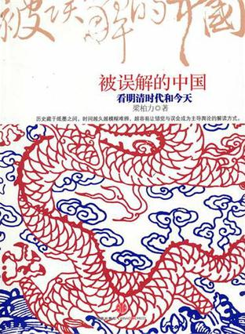
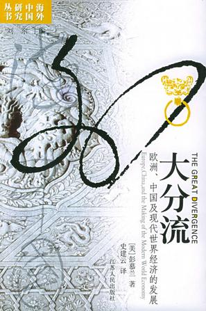
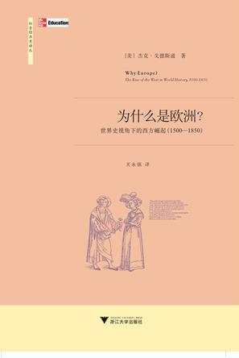
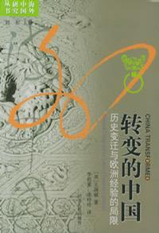
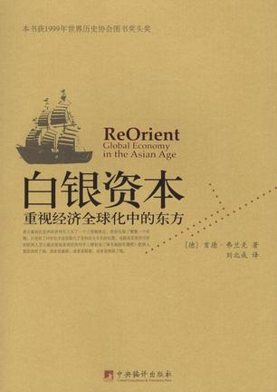

# ——本期主题：欧洲崛起专题——加州学派

# <北斗荐书栏目>

** **

## 本期主题：欧洲崛起专题——加州学派

**为何西方崛起，中国衰落？听听加州学派的意见吧：**

18-19世纪，欧洲通过工业革命一举崛起，超越此前一直是“世界中心”的中国。“**为什么是欧洲？**”一直是一个热门的研究课题。从韦伯对新教资本主义精神的讨论和李约瑟难题的提出到现在的新史学，学者们已经从多个角度来探究。现代新史学给了我们很多新鲜的视角和观点，其中以加州学派最为突出。龙登高将“加州学派”的整体风格和学术诉求归纳为四个方面：(1)从研究范式的高度反思西方中心主义的学术理论和方法；(2)强调世界经济体系和全球化不是欧洲最初建立和推动的；(3)注重中国研究，并将中国置于世界历史的范围之中，探究中国与外部世界的联系，以凸显中国历史的重要性，进而由此检验基于西方历史的观点与理论；(4)注重比较研究，比较视野从以往的文化差异角度转向中西经济发展道路并检讨传统学术。

**本期荐书人：**

黄霄，人称二贵，本科毕业自山东大学社会学系，科班遁门弟子，豆瓣标记“想读”的书拢共1600多本，目前在书店打小工。阅读方向为政治学、社会学及各种交叉学科，当前的兴趣为社会运动及明清史。

### 推荐书籍（点击书目可下载）：

**1****、 [《被误解的中国》](http://ishare.iask.sina.com.cn/f/11894628.html)**

**2****、[ 《大分流》](http://ishare.iask.sina.com.cn/f/11874314.html)**

**3****、 《为什么是欧洲？》**

**4****、 [《](http://ishare.iask.sina.com.cn/f/11892142.html)**[**转变的中国****》**](http://ishare.iask.sina.com.cn/f/11892142.html)

**5****、 [《](http://ishare.iask.sina.com.cn/f/11874534.html)**[**白银资本****》**](http://ishare.iask.sina.com.cn/f/11874534.html)

** **

**[《被误解的中国》](http://ishare.iask.sina.com.cn/f/11894628.html)**

近三十年新一代史学家对明清经济和社会的研究出现了很多新发展，提出了不少崭新的见解，从比较的视角反驳了许多关于中国明清时代的传统观点，诸如闭关锁国、重农抑商、抑制市场、轻视科技、缺乏产权保障及法治精神等。本书号称是新一代史学家近二三十年研究硕果的综合。

** **

**[《大分流》](http://ishare.iask.sina.com.cn/f/11874314.html)**

美国加利福尼亚大学尔湾分校历史与东亚语言文学教授彭慕兰（Kenneth Pomeranz）的代表作。获2000年美国历史学会东亚研究最高奖——费正清奖和世界历史学会年度奖。彭慕兰的核心观点是：18世纪以前，东西方处在基本同样的发展水平上，西方并没有任何明显的和独有的内生优势；18世纪末19世纪初，历史来到了一个岔路口，东西方之间开始逐渐背离，分道扬镳，此后距离越来越大。造成这种背离（即西方走向了现代化而中国却没有）的主要原因，一是美洲新大陆的开发，二是英国煤矿优越的地理位置。彭慕兰把这个东西方分道扬镳的过程称之为“大分流”。

** **

**《为什么是欧洲？》**

戈德斯通尝试从几个剖面来切入到这个复杂系统中去：宗教与社会变迁、贸易与征服、生活、科技、教育、政府及法律等一系列制度，然后再一一指出它们可能既非必要、也非充分条件。戈德斯通认为，真正改变欧洲乃至全世界的是农业、交通运输、制造业、金融、机械加工业、教育和市场营销等各个基础领域中“长期不断扩大而且相互关联的革新”。变革趋势不是从某一个具体的时期开始的，而是从来没有中断过。“当我们说是革新的模式造就了西方的崛起时，我们所说的不是一些离散的发明，而是在很多领域都在发生的一波又一波的联系变化，而它们彼此之间又相互促进，每项变化都在放大着其他变化所造成的影响”。正如经济史学家阿博特•厄什所说的，工业革命的特点就是“连续涌现的新奇事物”。

** **

[**《****转变的中国****》**](http://ishare.iask.sina.com.cn/f/11892142.html)

** **

本书中文版分为三编，上编《经济变化》，中编《国家形成》，下编《集体行动》（每编各有三章），分别对本书的三大主题进行讨论。作者之所以选择这三个主题，乃是因为资本主义的兴起和民族国家的形成，不仅是近代欧洲历史最重要的两大过程，而且由于西方国家的全球性扩张，使得这两个过程在某种程度上也成为世界性的了。此外，在１９６０年代兴起的欧洲社会史研究中，民众反抗研究处于中心的地位。以集体行动为契机，分析民众在社会转型时期所起的作用，也是非常必要的。

** **

[**《****白银资本****》**](http://ishare.iask.sina.com.cn/f/11874534.html)

** **

《白银资本》标志着与沃勒斯坦为代表的世界体系论相异的新的世界体系论的初步确立。弗兰克在《白银资本》中论证：1400—1800年间已存在一个具有全球分工和国际协作功能的世界经济体系，而亚洲、尤其是中国，是这个经济体的中心。他还非常突出地运用了长周期理论、康德拉杰夫周期理论等周期理论，以扩张的A阶段和收缩的B阶段轮流交替来说明西方的后来居上。同时弗兰克认为是世界经济体系的结构和运转导致了这种周期的出现。弗兰克在很大程度上运用这种周期理论做出了东亚将取代西方再次成为世界经济中心的预言，东亚（或许还会扩展到南亚和西亚）在21世纪可能会进入一个新的“A”阶段。

### 【附录】

### 

相关豆列：加州学派  
[http://book.douban.com/doulist/751239/?start=0](http://book.douban.com/doulist/751239/?start=0)

中国经济史论坛

[http://economy.guoxue.com/index.php](http://economy.guoxue.com/index.php)
