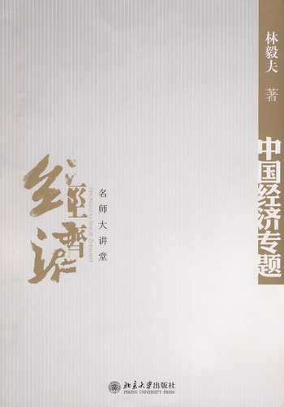
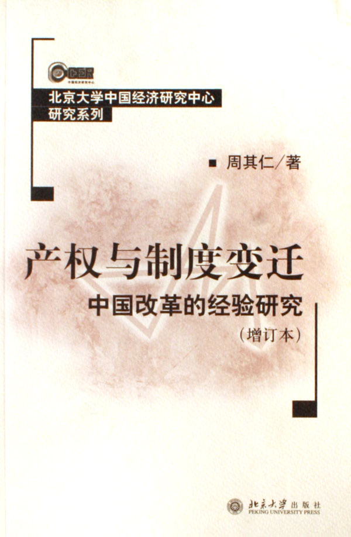
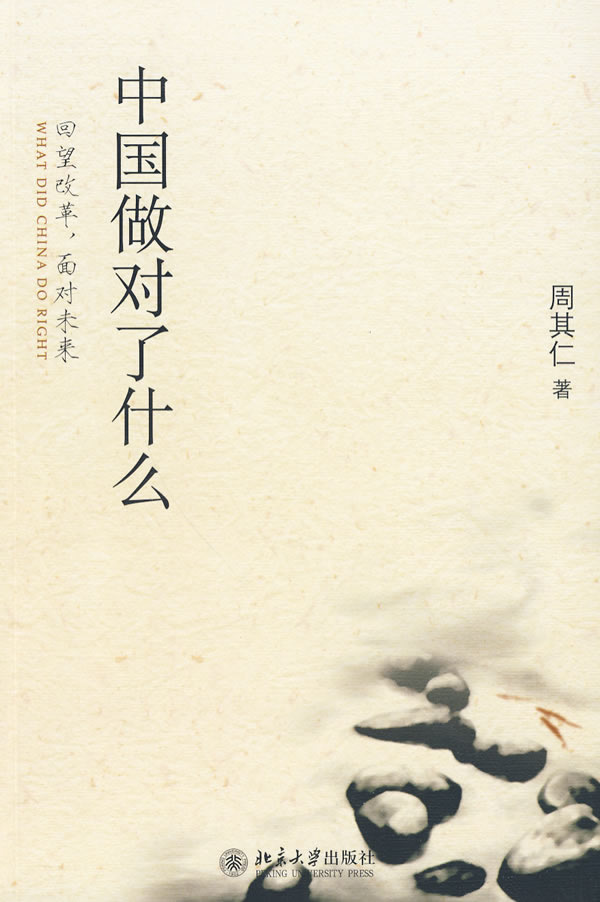
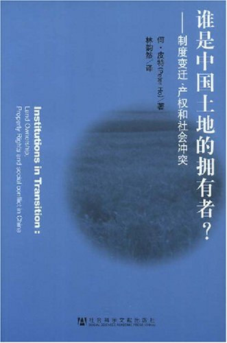
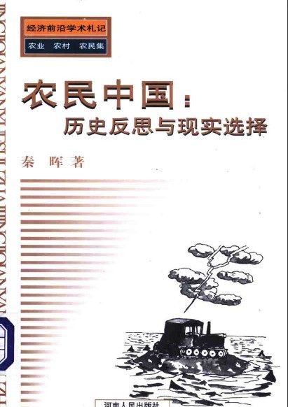

# 本期主题：农村地权问题（上）

# <北斗荐书栏目>

** **

## 本期主题：农村地权问题（上）

** ** ** ** **农村地权问题**一直是一个理论热点，原因有二，一是在自由主义者看来，地权问题是后集权主义中国产权问题的最后一个堡垒（周其仁的观点）；二是根据黄宗智的总结，论争双方都认为小规模农业潜力十分有限，在相当长的时期内，中国农村劳动力继续过剩，大部分农业从业人员只可能仍旧贫穷。中国农业的低收入唯有在更高度城镇化之后，减轻人口压力，建立规模农业，才有可能解决。本期主要推荐主张土地私有化派的几本书。本派的基本观点是，要求土地私有化，依赖市场机制进行资源配置，让小部分能干农民实现规模经营，领先致富，期待进一步城镇化之后，**走向西方先进国家的资本主义农业发展模式**。 **本期荐书人：**黄霄，人称二贵，本科毕业自山东大学社会学系，科班遁门弟子，豆瓣标记“想读”的书拢共1600多本，目前在书店打小工。阅读方向为政治学、社会学及各种交叉学科，当前的兴趣为社会运动及明清史。 

### 推荐书籍（点击书目可下载）：

## 

**1、****《中国经济专题》**

**2、****[《产权与制度变迁》]( http://ishare.iask.sina.com.cn/f/12192525.html)**

**3、****《中国做对了什么》**

**4、****《谁是中国土地的拥有者？》**

** ****5****、 [《]( http://ishare.iask.sina.com.cn/f/12192526.html)**[**农民中国：历史反思与现实选择》**** **]( http://ishare.iask.sina.com.cn/f/12192526.html)

** **

** **

**《中国经济专题》**

** **

****

** **

“中国经济专题”是林毅夫教授在北大面向本科生开设的一门课程，本书是其小结。本书在关于农村问题的章节中提到，三农问题根本在于农民收入有限，而非农民人口过多的问题。例如在三农问题最严重的1998-2003年，农业增长速度为4.3%，而同期人口增长速度为1%，远超过农业增长应比比人口增长快1%的标准。从50年代到90年代，中国政府主要采用过改变基础设施，提供灌溉，发展科技与教育，提高人力资本，产业结构调整等方法，而农业仍维持着“增产不增收”的状况。林认为主要问题在于农产品收入弹性低，价格弹性低，“谷贱伤农”。因此，“针对农产品的特性，唯一能够长期保证农民收入得到改善的途径是减少农民数量”，使得留乡农民可以扩大生产规模，能够充分发挥比较优势的全国统一的大市场也可建立。我们可以推断出林对于地权问题的基本观点同样是支持进一步明晰和扩大农民对土地的权利，使其可以自由买卖、流转，以实现规模经营。鉴于林毅夫在中国经济学界的地位，可以初步认为这种观点是主流经济学界和智库对于中国政府在地权问题上的主要建议。 ** ** ****[《产权与制度变迁》]( http://ishare.iask.sina.com.cn/f/12192525.html)**** ** **

****

** ** 周其仁是鼓吹农民扩大地权最主要的经济学家之一。本书有关农民地权的两篇文章，“中国农村改革：国家和土地所有权关系的变化”认为社会主义产权改革比“诺斯难题”还要困难的地方，是“在国家职能曾被过度滥用的约束条件下如何重建产权秩序”。周发现在名义上一切归公的人民公社体制下，私人产权从来没有完全消失，并通过“部分退出权”加重了国家控制的集体土地制的制度成本，从而迫使国家在体制选择政策方面“调整和退却”——从基层和地方开始——直到在全国范围重新承认私人的土地使用权以及通过承包所得形成的农民私产。“农民、市场与制度创新”着眼点是财产权利，认定农民私人土地使用权的重建将要求整个国民经济的计划体制——产权制度和工商业组织——要有根本的变革。另外，该报告指出“所有制的革新变化得不到相应的法律肯定(如农村承包经济牵动几亿人的根本利害，但至今仍无一个完备的法律)，倒退性变化也就难以制裁”(见本书第66页)。这比Hernando de Soto——他和他的秘鲁同事们非常强调产权具有正式的法律表达对资本形成的意义——最早提到这一点的著作还早了几年。 ** ** **《中国做对了什么》** ** **

****

** ** 周其仁的新书。新制度经济学派，发轫于科斯、经张五常光大、到周其仁传承，有一个核心的理念就是：明晰产权，其余的交给市场。周其仁的新书《中国做对了什么》对此进行了一个总结性的回顾。周在本书提出了现代化进程中的土地问题两大要点：1、土地总是属于农民的，不论是过去的个体农民，后来的合作化农民，还是集体化农民，或者在30年前开始的土地承包制农民，土地总是属于世世代代居住、生活、劳作于其上的农民的。这一点是历史决定的。2、仅靠农民用农业的办法利用农地，或者仅在生产率不同的农民之间交换土地权益，不能实现土地的最高收益。这是因为，工业化、城市化带来的积聚和集中，大大提升了土地的价值，这部分增加的土地价值，与农民的农业活动以外的工商业和城市经济相关联。周在关于农民土地产权的篇章中着重讨论了“土地交易所”模式，依旧着眼于从土地制度作为突破口，走城乡统筹之路。既回望了改革之初的家庭联产承包责任制改革，也指出了中国未来的道路在于城市化。 ** ** **《谁是中国土地的拥有者？》** ** **

****

** ** 作者在本书提到，在改革的过程当中，中国政府时常有意避免建立或定义某种制度——即“**有意的制度模糊**”。当农村的土地权属登记出现问题，或是政府拒绝澄清有关集体所有权在法规中的混乱状况时，这种“有意的制度模糊”就显得尤为突出。中国政府之所以如此，是因为它是保证农田（耕地）家庭联产承包责任制的主要机制之一：换句话说，它能够确保承包制在社会行为者中具有可信度。联产承包制在中国经济改革中成为最抢眼的成功之一，但由于联产承包制的基础并不稳固，因而很难进一步推行土地承包合同的商品化。而这将严重阻碍农村经济的发展。种种迹象表明，决定性的时刻已经到来，如果国家进一步延迟土地管理体制方面的制度改革，将会产生严重的后果。从草原、森林和荒地的相关章节里可以看出，所有制结构不明的直接后果是土地经营管理不善。 ** ** **[《]( http://ishare.iask.sina.com.cn/f/12192526.html)[**农民中国：历史反思与现实选择》**** **]( http://ishare.iask.sina.com.cn/f/12192526.html) ** ** **

****

** ** 秦晖是荐书者的偶像，一个百科全书式的、读书兴趣广泛的狂热读书者。他对于农民地权问题写了不少文章，阐发了大量有分量的观点。由于深度拖延症，荐书者尚未读完秦晖老师有关农村地权问题的文章，因此不敢妄论，只随便列了与本话题相关的一本书。本书有关地权问题的章节驳斥了有关土地制度问题的两个误区，一是认为土地买卖会导致兼并，激化社会矛盾，甚至导致农民战争；二是说土地私有制下通过市场机制可以实现有效率的土地合理配置（他认为这是不考虑非经济因素的“市场-私有化万能论”谬误）。秦认为，地权明晰既不是导致灾难的万恶之源，也不是拯救农业的万应灵药。当前思考土地政策的出发点应当是农民权利的保障。
