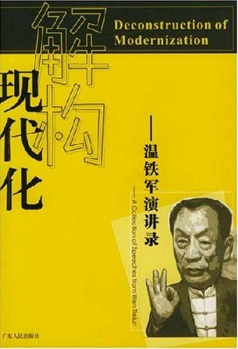
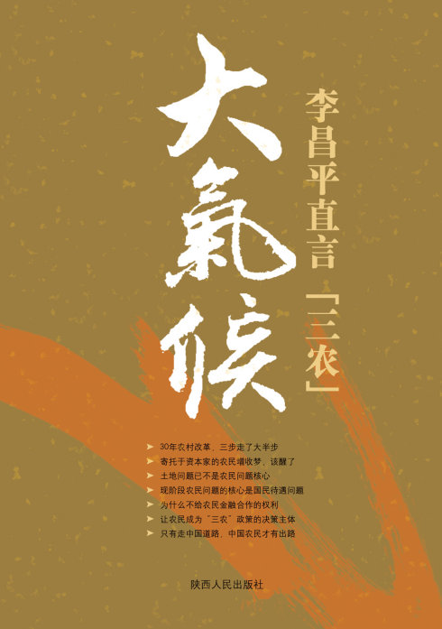
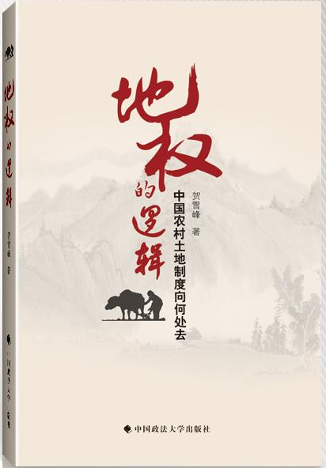
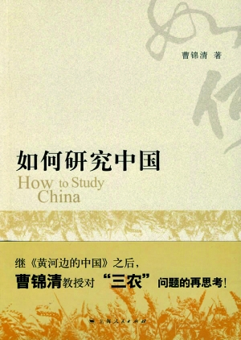

# 本期主题：农村地权问题（下）

# <北斗荐书栏目>

## 本期主题：农村地权问题（下）

继上周的上集后，本期将主要介绍主张均分土地使用权派的几本书。本派的基本观点是，认为土地承包的基本制度应该坚持，赋予农村人民基本生活保障，今后的农业发展则应以小规模家庭农场为主，借以稳定农村，防止大批农民失地流离以及两极分化，避免更尖锐的社会矛盾。 **本期荐书人：**黄霄，人称二贵，本科毕业自山东大学社会学系，科班遁门弟子，豆瓣标记“想读”的书拢共1600多本，目前在书店打小工。阅读方向为政治学、社会学及各种交叉学科，当前的兴趣为社会运动及明清史。 

### 推荐书籍（点击书目可下载）：

** **

**1、[ 《解构现代化——温铁军演讲录》](http://ishare.iask.sina.com.cn/f/12302481.html)**

**2、 [《大气候：李昌平直言三农》](http://ishare.iask.sina.com.cn/f/12302869.html)**

**3、 《地权的逻辑》**

**4、 《如何研究中国》**

**5、 《中国的隐性农业革命》**

### 

### 

### 

[**《解构现代化——温铁军演讲录》**](http://ishare.iask.sina.com.cn/f/12302481.html)

 本书认为土地制度的不同安排，取决于各地交易成本的高低（形成制度改变的不同条件，土地资源的稀缺程度，农村非农就业水平的高低等）。土地是农民的保障，而且越来越是农民的保障。“假如你们不能把土地上所承载的对农民的保障功能剥离掉，那么这个土地就永远得按人分配。”而“无论是谁，都解决不了8亿农民的社会保障。”温还举例说，印尼出现经济危机的时候，企业倒闭，回乡农民中有27%没有土地，成为基层动乱的最主要力量。菲律宾不断爆发武装斗争，因为50%以上的土地在大地主所有者中。温还提到，家庭承包这一土地制度强调的是三方面：明确集体所有权，稳定家庭承包使用权，通过搞活经营权来促进土地流转。解决或缓解三农问题，很重要的是靠农村工业化，靠县以下的乡镇工业化来进行，盘活土地资产，把土地资产增值收益变成建设资金或者地方工业化的启动资金。 ** ** [**《大气候：李昌平直言三农》**](http://ishare.iask.sina.com.cn/f/12302869.html)

 “向总理说实话”的李昌平，为三农问题再发言。本书认为我国从没有真正实行过完全的土地私有制，（即使在五十年代前后的土改给农民的只是土地的农用权，即“耕者有其田”，且不得抛荒撂荒，）也非完全的集体所有制，（除了1978-1988年村社集体在农地农用权及其收益权之外，农地的非农用权利亦可“集体所有，社企经营”。这个时期在农民看来是最好的土地制度。）而是在准国家所有制下的“混合所有制”。政府容易征用村民集体的土地，不是因为产权不清晰，而是因为政府不愿依法行政，习惯侵犯农民私有产权，且司法腐败，农民合法民主权利得不到落实。现行征地制度之所以大行其道，正是因为虚置土地农民集体所有制的结果，欺骗、分化了农民。而坚持土地集体所有和集体经营的7000多个村子，包括南街村、华西村和大寨村，土地就很难被征用，集体福利也很好。实际上，农民集体的土地所有权是明确的，边界是清晰的，但国家不发证；土地承包是清晰的，但国家禁止农户承包地成为抵押品。近三十年中国的两次准土地私有化改革——八十年代的林权改革和2000年前后启动的山西煤矿改制——都遭到了失败。1997年“二轮承包”和2003年取消农业税只给农民带来了500亿元实惠，但土地所有者“村民集体”不得收取承包费了，实际上消灭了土地村（社）民集体所有制度，以公地和血缘为根本的村（社）民利益共同体的自治功能会逐步消失，村（社）民组织走向解体。李提出，考察农民地权是否扩大，必须抓住两个核心：一是农民分享的地租（特别是非农用地租）是不是增加了，二是农民占有土地资本化收益是不是增加了。李认为，现在农民问题的核心，是“权利贫困”的农民如何获得国民待遇的问题，具体来讲就是就业和社保问题。 

### 

**《地权的逻辑》** ** **

****

** ** 贺雪峰今年的新书。贺的基本观点是，农民更大的土地权利可能并不是提高了土地资源的配置效率，而是降低了土地资源的配置效率。贺提出了我们讨论中国农村土地制度的两个前提：一是中国农户人均一亩三分、户均不超过十亩，且往往分散为七、八上十块的小农经济格局。中国农民承包的土地，不仅规模小，而且十分细碎。二是在农户家庭还要依靠土地获得农业收入，及农民从农村转移出来还有一个漫长过程的前提下，中国“人均一亩三分、户均不过十亩”的小农经济就还有长期存在下去的合理性和必然性。贺认为，对于从事农业生产的农民来讲，更大的土地权利并不意味着更多的收入和利益。相反，更大的土地权利却往往意味着更高的集体行动成本，更少的集体妥协，更难对付“钉子户”和更加无法防止搭便车（即“公地悲剧”），从而使农户更难获得进行农业生产的基础条件。相对于更大的土地权利，从事农业生产的农民最需要的是耕作方便，是旱涝保收。而在中国如此小而细碎的土地规模下，离开农户协同一致的行动，离开作为基本灌溉单元和土地所有权单位的村民组，农户根本不可能获得进行农业生产的基础条件。从资源配置的角度来看，农民更大的土地权利也并不意味着可以更快地推动土地流转和扩大土地经营规模，只是让农村中更加强势的不再从事农业生产的群体获益，而留在农村真正从事农业生产的弱势农民群体则因为更大的土地权利而利益受损。对于土地的非农使用，贺认为其收益主要来自工商业的发展，来自经济的发展和城市的扩张，与农户的努力无关。正是土地非农使用的级差收益不是全归失地农民占有，而可以防止出现一个庞大的土地食利阶层，而使国家可以用土地非农使用的增值收益进行社会再分配，这跟温铁军在《解构现代化》中提出的建立土地基金，其上市所产生的增值收益用于支付农民的保障的观点一致。 **《如何研究中国》**

 《黄河边的中国》作者今年的新书。曹批判了目前学术界，主要是经济学界占主导地位的意见，即将土地所有权视为妨碍土地流转的根本原因，因此建议土地实行私有化，使土地流转加快，将土地有偿地集中到一些种田大户手里。另一方面要求废除歧视性的户籍制度，加快农村剩余劳动力流向工商业，转向城市的趋势。曹认为，在劳动力无限供给的条件下，其工资结构有下降的趋势。现存的工资结构使得农民只能成为农民工，不能转化为城市的工人。如果取消现有的歧视性户籍制度，让农民能够自由进入城市，而同时又未能把城市的社会保障赋予进城的农民，那么将在同一个城市内部产生两个不同的等级，除非我们能够接受农民、农民工居住在大型的城市贫民窟里。从经济学上来讲并不经济的承包制，其政治学和社会学的意义远超其经济学意义。它是稳定天下的一个基本的农村经济制度。因为大量沉淀在土地上的农村剩余劳动力，无法在短期内转移出去。所以新农村建设的一个重要战略任务是，为大量的农民工在一定的年龄段安全地返回农村，建立一个稳定的战略后方。曹认为，“如果我们城市可以接纳大量的农民工，如果我们的社会保障扩展到全体农民，这两个条件一旦满足，那么土地私有不私有我觉得也无所谓。”曹还提出，凡是土地私有制国家都发生过的一个浪潮，要求土地国有化。而且19世纪很多资产阶级经济学家也提出要土地国有，法国大革命把大地主达到后，工业化也才能进行。李昌平去越南考察后也提出，在土地私有化上走的比我们更远的越南，现在也正在经历国有化的回潮。同李昌平的立场一致，曹也非常重视农民组织起来以规范地方政府行为、平衡城乡关系、杜绝伪劣产品、抗衡污染的问题，他提出的解决建议是要求政府注重提高农民的组织能力，而农民也要自发组织起来建立维护自己利益的农会。 **《中国的隐性农业革命》** ** **

****

** ** 黄宗智提出的中国农业“过密化”的概念受到了学界的重视和大量讨论。这本《中国的隐性农业革命》就是今年黄延续中国农业“过密化”基本判断的新书。黄在地权论争中保持着一个相对独立的位置，他与均分土地使用权派意见的不同之处在于提倡允许土地经营权进一步流转，让不愿意种地的农民把土地经营权以市场价格有限期地转租、出典给愿意种地的人，借此提高适度小规模农场所占比例。他与土地私有化派意见的不同之处在于反对采用少数人经营大农场、多数人无产化的传统资本主义模式。他认为兼种植-养殖的小家庭农产更符合中国大部分农村的实际状况。黄认为在当前的承包制下，务农人口普遍处于土地过少而引起的“过密”状态，因此大规模向城市求业，而他们的低农业收入又使其在城市所能得到的工资被压到最低的糊口水平，迫使许许多多农户同时依赖低收入农业和低收入临时工，以部分家庭成员除外打工的“半工半耕”方式来维持生活需要。这是当前三农问题经济上的基本原因。黄在本书中提出的最新颖和有启发性的观点，即中国农业的“隐性革命”，从前瞻性角度探讨了农业的可能出路，认为改革以来的大规模非农就业（先是乡村工业，而后是城市就业）以及近年来人们的食品消费转型（从以粮为主向粮食、肉-鱼、菜-果兼重模式）两大趋势的交汇，正赋予小规模农业一个历史性的契机，使中国农业有可能走出黄自己多年来所强调的“过密化”困境。适当提倡推广新时代粮食兼肉-鱼、菜-果的具有中国特色的小规模劳动密集型农场，可以在二三十年中即迈向充分就业的适度规模、多种经营农业，改善隐性失业问题，提高务农人员收入，缓解长期以来的农村劳动力过剩和低收入问题。
