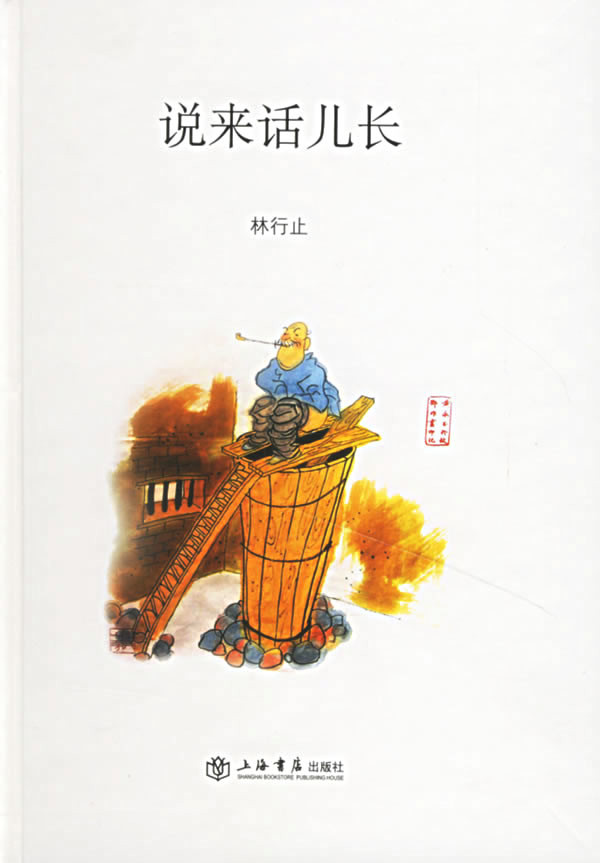
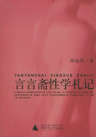
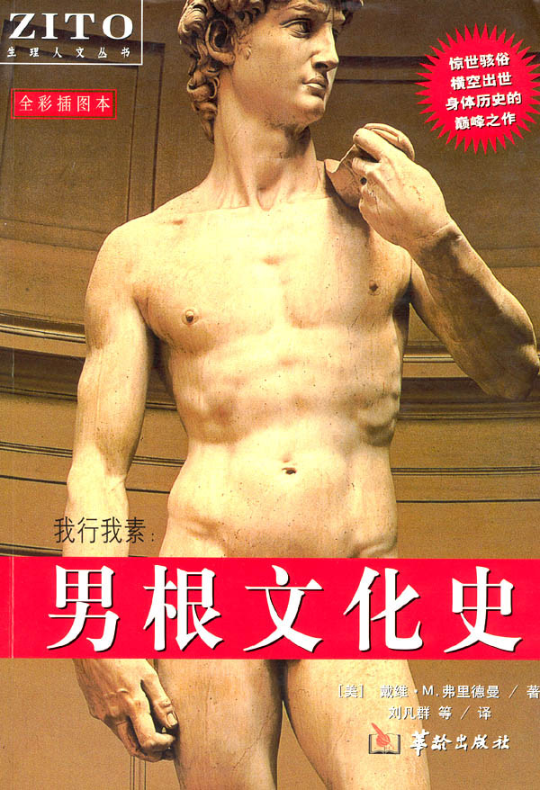
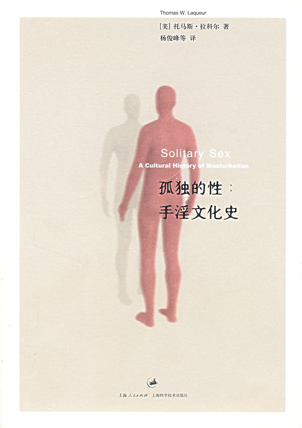
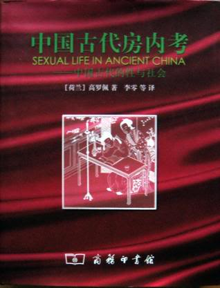

# 本期主题：又提起那话儿——形形色色的性话语

# <北斗荐书栏目>

# 

## 本期主题：又提起那话儿——形形色色的性话语

** ** ** ** 一般来说，对于那些在主流话语中不被提及或禁止、忌讳谈论的主题，我们大致会有两种态度，一是好奇，二是畏惧；好奇发生在未接触前，畏惧发生在首度接触时。性的禁忌起源于何时，各个民族不尽相同。这件出于本能而又能带来隐秘的欢愉之事实在值得我们探讨，性本身的性质、性和爱、性与意识形态、不同的人对性的不同态度、性与生命与健康等等，形形色色的性话语不仅是有意思的，也是有意义的。随着二十世纪文化研究的勃兴，人们开始从各个角度理解性、阐释性，或用性来看待、解读其它问题。从文学作品中的性话语来看，则是在九十年代文学的商品化、日常化转型之际，作为话题的性从传统的被压抑和被遮蔽的形态跃升为文学表达不可或缺的一大重要因素，它既是文学对抗政治的工具，又是商品经济时代必然消费的对象。 今天的我们似乎无时无刻不在谈论性，我想这恰恰是对并不宽松的意识形态的一种反拨——看起来我们离性很近，其实我们离性很远。 ** ** **本期荐书人：**谷卿，天蝎男，现在广州暨南大学中文系读研，平生最大爱好是读书、淘书、评书、写书。大学期间出版有《失语着行吟》、《赵朴初书法精神探论》等著。专业以外，主要关注全球化与大众文化、大众传媒与社会文化心理以及近现代学术思想史。 

### 

### 推荐书籍（点击书目可下载）： 

** **

**1、**[**《****说来话儿长****》**](http://ishare.iask.sina.com.cn/f/12779424.html )

****

**2、****《****言言斋性学札记****》**

** **

**3、**[**《****云雨：性张力下的中国人****》**]( http://ishare.iask.sina.com.cn/f/12780342.html)

** **

**4、**[**《****我行我素：男根文化史****》**](http://ishare.iask.sina.com.cn/f/12779422.html)

** **

**5、**[**《****孤独的性****》**](http://ishare.iask.sina.com.cn/f/12782689.html)

** **

**6****、[《](http://ishare.iask.sina.com.cn/f/12779421.html)****[中国古代房内考——中国古代的性与社会**》**](http://ishare.iask.sina.com.cn/f/12779421.html)**

** ** **[《说来话儿长》](http://ishare.iask.sina.com.cn/f/12779424.html)**

** **

林行止号称“香江第一健笔”，写专栏速度极快，也有趣，《万象》杂志早年很多关于屎尿屁的文章，大半出于其手。我最早读他的文集是香港天地版的《闲在心上》，里面有篇谈屁的文章给我印象特别深，几乎把古今中外涉及屁的著作都讲遍了，《说来话儿长》里也收录了此文。《说来话儿长》这个书名就很有意思，所谓“那话儿”就是“那玩意儿”，明清小说里多指代男子性器；我尤记得《鹿鼎记》中写韦小宝在《尼布楚条约》上签字时，因他不识字，写“小”字时就画一竖，左右各两个圈圈，签完后凝视一番，突然大笑：“一个雀儿两个蛋，可不是那话儿嘛！” **《言言斋性学札记》**

** **

言言斋主人是周越然。我最早知道周越然也是通过《万象》，知道他是个藏书大家，据说他每间藏书的屋子角都放一张秘戏图，目的是借水防火，书屋当然最惧火。这本札记最有趣的地方式翻译外来词，译得极有味道，既是音译，又带有隐晦内涵的意译。其中不仅关涉中国古代奇异性事、罕见性爱器具、性书解题、人兽性事，更有西方与性爱有关的掌故、传闻、器用、怪疾等等，对于叫喊的分类亦十分详尽，很有中西比较的文化意义。 **[《云雨：性张力下的中国人》](http://ishare.iask.sina.com.cn/f/12780342.html )** ** **

** **

我一直觉得江晓原教授是个“不务正业”的人，他是上海交大科学史系主任，却以性文化史研究而闻名，他有关性的著作甚至比世界性社会学的奠基人刘达临教授的更专业、更有味。这本书十年前有过上海人民出版社的版本，后来增加了一些图片再版了。用物理学意义上的“张力”来解读性爱，有其恰到的好处和生新的益处，他从元稹的一首诗和《柳河东集·河间传》开始，谈这一概念的提出，又以压力和张力为切入视角梳理了中国数千年的礼教史，确有一种特殊的意义。我最早读江晓原是他关于天文史和占星学的著作，也很有趣味。“上知天文下知性知识”，江晓原做到了。 **[《我行我素：男根文化史》](http://ishare.iask.sina.com.cn/f/12779422.html)**

** ** 单看每章的标题就会觉得很有意思：恶魔之棒、变速杆、量杖、雪茄、攻城之槌， 男根的角色变换恰恰揭示了文明发展的状态与思想认识的变化，从神明到恶魔，最后回归世俗，男根似乎从来没有被简单地视作为一种器官，它被人为地披上了各种罩纱，这本书通过对赋予男根意味的形式变化的考察，要表达的其实是他观察历史与文明的一种方式。此书最后的“防刺气球”一章则介绍了与性器有关的产业，如阳痿治疗、再造、移植等等，生发出本体以外的一系列考察。 **[《孤独的性》](http://ishare.iask.sina.com.cn/f/12782689.html)**

** ** 手淫确实是个奇妙的话题，人们总是关心别人对此如何评价，自己却噤若寒蝉，于是就在你猜我度中展开想象。关于自慰主题的书籍，我只知道内克的《自慰：一种巨大恐惧的历史》和这本《孤独的性》，此书有个副标题，叫做“手淫文化史”。书前有两篇序言，其中吴燕题为“只用一只手来看的书”的序最能道此中之妙。“如果为世界上最可做不可说之事开列排行榜，那么手淫多半会位列榜首。这种难以启齿的特质几乎是在手淫成为一种文化之初就已注定了的。”——我想，恐怕正是这个原因，才让这本书更加有阅读的趣味。 **[《中国古代房内考——中国古代的性与社会》](http://ishare.iask.sina.com.cn/f/12779421.html)**

** **

难以想象中国古代的性文化与性经验传承史由一个荷兰人考述出来。这本书梳理了从西周到明代三千多年的性文化和性习俗，参考利用了大量一手资料，极具说服力，《中国古代房内考》也被西方汉学界公认为具有开创性的一部权威之作。此书由北京大学李零教授译出，李先生对于古代方术的深入研究使他具备翻译的资格，而他主编的《中国方术概观》（房中卷）倒是很可以与此书相互印证着来看。除了这本《中国古代房内考》和《秘戏图考》是以性为主题的，高罗佩写狄仁杰的一系列著作也很有名——他是个狄仁杰迷。
