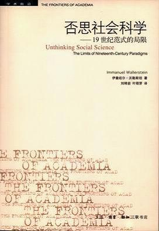

# 本期主题：否思社会科学——19世纪范式的局限

# <北斗荐书栏目>

**_ _**

****

** ** ** **

## 本期主题：否思社会科学——19世纪范式的局限 

** ** 曾经有人在跟我争论时说“这不是我说的，这是亚当斯密”说的，仿佛这样，他的观点就是无容置疑的了。事实上，他被一种意识形态控制而不自知。什么是经济学？为什么要有文科理科？为什么数学成为如此重要的工具？为什么发展是硬道理？非洲是什么？印度存在吗？这些都是从19世纪法国大革命开始的。这本书并非一本晦涩难懂的学术专著，而是可以作为了解社会科学的入门读物。阅读本书，你也许不赞同沃勒斯坦的新左派立场，但一定会开始想一些新的问题，获得新的视角。伊曼纽尔沃勒斯坦，美国社会学家。 ** ** **本期荐书人：**刘一舟（《北斗》特约撰稿人） 

### 推荐书籍（点击书目可下载）：

[**《否思社会科学——19****世纪范式的局限》**** **](http://ishare.iask.sina.com.cn/f/12637591.html)

** **

我们今天的社会科学体系，包括各种理论、范式和各种制度化的内容，都是从19世纪开始建构起来的。作为一种理性化的尝试，这种社会科学在其生命的历程中一直是将自身作为一种认识世界的普遍真理来加以对待的。但是，这套体系已经开始遭遇危机，很多学者开始反思19世纪的这些社会科学的内容。而沃勒斯坦认为，需要做的其实干脆是否思，沃勒斯坦将自己对19世纪社会科学的解构称为“否思”(unthinking)而非“反思”(rethinking)，即对19世纪社会科学的理论进行否定性批判。 沃勒斯坦在书的导言中说：“时至今日，这些旧理论的很多既狭隘又具有误导性的假说依然深刻影响着我们的思维，而实际上本不该如此。这些曾经被认为是思想解放的假说，今天已经成为我们对社会进行有用的分析的核心理性障碍。”的确，我们对19世纪社会科学理论的认识不一定是完整的系统的，但是他们确实在控制着我们的思想。我们的思维方式，我们对社会的看法，我们的价值观念都是在这个框架下形成的。沃勒斯坦说，即使是他自己，也没能完全从这种自己所弃绝的世界观中解放出来。而这恰恰证实了一个观点，传统方法的假说是多有力地控制着我们，而对此进行反思又是多么的重要。 **什么是社会科学** 社会科学并非自古有之，它作为一种文化运动形成于19世纪。沃勒斯坦从世界体系的视野考察了传统社会科学学科的起源、学科之间的分野以及学科划分的局限性。 “社会科学不是单个社会思想家的产物，而是特定结构内为达到特定目的集体创造物。” 法国大革命使社会变迁作为一种世界观被普遍接受，这代表着现代世界体系基本的文化转型。与这一世界观相呼应的是三种新制度的出现；意识形态、社会科学和社会运动。“这三种制度构成‘漫长的十九世纪’巨大的知识／文化综合物，其制度基础有时被不适当地称为‘现代性’。”现代世界体系塑造了三种意识形态：保守主义、自由主义和马克思主义。自由主义意识形态的胜利使社会科学更倾向于自由主义，自由主义的意识形态与社会科学的专业化互为一体，“社会科学是作为自由主义意识形态的学术搭档而诞生的”。 学科的分野包括两个层次：一是科学与人文的分野，二是社会科学内部的分野。科学与人文的分野的一种体现就是大学里理科和文科的分立。对很多人而言，人文学科和自然科学被定义为本质上完全不同甚至截然对立的两种认识形式。而社会科学（19世纪的社会科学分化为六大学科：经济学、政治学、社会学、历史学、人类学和东方学）则介于二者之间，它的有些学科倾向于人文学科，如历史学，有些学科倾向于自然科学，如政治学和经济学。“两种文化”之争被内化为社会科学内部的方法论之争，使社会科学处于两难之境：“社会科学像是系于朝相反方向奔驰的两匹马上的一个人。社会科学没有它自己的方法论立场，而被自然科学和人文学科两大巨人之间的斗争所撕裂。” 学科间的分野主要表现在三个方面：首先是过去和现在的分歧。历史学是假定处理过去发生的事情，经济学、政治学和社会学是处理当前发生的事情。其次是文明(西方)与野蛮的(非西方)的分歧。历史学、经济学、政治学和社会学只关心文明世界，即西方自己；野蛮的非西方世界则归于人类学和东方学的范畴。再次是国家、市场和社会之间的分歧。政治学、经济学和社会学使用的是假设的空间，它们根据国家领域、市场领域和公民社会来定义自己的空间边界，其实三者的边界在空间上都是民族国家。从以上三组分歧可以看出，学科专业化在时空向度上割裂了过去与现在、西方与非西方、国家、市场和社会之间的一体化。 **什么是发展** 沃勒斯坦在《否思社会科学》中揭示了“发展”的真实面目。“发展是硬道理”也是一种意识形态。第二次世界大战之后，“发展’作为一个社会科学领域的关键概念出现，首先便是指每一个被当作个别实体来看待的国家的发展。无论如何，这种分析单位，即民族国家，是应该得到社会科学从业者的质疑的。 在沃勒斯坦看来，“发展”就是“工业革命”这个概念的变体。“工业革命”从它诞生的那一天起，就是一个为英国霸权进行意识形态辩护的词。 “真正的”工业革命是诞生在英国的，所以这个词是专门为英国的自由主义者服务的，它被用来特指英国的资产阶级推翻贵族统治的社会状况。这个概念的确定使得英国在和法国等其他国家所谓的工业革命进行比较时，充分显现了英国的领先地位。而在1945年之后，通过“发展”概念的兴盛，众多的后发地区也开始以国家为单位寻求本国的前进道路。这种道路的选择更多的时候会以那些所谓的发达“国家”为范本。这种范本从某种程度而言就是国家界限的原封照搬，它很多时候体现为将所谓发达国家内部的一些矛盾对立体也引入到后发地区，如无产阶级与资产阶级、贵族与资产阶级。中国就是一个最明显的例子。我们没有进行“工业革命”，所以我们“落后”了，于是我们要靠“发展”赶上。但以民族一国家为边界所生产的一系列“发展”模式都是无法进行简单的照搬的，沃勒斯坦以含蓄的姿态表明，这是一个“不容易”的过程。 就社会科学层面而言，沃勒斯坦认为，“工业革命”也好，“发展”也罢，都只不过是一种神话、一种历史哲学而已。关于这些神话故事的构建主体，毫无疑问是社会科学的从业者。沃勒斯坦试图揭示并推翻这种神话，但沃勒斯坦更试图用一种新的历史哲学，或者说是修正过的历史哲学来取代原有的历史哲学。这种新的历史哲学虽然可以将旧有历史哲学中的种种缺陷进行弥补，但从本质上而言，它仍旧是一种神话。 **站在马克思的肩膀上** 一般认为，沃勒斯坦是一个新左派，一个新马克思主义者。沃勒斯坦以其世界体系理论成名，世界体系理论的一个重要源头就是马克思关于资本主义的理论。沃勒斯坦的世界体系理论实质上就是以马克思主义重建社会科学范式的一种尝试。沃勒斯坦认为，马克思是一个力图超越其时代局限的思想家，虽然他的学说仍然带有那个时代的局限。因此，在社会科学范式的重建中，应该将马克思主义置于中心地位。但这不能仅局限于马克思主义的文本。而是要立足于时代经验重新阐释马克思主义，并以马克思主义整合当代思想成就。 笔者认为，沃勒斯坦从两方面继承了马克思思想的遗产。第一，沃勒斯坦的世界体系理论，来源于马克思的世界市场。马克思的观点是，阶级斗争的形式是民族的，但经济的本质是世界市场。马克思要把整个贸易世界看作是一个国家，实际上是强调世界经济的整体性。而沃勒斯坦世界体系认为现代世界体系是一个资本主义世界经济体系，因国际性劳动分工划分为三个地区：中心、半边缘区，边缘。（中国的发展事实上是从边缘地位向半边缘地位的提升而已）。第二，沃勒斯坦继承了马克思的整体性方法论。马克思是一个什么家？不论将他称为哲学家、经济学家还是社会学家都是从现在的学科视野中来看。而马克思的研究是一种前学科式研究，在实践上，马克思的著作是那个时代整体性知识的丰碑，也就是后世破除学科边界的思想源泉。沃勒斯坦的后学科一体化研究方法，虽然借助了其他的知识路径，但在精神上和目标上与马克思相吻合。 **如何重新建构** 在解构传统学科的基础上，沃勒斯坦主张整合各学科，建构历史社会科学。历史社会科学(21世纪的社会科学)的建构不仅要打破传统的社会科学的学科区分，也要破除自然科学与人文学科之间的藩篱，即科学与人文的“走入”和社会科学的统一。沃勒斯坦描述了21世纪社会科学发展的三种前景：科学与人文学科即所谓的“两种文化”在认识论上的重新统一；社会科学组织上的重新统一和重新划分；知识世界中社会科学占据核心地位。这样一来，在社会科学研究中，不会再有历史学家、政治学家、经济学家和社会学家，更不会有历史社会学家、政治经济学家或心理史学家，只有历史社会科学家。建构历史社会科学这一提法在理论上颇有“野心”，它不仅要整合社会科学，还要整合自然科学与人文学科。前景的确是难以想象的。
