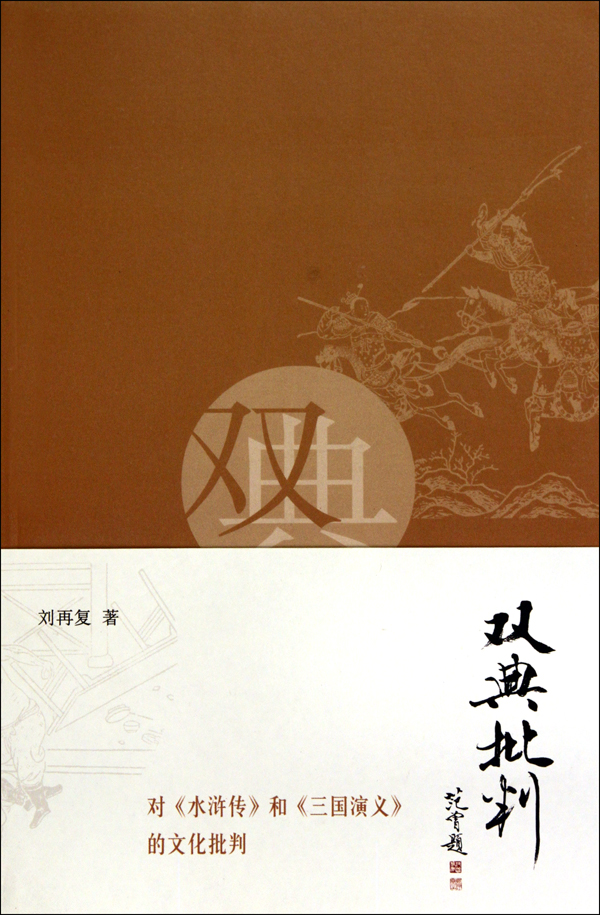
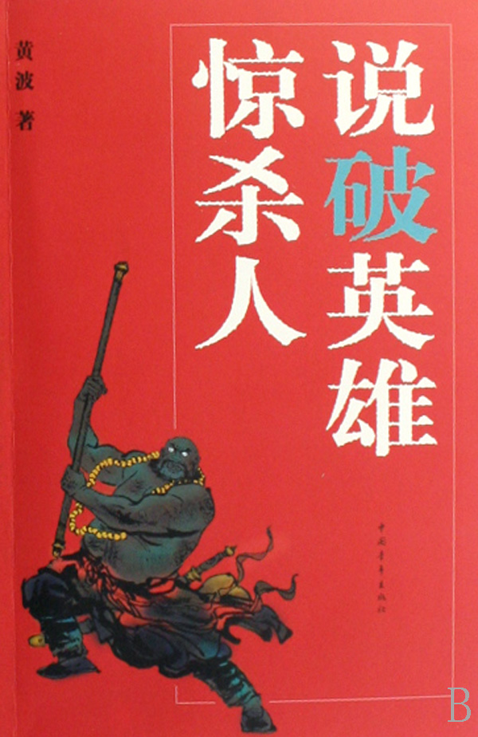
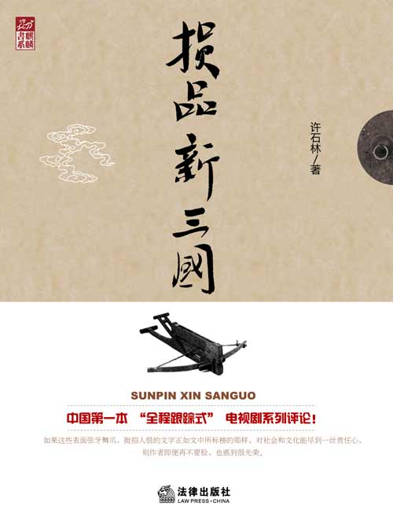
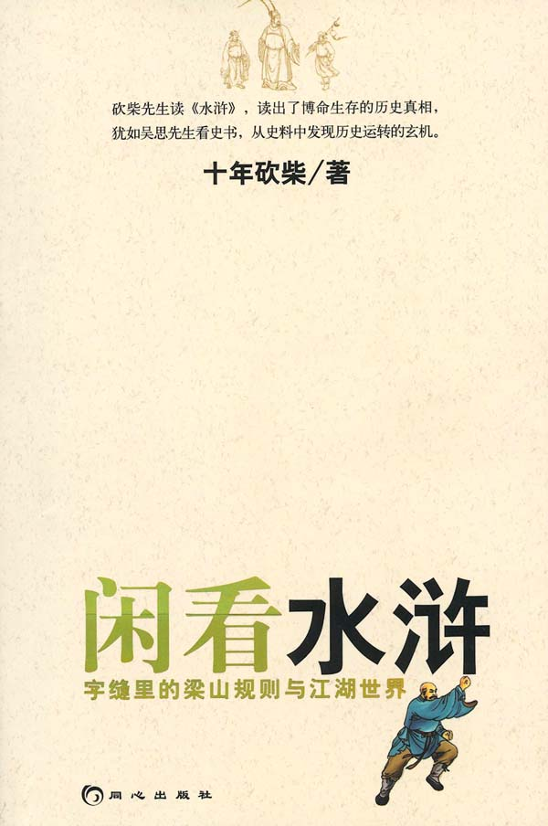

# 本期主题：经典名著再解读（附相关讲座通知）

# <北斗荐书栏目>

## 本期主题：经典名著再解读——《三国》《水浒》群口说（附相关讲座通知）

近一段时间以来，随着所谓“国学热”的进一步升温，在全民读经读史的同时，也出现了一大批重新阐释经典的著作和影视，在全球化和大众消费的全新的知识背景与社会背景下，这些文艺作品通过变换视角、调整历史观，对名著进行全新的理解与阐释。其实，在后现代的语境中，这种带有解构、拼贴形式的异质性、特殊性的解读本身也具有着鲜明的时代特色和批评史意义。经典的价值定义权落在了阐释者的手中，不论是文化批判、文学鉴赏，还是找寻社会学意义、挖掘管理学价值，新的解读方式给予我们很多的启发，尤其是近年来陆续出版的一大批以《三国》和《水浒》为主题的书籍，阅读它们、重温经典的过程，让我们再次感知到“旧书不厌百回读”的真谛的同时，也对我们当下所处的这个环境有了更加细密而深刻的了解。

**本期荐书人：**

谷卿，天蝎男，现在广州暨南大学中文系读研，平生最大爱好是读书、淘书、评书、写书。大学期间出版有《失语着行吟》、《赵朴初书法精神探论》等书。专业以外，主要关注全球化与大众文化、大众传媒与社会文化心理以及近现代学术思想史。

### 推荐书籍（点击书目可下载）：

** ****1、 《双典批判》**

**2、 [《说破英雄惊杀人》](http://ishare.iask.sina.com.cn/f/12033540.html)**

**3、 [《损品新三国》](http://ishare.iask.sina.com.cn/f/12041718.html)**

**4、 [《闲看水浒》](http://ishare.iask.sina.com.cn/f/12033539.html)**

**5、 [《千里走三国》](http://ishare.iask.sina.com.cn/f/12030380.html)**

** **

**《双典批判》**

在海外漂泊多年后归来，此时的刘再复先生通过反思“五四”对传统文化所采取的态度和手段，开始重新思索中国文化资源的优劣各在何处，欲图回答一个关于“我们究竟应该保留发扬哪些、应该批判扫荡什么”的问题，“红楼四书”和《双典批判》就是刘先生思考和研究的成果，更是对这一问题进行回复的答卷。在这部《双典批判》中，我们看到了什么才是文化的原形与本质，我们也知道了什么才是文学的旨归和初衷。

** **

**[《说破英雄惊杀人》](http://ishare.iask.sina.com.cn/f/12033540.html)**

央视《水浒传》片尾曲中有句词唱道：“轻生死、重大义，男儿本色”，听来慷慨悲凉，让人深为之动。但细加考量，梁山好汉们“轻”的这个“生”和“死”似乎往往是他人的、与自己不相干的人的“生”和“死”。黄波不是第一个说破这些伪英雄的作者，但他却凭借着自己对人性与情感的极度敏感与珍视，将这些“英雄”们的“伟绩”一一做出精彩独到的评判。英雄既在他的口中被说“破”，也在他口中被说“立”——“无情未必真英雄，怜子如何不丈夫”，黄波就在这些怀有一腔义愤的解剖和批判的过程中告诉我们，什么样的男儿才能算得真豪杰。

** **

[**《损品新三国》**](http://ishare.iask.sina.com.cn/f/12041718.html)** **

毫无疑问，我们不应赞赏那种以暴易暴的斗争形式和革命话语，而“以损攻损”倒是能够体现文化批评的智趣与魅力。许石林选择这样一部热播一时的改编自名著的电视剧进行批评是明智的，因为若单纯以名著文本进行批评，势必会因为不具有强烈的时效性和广泛的接受基础而难见成效，而以新三国这部电视剧为批评对象则保证其批评成效能够更好、更早地得到反馈。同时，用“损品”的方式则使得批评成效更大，引起反响更剧，这种形式既说明作者“损品”的态度是“损”，又指出作者的批评对象的质量很“损”，一石二鸟地表明了这种主客体“同损”的特殊批评环境。

** **

**[《闲看水浒》](http://ishare.iask.sina.com.cn/f/12033539.html)**

这本是十年砍柴的处女作也是成名作，十年砍柴的“闲看”本来就是一次个人读书史的回顾，《闲看水浒》2010年的再版更为他提供了再次回顾阅读历程的机会。闲看最不闲，十年砍柴看到的是表面一团和气掩盖下的规则、机心、矛盾，他深知中国传统小说特讲谋略与权术，《水浒》即为典型之例，在“名著”和“经典”的大名之下，怎样读出文字与故事背后的东西，真不是一时的功夫。要知道，历史和文学的细节，往往是最隐秘的；历史和文学的细节，往往也是最动人的。

** **

**[《千里走三国》](http://ishare.iask.sina.com.cn/f/12030380.html)**

《千里走三国》的作者成君忆号称是“中国管理文学的开创者”，所谓“管理文学”，正是在文学作品中看到无数成功或不成功地处理人人关系、人物关系、物物关系的经典案例，这种功利的视角必然要以实证的方式体现出来。图书编辑这样介绍此书：“自2008年春踏上千里三国之旅，近一年的时间里，成君忆走遍了河北、山东、湖北、四川、甘肃、浙江等地的三国遗址，以边走边看、边想边写的形式完成了《千里走三国》的创作。”不管这是不是一种炒作方式，成君忆实地证书的行动是有趣的，也可以说是有意义的，这样的写作与思考方式，恰恰说明了经典阐释空间的巨大和阐释方式的多维。姑且不论他思考与写作的结果和结论，只为这种新形式，我们似乎应该一读。

### 【醒目】

在本期推出过程中，我们得知适逢广州有一相关讲座，推荐给各位时间地点方便、有兴趣的摘星星的孩子们前往参加。

主题：从《水浒传》看江湖文化

主讲人：王学泰——原中国社科院文学所研究员，中国社科院研究生院教授

时间：12月4日周六上午10：00—12：00

地点：广州市先烈中路100号广东省科技图书馆一楼学术报告厅
