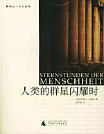

# 铭记伟大的瞬间——《人类的群星闪耀时》推荐

# 铭记伟大的瞬间——《人类的群星闪耀时》推荐

## 文/灯下漫笔

人类文明的历史像繁星密布的苍穹，影响人类历史进程的人们宛若星辰一般闪耀着光辉，在历史的天幕上留下自己最美丽的一道道轨迹。他们的身份各不相同，命运也迥异。有的如同不灭的恒星，在历史上写下了不朽的一笔，标柄千载；有的如匆匆划过天空的流星，在历史的长河中转瞬即逝；还有的像爆发的超新星，在某个历史时期显赫一时，迸发出的光芒照亮了无垠的宇宙，但随即湮没无闻。这些璀璨的星斗把各个国家和时代展现给我们，也记录下了一个个人类群星闪耀的时刻。相比其他大而全的历史书籍，这本《人类的群星闪耀时》中不再是乏善可陈的历史事件的叙述，作者奥地利著名作家茨威格用精彩的笔法描述了人类历史上十二个光明与黑暗，正义与邪恶，和平与战争对决的关键时刻在那些千钧一发的时刻，每个细节都让人感到惊心动魄。这些细致的特写如同一幅幅精美的油画，挥洒刻画了那一刻辉煌广阔的图景，将那瞬间的历史延长，让我充分读到历史的心灵，感受历史的灵魂。 我们先把目光投向美洲大陆。在哥伦布发现新大陆之后，整个欧洲的人们络绎不绝的来往于欧洲和新大陆之间。无数冒险家们为了寻求财富，开辟航道而出海远航。就在这的人群中，一位野心勃勃而又声名狼藉的逃犯巴尔沃亚，为了保住身家性命而进行了一次又一次的探险。但是不经意间，他在此过程中成为了第一个发现太平洋的人，完成了一项不朽的事业从而永载史册。 他早年成名，创作歌剧无数。贤才易遭天妒。在创作灵感最活跃的时候，韩德尔却遭受了破产和中风的双重打击。然而，在被医生断定要终身瘫痪之时，他靠着自己坚定的意志奇迹般的恢复了健康，重新投入到创作工作中。韩德尔涌泉般的才思并未因身体的衰弱和生活的困窘而枯竭，纯净的心灵、虔诚的信仰使他又获得了创作的勇气，进而写下了《弥赛亚》这部不朽的旷世之作。 “她就像长着双翅的胜利女神奈基，在法国的所有战场山翱翔，给无数的人带来热情和死亡。”无数法国人唱响着这首《马赛曲》，为了法国的胜利，为了自由的胜利而前仆后继的奋斗。而这首歌曲的创作，却是一个近乎传奇的故事。在法国大革命期间，一位普通军官鲁热受市长之托，为军队谱写一首振奋人心的歌曲。他虽才能平平，但深受民众革命情绪影响，在一个晚上把亢奋的革命激情，战士的行军步伐，军号的节奏，战车的辚辚声融入其中，一挥而就写成了这首唱动时代脉搏的战歌。一石激起千层浪，这首《马赛曲》很快风靡全国，法国各地的义勇军们唱着这首慷慨激昂的战歌向巴黎昂首进军，一举推翻了专制的封建王朝。而命运却给作者鲁热开了一个残酷的玩笑，他只成为了“一夜之间的神明与天才”。在以后的日子里，他又过上了平庸卑微的生活，并在穷困潦倒中离世。如此人生，实在是让人唏嘘不已。 皇帝的大军马不停蹄的开往前线，这是事关波拿巴皇帝命运的决战。在战斗胶着的关键时刻，将军格鲁希保守懦弱，只考虑了一秒钟就决定固守成命，最终导致拿破仑兵败滑铁卢。作者茨威格感叹道：“这一秒钟决定了整个19世纪，而这一秒钟全取决于这个迂腐庸人的一张嘴巴。”一位庸才葬送了一位天才的事业，这也许就是命运的安排吧。在历史的宿命面前，再伟大的天才也是微不足道的。 寒冬，圣彼得堡，肃杀的刑场上。士兵们已经举起了枪，一位革命家和他的战友们即将被处以死刑。就在这千钧一发的时刻，传令官传达了沙皇的赦免令。在经历了由死刑改判为流放以后，在生死界限上走了一遭的陀思妥耶夫斯基，思想从此转折。只有一个切身体会过死亡威胁的人，才能真切感受到生命的弥足珍贵。他从此抛弃了激进革命的思想，主张用道德感化来替代反对专制的革命斗争，以求得统治阶级和人民之间的和解。茨威格是一名伟大的人道主义者，在他这二百行的长诗里，充分肯定了陀氏这种超越时代的非暴力斗争的思想。正是这种思想，使得陀思妥耶夫斯基得以升华，成为了一名伟大的思想家。 在浩瀚的大西洋两岸，人们关注着那个要在大洋上铺设电缆，建立连接欧美两大洲的纽带的人，他的名字叫菲尔德。在经过了三次尝试以后，电缆成功的沟通了两大洲。但它几天后就停止了工作，原来狂喜的人们瞬间转化成了愤怒，原本的英雄成为了骗子。六年的沉默过后，在菲尔德的坚持努力下，原本沉睡的电缆最终又开始传送电波，开启了人类电报时代的新纪元。“从此时此刻起，地球仿佛在用一个心脏跳动；生活在地球上的人类能够从地球的这一边同时听到、看到、了解到地球的另一边。” 我们现在来到地球最南端的大洲。两个勇敢无畏的人——阿蒙森和斯科特向这块用严寒和暴风雪铸成的堡垒发起了勇敢的进军。前者获得了成功，成为第一个征服南极点的人，后者在征途中不幸罹难。然而，茨威格用更多的笔墨描写了后者悲壮的一幕。在作者看来，“只有雄心壮志才会点燃起火热的心，去做那些获得成就和轻易成功是极为偶然的事。”斯科特有着一颗充满热情和信念的心，和不可战胜的艰难险阻进行了勇敢的搏斗。从这一点来看，斯科特也是当之无愧的胜利者。在这一篇中，最令人感动的是斯科特及其伙伴被暴风雪困在帐篷中，心知生还无望时给亲人们写信的一幕。斯科特写道：“我不知道，我算不算是一个伟大的发现者。但是我们的结局将证明，我们民族还没有丧失那种勇敢精神和忍耐力量。”直到临终前，他仍然满怀着征服南极的自豪感和对爱情、友谊、忠诚的热爱和坚守。这让我想起了安徒生《光荣的荆棘路》中的一段话：“人类啊，当灵魂懂得了它的使命以后，你能体会到在这清醒的片刻中所感到的幸福吗？在这片刻中，你在光荣的荆棘路上所得到的一切创伤——即使是你自己所造成的——也会痊愈，恢复健康、力量和愉快；嘈音变成谐声；人们可以在一个人身上看到上帝的仁慈，而这仁慈通过一个人普及到大众。”斯科特从南极探险中获得的幸福，正是如此。 除此之外，书中还记录了君士坦丁堡的陷落、黄金国的发现等几个具有时代意义的历史瞬间。整本书的心理描写细腻生动，洋溢着浓浓的人道主义，对坚强、善良、勇敢、宽容等人类品德中永远闪光的特性作了不遗余力的赞美和讴歌。茨威格从冷静客观的历史记载下面挖掘了更丰富更人性的一面，并进行了条理的分析，充分展现了作者和平主义和人道主义的美好理想。历史具有强大的生命力，本书中对历史的描写和感悟是与人类基本理念与价值相通的，也是人类深邃思考、澎湃热情和沧桑体验的精彩记录。正如茨威格所说：“历史是真正的诗人和戏剧家，任何一个作家都别想超过他。”
