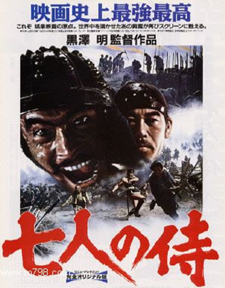
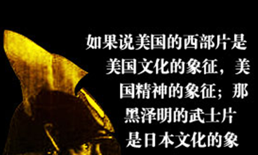

# 回归婴儿——武士，彼岸的姿态

# 武士，彼岸的姿态

## 文 / 许淳(中央戏剧学院)

 《七武士》，艺术性与可看性都很强的电影，纵观七武士的命运，在道德层次上也最终到达了圆满，这印证了佛教中“七”的意味。我个人是非常喜欢这部电影的，在塑造人物时精雕细镂，在情节上往返起伏极具张力。画面在粗犷中又透出几分精致，朔风萧兮，沙尘飞扬，黑云压城，冷烟袅袅，森然中满含严肃。《七武士》里的人物挥之不去，一排黑影逐次闪过，七个武士在画面的一端慢慢走向另一端，直至消失。接着人物又一个一个闪回出现。 

 在整部七武士中，平八的戏份最少，著色不多。平八乐观执着，他对寄人篱下的砍柴生活是毫不在意的，本是武士却沦为砍柴为生，他依然满不在乎，非常认真的砍柴，这是一种非常潇洒的人生态度，可以说他是七个武士中最具魏晋风度的一个。平八是第一个牺牲者，死于拯救农民，平八死时，全片的残酷基调才开始真正显露。五郎兵卫，纵有百步穿杨的精妙箭法，最终也难逃火枪的枪口。而七郎次给我印象最深的是被问及攻打山贼有可能牺牲性命时那个优雅的微笑。 久藏。七武士里武力最高之人，有着对剑道极高的领悟，他的身上有着宫本武藏式的剑与禅的合二为一，久藏是不是人间烟火的禁欲剑客，当种武士调侃女人时，久藏想到的去山上练剑。这让我想起古龙小说里的西门吹雪，久藏与西门有极其相似之处，处事冷静、惜言如金，面无表情、宠辱不惊。事实上，在《七武士》的决斗中，也总让人想起古龙的小说，在凋敝肃杀的气氛渲染之后，一击毙命；高手杀敌，十步一杀，取人首级如探囊，事了拂衣，大袖飘飘，衣襟摇摇。自私一点说，久藏也是我个人最喜欢的剑客。好像看完的人都非常喜欢。 勘兵卫代表了上等武士的智的层面。勘兵卫熟稔兵法、城府极深。为救人不惜削发，寻找武士的巧妙判断，对付山贼时运筹帷幄，在决战之后清醒意识到输赢双方。同样是剑术极高的武士，久藏达到的是剑人合一的境界，而勘兵卫则是无剑的更高境界。他是武士最终杀死山贼的最关键人物。值得一提的是，久藏在最后是被火枪突然打死的，《七武士》后来改编的漫画版中久藏的死一直是个谜。有一种说法是杀死杀久藏的是勘兵卫。起初我只是付之一笑，但这有意思的猜想总徘徊在脑中，在一瞬间我也突然发现倘若真是那样，勘兵卫会更加完美，最后死的三个人严格意义上来说都不是武士，如果勘兵卫摆脱了武士的身份，杀死久藏的做法变更让人物变的复杂。 黑泽明非常注意细节对故事的推动，睡马棚的农民利吉从开始的主战到被问及老婆时总无端生气，再到自荐攻打山贼时很多细节埋下了对利吉心事的疑问，到后来防火烧山贼时我们才发现原来那个女人是利吉的老婆。在放火烧山贼中，黑泽明给了很多对女人表情的特写，我们可以看出非常微妙的心理变化，这一系列细节又是伏笔。女人开始看见火时，眼睛里闪现的是恐惧与不安，但随后表情却坦然，接着又有几分兴奋在其中，可以看见女人在死亡面前得到解脱的释然。当她出门看见自己丈夫利吉时，她惊惧的嘶喊，向火堆里冲去时，观众恍然女人的身份。很多小说里在处理这一情节时毫无疑问会让农民也冲入火堆殉情，但黑泽明就是这么残酷，在死亡面前还不忘将镜头直指人性深处，农民在火堆面前绝望的徘徊，在这一刻，农民的卑贱与懦弱暴露无疑。 黑泽明对农民的批判从头到尾都不遗余力，在黑泽明的电影农民是最为卑贱的阶层。虽然在影片里有武士对农民的同情，电影本身也能够引起我们对农民的怜悯感。但同情是一个悖论，同情的另一面是轻蔑，同情有一种俯视的姿态，我非常反感动辄就说对人民的同情等等，同情本身就是对对象的亵渎。在《七武士》中，农民的弱者身份从开始农民口中“哀求山贼哪怕跪下来”就存在并贯穿整部电影，农民对武士的臣服姿态绝不是出于敬畏，而是功利的哀求。这里面有一种小人物的求活主义在其中，不为什么而活，活着本身就是意义，这是农民的苟活。农民性格上的野蛮粗鄙也在电影中暴露无遗，在追杀山贼上，武士充满了自身的道义与原则，坚持穷寇莫追。而农民则是原始的复仇方式，选择的是野蛮的以暴制暴的方式。在电影的开始农民杀落荒武士抢夺落荒武士的武器到后来农民藏匿自己的衣食到最后不需要武士时的欣喜自在，这里面又包含着农民性格上的阴险狡诈，这里面有着一种流氓的处事方式，我是小人物，我的狡诈不需要对任何人负责，在《七武士》里，在需要武士时，农民流露出的是诚惶诚恐，在剿灭山贼是，农民立刻忘了武士的牺牲。这是上岸弃船，过河拆桥的方式。 

 黑泽明对武士道的理解和大江健三郎相反，黑泽明对武士道更多的是一种深情的尊崇与无奈的惋惜，尽管在《影子武士》里试图挥别武士道，对武士道进行无情的解构，但在最后的《梦》里还是对武士道精神恋恋不舍。《七武士》里同样强调了武士道的精髓不在于武，而在于道。道则分为两个方面，一曰诚。佩刀起誓，有神为证。这在电影《忠臣藏》里到达了一种极致，在《七武士》里，武士之间，或是一面之交，或是素昧平生，或是生死之交，但若答应，就是千金一诺，士为知己者死。武士与农民之间，答应了便是全力相助，至死不渝。二曰死，武士道里自杀是维护精神的纯粹性，在《七武士》中，七郎次改行换业，勘兵卫认识到武士宿命，胜四郎仍然年轻，这三个人都不算真正的武士，所以只有三人活了下来。另外，四个武士都死于火枪，死于火枪有着深刻的历史隐喻，一方面，冷兵器时代终结，另一方面，武士被时代所湮灭。这是无情的。 武士对农民的帮助是与他们的身份相关联的，尽管农民自始至终对武士充满警惕，但武士却不在乎，尽全力保护农民，这有一种“侠”的自觉性在里面，“侠”在正义的同时又充满着难以表达的诱惑性，有着一种道义上的美感，从这个层次上说，武士成亦侠败亦侠，所以说武士最终输给的是自己。英雄是孤寂的，飞鸟尽，良弓藏的古言最后得到了印证，当别人不需要英雄时，英雄将不再是英雄。可以说，《七武士》与《巴顿将军》有着同样寓意的结尾，巴顿最后退出了舞台，牵着一只狗走向远处，七个武士，最终也退出了农民的村庄，二者的背后有着同样的景深，那便是时代。时事，当需要英雄时呼之欲出，当不需要你时你随时可能被历史篡改，如果把巴顿与希特勒背后的历史隐去，你会发现二人不过是硬币的两面，无论从处事、性格、命运而言都如此。 贯穿武士阶层与农民阶层的则是两个人。一是菊千代，二为胜四郎。菊千代是片中戏份最大，作用最多的人物。他的鲁莽、正义中带了几分幼稚的性格让人看来十分可爱，这让全片有了很多喜剧色彩。菊千代的性格一步一步变化，从开始时有正义感却只做旁观者到后来加入武士队伍再到同情农民批评武士到最后为朋友牺牲性命，菊千代的变化过程也是武士道精神的深化过程。菊千代出身农民阶层，身为孤儿，连名字也没有，这让他对武士有着特别的体悟。在电影中，菊千代为救农民不顾生命朝老爹被烧的屋子奔去，在那个婴儿的哭声中，菊千代说出了自己的身份：这孩子就像我一样。我当年全家也被杀。菊千代一方面痛恨“农民什么都有，表面老实但最会撒谎”，另一方面说“是武士造成农民这样的”，说的是农民，其实又是自己。重视出身的武士使菊千代不可能成为真正的武士，尽管最后菊千代是领悟武士道最深的人，但埋葬他遗骨的坟上刚开始也没有得到应由的礼遇，在那幅图画里他也只能是处在中间的那个不伦不类的三角。菊千代，隐去了自己，作为一个中间人辨证的对农民与武士的关系进行着看似微不足道实则最为深刻的思考。 

 胜四郎自始至终都是武士的成长过程。他也是贯穿农民与武士的重要人物。他与农民的关系不仅仅反映在对农民的怜悯上，最重要的是与志乃的爱情上。志乃作为农民出身有着自身的自卑，而胜四郎只看到农民生活的逍遥，两人的相爱是从对方身上看到生活的寄托，农民阶层与武士阶层形成了互补。当然，在黑泽明悲观的武士观中，胜四郎和志乃的爱情最终只是镜花水月。在影片最后，两人无语交错而过，志乃唱着秧歌加入种地的队伍，而胜四郎茫然站在路口。前面农民利吉与妻子的爱情最终也不是浪漫的方式，同样是残酷的诀别。 武士道注重共性，我非常喜欢那个经典的情节。当菊千代拿出那幅画，爬上楼顶，振臂一呼，所有人默然不语，泪光纵横，只剩风吹画的声音，在那一刻，七武士才让人感觉到他们是一个永恒的整体存在。黑泽明在那个镜头里，才毫不吝啬的流露出对武士的崇敬与守望。虽然到了结尾，黑泽明还是把一片悲观藏在了农民的欢声笑语里。武士还是解体了。
