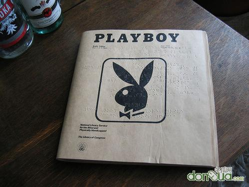

# 洞察你我身边的心灵杀手（上）—解密中国大学生的荒漠心灵

**往期经典**

****

#  洞察你我身边的心灵杀手（上） 

#  ——解密中国大学生的荒漠心灵

## 文/西哲猫眼

在当下我们所处的语境里，大学生已经成为了一个极其特殊的概念。相比于二十年前国人对于大学生这个群体所做出的“天之骄子”的标准式解读，眼前的这个时代里，我们甚至难以用少数的几句话来完整地勾画出中国大学生的社会存在形态。 如果你是一个在校的大学生，那么你可以很清晰地感觉到，尽管当代大学生是个一言难尽的群体，但是有几个基本的现状是所有人都认同的。有一点我们必须明确的是，当今大学是一类无法与网络完全分离的实体。大学生的生活也绝无可能与网络绝缘。所以，我们大体可以从网络世界和现实世界这两个方面来给当代大学生的集体轮廓来个速写。 **1.网络世界里的各色人等 ** 网络世界里的大学生往往表现得很可爱。不过这里的可爱并非传统意义上的褒义词。现实世界人以类聚，网络世界也不例外。相似的生活环境和共同的年龄特点使得这群刚刚成年的孩子们自然而然地聚集在了一起。这个世界十分有趣，黑格尔就曾经指出了这种有趣：每一个范畴在循序渐进地发展到它自身完成的那一刻之后，它同时也就否定了自身，走向了自身的反面，然后又在更高的层次上继续发展，继续前进。在这群孩子因为相似的特征走到一起，形成集中的网络群体的同时，这个群体也开始分化，形成各种各样的小圈子。 正所谓群内无派，千奇百怪。网络上的大学生和其他很多年龄相似的网民一起形成了我们熟知的各种团体：脑残帮、愤青派、酱油党、山寨同盟，以及由无厘头、花痴、文艺青年等集成的朋友圈。不过，以上列出的所有网派都有一个共同的特点，那就是只愿吃快餐，不肯品龙井的快餐族。当然这里的快餐二字指的是他们的文化品味（请注意，我说的不是表示层次高低的“品位”，而是表示倾向的“品味”）。拒绝思考的深度、严肃的探讨、理性的辨析、信仰的沟通是这些圈子始终如一的共性。所有这些群体最热中的事情无非是发口水文、看帅哥美女图片、扯些无关紧要的闲谈，或者是一起玩网络游戏。 照理来说，青年群体应该是整个社会中对未来的期望值最高，最愿意思考问题的一群人，而且在欧洲情况也的确是如此的。但是不可思议的是，当代的中国大学生和众多的青年们一起，恰恰成为了中国最不愿意面对现实和思考问题的一群人。在网络上，绝大多数的青年们所做的事情都是不需要多少脑筋的，换句话说他们的生理年龄似乎比心理年龄大了一截。身体已经发育到大学生的水平了，但与之相匹配的却是高中生甚至初中生的大脑——准确的说是情商。所以我们在青年部落里看到的就是“脑残满天飞，山寨遍地爬，花痴随风荡，愤青到处嚎”的无奈场面。一批有社会责任感的学者现在开始越来越大声地疾呼青年们的启蒙问题，但是摆在我们面前的现状是十分令人沮丧的。不要说启蒙了，就连平静心灵坐下来认真谈一谈的耐心他们都不愿意拿出来，我们还怎么开始这个东方的启蒙时代？ **2.现实世界中的犬儒集团 ** 现实生活中，大学生们的特点就更容易评判了。如果说八十年代的大学生是文化热浪潮中的指点江山的排头兵，那么当代的很多大学生就是茶余饭后间插科打诨的犬儒派。在他们的精神世界里，历史是无所谓的，社会是无所谓的，正义是无所谓的，信仰是无所谓的，有所谓的仅仅是食堂的饭菜味道变得怎么样了，自己心仪的另一个孩子穿什么衣服了，某只球队下一场比赛的出场阵容如何变了，某门课的考试是否变难了，等等。 当然，造就这二十年前后中国高等教育巨大变化的原因有很多，影响最为显著的原因有三个：首先是经济方面，毕业固定分配制度被人才自由市场制度所取代，生存的压力扑杀了流思的徜徉；其次是政治方面，开放自由的思想环境让位于全民噤声的政治高压，现状不再允许指点江山激扬文字；再次是文化方面，物质的享受盖过了精神的躬耕，金钱裹挟着欲望的浪潮，经它冲洗过精神土壤只会留下铜臭而非书香。 

于是乎，犬儒化的生活方式开始流行。青年们逐渐达成默契，不再讨论什么大问题了，那不是他们该讨论的事情。食色和欢娱才是正题，今朝有酒今朝醉的享乐主义被放大到了极致。甚至反对者享乐主义浪潮的人必须遭到惩罚，众人的不快才可能得到平息。“神侃瞎玩谈恋爱，美酒香烟麻将牌，青春当使蒙头醉，韶光逝去不再来”。整个国家在高压下的精神没落和国门开放后的物质丰富共同催生了拜金主义、享乐主义和虚无主义的横行。青年们——尤其是大学生们——的堕落给当代中国史记上了一段莫大的讽刺，那就是一个抵御资本主义长达几十年的红色国家，到头来却成为世界上受到资本主义负面精神毒害最深重的国家之一。但是，这种国家所遭受的毒害最后却一定是由年轻人来买单的。 如果我们让目光跳回到古罗马帝国的最后那段日子，我们就会发现在古希腊光荣传统日薄西山的四世纪，整个罗马帝国也沉浸在物质的享受和肉欲的放纵之中。除了提倡艰苦修行以重获精神新生的斯多葛哲学学派以其信徒，以及主导肉体安宁和精神平静的伊壁鸠鲁哲学学派及其信徒之外，整个亚平宁半岛上的其他居民都加入到了这一幕由集体精神临终所造就的荒诞剧里。肉体狂欢本身是一种无奈，对于精神世界的普遍黯淡的无奈。但是当我们仔细地开始对比中华古文明和希腊古文明的没落史之时，我们就可以很快的发现，其中的相似之处会多得让我们吃惊。 **3.精神荒漠的微观姿态 ** 从一个当代普通中国大学生的日常生活形态出发，我们可以更准确地描述这群可爱而又可怜的孩子们所遭遇的精神苦难。在寝室里，教室里，食堂里，我们可以听到的一个频率很高的词就是：“无聊”。事实上能够在本科四年的绝大多数时间里感觉不到无聊的人在中国早已经是微乎其微了。大多数本科生的生活存在着不同程度的无聊，这无聊是根深蒂固的，难以逃脱的，但是又是一般人难以解释清楚的。实际上，无聊的破坏力是巨大的。借助于对完整心灵的步步为赢的蚕食，无聊可以将一个充满朝气、梦想、热情和好奇心的青年不费吹灰之力地改造成一个浑浑噩噩、得过且过、游戏人间的懒汉。当然了，这需要一个潜移默化的过程。 如果只是少数人的无聊，那么他就很容易通过加入自己志同道合的朋友圈子，或者进入与自己兴趣相同的同龄人集团来建立自己的精神归属。而一旦有了精神归属之后，因为有了合乎自身兴趣，并允许自己付出努力和发挥才智的领域，那么理想与激情就达到了匹配与契合，无聊也就被顺利消解。但是问题的现状就是无聊对于目前中国大学生群体而言，绝不是少数人的专利，而是属于整个群体的共性——也就是说中国大学生的无聊是一种在群体中无可逃避的集体性无聊。当几乎所有人都找不到心灵之所属、努力之方向、才华之展台的时候，这个群体就会长期处在萎靡黯淡、无所事事的状态。这方面的例子太多了，实在是不胜枚举。我相信每个大学生在自己的身边都可以找到甚感无聊的人，也许读到这篇文章的你也是一个正感到无聊或者曾经深感无聊的人。那么，这种无聊的形成到底应该如何来加以微观层面的分析呢？ 如果从个体存在的角度上看，当代中国大学生的无聊可以追溯为两个原因。 当然我要说明的是，本来我希望用简单明了的汉语来表达这两种欲望的，但是综合考虑了我所需要表达的意思之后，我感觉有些意尽词穷了，所以无奈地用了两个英文单词——simple和profound来表达。 首先，simple欲望的空前满足。 从高中进入大学，原先的高考压力、家长束缚统统都没有了，个人的时间处境与空间处境的高速转换本身就容易让人迷失前进的方向。再加上物质条件的改善，使得许多simple欲望都有条件得到满足。什么是simple欲望呢？simple欲望主要是物质享受和由此带来的虚荣心的满足，它是区别于profound欲望的。在哲学美学里，欲望被分成生理的、心理的、社会的——这三类形态。simple欲望对应于生理欲望和一部分浅层次的心理欲望和社会欲望。这一类的例子有很多，比如希望吃香的喝辣的，希望穿名牌开好车，希望谈恋爱找朋友，希望上网玩游戏，等等。 尽管不同的大学生经济条件不同，但是如果进行纵向比较，那么我们很容易发现，对多数大学生来说，本科期间他们在经济上的可用资源相比于之前的十几年都会显得更充足。再加外界管束的急剧减弱，心中压抑了多年的冲动和激情就展现了出来。在自身经济能力允许承受的范围内，大可随便逛街，随便吃饭，随便出游，随便购物，随便打扮，随便谈恋爱，随便上网玩游戏，等等。让我们再次回到前文当中黑格尔所说过的那句话，这个论断放到欲望的讨论中也是成立的。亦即当所欲物不在场时（蛋糕还没吃进你的嘴时），欲望才存在（你有食欲）；当所欲物终于变成在场时（蛋糕被你吃了下去），欲望被满足（吃饱不饿了）。不过重要的是，欲望的满足实际上却是欲望的消亡，正如鞭炮被炸毁的那一刻恰恰是它完成自身使命，使得自身成为真正的鞭炮的那一刻。 

作为可以在当时当地被快速满足的种种欲望，它们是有很大局限性的。尽管这类欲望的重生是十分容易的，比如饱了后几个小时又会饿的，但是simple欲望的反复产生与消亡可以迅速引发心理的疲劳，因为它们实在太容易满足，没有挑战，没有刺激。山珍海味吃腻了往往反而不知道该去吃什么，网络游戏打到顶级了反而不知道要再玩什么，衣服买了一大衣柜了反而不知道该穿什么。 其次，profound欲望的结构性缺失。 profound欲望是和simple欲望先对立的另一类欲望，它对应着哲学美学欲望分类中的某一部分心理欲望和社会欲望。相对于simple欲望的直观和常见，profound欲望显得更为深刻、高远、晦涩。现实生活中我们也难以看到这种欲望的明显表现，但是我们依旧可以对它做个简洁的描述：它往往是纯精神的。比如一个看破红尘遁入空门的人——佛教虽然说这就已经是六根清净四大皆空的良好开始，亦即消弭个人欲望的开端了，但实际上他也是有欲望的。他的欲望是通过修行达到与佛祖同心同性。再比如说一个热爱小动物的青年，他每次遇到受伤或者被遗弃的小动物时都会鼎力相救。他的欲望是想看到所有的小动物都能健康快乐地活着，并为此而努力。 

值得注意的是，这个profound欲望是类似于我们通常谈论的理想、梦想、愿望、期望等等概念范畴。但是这个profound欲望又细微地差别于后者，因为profound欲望一定会有一个道德的背景预设，它是人在潜藏于心灵深处的道德律和我们固有的智慧的共同作用下产生的。并且它永远无法真正被满足，因为要么是它是否被满足难以得到清晰的界定，要么是它的目标是个不可能完成的全称任务（比如我希望世界上所有的毒奶粉宝宝都恢复健康）。当然，我们所能够碰到的大多数profound欲望都与宗教和政治有着或多或少的联系，因为这两个领域里头始终不能逃避的就是行为的道德问题。 八十年代，因为改革开放之初胡耀邦和赵紫阳的新政，整个国家的文化领域和思想领域空前开放。盛极一时的文化热里头因为包含着西方文化的东渐，尼采、佛洛依德、黑格尔、康德、维特根斯坦、罗素、杜威等人的思想和著作像潮水一般冲入了大学生的精神生活，导致追寻理性的号角也迅速响起。再加上当时的大学里都是精英，其他的同龄人也都普遍是有光辉理想和明确志向的朝气蓬勃的青年，所以对于自由民主平等的社会新秩序，以及对于民族道德伦理的启蒙与重塑的呼唤就会不绝于耳。那时的中国真的很美好，每个大学生的脑袋里都充盈着profound欲望。然而理想主义只能在合理的范围内展现自己的魅力，倘若玩过了头就必定与捉襟见肘的社会现实与政治框架相抵触。很遗憾，我们失去了一个良好的复兴机遇。接下来的政治高压让整个中国进入了全民噤声的九十年代，犬儒主义的生活方式全面兴起。也就是在这个时候，我们这个年轻群体的心灵杀手也就变得强大了起来，开始屠戮每一颗它能附着上的心灵。
