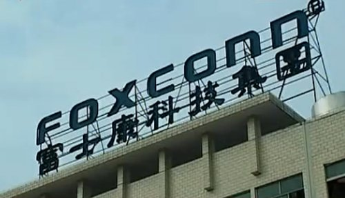
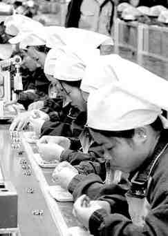

# 我也來聊聊郭台銘和富士康（三）

# 我也來聊聊郭台銘和富士康（三）

## 文 / 杜宗熹（国立台湾大学）

 看楼主在这里扯很简单，但实际上，要建立合作生产和外包制造程序，并不是这么简单的事情。这牵涉到双方之间的信任和关系。信任不光讲的是人际关系上的信任，同时也牵涉到两家公司之间的信任关系。什么意思呢？简单来说，我今天把我的产品，外包给某人。即便我信任这个人，他的公司也不一定有能力生产。 这个现象在电子产品非常显著。首先，电子业有很高的技术障碍，至少在某些比较中上游的制造上，这个技术的门坎是很高的，不是随便一家公司都做得来。如果你没有生产IC的机器，你怎么做得出IC呢？就算你有生产IC的机器，也不一定是最先进的，不一定可以符合客户需要的要求。就算技术上都达的到，也还有很多其它的因素需要考虑。 一个重要的因素，是调整生产程序的时间，这也是台湾厂商，包含富士康在内最大的优势。也是苹果等欧美大厂，喜欢把订单给台湾厂商的最重要原因。现在这个时代里，电子产品淘汰的很快，往往一个产品，半年一年就过时了。所以，从设计出一个产品，到上市之间的时间，最好是越短越好。 在过去，欧美大厂多半自己生产，很多在大陆也有自己的流水线。不过，为什么这些公司，还是经常把订单给富士康之类的公司？宁愿让一个台湾的厂商（某个程度上来说就是外人）来生产，也不要自己生产？除了成本的考虑外，最重要的是回到台湾厂商的经营模式：中小企业、协力生产、普遍外包。 这种模式有什么好处呢？对欧美大企业来说，他可以货比三家，而且很多机器设备和资源，不用自己准备。前面说过，在这个商品需求变化很快的时代，公司规模越大，不见得越好。如果采用这种外包的模式，可以对欧美大公司来说，可以减少很多不确定的风险，让风险给下游的企业去承担，自己只要准时付钱就好。各位想想，如果欧美大厂自己生产，产品在生产的过程中弄坏了，或者最后卖不掉有库存，这些成本他们要自行吸收。如果外包出去，这些成本就变成接单的外包厂商要自己想办法。这其实是意味着生产关系中的权力和责任，极度的不对等。 

 而台湾企业的专长就在这里，不过，这其实也是台湾企业（特别是富士康之类）的悲哀。早年，台湾发展电子业的时候，为了不跟硅谷的大厂正面冲突（以免直接被欧美大厂打死），就采取与欧美大厂互补的生产模式。简单来说，我们以不跟欧美大厂争上游的方式，来换取欧美大厂把中下游的生产程序外包给台湾的厂商，通常，也会把不同的生产程序，转包给不同的厂商。因此，台湾企业就专精于某些制造程序，尽可能把生产成本压到最低，协调时间减少到最少，然后把生产出来的半成品，交给更下游的制造商。这说来很简单，实际运作时，需要很成熟的操作和管理技巧，更重要的，是需要一个完整的产业网络。 现在国际大厂对于台湾这些外包厂商的要求，严格到什么程度，各位可能很难想象。根据台湾一些学者的研究，在江苏和广东的这些台湾电子业厂商，几年前被要求要达到「九五五」的生产标准，也就是百分之九十五的货，要在五天内生产完毕。要搞清楚！这些订单不是一次一百台，一万台，常常是一次一百万台！富士康如果要在五天内，增产一百万台苹果的Ipad，压力会不大吗？ 

 如果大家觉得这很夸张的话，告诉大家更夸张的。根据研究，欧美大厂对于「九五五」的生产标准，已经觉得不够，两三年前，台湾这些厂商已经被要求，要达到「九八二」的生产标准。也就是，98%的货，要在两天内生产完毕。是阿，要交货的产量增加，而且时间少了一半以上，压力会不大吗？ 各位也不要以为这样就结束了，目前我听到的最新研究指出，这个数字仍持续在下降，目前已经有厂商以26小时内，要100%出货做为目标。电子业的竞争，已经到了白热化的程度。所以，也不要太苛责富士康。如果你是富士康的管理人员，你只好拚命增产，以达到这些欧美客户的要求，不然，就准备把生意让给别人吧。反正富士康不做，自然会有别人去做。 所以，大家也不要觉得，为什么富士康这些公司，好像在里头上班的工人压力很大，这实在是因为竞争造成的。实际上，这些台湾厂商，赚的也都是辛苦钱。富士康集团虽然是两岸三地最大的民营企业集团，营收达数千亿人民币，而且还在增加中。但这真的都是辛苦钱，利润非常微薄。根据去年鸿海公布的公开财报，鸿海虽然规模很大，产值很高，但实际的利润率只有3%不到。赚这种代工的钱很辛苦的！ 所以，基本上这是个食物链的关系。很多人看到富士康在中国大陆的管理怎样怎样不好，但其实，富士康自己也是受害者。在这种竞争激烈的环境底下，各家厂商都是绞尽脑汁的要节省成本。我对深圳的生产过程并不熟悉，不敢乱说，我也没有去过任何鸿海的公司或工厂。不过，我建议大家从一个更广泛的角度去思考：其实富士康也是受害者，背后真正掌握这个生产关系的，是苹果这类的国际大厂。如果富士康不做这个生意，苹果自然会把订单给别人，至于其它的公司，在管理和政策上，是不是会比富士康更好，那就真的很难说了。 （待续） 

### 【关于作者】

“杜宗熹 (台灣大學地理系) 從小以為自己和普通人一樣，但後來發現自己的經驗有點特別。我生於1986年，台北人，爺爺是1949年撤退來台的國軍，河北唐山人，奶奶是山東青島人，一起逃難來台。但我媽媽那邊的家族，卻是不折不扣的台灣本省人，祖籍福建漳州。我自認跨越台灣的兩個族群，更喜歡跨學科、跨文化的議題。從小，我經常出國旅行，走訪過歐、亞、美三大洲的近二十國，因此，我喜歡站在全球和外國的角度去思考問題。 我的父母是台灣經濟起飛的收益者，都有本科以上學歷。雖然沒有出國留學，但我父親曾在台灣的電腦業工作多年，讓我對於科技業的現況有些瞭解，但我自己並不打算走上這條路。我熱愛歷史、社會和政治議題，但在二十多年的洗腦之下，對於台灣科技業的發展歷程，多少還是有些心得。 高中畢業後考入國立清華大學人文社會學系，主要修習社會學和經濟學。這是我第一次長時間住在台北以外的台灣城市；我在新竹這個世界科技的重鎮待了四年，也從旁觀察這些將來要投入科技業的清華學生。在某些偶然的機會下，我認識了很多來台灣交換的大陸學生，從此走上兩岸交流的這條路線。 清華畢業後，考入國立臺灣大學地理系的研究生，開始了我的台大生活，目的是希望能夠換個環境，也換個學科。台大地理系掛在理學院的名下，但實際上我研究的仍是都市、產業經濟和政治方面的議題，並且致力於了解中國大陸的發展。但對於火山、地震、地質、氣候、水文的認識，我所知道的，並不會超過一個普通高中生所知道的程度。”
