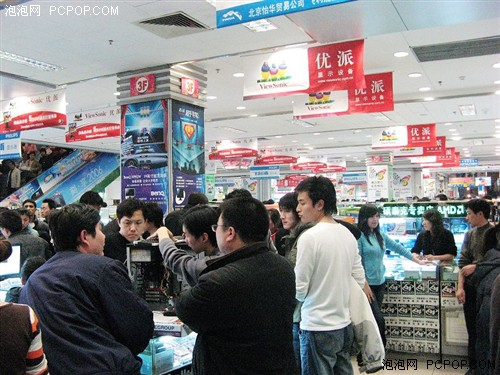

# 我也來聊聊郭台銘和富士康（二）

# 我也來聊聊郭台銘和富士康（二）

## 文 / 杜宗熹（国立台湾大学）

 上文说到，虽然学历这件事情不是绝对的影响因素，不过，就台湾乃至于全球电子业的发展过程来看，学历其实是一个很重要的因素。而一家公司与美国的关系，特别是和硅谷的关系，也会影响到这家电子公司的发展。这就好像学建筑的，如果要做到世界一流，一定要到哪里学习，或者学艺术的，一定要向某某地方靠拢，才有办法掌握最新趋势。否则，在自己家乡闭门造车，很难造出东西来。 电子业也有这样的特性，尤其是在1980年代前后，当时世界上大部分的人，都还没用過电脑，也不知道电脑可以干什么时。你与计算机大部分技术的发源地—美国加州的硅谷有多远（包含技术上、关系上和经验上），就意味着你有没有可能投入这个产业。 台湾电子业的公司最典型的发展例子，就是公司是由留美归国的留学生、或者在美国工作一段时间的归国学人所创办。在早期，台湾经济比较落后的时候，大批的优秀学生，为了追求更好的生活和个人的机会，纷纷前往美国求学，最后就留在美国工作、成家、立业。这些人在美国这片新大陆上的表现，也都十分精彩。 在80年代前后，有非常多（台湾去的）华裔人士，在美国重要的一些电子公司，担任工程师，或者领导干部。类似的例子在当时的其它国家也有出现，像是当时美国加州的以色列或者印度裔族群中，也有非常多优秀的工程师和干部，在美国的顶尖电子公司工作。而他们也跟台湾去的这些华裔人士一样，多半是以留学生的身分去，最后留在美国。后来也协助以色列和印度的电子产业发展。 不过，这种台湾优秀学生拚命往美国跑的趋势，在1980年代之后开始有了反转，最终在1990年代达到高峰。一方面，台湾的经济逐渐起飞，靠着中小企业和民生轻工业发展的台湾，经济实力逐步累积，国民所得也快速增长。二方面，当时的技术官僚非常有远见的，参考一些国内外专家的建议，发现到计算机产业将会在未来成为趋势，也主动的开始与美国的公司合作，而且往往都透过这些公司中的华裔人士，让美国和台湾的产业，产生连结。 当时，几个关键性的举动，像是张忠谋博士等，几位重要的美国电子业高阶主管决定回台湾发展，加上台湾拥有工业技术研究院，清华、交大、新竹科学园区等多方面的软硬件和技术上的配合，让台湾逐渐成为美国电子业的左右手。另一方面，台湾本地学生所创办的公司，例如宏碁等企业，也抓住了这个契机，成就后来台湾电子业的荣景。 于是，非常有趣的。早年大家在担心台湾优秀的学生，都跑到美国去贡献自己的才华，台湾似乎都没有分到什么。不过，这些早年出国的留学生，后来却促成了台湾和硅谷的产业合作和连接，利用台湾的优势，去补硅谷的不足。于是，生产在台湾，研发和销售在硅谷的模式，在80-90年代逐渐成形，电子业也兴兴向荣。在当时，更有大批早年的留学生，返回台湾来创业、投入新的电子产业发展。根据统计，光是1990-1995年之间，加州就有数万华侨返回台湾发展。 这些人不是普通的华侨，都是当年台湾最优秀的学生，许多拥有美国名校的学历，也有很多人曾经在IBM等大公司工作过，有丰富的管理和经营经验。透过这些人的帮忙，台湾逐步建立了电子业的产业集群。一方面，他们介绍生意给台湾的厂商、替台美两方的厂商寻早合作对象、二方面，有很多人直接带回美国的发展经验，像是金融市场的制度、科研的制度、管理的制度等等，补足了台湾当时这方面的不足。当然，也有很多人，后来直接跳入创业的行列。像张忠谋博士就是个很好的例子。 然而，这些和美国电子业一起发展的经验和关系，郭台铭跟鸿海都没有，这就是富士康特别的地方。富士康发迹的很晚，但最终仍成为两岸三地最大的民营企业集团，这其实是相当的不简单。 当然除了有这些归国学人当作推手外，台湾电子业能够有这样的成就，最重要的还是抓到了那个历史的机遇。这种机会很难有，但台湾在80年代前后正好掌握到，造就了今日蓬勃发展的电子业。当然，富士康和郭台铭也是如此。 本来，在二次大战之后，凯恩斯和福特主义式的大企业兴起，像是IBM这类的大公司，握有大量的资源和人力，也掌握了关键技术。不过，在1970年代之后，全球的消费市场开始有个悄悄的改变：少量而多样化的商品，开始成为市场上的主流。取代了大量生产、大量消费的福特主义式生产模式。时至今日，产品淘汰的速度越来越快，这个趋势有增无减（电子产品尤其是）。 而IBM这类的大公司，就像是大恐龙，包办了产品的上中下游。在当时，这些欧美的大公司无法快速面对突然改变的需求。在大型公司内部的资源整合上，整个生产流水线和公司组织的调整，动作也较慢，常常需要一定的反应时间。最后，重视协调性和弹性的中小企业产业群集，优势就显现出来，小公司资本少、人力也不多，可以弹性生产、弹性接单，最多就是倒闭关门，也不会对整个产业造成多大影响。 后来，这些大企业也发现到了这一点。于是，开始把生产的过程外包给第三世界国家的中小企业。特别在电子产品这一块，电子零件体积小、运送方便、一旦标准化生产之后，整合非常的容易。于是，计算机和电子产品的零组件，开始在1980-1990年代之后，大量外包给不同的公司，每个公司只做一小部分的制造。 

 于是，电脑零件从上游到下游，要经过数十个不同的生产流程，牵涉上百家公司是常态。而这点，正好是台湾厂商的优势。台湾本来就是个以中小企业为主的经济环境（鸿海也曾经是中小企业），这种合作生产、外包的模式，本来就是台湾企业的专长。因此，当国际的分工体系和消费者对产品的需求改变时，台湾厂商快速抓到了历史的机遇，专精在某个制造程序，把那个程序做到最好、产品质量最高、最便宜，然后再卖给更下游的公司，欧美大厂也就很喜欢找台湾厂商代工。最后，大家手上的电脑、手机、PDA，就这样被生产出来。 （待续） 

### 【关于作者】

“杜宗熹 (台灣大學地理系) 從小以為自己和普通人一樣，但後來發現自己的經驗有點特別。我生於1986年，台北人，爺爺是1949年撤退來台的國軍，河北唐山人，奶奶是山東青島人，一起逃難來台。但我媽媽那邊的家族，卻是不折不扣的台灣本省人，祖籍福建漳州。我自認跨越台灣的兩個族群，更喜歡跨學科、跨文化的議題。從小，我經常出國旅行，走訪過歐、亞、美三大洲的近二十國，因此，我喜歡站在全球和外國的角度去思考問題。 我的父母是台灣經濟起飛的收益者，都有本科以上學歷。雖然沒有出國留學，但我父親曾在台灣的電腦業工作多年，讓我對於科技業的現況有些瞭解，但我自己並不打算走上這條路。我熱愛歷史、社會和政治議題，但在二十多年的洗腦之下，對於台灣科技業的發展歷程，多少還是有些心得。 高中畢業後考入國立清華大學人文社會學系，主要修習社會學和經濟學。這是我第一次長時間住在台北以外的台灣城市；我在新竹這個世界科技的重鎮待了四年，也從旁觀察這些將來要投入科技業的清華學生。在某些偶然的機會下，我認識了很多來台灣交換的大陸學生，從此走上兩岸交流的這條路線。 清華畢業後，考入國立臺灣大學地理系的研究生，開始了我的台大生活，目的是希望能夠換個環境，也換個學科。台大地理系掛在理學院的名下，但實際上我研究的仍是都市、產業經濟和政治方面的議題，並且致力於了解中國大陸的發展。但對於火山、地震、地質、氣候、水文的認識，我所知道的，並不會超過一個普通高中生所知道的程度。”
