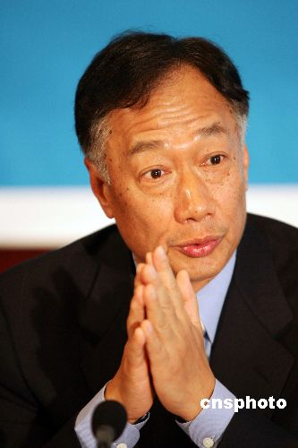

# 我也来聊聊郭台铭和富士康（一）

**编者按：本期天玑由来自国立台湾大学的杜宗熹带来关于郭台铭以及他的企业故事的系列文章。**

# 我也来聊聊郭台铭和富士康（一）

## 文 / 杜宗熹 （国立台湾大学）

先声明，我跟鸿海（富士康）没有任何关系，家里也没有人是鸿海的员工，如果大家期待我要爆料的话，那可能就会失望了。以下都来自于已经公开出版的报纸，书籍，研究文献，而且说老实话，这些都不是什么太新的信息，不过可以给没听过的大陆网友参考。 

郭台铭的发迹历程是很神奇的。在很多人看来，其实郭台铭是个电子业的「边缘人物」。说他「边缘」，并不是说他的公司小、做一些不重要的东西，或者他的个性很糟糕之类的。恰好相反，我要说的其实是说：各位如果去比较郭台铭的创业过程和经历，会发现鸿海的崛起过程非常特别，跟台湾一般的电子业大厂是不同的。这也与郭台铭的个性和经历有关。 郭台铭不是台湾本省人，而是外省人，祖籍山西省泽州县。其实从名字也可以看出他是外省人－正如龙应台教授在「大江大海1949」一书里面所提到的：如果是以台湾为故乡的家庭，名字里面是不会用「台」的。只有流落台湾的异乡人，才会把新生的孩子以台湾之名命名纪念（龙应台老师自己的命字也是这样来的）。这点，也可以在郭台铭弟弟的名字上发现：他们都是「台」字辈，郭台铭前先年因癌症过世的弟弟，叫做郭台成；他也还有另一个弟弟叫做郭台强。 1949年的大迁徙，带来了大江南北各省各地的家庭，从高官、富商、军警、到一般的市井小民都有。郭台铭的家庭并不算显赫，父亲是个一般的小警察，家境也不好。郭台铭求学时曾在橡胶厂、砂轮厂和制药厂打工，是那个时代典型的台湾中下阶层家庭孩子成长的过程。郭台铭虽然是外省人，但他的成长历程，倒是与许多台湾本省的家庭很类似。发迹的历程，也与王永庆比较类似，而有别于目前台面上的那些IT产业界的其他成功人士。 当然，郭台铭的成绩也不好。高中联考没考上任何一所高中，只考到台北郊区一所私立的专科学校（相当于大陆的中专）－ 私立中国海事专科学校（当时简称中国海专，现在已经升格为私立台北海洋技术学院）。中国海专是当时台北知名的五大「打架学校」之一，学生基本上也无心向学，毕业后多半直接投入业界，很少再升学。 这里不好意思讲太白，怕又冒犯到这些学校的校友。不过，当时台北对这几所学校有所谓「五湖四海」的戏称，就可以知道这些学校在一般社会大众中的名声。「五湖四海」是这几个学校校名的谐音，五个「湖字辈」、四个「海字辈」的学校，「中国海专」自然是「四海之一」。另外像「四海工专」、「西湖商工」等等，自然也在「五湖四海」之列。不过，中国海专倒是因为出了郭台铭这个校友，而感到与有荣焉。 当然，学历不是一切。努力、好的机会和眼光，可能远比学历来的重要。郭台铭是个好例子，台湾首富只有专科学历，而刚过世的王永庆老先生更是个好例子，这个纵横商场数十年、精通多国语言、世界十大石化集团之一－台塑集团的创办人，只有小学学历。小时后，我们如果书读得不好被骂，常常就会把王永庆老先生推出来当作「书读得好也没啥用」的借口。现在，郭台铭也成为了大家的第二个借口。 好像扯远了，先拉回来。郭台铭中国海专毕业后，像所有的台湾的男性同胞一样必须入伍从军。退伍后，他也曾在复兴航运公司上班。直到1974年，郭台铭才以母亲标会而来的10万元新台币，在台北县土城乡成立「鸿海塑料企业有限公司」。 鸿海最早的员工仅有10人，从制造黑白电视的旋钮起家，是当时台湾数万家中小企业中的典型代表。一年后，郭台铭公司改名为「鸿海工业股份有限公司」，最后在1982年才改名为今日的「鸿海精密工业股份有限公司」。后来，随着全球计算机产业的蓬勃发展，鸿海也加入抢食电子业大饼的行列。 稍微对全球和华人电子业发展历程有些了解的人就会知道，郭台铭和鸿海的创办过程，跟其他所有IT产业的发迹，基本上是完全不同的，反而比较像是一般的台湾中小型机械产业。郭台铭的「边缘」，也表现在这里。 1949年以后，台湾不断的有学生赴美求学。根据不是很完整的统计资料指出，1949年至今，台湾总共有50万以上的大学毕业生，赴美求学，大部份也都就读理工科。这个数目会略微低估，因为它不包含从小被送去美国的小留学生、因为结婚而去美国的台湾人、还有因为其他因素移民美国的人。但大致上来说，这并不是一个小数目。70年代台湾学界最流行的一句话，就是「来来来、来台大；去去去、去美国」。 像这种典型的台大、清华、交大、成大毕业，后来在美国深造，最终投入电子产业发展的人不胜枚举，很多也颇有成就。例如台积电的创办人张忠谋是美国麻省理工学院（MIT）毕业、美国史丹佛大学的博士，五十多岁就当到当时世界最大半导体公司：美国德州仪器的第一副总裁。宏碁的创办人施振荣虽然只有（新竹）交大的本科学历、没有去美国留学，但宏碁其他的领导班子和高阶干部中，还是有非常多早年赴美留学，后来加入宏碁的例子。 这些早年的高材生，他们的发迹模式，就和郭台铭与鸿海有很大的不同。首先先讲学历：郭台铭只有专科学历（而且是个不怎么好的学校，不是当时排名最好的台北工专等学校），和当时其他这些台大、清华、交大毕业，后来读MIT、加州大学等美国名校的研究生，可以说学历上差上一大截，机会上也差上很多。郭台铭没有机会去美国发展，早年也没有机会和硅谷有任何的关系。 不过，或许也因为这样，郭台铭的作风上常常带有台湾其他企业家（特别是电子业）没有的霸气和风格。在强调一切要低调、不居功、讲合作的台湾社会，像郭台铭这样「嚣张」的举办数万人的员工尾牙、发千万台币的股票当抽奖、找林志玲和刘嘉玲等明星来尾牙的做法，让台湾许多人颇瞠目结舌。因为，郭台铭的作风真太高调、也太嚣张了。不过，暗地里，自然很多人对那千万台币的股票分红，颇为向往。台湾的年轻人也还是有很多人想要已进入鸿海集团为目标。 （待续） 

### 【关于作者】

“杜宗熹 (台灣大學地理系) 從小以為自己和普通人一樣，但後來發現自己的經驗有點特別。我生於1986年，台北人，爺爺是1949年撤退來台的國軍，河北唐山人，奶奶是山東青島人，一起逃難來台。但我媽媽那邊的家族，卻是不折不扣的台灣本省人，祖籍福建漳州。我自認跨越台灣的兩個族群，更喜歡跨學科、跨文化的議題。從小，我經常出國旅行，走訪過歐、亞、美三大洲的近二十國，因此，我喜歡站在全球和外國的角度去思考問題。 我的父母是台灣經濟起飛的收益者，都有本科以上學歷。雖然沒有出國留學，但我父親曾在台灣的電腦業工作多年，讓我對於科技業的現況有些瞭解，但我自己並不打算走上這條路。我熱愛歷史、社會和政治議題，但在二十多年的洗腦之下，對於台灣科技業的發展歷程，多少還是有些心得。 高中畢業後考入國立清華大學人文社會學系，主要修習社會學和經濟學。這是我第一次長時間住在台北以外的台灣城市；我在新竹這個世界科技的重鎮待了四年，也從旁觀察這些將來要投入科技業的清華學生。在某些偶然的機會下，我認識了很多來台灣交換的大陸學生，從此走上兩岸交流的這條路線。 清華畢業後，考入國立臺灣大學地理系的研究生，開始了我的台大生活，目的是希望能夠換個環境，也換個學科。台大地理系掛在理學院的名下，但實際上我研究的仍是都市、產業經濟和政治方面的議題，並且致力於了解中國大陸的發展。但對於火山、地震、地質、氣候、水文的認識，我所知道的，並不會超過一個普通高中生所知道的程度。”
