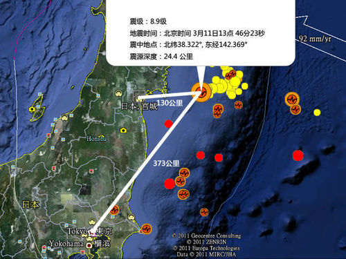
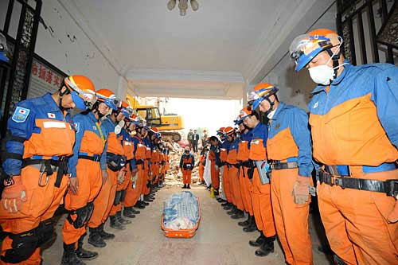

# 他乡故交，你还好吗？

`**今天远方发生大地震了，很担心我的故交，担心他们的家人、亲朋、同事……要问一声，他乡故交，你们好吗？**`

### ** **

****

# ** **

# 他乡故交，你还好吗

## 文/陆遥遥（北斗撰稿人）

下午计划在人民大会堂旁听“两高”报告，从人人网获知日本发生地震的消息，马上赶回单位看NHK。 途中拨通了京都干爹家的电话。他说日本关西地区没有震感。心想地震可能并不那么猛烈。回到办公室，马上联系东京的两友人，也很快联系上。他们都已经被解除避难要求，回到家（办公室）中了。只是东京的电话仍不畅通。 事实上还算万幸，虽然里氏达到8.4级（NHK报道），但东京地区的震度只有5度。地震发生在日本东北部的宫城县、岩手县，而非一直预测的东京、东海道直下型地震。——日本地震研究证明，大东京地区每隔80至120年就会发生一次大地震，而上次地震已经是90多年前的事了。所以大家都认为，最近十几年内，东京很有可能发生超大地震。日本气象厅和地震研究业界预测，如果发生东京直下的地震，死亡可能达到十万人。 虽然东京损失不大，但日本东北部损害相当严重。从NHK的航拍镜头看，海啸排山而来，推着船舶、汽车、甚至房屋等深入陆地十几千米。河流受海啸影响，宛如钱塘江大潮，一路溯及上游。地震时期办发的大火随处可见……按照接受过专门训练，报道过阪神大地震的同时说法，本次地震极有可能造成了千人单位的伤亡。毕竟这是一次震级达到8.8级，相当于汶川地震20倍的，日本观测以来最大的地震。 2008年我国汶川大地震，日本社会各界给予了巨大的关心、同情和帮助。笔者全程陪同日本救援队奔走于青川、北川各地。 在青川，日本救援队最终只是挖出了死者母子的遗体——母亲怀抱着婴儿。日本救援队用洁白的毛毯包裹死者，又用蓝色帆布袋装殓，然后集体向死者行李。死者家属在一旁答拜。一张很有名的照片记录了感人一刻。照片中没有我，但那时我就在镜头后面。 

# 

日本政府本计划第一时间用自卫队飞机运送救灾物资，但顾及到中方保守势力的杯葛，迅速换成租用民间飞机。这是怎样的诚意？ 汶川地震时，我干爹正在坐船环游世界。这位略微小气，吃碗面为12、14元的量哪个合算算计半天的老头，也捐了100美金。捐款仪式是这艘日本游船船长特意举行的，他们筹集了两万多美金，然后送到了里约热内卢的中国领馆。希望被用到了应该的地方。 我因为想研究与军国主义思想密切相关日本儒学学习日语起，到通过日语了解日本，认识很多日本人。有讨厌的，也有点头之交，也有生死之友。世界上不存在什么天性恶劣的民族，人都是一样宝贵的，这不是文明人应该有的想法吗？ 今天远方发生大地震了，很担心我的故交，担心他们的家人、亲朋、同事……要问一声，他乡故交，你们好吗？ 我国古人说，以直报怨，以德报德，今天让我们寄同情与我们的邻国人民，努力帮助他们，至少关心他们。不要再说违背人类良知的话语。 今天我们都是人类，在暴戾自然前，渺小的，亟需团结的人类！ 

（编辑：陈锴）
