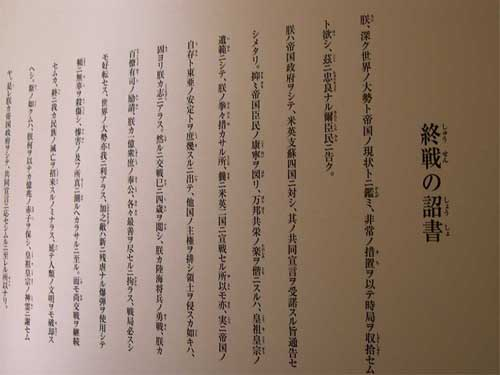

# 六十六年的时间跨度

`**“如果六十六年的时间跨度还不能让日本的战争罪恶成为历史，那六十六年中将我们国家刺得千疮百孔的这一切又算什么呢？如果侵华战争依然是不可忘记的血海深仇，那内战、大跃进和文革又算什么呢？如果必须仇恨六十六年前杀害同胞的每一个日军，那二十二年前开枪射杀我们的同胞、射杀中国的未来的士兵又算什么呢？”**`

# **  
**

# 六十六年的时间跨度

## 文/令霸贤(北京市)

1945年9月2日，日本签署投降书，第二次世界大战正式结束，距今已有六十六年矣。前几篇日志里，有一些朋友认为六十六年太短，不足以消除仇恨。诚然，六十六年之于历史长河，确实是沧海之一粟，然而若将六十六年置于人的一生当中，它却具有了非凡的意义。

杜甫诗云：“人生七十古来稀”，即使在人均寿命已经达到80岁的今天，六十六年依旧是一个人的一生的绝大部分了。六十六年对于刚刚年过弱冠的笔者而言，是要将之前走过的人生道路再走两遍有余才能达到的时间跨度，我想日本的90后也会是这种感觉，那纸投降书与祖辈们厮杀的二战早已一起成为了真正的历史。

六十六年的时间跨度之于日本意味着什么？从日本的人口结构上看，日本65岁以上人口占总人口的比例为21.6%，也就是说78.4%的日本人出生在日本投降之后。如果认为战争时期15岁以下的人不会在战争中发挥作用，那日本81岁以上的人，也就是可能在战争中发挥过作用的人占日本总人口的5.6%，也就是说现今94.4%的日本人没有在日本发动的侵略战争中发挥过作用。

六十六年的时间跨度之于日本意味着什么？意味着就算当年战争的发动者与参与者一个也没被清算审判，他们也早已不是日本社会的主流。就像我在《铭记历史，遗忘仇恨》中说的，我们不能要求战犯的后代去背负他们祖辈的罪恶，这不公平，这是现代版的诛族连坐，这是对一个人自身超越于种族与出身之外的固有价值的抹杀。人也不应该去从上一辈人那里继承仇恨，这同样也是对自己心灵的诛族连坐，这同样是对自身独立而固有的价值的抹杀，这会让人成为种族主义的傀儡。

六十六年的时间跨度之于日本意味着什么？意味着还有4年村上春树才出生，而距川端康成获得诺贝尔文学奖还有23年；意味着7年之后《铁臂阿童木》才会诞生，而距《ONE PIECE》的出世还有52年；意味着岸本齐史要在29年后才出生，而距藤子·F·不二雄发表《哆啦A梦》还有24年；意味着19年后新干线才会通车，而距索尼推出Walkman还有34年；意味着还要过38年任天堂才会推出FC游戏机，而距《拳皇》的诞生还有半个世纪。如果六十六年的时间跨度和沧海变桑田的世界不意味着纷飞的战火与疯狂的杀戮早已成为历史，那还有什么能成为历史呢？

六十六年的时间跨度若之于中国，又意味着什么呢？意味着残酷惨烈程度丝毫不亚于抗战的国共内战还没打响；意味着胡适、梁实秋等一代大师还不需要做出痛苦的抉择；意味着让知识分子彻底闭嘴的反右运动还是在12年之后；意味着14年后造成数千万饿殍大跃进饥荒才会发生；意味着吴晗还没写《海瑞罢官》，老舍还没自沉太平湖，遇罗克和林昭都还活着，距毁灭一个国家文化根基的毛泽东最后的革命爆发还有21年，而郭沫若还要等31年才会写完在《水调歌头·庆祝无产阶级文化大革命十周年》后接着写《水调歌头·粉碎四人帮》；意味着北京的春天于32年后终于到来，又于次年悄然逝去；意味着33年后中国才会有“改革开放”，而35年后“清除精神污染”就开始了，距高行健被迫离开中国还有42年，而距他获得诺贝尔文学奖还有55年；意味着大学生还不需要上政治课，距大学生面对枪口，用肉身去阻挡坦克，距中国最后一批真正意义上的大学生被履带碾成肉酱还有44年。

如果六十六年的时间跨度还不能让日本的战争罪恶成为历史，那六十六年中将我们国家刺得千疮百孔的这一切又算什么呢？如果侵华战争依然是不可忘记的血海深仇，那内战、大跃进和文革又算什么呢？如果必须仇恨六十六年前杀害同胞的每一个日军，那二十二年前开枪射杀我们的同胞、射杀中国的未来的士兵又算什么呢？

六十六年的时间跨度若之于世界，又意味着什么呢？意味铁幕的降下和冷战的结束；意味着柏林墙的修筑与倒塌；意味着打了半辈子的战争后，拉宾与阿拉法特的握手；意味着兵戎相见了上千年的欧洲各国开始融合，也意味着由仇恨意识而引发的卢旺达种族灭绝大屠杀；意味着纳尔逊·曼德拉和昂山素季失而复得的自由；意味着将人们的焦点从政治转向舞台的迈克尔·杰克逊，也意味着将世界的目光从战场转向球场的乔丹与贝利；意味着计算机的诞生和半个世纪后成为世界首富的比尔·盖茨；意味着被迫害致死的阿兰·图灵和他死去半个世纪后英国的同性婚姻合法化；意味着马丁·路德·金震撼世界的演讲和后来成为美国总统的贝拉克·奥巴马。

这是和平取代战争的六十六年，这是文明取代野蛮的六十六年，这是自由取代奴役的六十六年，是人的价值独立出种族、血统甚至是国家、宗教之外的六十六年。在六十六年的时间跨度里，值得我们记住的太多太多，值得我们反思的也太多太多。若我们仅仅记住了六十六年前的仇恨，那我们并不是在铭记历史，而是让自己生活在了历史之中，一直裹足不前。

马丁·路德·金的演讲《我有一个梦想》中有这么一句著名的话——“我梦想有一天，在佐治亚的红山上，昔日奴隶的儿子将能够和昔日奴隶主的儿子坐在一起，共叙兄弟情谊。”

是不是也该有一天，昔日战争发动者与受害者的儿子能够坐在一起共叙情谊？是不是该让六十六年前的那场梦魇彻底脱离我们生活而成为的纯粹的历史？历史应当是一个国家精神的一部分，但不应该是国民的生活之所在，因为生活在历史当中就看不到未来。在六十六年的时间跨度面前，我们依旧在铭记历史，但我们也应当遗忘仇恨。因为仇恨属于六十六年前那个充满罪恶与血腥的时代，不属于我们当中的每一个人。

（采稿：乔淼 编辑：陈轩）
