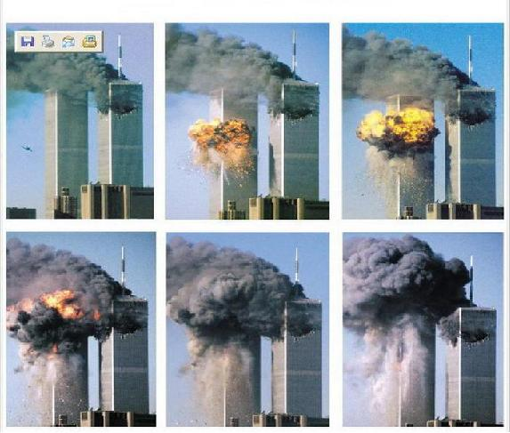

# 再见了！本·拉登

`**“9·11的烟尘已经散去近十年了，但很多人心中的本·拉登圣像依然鲜活。今天的日本大地震造成的创伤也许会很快愈合，而那些幸灾乐祸者心中仇恨的地震还要持续多久呢？让我们一起向往一个人权、人道、人性、人味的世界，让我们一起说： ‘再见了！本·拉登。 再见了！仇恨。 ’”**`

# ** **

# 再见了！本·拉登

## 文/令霸贤

这篇文章本来想等到今年的9月11日再写，但生活总是充满着意外，就像今天的灾难那样。在此首先向日本地震和云南地震的遇难者致哀。 今天在网上看到很多国人对日本遭受的大地震和海啸表现出极度的幸灾乐祸，在万分震惊之余，我想到了9·11袭击发生的那天。 十年前的9月11日，美国纽约的世贸中心在世人惊诧的目光中轰然倒地。而在万里之外的一个小学教室里，通过电视目睹这一惨况的小学生们却在欢呼雀跃。很不幸，本人就是其中的一员。回想起来，场面甚是恐怖，但更让我感到恐惧的是老师也在讲台上庆贺。那时候我读六年级，面临着升学考试，老师肯打开教室里的电视是很少有的事情，唯一能忆起的一次却是为了幸灾乐祸。 

“美国人的大楼倒了好不好？”“好！” “为什么好？” “美国人撞了我们的飞机。” “美国人炸了我们的使馆。” “美国人不让我们解吅放台湾。” “美国人处处和我们作对！” …… 当时的状况大体如此，闭眼回想，讲台上下真是一派群魔乱舞的景象，其实那天哪里的景象都差不多，人们都在以“报应”、“活该”等词藻谈论此事。只有父亲明确地告诉我“恐怖主义是必须受到谴责的！”听了我的讲述，父亲对老师的十分愤怒，“为人师表怎能如此？还有一点师德吗？”。父亲从小就教育我要有同情之心，在苦难面前没有人是孤独的，所有的人都是受害者。父亲的教诲将老师灌输进我内心的本·拉登的幽灵驱逐。 虽然离纽约万里之遥，双子塔倒地的烟尘却也能在身边感受得到。在美国纽约的一个亲戚于动荡中失业，还在暴跌的股市里赔了很多钱。小区里有一个大哥哥，他们家和我家关系很好，当时他们家正准备举家移民美国，他为此没有参加高考而是天天学英语，他的父母也辞去了工作，仿佛一家人的新人生就在眼前。然而因为9·11事吅件，美国政吅府收紧了移民政策，他们家没能拿到签证，至今也没。他又不得不重新读高三去参加高考，他的父母也只好重新找工作，一家人就这么在人生的道路上绕了一个大大的圈子。 这些都发生在我的身边，明确地提醒着我，没有人能在苦难与罪恶中独善其身。肯尼迪曾说过“自由是不可分割的”，而“苦难与罪恶”难道是可以分割的？ 因为袭吅击美国，本·拉登成为了很多中国人心目中的英雄。然而后来的调查却显示，拉登领导的“基地”组织是新吅疆恐怖组织“东吅突”的幕后资助者，后者后来制造了可怕的“七·五”事吅件。“敌人的敌人是朋友”这种逻辑的荒唐性显而易见，但在从小接受的仇恨教育使得很多人竟将其奉为真理。仇恨教育与仇恨意识能让很多国人将一个臭名昭著的恐怖大亨捧为英雄，却完全无视了恐怖袭吅击中惨死的2998个鲜活的生命，以及由此引发的两场血流成河的战争，还有无数人陷入深渊的命运。 仇恨教育与仇恨意识让人在充斥内心的仇恨之中丧失人性，丧失理性，激发兽欲，藐视道德、法律与人权，让逃避社会责任者毫无负罪感。每次反日游行过后，街头的惨乱景象犹如世界末日，在仇恨指使下的打砸抢烧，让人类几千年来积淀下的人性、秩序、道德、法律荡然无存。有一个开日本车的少女被两眼冒红光“爱国者”们围堵，车身被涂满污言秽语，在大哭中苦苦求饶也不被仇恨蒙心的反吅日游行者们放行。仇恨的危害显而易见，在此我还要引用这段我已经引用多次的话： “仇恨会腐蚀一个人的智慧和良知，敌人意识将毒化一个民族的精神，煽动起你死我活的残酷斗争，毁掉一个社会的宽容和人性，阻碍一个国家走向自由民民主的进程。” 今天在网上看到很多对日本遭遇天灾而幸灾乐祸的帖子，能发现他们对日本人仇恨的原因是六十年前的日本侵华战争。仇恨的理由非常荒谬，且不说昔日罪大恶极的战犯们皆已在战后的审判中被绳之以法，就算是日本在战争年代的那整整一代人，至今也已所剩不多，早已不是日本社会的主流。日本的符号早已由疯狂的军国主义和武士道，变成了风靡世界日本电器、汽车、电子游戏和动漫，滴血的军刀已幻化成哆啦A梦的口袋。 让一个人去承担上祖辈的罪责是非常荒谬的。根据家谱记载，本人的祖先原本生活在福建，在清军入关后逃难至琼州。若本着某些誓与日本人不共戴天的仁兄们的逻辑，我应该怎么去面对我先祖的苦难？若祖仇不忘，那回想扬州十日、嘉定三屠、江阴惨吅案、剃发易服，我必须不能与满族人同一桌子吃饭了。还有蒙古灭宋后的大屠吅杀，张献忠屠四川等等，若故仇旧恨不忘，那在与人共进餐之前，是不是应该先沿家谱细细考证一番？实乃荒唐至极！ 仇恨教育与仇恨意识对任何人都没好处，并且将会使人异化成工具，而这正是某些心怀不轨的统治者乐于看到的。将人与人之间的矛盾放大成群体与群体之间的仇恨，将对一个群体的憎恶延续成对其子孙后代的仇恨，这是邪恶的统治者惯用的技俩，借此达到不可告人的目的。而仇恨者与被仇恨者皆为受害者。当邪恶的统治者需要煽动仇恨时，自然就会有人被划为“敌人”。 土改运动时期，农村人口被分为雇农、贫农、中农、富农和地主，而后二者就被当作成了阶级敌人。在宣传机器的仇恨教育下，富农和地主在政治和经济上被打倒，从肉体上被消灭。虽然打倒他们的贫下中农后来的命运更凄惨，但某些匪类的统治地位得到了巩固。毛吅泽东的“阶级斗争”策略实乃煽动仇恨的经典案例。当红卫兵们四处寻找阶级敌人发泄自己被灌输的仇恨时，“斗争哲学”的集大成者、“万岁万万岁”的毛主席的统治地位谁还能动摇呢？阶级斗争的对象不但是阶级敌人，连同他们的子女卷入其中。君不见，当年那些“狗崽子”们的凄惨命运。遇罗克因一篇《出身论》而死于非命，独吅裁者岂能容自己给人民灌输的仇恨意识受到威胁？ 统治者利用仇恨教育和仇恨意识来达到巩固统治以及其他不可告人的目的，这在历史上案例无数，并常与浩劫相伴随。中世纪的教廷宣传对犹太人的仇恨，当“一切都是犹太人的错”的观念大肆传播时，上帝和教廷的伟大谁能质疑呢？后来纳粹又故伎重演，戈培尔的宣传机器将人们的怒火引至犹太人、共产主义者、同性恋者等等群体身上，元首的权威自然无人能撼动，这造就了二十世纪最悲惨的一幕。慈禧太后利用义和团对仇洋情绪来做与洋人谈判的筹码，结果引发庚子拳乱，无数无辜洋人、教民还有更多中国人死于非命，而八国联军入侵后，慈禧又杀拳匪以求和谈。仇恨的怒火会烧痛他人，也会灼伤自己。 仇恨教育与仇恨意识是流毒深远的狼奶，重则引发血雨腥风的浩劫，轻则也会让人失去理智与人性，让人固步自封。仇美情绪让很多国人痛恨一切美国的东西，自然就包括由美国发扬光大的民吅主、自由、人权、法治等理念，这自然是既得利益的当权者十分喜闻乐见的。只要通过宣传机器为民众多树立几个不共戴天的假想敌，“中国特色”的提法就会在某些人中非常有市场。很多国人充满动机决定论的荒唐逻辑也与此有关，在仇美情绪的作用下，对他们而言，称赞美国就是“汉奸”行为，大帽子往上扣而全然不理会其具体内容。理智荡然无存。 9·11的烟尘已经散去近十年了，但很多人心中的本·拉登圣像依然鲜活。今天的日本大地震造成的创伤也许会很快愈合，而那些幸灾乐祸者心中仇恨的地震还要持续多久呢？让我们一起向往一个人权、人道、人性、人味的世界，让我们一起说： “再见了！本·拉登。 再见了！仇恨。” ——2011年3月11日夜 于 中国·北京 

（编辑：陈轩）
