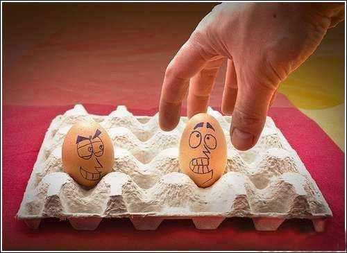

# 幸灾乐祸之人和那些谩骂幸灾乐祸之人的人

`**“所以，他们幸灾乐祸的是应该是政治含义上的‘日本’或‘日本人’，是那些他们想象中背负着战争罪行的日本人，和那些具体的日本人个体关系不大。”**`

# ****

# ** **

# 幸灾乐祸之人和那些谩骂幸灾乐祸之人的人

## 文/冬至（天津）

2011年3月11日下午，日本东北部宫城县发生大地震，地震引发了海啸。目前这场灾害已经造成大规模的破坏及一定的人员伤亡。 国内网络上针对此事异常“热闹”。有些人感到大快人心，感慨上天惩罚了“小日本”，“日本鬼子”终于因曾犯下的罪恶得到报应，甚至有人放出“全部震死TMD小日本”之类的狂言。然后，另一部分人觉得前面这些人幸灾乐祸，毫无道德怜悯之心，甚至谩骂其禽兽不如，语气似乎愤慨而真切。 幸灾乐祸之人是否真的“禽兽不如”呢？这些人所诅咒的难道真的是那些同样早起晚睡、身陷生计，同样疲于奔命、养家糊口的活生生的日本人的个体吗？（当然不能说这群幸灾乐祸的人就没有极端的民族分子）。日本曾在中国的战争行径是确凿的，一种最直接的仇视心理是可以理解的；而问题是中国多年的政治教化，无论是文学上、影视上和民间流传上都让政治范畴的抽象的“日本人”置换掉了真实存在的日本人。所以，他们幸灾乐祸的是应该是政治含义上的“日本”或“日本人”，是那些他们想象中背负着战争罪行的日本人，和那些具体的日本人个体关系不大。 所以，那些谩骂幸灾乐祸之人没有人性、没有基本的人道主义，实际上根本没有骂到点子上去。国人的人性曾一直被批判，现在社会的诸多现象也不断应正着。我在此不想鼓吹中国人的道德的高低。 我想说，多年的政治化宣传并没有增强国人对日本人的了解，这种政治化宣传本身就是抹杀个体的，去人性的，单一化的叙述历史。是这种教化让许多国人在这场邻国灾难面前露出了邪恶的“嘴脸”。那想一想对待外邦是这样，对待本国人难道不也是如此吗。那些改革进程中对个体生命与尊严摧残的事实不断在宣传中被阉割，实在令人心寒。这能不能算是集体意识对个体意识的强权和暴政？ 那么，幸灾乐祸之人身上最可怕的是不是他们自身的人性呢，还有另有他物？ PS：那些谩骂幸灾乐祸之人的人中有一部分又怎么样呢？似乎他们在巨大的灾难面前想到那些活生生的个体，就是一种对生命的尊重，对人性的关怀？还是他们在对幸灾乐祸之人的攻击中获得了或多或少的道德优越感呢？这些没有好好想想原因、“血气方刚”地呼唤提高国民素质的人，自身素质是不是也值得自我反思呢？ 

（编辑：陈锴）
