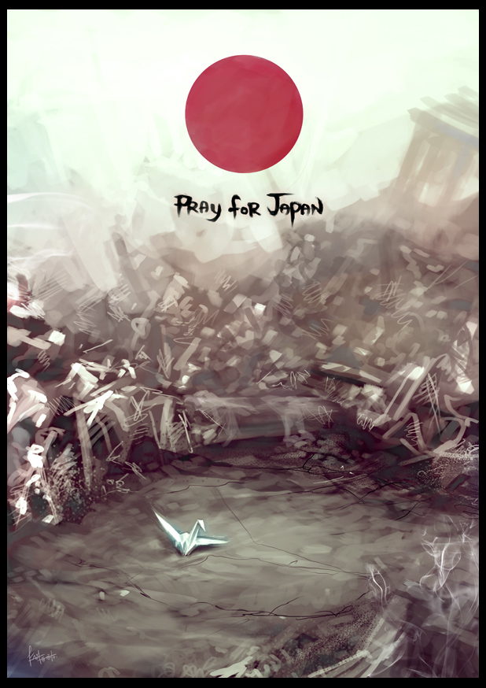

# 我们为什么对日本大地震的第一反应是幸灾乐祸

`**“我们幸灾乐祸的只是一个我们印象里的日本，一个概念化的日本，他曾经侵略中国，杀害奴役过我们的祖辈；他厚颜无耻，修改教科书，否认南京大屠杀；他死不认罪，经常去参拜靖国神社；他仇视中国，骂中国人为支那猪；他贪婪凶残，抢占我们的钓鱼岛，怂恿台湾独立。这才是我们所诅咒的日本。”**`

# ** **

# 我们为什么对日本大地震的第一反应是幸灾乐祸？

## 文/时红魁(北京航空航天大学)

**为地震中遇难的日本人民默哀，为至今仍在遭受地震带来苦难的人民祈福，祈祷日本的核电站危机能安全解决。**

我不知道各位听到日本地震的第一反应是什么？就我个人而言，讲老实话，得知日本发生大地震的第一反应是：日本大地震？太好了，死了多少人？当然这只是在脑子里的第一反应，我绝对不会表达出来。相反，我还去发个状态，对日本人民表示祈福。我是不是特虚伪？ 我不知道有多少人有跟我类似的第一反应，反正身边的大多数同事和一些朋友的第一反应莫不如此，因此当网络上出现大量“热烈庆祝日本地震”的言论，我一点都不奇怪，有这种想法的人很多，只不过有些人只是心理活动，有些人直接表达出来而已。 那我们是不是像有些人所骂的，蔑视生命，没有起码的同情心，是不是没有博爱，“狭隘地”的嗜好“复仇”，我们是不是没有人性，甚至禽兽不如？是不是如某学者所说 “喝狼奶长大的”？国民素质极差？我们需不需要忏悔？ 张承志说：“日本是一个古怪的国度：数不清的人向它学习过，但是后来选择了与它对立的原则；数不清的人憧憬着投奔过它，但是最终都讨厌地离开了它。它像一个优美的女人又像一个吸血的女鬼；许多人则深爱之后，或者被它扯入灭顶的泥潭深渊，或者毕生以揭露它为己任。” 我们接触的日本人，都是良善的，温文尔雅的，他们为人礼貌，做事谨慎认真。他们个个干净，文明，守规矩，有礼貌。没有侵略者狰狞的笑容，没有右翼死不认罪的狂妄，没有侵占钓鱼岛的叫嚣。在这里，存在着两个日本的割裂。日本，就是这样一个古怪的国度，复杂的民族。 而我们，真的痛恨日本人吗？当地震的报道不断延续，我们看到更多的悲惨的画面，看到那铺天盖地的狂暴海啸，看到良田和城市变成废墟，看到避难所中满目伤悲，头发花白的老人，看到失声痛哭的孩子，我想，不惟是我，大部分曾经幸灾乐祸的国人也会发自内心的祈求灾难快点过去，人民的苦痛不要继续，核电站千万不要出事。与幸灾乐祸相比，在我们身上同样存在一种割裂。 而我们为何幸灾乐祸呢？我们诅咒的又是什么呢？ 我们幸灾乐祸的只是一个我们印象里的日本，一个概念化的日本，他曾经侵略中国，杀害奴役过我们的祖辈；他厚颜无耻，修改教科书，否认南京大屠杀；他死不认罪，经常去参拜靖国神社；他仇视中国，骂中国人为支那猪；他贪婪凶残，抢占我们的钓鱼岛，怂恿台湾独立。这才是我们所诅咒的日本。 我们眼中的日本如此，阿拉伯眼中的以色列亦如此，当我们面对一个概念中的对方时，心中充满仇恨，当我们听说，他们遭到灾难，跟我们听说村里的一个恶霸被车撞断了腿，横行的黑社会老大得了绝症一样高兴。 同911美国世贸大楼不少国人欢呼被撞一样，中国人信奉“积善之家必有余庆，积不善之家必有余殃”，这句源自《周易》的名言，千百年来善恶相报的观念已经浸入中国人的骨髓。 不能说中国人不善良，抗日战争结束以后，善良的中国老百姓不忍日本遗孤的嗷嗷待哺，在日本侵略者造成的巨大创伤尚未恢复的情况下对那些走投无路、生命垂危的日本遗孤伸出仁爱之手，把他们从死亡线上拯救出来，并用自己的乳汁和从口中省下的粮食将他们喂活养大。蒋介石宣布放弃索要日本的战争赔款时的名言，也是所谓“以德报怨”，但是在现在广大中国人看来，中国做到了“以德报怨”，而日本则显得无情无义。参拜“靖国神社”，修改教科书，否认南京大屠杀，家永三郎败诉，花岗惨案审判，钓鱼岛争端，一件件事情，深深刺痛了中国人。 在普通中国人的观念中，日本当年做了太多的恶，如今遭到了报应，美国也一样。悲惨的是，种下“恶因”的是日本的军阀，那些大资本家和穷凶极恶的刽子手，是美国的金融资本，石油资本和军工资本，而承受“恶果”业报却是普通人民。 我们所诅咒的只是一个概念，一个形象，而非一个个活生生的，有血有肉的日本人。 我想，对这次事件大声叫好的人，一定都没到过日本，或者没有和日本人深入交往，没有亲密的日本朋友，日本在他们心目中，只是地图上的一块，只是两个汉字，他们心中的日本，只是教科书里的，新闻里的。包括我，虽然跟日本人有一些短暂的交往，但并没有真正的日本朋友，更多的日本印象，来自于书本，影视和网络。 我承认我幸灾乐祸的情绪确实有问题，但该指责的是什么呢？或者我们错在哪里呢？ 现代战争的残忍性大概也因于此，在古代的冷兵器时代，人们对面相搏，敌人的血肉都能溅到自己身上，可以真切感受到战争的残酷和丑恶。到了近代的枪炮时代，枪弹的射程虽有上百米，但战争双方还可以互相看到，对方的死亡和痛苦仍然也都是可感知的。但到了现代战争时代，高科技造成的壁垒让战争的参与者更加冷血，轰炸广岛长崎的飞行员看不到核爆造成的惨状，几千公里外的导弹发射员可能在和同伴的谈笑中按下发射按钮，完全感受不到建筑物的倒塌死伤者的惨叫和轰鸣。 因为没有交流，没有有血有肉的感情，有的，只是痛苦的历史记忆和一次次的伤害，所以我们显得冷血，我们才会幸灾乐祸。 我不知道那些痛骂中国人没有人性的是什么人，或许他们真的是心地善良，是值得称道的好人，或许他们有在日本生活居住的经历，有友谊深厚的日本朋友。 但我不能容忍的是那些自认为被普世价值的人性光辉所普照，认为中国人没素质的人。在他们看来，或许我们连一点儿也不应该诅咒，我们应该宽容，几十年了都过去了，不管人家认不认错，算了吧，钓鱼岛嘛，算了吧。 你可以说日本不是这样，日本很善良，日本其实很美好，你也可以说大部分中国人对日本的看法是片面的，狭隘的，是我们政府的宣传扭曲了日本的美好形象。但请不要站在道德的制高点上摇晃那虚伪的人性的旗帜，谴责中国人，辱骂中国人，高歌逆向民族主义。 毫无疑问，这种幸灾乐祸的情绪必然会伤害到普通的日本人民，但我希望他们能够理解我们真正在诅咒的是什么。如果造成伤害，我本人愿意道歉。 最后，祝愿盈江同胞、日本人民早日走出灾后的痛苦，重建新的家园。 张承志作品：日本留言 http://www.islambook.net/xueshu/list.asp?id=1940 我该去恨的日本究竟在哪？ http://www.douban.com/note/139364618/ 资料：1923年，日本关东大地震， 15万人遇难，当时中国非常落后，北洋政府决定对日本进行救助。号召百姓忘却战争前嫌，不再低治日祸，以减轻日本人民负担， 利于恢复。北平、天津、成都等城市成立救灾团体，演艺界筹款筹物，而梅兰芳先生也为日本的地震开了赈灾演出。。景山公园卖票助赈，连中学生也把零用钱捐出，赈济日灾，红十字会救护队赴日救灾，表现出纯洁的道德感和国际主义、人道主义精神。首艘到岸的救助船就是中国的新铭号。商人、画家、上海佛教领袖王一亭募捐白米6000担、面粉2000余包以及各种生活急需品，这是来自国外的首批救灾物资。 我国普陀山和许多寺院举行四十九天道场法事，念经念佛，吊祭日本罹难者。在杭州铸造完工的梵钟，至今还存放在东京都慰灵纪念堂。 

（编辑：陈轩）
