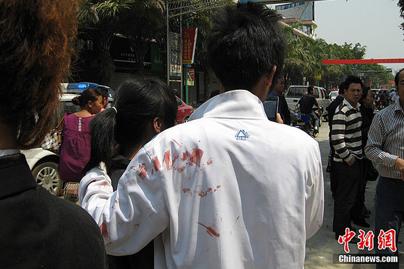
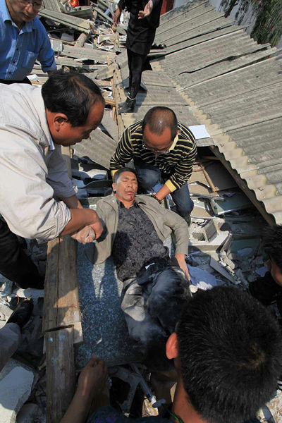
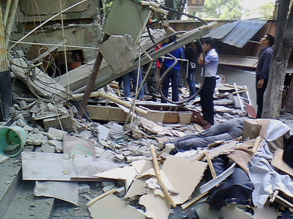
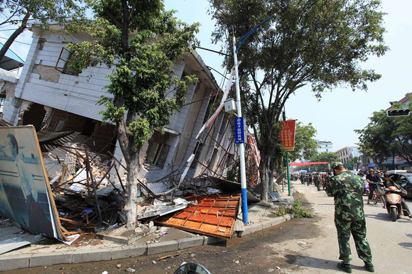
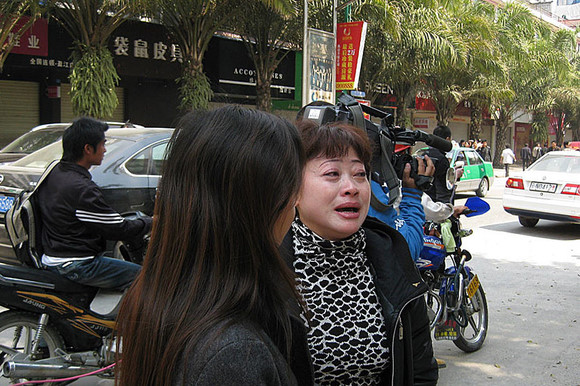

# 我已经出离愤怒了——写在家乡盈江地震之后

`**编者按：据云南网报道，盈江灾区急需血浆、棉被、针剂、帐篷、饮用水等物资支援。献血可到各地血站；物资可寄给云南慈善总会，说明“盈江310震区专用”。地址：云南省接收救灾捐赠办公室（昆明市白云路538号，省民政厅内）电话：（0871）5731400、5731401。**`

# ** **

# ** **

# 我已经出离愤怒了

# ——写在家乡盈江地震之后

## 文/毛彬（南京农大）

盈江的地震从步入2011年之后就一直不断，每天都有十多次甚至几十次小规模的震动，规模大的，一次是4.1级，一次是4.8级，两个月来已经震了1200多次。寒假的时候，回家过年，亲自感受到了那种恐惧感，每天都在惶恐中度日，大家不知道会不会有更大的地震会来袭，传闻很多。 2008年盈江的那次地震，具有破坏性，可是报上去是5.9级，然后，2011年3月10日之前，依然是不痛不痒的稍许关注，政府没说什么，CCTV报道就是几个文字，砖家……当时砖家说不会有更大的地震了，请大家不用担心。 再然后，就是3月10号的盈江地震，这次是5.8级，我知道，听上去似乎也没这么大嘛，比起这次日本地震，差距就像中国和日本的人均收入差距一般，但是，要知道，这次盈江的地震是浅源地震，震中就在县城，震源距地表只有10公里，这个破坏性有多大，大家可以去看看视频，当时盈江交通摄像头拍下来的，有多恐怖，我不知道怎么形容。     好了，开始有相关的专题报道了，依然是不多的篇幅，然后，被日本地震的报道慢慢淹没下去。大家的关注都集中到了日本地震去了，可能你不是一个盈江人，无法体会到那种心痛的感觉。倒塌的天缘超市，我上个月还和妈妈去买过东西，下来的那家七匹狼专卖店，上个月我买的衣服现在还没有穿，还是新的，我记得那里的服务员很年轻，很亲切，可是现在，已经生死未卜。  一个县城死了25人，伤了250多人，看上去，这个数字让大家轻视了，毕竟中国那么大，这么点人，是不会引起很大的轰动的，可是我和你说，盈江就像我们盈江人血液里的一部分，我从小在那里长大，那里有最美的景色，最善良的人，几乎每个人，都是彼此紧紧相连的。我妈妈的一个好朋友，是个傣族，也是我小学一年级的启蒙老师，她被这次地震无情的夺去了生命，我还记得，她女儿上个月刚结婚，当时我和妈妈去她们寨子喝喜酒，她穿着傣族服装，满面笑容的接待我们，那时的她是那么的幸福和美丽，不过一个月的时间，她已经和女儿生死两隔了。  我在网上看着视频，听到了熟悉的家乡的语言，很少很少的情况，除非有什么不好的消息，很少能看到有关盈江的相关报道，这个边陲的明珠是那么的美，却似乎与世隔绝一般，被遗忘了。当我在视频上听到家乡的语言时，却是大家的哭声，女孩的尸体，母亲的泪水，那么清晰，都是我们可爱的盈江人。现在你能体会我的感受了吧，当我看到大家只知道日本地震时，一个劲的在为日本祈福，可有想过我们可爱的盈江仍未脱离险境，现在物资不够，人力不够，大家真的关注过了吗？哪怕一点点。  我是一个盈江人，无论身在何处，都会爱着我的家乡，所有的盈江人都是，我不管你们管不管那里的人民，会不会把注意力稍微从日本地震转向盈江地震，伸出你们的援助之手，我只知道，所有的盈江人都会用自己的力量去呐喊，去战胜天灾，哪怕我今天的日志再微不足道也是这样，至少我们有决心！ 

（编辑：黄理罡）
